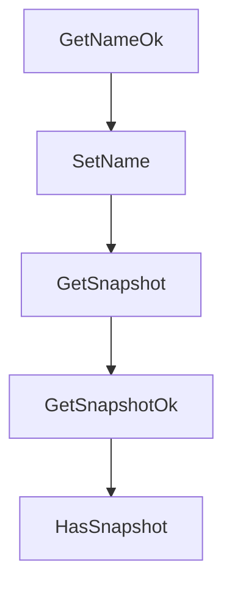

# Chapter 3: Process and Code Execution Patterns

Welcome to **Chapter 3: Process and Code Execution Patterns**. In this part of **Daytona Tutorial: Secure Sandbox Infrastructure for AI-Generated Code**, you will build an intuitive mental model first, then move into concrete implementation details and practical production tradeoffs.


This chapter covers process execution and code-run workflows across SDK surfaces.

## Learning Goals

- choose stateless versus stateful execution paths
- structure command execution with timeouts and environment variables
- capture stdout/stderr and exit codes for reliable automation
- design retries and error handling for long-running tasks

## Execution Heuristic

Use stateless execution for isolated snippets and predictable idempotent jobs. Use stateful interpreter contexts only when you need persistent variables and iterative sessions. Keep explicit timeout and error handling in both paths.

## Source References

- [Process and Code Execution](https://github.com/daytonaio/daytona/blob/main/apps/docs/src/content/docs/en/process-code-execution.mdx)
- [Language Server Protocol](https://github.com/daytonaio/daytona/blob/main/apps/docs/src/content/docs/en/language-server-protocol.mdx)
- [Python SDK README](https://github.com/daytonaio/daytona/blob/main/libs/sdk-python/README.md)
- [TypeScript SDK README](https://github.com/daytonaio/daytona/blob/main/libs/sdk-typescript/README.md)

## Summary

You now have an execution model that balances speed, isolation, and observability.

Next: [Chapter 4: File, Git, and Preview Workflows](04-file-git-and-preview-workflows.md)

## Depth Expansion Playbook

## Source Code Walkthrough

### `libs/api-client-go/model_workspace.go`

The `GetNameOk` function in [`libs/api-client-go/model_workspace.go`](https://github.com/daytonaio/daytona/blob/HEAD/libs/api-client-go/model_workspace.go) handles a key part of this chapter's functionality:

```go
}

// GetNameOk returns a tuple with the Name field value
// and a boolean to check if the value has been set.
func (o *Workspace) GetNameOk() (*string, bool) {
	if o == nil {
		return nil, false
	}
	return &o.Name, true
}

// SetName sets field value
func (o *Workspace) SetName(v string) {
	o.Name = v
}

// GetSnapshot returns the Snapshot field value if set, zero value otherwise.
func (o *Workspace) GetSnapshot() string {
	if o == nil || IsNil(o.Snapshot) {
		var ret string
		return ret
	}
	return *o.Snapshot
}

// GetSnapshotOk returns a tuple with the Snapshot field value if set, nil otherwise
// and a boolean to check if the value has been set.
func (o *Workspace) GetSnapshotOk() (*string, bool) {
	if o == nil || IsNil(o.Snapshot) {
		return nil, false
	}
	return o.Snapshot, true
```

This function is important because it defines how Daytona Tutorial: Secure Sandbox Infrastructure for AI-Generated Code implements the patterns covered in this chapter.

### `libs/api-client-go/model_workspace.go`

The `SetName` function in [`libs/api-client-go/model_workspace.go`](https://github.com/daytonaio/daytona/blob/HEAD/libs/api-client-go/model_workspace.go) handles a key part of this chapter's functionality:

```go
}

// SetName sets field value
func (o *Workspace) SetName(v string) {
	o.Name = v
}

// GetSnapshot returns the Snapshot field value if set, zero value otherwise.
func (o *Workspace) GetSnapshot() string {
	if o == nil || IsNil(o.Snapshot) {
		var ret string
		return ret
	}
	return *o.Snapshot
}

// GetSnapshotOk returns a tuple with the Snapshot field value if set, nil otherwise
// and a boolean to check if the value has been set.
func (o *Workspace) GetSnapshotOk() (*string, bool) {
	if o == nil || IsNil(o.Snapshot) {
		return nil, false
	}
	return o.Snapshot, true
}

// HasSnapshot returns a boolean if a field has been set.
func (o *Workspace) HasSnapshot() bool {
	if o != nil && !IsNil(o.Snapshot) {
		return true
	}

	return false
```

This function is important because it defines how Daytona Tutorial: Secure Sandbox Infrastructure for AI-Generated Code implements the patterns covered in this chapter.

### `libs/api-client-go/model_workspace.go`

The `GetSnapshot` function in [`libs/api-client-go/model_workspace.go`](https://github.com/daytonaio/daytona/blob/HEAD/libs/api-client-go/model_workspace.go) handles a key part of this chapter's functionality:

```go
}

// GetSnapshot returns the Snapshot field value if set, zero value otherwise.
func (o *Workspace) GetSnapshot() string {
	if o == nil || IsNil(o.Snapshot) {
		var ret string
		return ret
	}
	return *o.Snapshot
}

// GetSnapshotOk returns a tuple with the Snapshot field value if set, nil otherwise
// and a boolean to check if the value has been set.
func (o *Workspace) GetSnapshotOk() (*string, bool) {
	if o == nil || IsNil(o.Snapshot) {
		return nil, false
	}
	return o.Snapshot, true
}

// HasSnapshot returns a boolean if a field has been set.
func (o *Workspace) HasSnapshot() bool {
	if o != nil && !IsNil(o.Snapshot) {
		return true
	}

	return false
}

// SetSnapshot gets a reference to the given string and assigns it to the Snapshot field.
func (o *Workspace) SetSnapshot(v string) {
	o.Snapshot = &v
```

This function is important because it defines how Daytona Tutorial: Secure Sandbox Infrastructure for AI-Generated Code implements the patterns covered in this chapter.

### `libs/api-client-go/model_workspace.go`

The `GetSnapshotOk` function in [`libs/api-client-go/model_workspace.go`](https://github.com/daytonaio/daytona/blob/HEAD/libs/api-client-go/model_workspace.go) handles a key part of this chapter's functionality:

```go
}

// GetSnapshotOk returns a tuple with the Snapshot field value if set, nil otherwise
// and a boolean to check if the value has been set.
func (o *Workspace) GetSnapshotOk() (*string, bool) {
	if o == nil || IsNil(o.Snapshot) {
		return nil, false
	}
	return o.Snapshot, true
}

// HasSnapshot returns a boolean if a field has been set.
func (o *Workspace) HasSnapshot() bool {
	if o != nil && !IsNil(o.Snapshot) {
		return true
	}

	return false
}

// SetSnapshot gets a reference to the given string and assigns it to the Snapshot field.
func (o *Workspace) SetSnapshot(v string) {
	o.Snapshot = &v
}

// GetUser returns the User field value
func (o *Workspace) GetUser() string {
	if o == nil {
		var ret string
		return ret
	}

```

This function is important because it defines how Daytona Tutorial: Secure Sandbox Infrastructure for AI-Generated Code implements the patterns covered in this chapter.


## How These Components Connect


