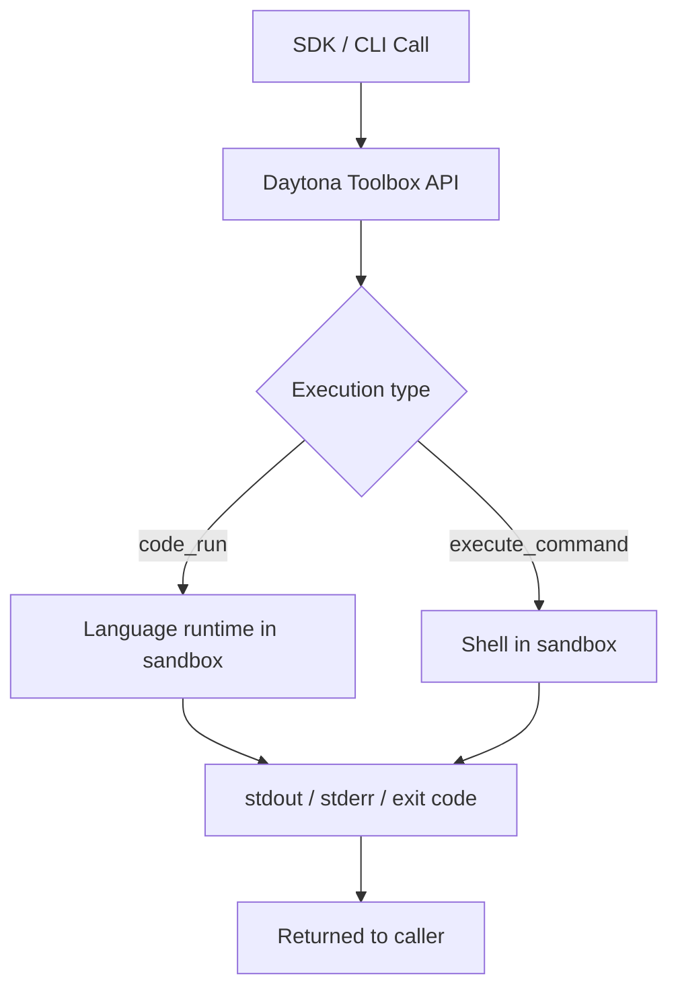

# Chapter 3: Process and Code Execution Patterns

Welcome to **Chapter 3: Process and Code Execution Patterns**. In this part of **Daytona Tutorial: Secure Sandbox Infrastructure for AI-Generated Code**, you will build an intuitive mental model first, then move into concrete implementation details and practical production tradeoffs.

This chapter covers process execution and code-run workflows across SDK surfaces.

## Learning Goals

- choose stateless versus stateful execution paths
- structure command execution with timeouts and environment variables
- capture stdout/stderr and exit codes for reliable automation
- design retries and error handling for long-running tasks

## Execution Heuristic

Use stateless execution for isolated snippets and predictable idempotent jobs. Use stateful interpreter contexts only when you need persistent variables and iterative sessions. Keep explicit timeout and error handling in both paths.

## Source References

- [Process and Code Execution](https://github.com/daytonaio/daytona/blob/main/apps/docs/src/content/docs/en/process-code-execution.mdx)
- [Language Server Protocol](https://github.com/daytonaio/daytona/blob/main/apps/docs/src/content/docs/en/language-server-protocol.mdx)
- [Python SDK README](https://github.com/daytonaio/daytona/blob/main/libs/sdk-python/README.md)
- [TypeScript SDK README](https://github.com/daytonaio/daytona/blob/main/libs/sdk-typescript/README.md)

## Summary

You now have an execution model that balances speed, isolation, and observability.

Next: [Chapter 4: File, Git, and Preview Workflows](04-file-git-and-preview-workflows.md)

## How These Components Connect

