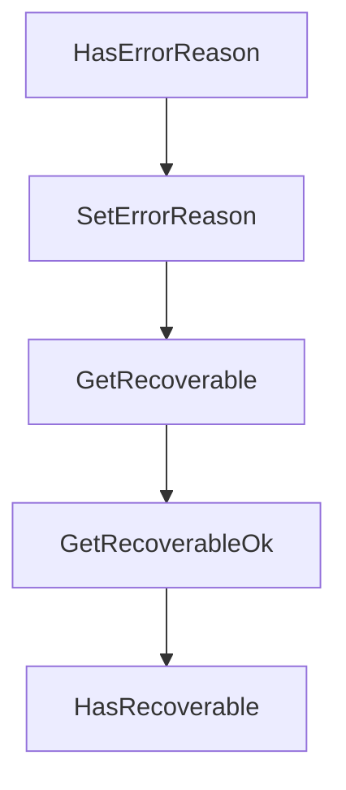

# Chapter 4: File, Git, and Preview Workflows

Welcome to **Chapter 4: File, Git, and Preview Workflows**. In this part of **Daytona Tutorial: Secure Sandbox Infrastructure for AI-Generated Code**, you will build an intuitive mental model first, then move into concrete implementation details and practical production tradeoffs.


This chapter maps the day-to-day development workflow inside Daytona sandboxes.

## Learning Goals

- manage file uploads, downloads, and directory operations
- clone and manipulate repositories in sandbox contexts
- expose running services with preview links
- keep preview and repo workflows reproducible for agents

## Workflow Pattern

Treat each sandbox as a disposable but scriptable workspace: hydrate files, clone code, run tasks, expose service previews for review, then persist artifacts through snapshots/volumes if needed.

## Source References

- [File System Operations](https://github.com/daytonaio/daytona/blob/main/apps/docs/src/content/docs/en/file-system-operations.mdx)
- [Git Operations](https://github.com/daytonaio/daytona/blob/main/apps/docs/src/content/docs/en/git-operations.mdx)
- [Preview](https://github.com/daytonaio/daytona/blob/main/apps/docs/src/content/docs/en/preview.mdx)
- [Webhooks](https://github.com/daytonaio/daytona/blob/main/apps/docs/src/content/docs/en/webhooks.mdx)

## Summary

You can now run a full code-to-preview loop inside Daytona with cleaner automation boundaries.

Next: [Chapter 5: MCP Agent Integration and Tooling](05-mcp-agent-integration-and-tooling.md)

## Depth Expansion Playbook

## Source Code Walkthrough

### `libs/api-client-go/model_workspace.go`

The `HasErrorReason` function in [`libs/api-client-go/model_workspace.go`](https://github.com/daytonaio/daytona/blob/HEAD/libs/api-client-go/model_workspace.go) handles a key part of this chapter's functionality:

```go
}

// HasErrorReason returns a boolean if a field has been set.
func (o *Workspace) HasErrorReason() bool {
	if o != nil && !IsNil(o.ErrorReason) {
		return true
	}

	return false
}

// SetErrorReason gets a reference to the given string and assigns it to the ErrorReason field.
func (o *Workspace) SetErrorReason(v string) {
	o.ErrorReason = &v
}

// GetRecoverable returns the Recoverable field value if set, zero value otherwise.
func (o *Workspace) GetRecoverable() bool {
	if o == nil || IsNil(o.Recoverable) {
		var ret bool
		return ret
	}
	return *o.Recoverable
}

// GetRecoverableOk returns a tuple with the Recoverable field value if set, nil otherwise
// and a boolean to check if the value has been set.
func (o *Workspace) GetRecoverableOk() (*bool, bool) {
	if o == nil || IsNil(o.Recoverable) {
		return nil, false
	}
	return o.Recoverable, true
```

This function is important because it defines how Daytona Tutorial: Secure Sandbox Infrastructure for AI-Generated Code implements the patterns covered in this chapter.

### `libs/api-client-go/model_workspace.go`

The `SetErrorReason` function in [`libs/api-client-go/model_workspace.go`](https://github.com/daytonaio/daytona/blob/HEAD/libs/api-client-go/model_workspace.go) handles a key part of this chapter's functionality:

```go
}

// SetErrorReason gets a reference to the given string and assigns it to the ErrorReason field.
func (o *Workspace) SetErrorReason(v string) {
	o.ErrorReason = &v
}

// GetRecoverable returns the Recoverable field value if set, zero value otherwise.
func (o *Workspace) GetRecoverable() bool {
	if o == nil || IsNil(o.Recoverable) {
		var ret bool
		return ret
	}
	return *o.Recoverable
}

// GetRecoverableOk returns a tuple with the Recoverable field value if set, nil otherwise
// and a boolean to check if the value has been set.
func (o *Workspace) GetRecoverableOk() (*bool, bool) {
	if o == nil || IsNil(o.Recoverable) {
		return nil, false
	}
	return o.Recoverable, true
}

// HasRecoverable returns a boolean if a field has been set.
func (o *Workspace) HasRecoverable() bool {
	if o != nil && !IsNil(o.Recoverable) {
		return true
	}

	return false
```

This function is important because it defines how Daytona Tutorial: Secure Sandbox Infrastructure for AI-Generated Code implements the patterns covered in this chapter.

### `libs/api-client-go/model_workspace.go`

The `GetRecoverable` function in [`libs/api-client-go/model_workspace.go`](https://github.com/daytonaio/daytona/blob/HEAD/libs/api-client-go/model_workspace.go) handles a key part of this chapter's functionality:

```go
}

// GetRecoverable returns the Recoverable field value if set, zero value otherwise.
func (o *Workspace) GetRecoverable() bool {
	if o == nil || IsNil(o.Recoverable) {
		var ret bool
		return ret
	}
	return *o.Recoverable
}

// GetRecoverableOk returns a tuple with the Recoverable field value if set, nil otherwise
// and a boolean to check if the value has been set.
func (o *Workspace) GetRecoverableOk() (*bool, bool) {
	if o == nil || IsNil(o.Recoverable) {
		return nil, false
	}
	return o.Recoverable, true
}

// HasRecoverable returns a boolean if a field has been set.
func (o *Workspace) HasRecoverable() bool {
	if o != nil && !IsNil(o.Recoverable) {
		return true
	}

	return false
}

// SetRecoverable gets a reference to the given bool and assigns it to the Recoverable field.
func (o *Workspace) SetRecoverable(v bool) {
	o.Recoverable = &v
```

This function is important because it defines how Daytona Tutorial: Secure Sandbox Infrastructure for AI-Generated Code implements the patterns covered in this chapter.

### `libs/api-client-go/model_workspace.go`

The `GetRecoverableOk` function in [`libs/api-client-go/model_workspace.go`](https://github.com/daytonaio/daytona/blob/HEAD/libs/api-client-go/model_workspace.go) handles a key part of this chapter's functionality:

```go
}

// GetRecoverableOk returns a tuple with the Recoverable field value if set, nil otherwise
// and a boolean to check if the value has been set.
func (o *Workspace) GetRecoverableOk() (*bool, bool) {
	if o == nil || IsNil(o.Recoverable) {
		return nil, false
	}
	return o.Recoverable, true
}

// HasRecoverable returns a boolean if a field has been set.
func (o *Workspace) HasRecoverable() bool {
	if o != nil && !IsNil(o.Recoverable) {
		return true
	}

	return false
}

// SetRecoverable gets a reference to the given bool and assigns it to the Recoverable field.
func (o *Workspace) SetRecoverable(v bool) {
	o.Recoverable = &v
}

// GetBackupState returns the BackupState field value if set, zero value otherwise.
func (o *Workspace) GetBackupState() string {
	if o == nil || IsNil(o.BackupState) {
		var ret string
		return ret
	}
	return *o.BackupState
```

This function is important because it defines how Daytona Tutorial: Secure Sandbox Infrastructure for AI-Generated Code implements the patterns covered in this chapter.


## How These Components Connect


