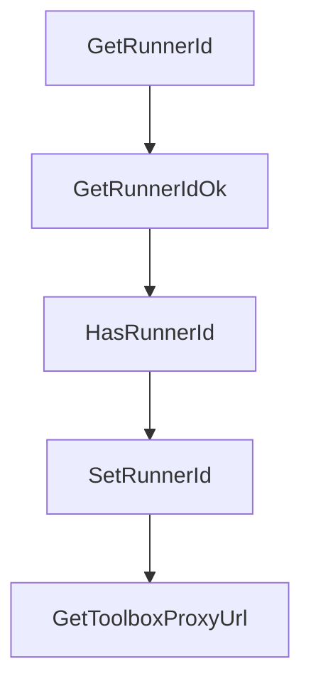

# Chapter 5: MCP Agent Integration and Tooling

Welcome to **Chapter 5: MCP Agent Integration and Tooling**. In this part of **Daytona Tutorial: Secure Sandbox Infrastructure for AI-Generated Code**, you will build an intuitive mental model first, then move into concrete implementation details and practical production tradeoffs.


This chapter focuses on integrating Daytona with coding-agent hosts through MCP.

## Learning Goals

- initialize Daytona MCP integration for Claude/Cursor/Windsurf
- understand available MCP tools for sandbox, file, git, and command operations
- wire custom MCP config into non-default agent hosts
- troubleshoot common auth and connectivity failures

## Integration Pattern

Use CLI setup (`daytona mcp init ...`) for standard hosts. For custom hosts, generate JSON config via `daytona mcp config`, inject required env vars, and validate tool calls with a minimal create/execute/destroy flow.

## Source References

- [Daytona MCP Server Docs](https://github.com/daytonaio/daytona/blob/main/apps/docs/src/content/docs/en/mcp.mdx)
- [CLI MCP README](https://github.com/daytonaio/daytona/blob/main/apps/cli/mcp/README.md)
- [CLI Reference](https://github.com/daytonaio/daytona/blob/main/apps/docs/src/content/docs/en/tools/cli.mdx)

## Summary

You can now connect Daytona capabilities directly into MCP-compatible coding-agent environments.

Next: [Chapter 6: Configuration, API, and Deployment Models](06-configuration-api-and-deployment-models.md)

## Depth Expansion Playbook

## Source Code Walkthrough

### `libs/api-client-go/model_workspace.go`

The `GetRunnerId` function in [`libs/api-client-go/model_workspace.go`](https://github.com/daytonaio/daytona/blob/HEAD/libs/api-client-go/model_workspace.go) handles a key part of this chapter's functionality:

```go
}

// GetRunnerId returns the RunnerId field value if set, zero value otherwise.
func (o *Workspace) GetRunnerId() string {
	if o == nil || IsNil(o.RunnerId) {
		var ret string
		return ret
	}
	return *o.RunnerId
}

// GetRunnerIdOk returns a tuple with the RunnerId field value if set, nil otherwise
// and a boolean to check if the value has been set.
func (o *Workspace) GetRunnerIdOk() (*string, bool) {
	if o == nil || IsNil(o.RunnerId) {
		return nil, false
	}
	return o.RunnerId, true
}

// HasRunnerId returns a boolean if a field has been set.
func (o *Workspace) HasRunnerId() bool {
	if o != nil && !IsNil(o.RunnerId) {
		return true
	}

	return false
}

// SetRunnerId gets a reference to the given string and assigns it to the RunnerId field.
func (o *Workspace) SetRunnerId(v string) {
	o.RunnerId = &v
```

This function is important because it defines how Daytona Tutorial: Secure Sandbox Infrastructure for AI-Generated Code implements the patterns covered in this chapter.

### `libs/api-client-go/model_workspace.go`

The `GetRunnerIdOk` function in [`libs/api-client-go/model_workspace.go`](https://github.com/daytonaio/daytona/blob/HEAD/libs/api-client-go/model_workspace.go) handles a key part of this chapter's functionality:

```go
}

// GetRunnerIdOk returns a tuple with the RunnerId field value if set, nil otherwise
// and a boolean to check if the value has been set.
func (o *Workspace) GetRunnerIdOk() (*string, bool) {
	if o == nil || IsNil(o.RunnerId) {
		return nil, false
	}
	return o.RunnerId, true
}

// HasRunnerId returns a boolean if a field has been set.
func (o *Workspace) HasRunnerId() bool {
	if o != nil && !IsNil(o.RunnerId) {
		return true
	}

	return false
}

// SetRunnerId gets a reference to the given string and assigns it to the RunnerId field.
func (o *Workspace) SetRunnerId(v string) {
	o.RunnerId = &v
}

// GetToolboxProxyUrl returns the ToolboxProxyUrl field value
func (o *Workspace) GetToolboxProxyUrl() string {
	if o == nil {
		var ret string
		return ret
	}

```

This function is important because it defines how Daytona Tutorial: Secure Sandbox Infrastructure for AI-Generated Code implements the patterns covered in this chapter.

### `libs/api-client-go/model_workspace.go`

The `HasRunnerId` function in [`libs/api-client-go/model_workspace.go`](https://github.com/daytonaio/daytona/blob/HEAD/libs/api-client-go/model_workspace.go) handles a key part of this chapter's functionality:

```go
}

// HasRunnerId returns a boolean if a field has been set.
func (o *Workspace) HasRunnerId() bool {
	if o != nil && !IsNil(o.RunnerId) {
		return true
	}

	return false
}

// SetRunnerId gets a reference to the given string and assigns it to the RunnerId field.
func (o *Workspace) SetRunnerId(v string) {
	o.RunnerId = &v
}

// GetToolboxProxyUrl returns the ToolboxProxyUrl field value
func (o *Workspace) GetToolboxProxyUrl() string {
	if o == nil {
		var ret string
		return ret
	}

	return o.ToolboxProxyUrl
}

// GetToolboxProxyUrlOk returns a tuple with the ToolboxProxyUrl field value
// and a boolean to check if the value has been set.
func (o *Workspace) GetToolboxProxyUrlOk() (*string, bool) {
	if o == nil {
		return nil, false
	}
```

This function is important because it defines how Daytona Tutorial: Secure Sandbox Infrastructure for AI-Generated Code implements the patterns covered in this chapter.

### `libs/api-client-go/model_workspace.go`

The `SetRunnerId` function in [`libs/api-client-go/model_workspace.go`](https://github.com/daytonaio/daytona/blob/HEAD/libs/api-client-go/model_workspace.go) handles a key part of this chapter's functionality:

```go
}

// SetRunnerId gets a reference to the given string and assigns it to the RunnerId field.
func (o *Workspace) SetRunnerId(v string) {
	o.RunnerId = &v
}

// GetToolboxProxyUrl returns the ToolboxProxyUrl field value
func (o *Workspace) GetToolboxProxyUrl() string {
	if o == nil {
		var ret string
		return ret
	}

	return o.ToolboxProxyUrl
}

// GetToolboxProxyUrlOk returns a tuple with the ToolboxProxyUrl field value
// and a boolean to check if the value has been set.
func (o *Workspace) GetToolboxProxyUrlOk() (*string, bool) {
	if o == nil {
		return nil, false
	}
	return &o.ToolboxProxyUrl, true
}

// SetToolboxProxyUrl sets field value
func (o *Workspace) SetToolboxProxyUrl(v string) {
	o.ToolboxProxyUrl = v
}

// GetImage returns the Image field value if set, zero value otherwise.
```

This function is important because it defines how Daytona Tutorial: Secure Sandbox Infrastructure for AI-Generated Code implements the patterns covered in this chapter.


## How These Components Connect


