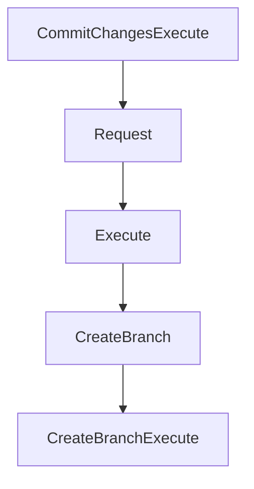

# Chapter 6: Configuration, API, and Deployment Models

Welcome to **Chapter 6: Configuration, API, and Deployment Models**. In this part of **Daytona Tutorial: Secure Sandbox Infrastructure for AI-Generated Code**, you will build an intuitive mental model first, then move into concrete implementation details and practical production tradeoffs.


This chapter explains how to standardize Daytona configuration and deployment choices.

## Learning Goals

- apply config precedence across code, env vars, and `.env`
- align SDK and API usage to one environment contract
- understand OSS docker-compose deployment boundaries
- avoid mixing development and production assumptions

## Deployment Decision Rule

Keep hosted Daytona for production reliability unless you explicitly need OSS self-host experimentation. The current OSS guide is positioned for local/dev workflows and is not marked production-safe.

## Source References

- [Environment Configuration](https://github.com/daytonaio/daytona/blob/main/apps/docs/src/content/docs/en/configuration.mdx)
- [API Reference Docs](https://github.com/daytonaio/daytona/blob/main/apps/docs/src/content/docs/en/tools/api.mdx)
- [Open Source Deployment](https://github.com/daytonaio/daytona/blob/main/apps/docs/src/content/docs/en/oss-deployment.mdx)

## Summary

You now have a clearer contract for environment setup and deployment mode selection.

Next: [Chapter 7: Limits, Network Controls, and Security](07-limits-network-controls-and-security.md)

## Depth Expansion Playbook

## Source Code Walkthrough

### `libs/toolbox-api-client-go/api_git.go`

The `CommitChangesExecute` function in [`libs/toolbox-api-client-go/api_git.go`](https://github.com/daytonaio/daytona/blob/HEAD/libs/toolbox-api-client-go/api_git.go) handles a key part of this chapter's functionality:

```go
	CommitChanges(ctx context.Context) GitAPICommitChangesRequest

	// CommitChangesExecute executes the request
	//  @return GitCommitResponse
	CommitChangesExecute(r GitAPICommitChangesRequest) (*GitCommitResponse, *http.Response, error)

	/*
	CreateBranch Create a new branch

	Create a new branch in the Git repository

	@param ctx context.Context - for authentication, logging, cancellation, deadlines, tracing, etc. Passed from http.Request or context.Background().
	@return GitAPICreateBranchRequest
	*/
	CreateBranch(ctx context.Context) GitAPICreateBranchRequest

	// CreateBranchExecute executes the request
	CreateBranchExecute(r GitAPICreateBranchRequest) (*http.Response, error)

	/*
	DeleteBranch Delete a branch

	Delete a branch from the Git repository

	@param ctx context.Context - for authentication, logging, cancellation, deadlines, tracing, etc. Passed from http.Request or context.Background().
	@return GitAPIDeleteBranchRequest
	*/
	DeleteBranch(ctx context.Context) GitAPIDeleteBranchRequest

	// DeleteBranchExecute executes the request
	DeleteBranchExecute(r GitAPIDeleteBranchRequest) (*http.Response, error)

```

This function is important because it defines how Daytona Tutorial: Secure Sandbox Infrastructure for AI-Generated Code implements the patterns covered in this chapter.

### `libs/toolbox-api-client-go/api_git.go`

The `Request` function in [`libs/toolbox-api-client-go/api_git.go`](https://github.com/daytonaio/daytona/blob/HEAD/libs/toolbox-api-client-go/api_git.go) handles a key part of this chapter's functionality:

```go
	Add files to the Git staging area

	@param ctx context.Context - for authentication, logging, cancellation, deadlines, tracing, etc. Passed from http.Request or context.Background().
	@return GitAPIAddFilesRequest
	*/
	AddFiles(ctx context.Context) GitAPIAddFilesRequest

	// AddFilesExecute executes the request
	AddFilesExecute(r GitAPIAddFilesRequest) (*http.Response, error)

	/*
	CheckoutBranch Checkout branch or commit

	Switch to a different branch or commit in the Git repository

	@param ctx context.Context - for authentication, logging, cancellation, deadlines, tracing, etc. Passed from http.Request or context.Background().
	@return GitAPICheckoutBranchRequest
	*/
	CheckoutBranch(ctx context.Context) GitAPICheckoutBranchRequest

	// CheckoutBranchExecute executes the request
	CheckoutBranchExecute(r GitAPICheckoutBranchRequest) (*http.Response, error)

	/*
	CloneRepository Clone a Git repository

	Clone a Git repository to the specified path

	@param ctx context.Context - for authentication, logging, cancellation, deadlines, tracing, etc. Passed from http.Request or context.Background().
	@return GitAPICloneRepositoryRequest
	*/
	CloneRepository(ctx context.Context) GitAPICloneRepositoryRequest
```

This function is important because it defines how Daytona Tutorial: Secure Sandbox Infrastructure for AI-Generated Code implements the patterns covered in this chapter.

### `libs/toolbox-api-client-go/api_git.go`

The `Execute` function in [`libs/toolbox-api-client-go/api_git.go`](https://github.com/daytonaio/daytona/blob/HEAD/libs/toolbox-api-client-go/api_git.go) handles a key part of this chapter's functionality:

```go
	AddFiles(ctx context.Context) GitAPIAddFilesRequest

	// AddFilesExecute executes the request
	AddFilesExecute(r GitAPIAddFilesRequest) (*http.Response, error)

	/*
	CheckoutBranch Checkout branch or commit

	Switch to a different branch or commit in the Git repository

	@param ctx context.Context - for authentication, logging, cancellation, deadlines, tracing, etc. Passed from http.Request or context.Background().
	@return GitAPICheckoutBranchRequest
	*/
	CheckoutBranch(ctx context.Context) GitAPICheckoutBranchRequest

	// CheckoutBranchExecute executes the request
	CheckoutBranchExecute(r GitAPICheckoutBranchRequest) (*http.Response, error)

	/*
	CloneRepository Clone a Git repository

	Clone a Git repository to the specified path

	@param ctx context.Context - for authentication, logging, cancellation, deadlines, tracing, etc. Passed from http.Request or context.Background().
	@return GitAPICloneRepositoryRequest
	*/
	CloneRepository(ctx context.Context) GitAPICloneRepositoryRequest

	// CloneRepositoryExecute executes the request
	CloneRepositoryExecute(r GitAPICloneRepositoryRequest) (*http.Response, error)

	/*
```

This function is important because it defines how Daytona Tutorial: Secure Sandbox Infrastructure for AI-Generated Code implements the patterns covered in this chapter.

### `libs/toolbox-api-client-go/api_git.go`

The `CreateBranch` function in [`libs/toolbox-api-client-go/api_git.go`](https://github.com/daytonaio/daytona/blob/HEAD/libs/toolbox-api-client-go/api_git.go) handles a key part of this chapter's functionality:

```go

	/*
	CreateBranch Create a new branch

	Create a new branch in the Git repository

	@param ctx context.Context - for authentication, logging, cancellation, deadlines, tracing, etc. Passed from http.Request or context.Background().
	@return GitAPICreateBranchRequest
	*/
	CreateBranch(ctx context.Context) GitAPICreateBranchRequest

	// CreateBranchExecute executes the request
	CreateBranchExecute(r GitAPICreateBranchRequest) (*http.Response, error)

	/*
	DeleteBranch Delete a branch

	Delete a branch from the Git repository

	@param ctx context.Context - for authentication, logging, cancellation, deadlines, tracing, etc. Passed from http.Request or context.Background().
	@return GitAPIDeleteBranchRequest
	*/
	DeleteBranch(ctx context.Context) GitAPIDeleteBranchRequest

	// DeleteBranchExecute executes the request
	DeleteBranchExecute(r GitAPIDeleteBranchRequest) (*http.Response, error)

	/*
	GetCommitHistory Get commit history

	Get the commit history of the Git repository

```

This function is important because it defines how Daytona Tutorial: Secure Sandbox Infrastructure for AI-Generated Code implements the patterns covered in this chapter.


## How These Components Connect


