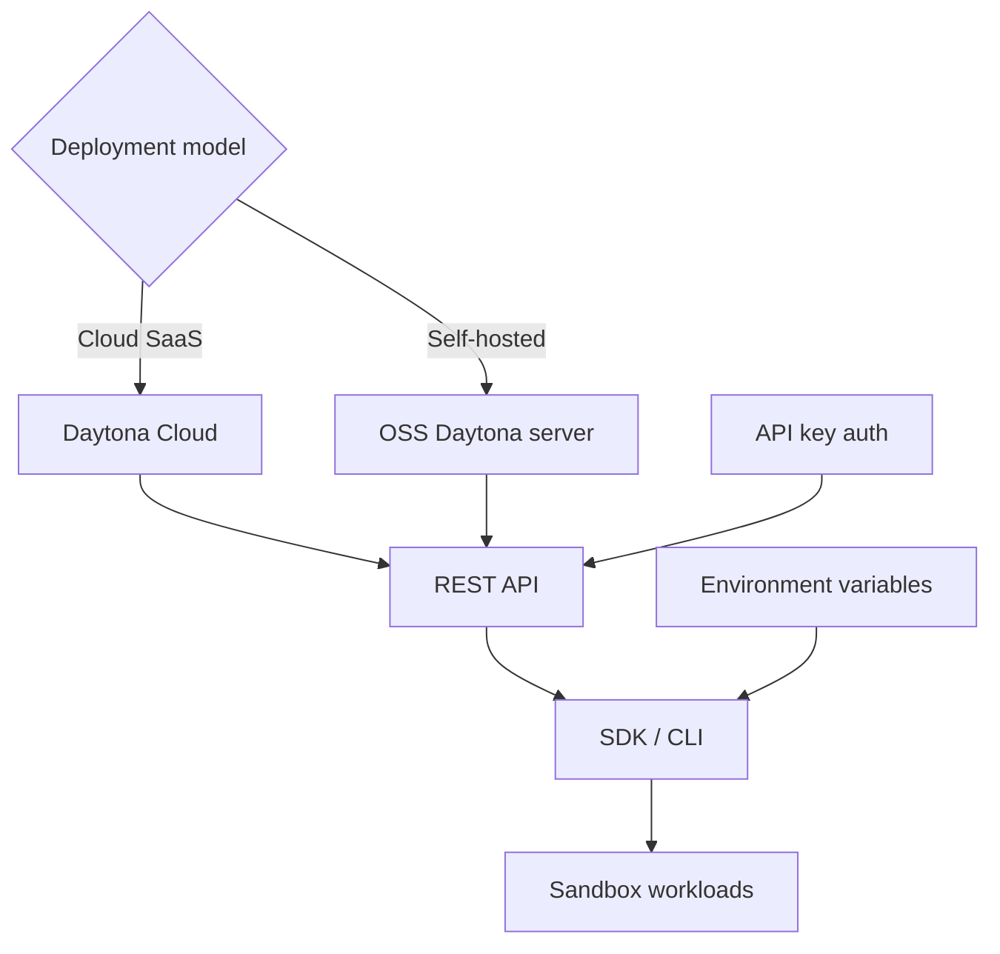

# Chapter 6: Configuration, API, and Deployment Models

Welcome to **Chapter 6: Configuration, API, and Deployment Models**. In this part of **Daytona Tutorial: Secure Sandbox Infrastructure for AI-Generated Code**, you will build an intuitive mental model first, then move into concrete implementation details and practical production tradeoffs.

This chapter explains how to standardize Daytona configuration and deployment choices.

## Learning Goals

- apply config precedence across code, env vars, and `.env`
- align SDK and API usage to one environment contract
- understand OSS docker-compose deployment boundaries
- avoid mixing development and production assumptions

## Deployment Decision Rule

Keep hosted Daytona for production reliability unless you explicitly need OSS self-host experimentation. The current OSS guide is positioned for local/dev workflows and is not marked production-safe.

## Source References

- [Environment Configuration](https://github.com/daytonaio/daytona/blob/main/apps/docs/src/content/docs/en/configuration.mdx)
- [API Reference Docs](https://github.com/daytonaio/daytona/blob/main/apps/docs/src/content/docs/en/tools/api.mdx)
- [Open Source Deployment](https://github.com/daytonaio/daytona/blob/main/apps/docs/src/content/docs/en/oss-deployment.mdx)

## Summary

You now have a clearer contract for environment setup and deployment mode selection.

Next: [Chapter 7: Limits, Network Controls, and Security](07-limits-network-controls-and-security.md)

## How These Components Connect

