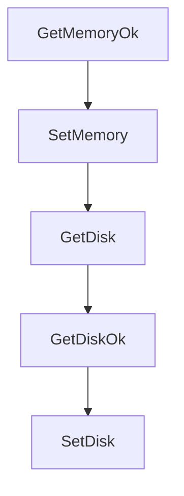

# Chapter 7: Limits, Network Controls, and Security

Welcome to **Chapter 7: Limits, Network Controls, and Security**. In this part of **Daytona Tutorial: Secure Sandbox Infrastructure for AI-Generated Code**, you will build an intuitive mental model first, then move into concrete implementation details and practical production tradeoffs.


This chapter covers resource governance, rate-limit behavior, and network isolation controls.

## Learning Goals

- map organization tiers to resource and request limits
- implement graceful retry behavior for rate-limited APIs
- use network allow/block controls to reduce risk
- connect sandbox policy choices to broader security posture

## Governance Baseline

Treat quotas and egress policy as first-class architecture constraints. Build retry and throttling by default, and explicitly choose `networkAllowList` or `networkBlockAll` for untrusted workflows.

## Source References

- [Limits](https://github.com/daytonaio/daytona/blob/main/apps/docs/src/content/docs/en/limits.mdx)
- [Network Limits (Firewall)](https://github.com/daytonaio/daytona/blob/main/apps/docs/src/content/docs/en/network-limits.mdx)
- [Security Policy](https://github.com/daytonaio/daytona/blob/main/SECURITY.md)

## Summary

You now have a policy framework for scaling usage while constraining abuse and blast radius.

Next: [Chapter 8: Production Operations and Contribution](08-production-operations-and-contribution.md)

## Depth Expansion Playbook

## Source Code Walkthrough

### `libs/api-client-go/model_runner_full.go`

The `GetMemoryOk` function in [`libs/api-client-go/model_runner_full.go`](https://github.com/daytonaio/daytona/blob/HEAD/libs/api-client-go/model_runner_full.go) handles a key part of this chapter's functionality:

```go
}

// GetMemoryOk returns a tuple with the Memory field value
// and a boolean to check if the value has been set.
func (o *RunnerFull) GetMemoryOk() (*float32, bool) {
	if o == nil {
		return nil, false
	}
	return &o.Memory, true
}

// SetMemory sets field value
func (o *RunnerFull) SetMemory(v float32) {
	o.Memory = v
}

// GetDisk returns the Disk field value
func (o *RunnerFull) GetDisk() float32 {
	if o == nil {
		var ret float32
		return ret
	}

	return o.Disk
}

// GetDiskOk returns a tuple with the Disk field value
// and a boolean to check if the value has been set.
func (o *RunnerFull) GetDiskOk() (*float32, bool) {
	if o == nil {
		return nil, false
	}
```

This function is important because it defines how Daytona Tutorial: Secure Sandbox Infrastructure for AI-Generated Code implements the patterns covered in this chapter.

### `libs/api-client-go/model_runner_full.go`

The `SetMemory` function in [`libs/api-client-go/model_runner_full.go`](https://github.com/daytonaio/daytona/blob/HEAD/libs/api-client-go/model_runner_full.go) handles a key part of this chapter's functionality:

```go
}

// SetMemory sets field value
func (o *RunnerFull) SetMemory(v float32) {
	o.Memory = v
}

// GetDisk returns the Disk field value
func (o *RunnerFull) GetDisk() float32 {
	if o == nil {
		var ret float32
		return ret
	}

	return o.Disk
}

// GetDiskOk returns a tuple with the Disk field value
// and a boolean to check if the value has been set.
func (o *RunnerFull) GetDiskOk() (*float32, bool) {
	if o == nil {
		return nil, false
	}
	return &o.Disk, true
}

// SetDisk sets field value
func (o *RunnerFull) SetDisk(v float32) {
	o.Disk = v
}

// GetGpu returns the Gpu field value if set, zero value otherwise.
```

This function is important because it defines how Daytona Tutorial: Secure Sandbox Infrastructure for AI-Generated Code implements the patterns covered in this chapter.

### `libs/api-client-go/model_runner_full.go`

The `GetDisk` function in [`libs/api-client-go/model_runner_full.go`](https://github.com/daytonaio/daytona/blob/HEAD/libs/api-client-go/model_runner_full.go) handles a key part of this chapter's functionality:

```go
}

// GetDisk returns the Disk field value
func (o *RunnerFull) GetDisk() float32 {
	if o == nil {
		var ret float32
		return ret
	}

	return o.Disk
}

// GetDiskOk returns a tuple with the Disk field value
// and a boolean to check if the value has been set.
func (o *RunnerFull) GetDiskOk() (*float32, bool) {
	if o == nil {
		return nil, false
	}
	return &o.Disk, true
}

// SetDisk sets field value
func (o *RunnerFull) SetDisk(v float32) {
	o.Disk = v
}

// GetGpu returns the Gpu field value if set, zero value otherwise.
func (o *RunnerFull) GetGpu() float32 {
	if o == nil || IsNil(o.Gpu) {
		var ret float32
		return ret
	}
```

This function is important because it defines how Daytona Tutorial: Secure Sandbox Infrastructure for AI-Generated Code implements the patterns covered in this chapter.

### `libs/api-client-go/model_runner_full.go`

The `GetDiskOk` function in [`libs/api-client-go/model_runner_full.go`](https://github.com/daytonaio/daytona/blob/HEAD/libs/api-client-go/model_runner_full.go) handles a key part of this chapter's functionality:

```go
}

// GetDiskOk returns a tuple with the Disk field value
// and a boolean to check if the value has been set.
func (o *RunnerFull) GetDiskOk() (*float32, bool) {
	if o == nil {
		return nil, false
	}
	return &o.Disk, true
}

// SetDisk sets field value
func (o *RunnerFull) SetDisk(v float32) {
	o.Disk = v
}

// GetGpu returns the Gpu field value if set, zero value otherwise.
func (o *RunnerFull) GetGpu() float32 {
	if o == nil || IsNil(o.Gpu) {
		var ret float32
		return ret
	}
	return *o.Gpu
}

// GetGpuOk returns a tuple with the Gpu field value if set, nil otherwise
// and a boolean to check if the value has been set.
func (o *RunnerFull) GetGpuOk() (*float32, bool) {
	if o == nil || IsNil(o.Gpu) {
		return nil, false
	}
	return o.Gpu, true
```

This function is important because it defines how Daytona Tutorial: Secure Sandbox Infrastructure for AI-Generated Code implements the patterns covered in this chapter.


## How These Components Connect


