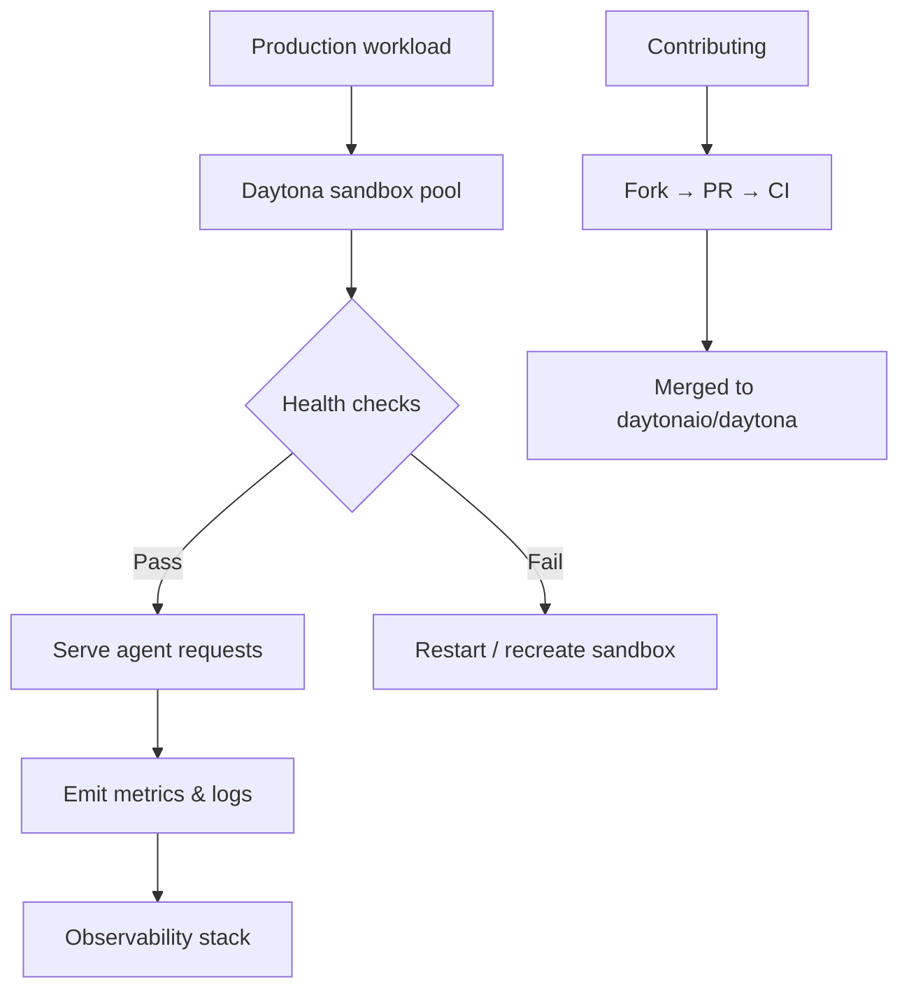

# Chapter 8: Production Operations and Contribution

Welcome to **Chapter 8: Production Operations and Contribution**. In this part of **Daytona Tutorial: Secure Sandbox Infrastructure for AI-Generated Code**, you will build an intuitive mental model first, then move into concrete implementation details and practical production tradeoffs.

This chapter finalizes operational practices for long-lived Daytona adoption.

## Learning Goals

- define runbooks for sandbox lifecycle hygiene and incident response
- monitor quota, network, and execution health signals continuously
- keep SDK/CLI upgrades controlled through staged rollout
- contribute back upstream through focused, testable changes

## Operations Playbook

1. baseline usage and limits in dashboards before scaling workloads
2. standardize sandbox templates, lifecycle policies, and retry behavior
3. gate upgrades through staging and synthetic sandbox smoke tests
4. maintain internal runbooks for auth, network, and execution failures
5. upstream fixes and documentation improvements via small pull requests

## Source References

- [Limits](https://github.com/daytonaio/daytona/blob/main/apps/docs/src/content/docs/en/limits.mdx)
- [Open Source Deployment](https://github.com/daytonaio/daytona/blob/main/apps/docs/src/content/docs/en/oss-deployment.mdx)
- [Contributing](https://github.com/daytonaio/daytona/blob/main/CONTRIBUTING.md)

## Summary

You now have an end-to-end blueprint for using Daytona as secure execution infrastructure for agentic coding workflows.

## How These Components Connect

