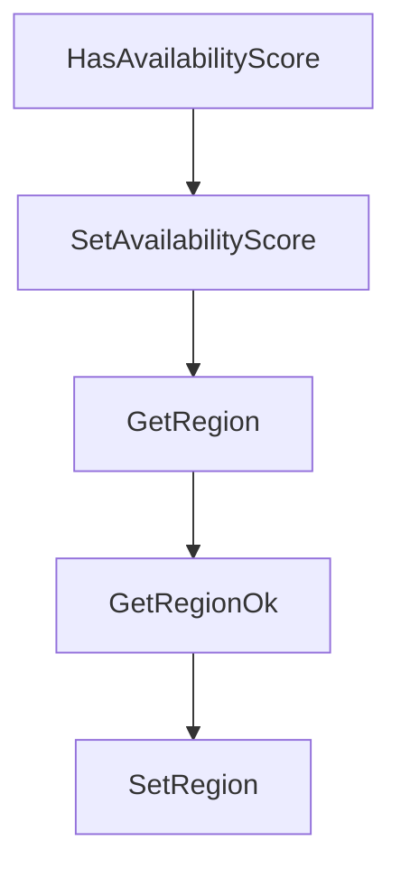

# Chapter 8: Production Operations and Contribution

Welcome to **Chapter 8: Production Operations and Contribution**. In this part of **Daytona Tutorial: Secure Sandbox Infrastructure for AI-Generated Code**, you will build an intuitive mental model first, then move into concrete implementation details and practical production tradeoffs.


This chapter finalizes operational practices for long-lived Daytona adoption.

## Learning Goals

- define runbooks for sandbox lifecycle hygiene and incident response
- monitor quota, network, and execution health signals continuously
- keep SDK/CLI upgrades controlled through staged rollout
- contribute back upstream through focused, testable changes

## Operations Playbook

1. baseline usage and limits in dashboards before scaling workloads
2. standardize sandbox templates, lifecycle policies, and retry behavior
3. gate upgrades through staging and synthetic sandbox smoke tests
4. maintain internal runbooks for auth, network, and execution failures
5. upstream fixes and documentation improvements via small pull requests

## Source References

- [Limits](https://github.com/daytonaio/daytona/blob/main/apps/docs/src/content/docs/en/limits.mdx)
- [Open Source Deployment](https://github.com/daytonaio/daytona/blob/main/apps/docs/src/content/docs/en/oss-deployment.mdx)
- [Contributing](https://github.com/daytonaio/daytona/blob/main/CONTRIBUTING.md)

## Summary

You now have an end-to-end blueprint for using Daytona as secure execution infrastructure for agentic coding workflows.

## Depth Expansion Playbook

## Source Code Walkthrough

### `libs/api-client-go/model_runner_full.go`

The `HasAvailabilityScore` function in [`libs/api-client-go/model_runner_full.go`](https://github.com/daytonaio/daytona/blob/HEAD/libs/api-client-go/model_runner_full.go) handles a key part of this chapter's functionality:

```go
}

// HasAvailabilityScore returns a boolean if a field has been set.
func (o *RunnerFull) HasAvailabilityScore() bool {
	if o != nil && !IsNil(o.AvailabilityScore) {
		return true
	}

	return false
}

// SetAvailabilityScore gets a reference to the given float32 and assigns it to the AvailabilityScore field.
func (o *RunnerFull) SetAvailabilityScore(v float32) {
	o.AvailabilityScore = &v
}

// GetRegion returns the Region field value
func (o *RunnerFull) GetRegion() string {
	if o == nil {
		var ret string
		return ret
	}

	return o.Region
}

// GetRegionOk returns a tuple with the Region field value
// and a boolean to check if the value has been set.
func (o *RunnerFull) GetRegionOk() (*string, bool) {
	if o == nil {
		return nil, false
	}
```

This function is important because it defines how Daytona Tutorial: Secure Sandbox Infrastructure for AI-Generated Code implements the patterns covered in this chapter.

### `libs/api-client-go/model_runner_full.go`

The `SetAvailabilityScore` function in [`libs/api-client-go/model_runner_full.go`](https://github.com/daytonaio/daytona/blob/HEAD/libs/api-client-go/model_runner_full.go) handles a key part of this chapter's functionality:

```go
}

// SetAvailabilityScore gets a reference to the given float32 and assigns it to the AvailabilityScore field.
func (o *RunnerFull) SetAvailabilityScore(v float32) {
	o.AvailabilityScore = &v
}

// GetRegion returns the Region field value
func (o *RunnerFull) GetRegion() string {
	if o == nil {
		var ret string
		return ret
	}

	return o.Region
}

// GetRegionOk returns a tuple with the Region field value
// and a boolean to check if the value has been set.
func (o *RunnerFull) GetRegionOk() (*string, bool) {
	if o == nil {
		return nil, false
	}
	return &o.Region, true
}

// SetRegion sets field value
func (o *RunnerFull) SetRegion(v string) {
	o.Region = v
}

// GetName returns the Name field value
```

This function is important because it defines how Daytona Tutorial: Secure Sandbox Infrastructure for AI-Generated Code implements the patterns covered in this chapter.

### `libs/api-client-go/model_runner_full.go`

The `GetRegion` function in [`libs/api-client-go/model_runner_full.go`](https://github.com/daytonaio/daytona/blob/HEAD/libs/api-client-go/model_runner_full.go) handles a key part of this chapter's functionality:

```go
}

// GetRegion returns the Region field value
func (o *RunnerFull) GetRegion() string {
	if o == nil {
		var ret string
		return ret
	}

	return o.Region
}

// GetRegionOk returns a tuple with the Region field value
// and a boolean to check if the value has been set.
func (o *RunnerFull) GetRegionOk() (*string, bool) {
	if o == nil {
		return nil, false
	}
	return &o.Region, true
}

// SetRegion sets field value
func (o *RunnerFull) SetRegion(v string) {
	o.Region = v
}

// GetName returns the Name field value
func (o *RunnerFull) GetName() string {
	if o == nil {
		var ret string
		return ret
	}
```

This function is important because it defines how Daytona Tutorial: Secure Sandbox Infrastructure for AI-Generated Code implements the patterns covered in this chapter.

### `libs/api-client-go/model_runner_full.go`

The `GetRegionOk` function in [`libs/api-client-go/model_runner_full.go`](https://github.com/daytonaio/daytona/blob/HEAD/libs/api-client-go/model_runner_full.go) handles a key part of this chapter's functionality:

```go
}

// GetRegionOk returns a tuple with the Region field value
// and a boolean to check if the value has been set.
func (o *RunnerFull) GetRegionOk() (*string, bool) {
	if o == nil {
		return nil, false
	}
	return &o.Region, true
}

// SetRegion sets field value
func (o *RunnerFull) SetRegion(v string) {
	o.Region = v
}

// GetName returns the Name field value
func (o *RunnerFull) GetName() string {
	if o == nil {
		var ret string
		return ret
	}

	return o.Name
}

// GetNameOk returns a tuple with the Name field value
// and a boolean to check if the value has been set.
func (o *RunnerFull) GetNameOk() (*string, bool) {
	if o == nil {
		return nil, false
	}
```

This function is important because it defines how Daytona Tutorial: Secure Sandbox Infrastructure for AI-Generated Code implements the patterns covered in this chapter.


## How These Components Connect


