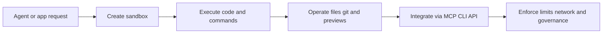

# Daytona Tutorial: Secure Sandbox Infrastructure for AI-Generated Code

> Learn how to use `daytonaio/daytona` to run AI-generated code in isolated sandboxes, integrate coding agents through MCP, and operate sandbox infrastructure with stronger security and resource controls.

## Why This Track Matters

Daytona is one of the most visible open-source platforms for securely executing AI-generated code in isolated runtime environments. It sits at the intersection of coding agents, sandbox security, and programmable infrastructure.

This track focuses on:

- creating and managing sandboxes with SDK, CLI, and API workflows
- running code, file operations, git workflows, and preview links safely
- integrating Daytona with coding-agent hosts through MCP
- operating quotas, network controls, and deployment models with better guardrails

## Current Snapshot (auto-updated)

- repository: [`daytonaio/daytona`](https://github.com/daytonaio/daytona)
- stars: about **55.3k**
- latest release: [`v0.141.0`](https://github.com/daytonaio/daytona/releases/tag/v0.141.0) (**February 11, 2026**)
- license: AGPL-3.0 (repository)
- recent activity: updates on **February 12, 2026**
- project positioning: secure and elastic infrastructure for running AI-generated code

## Mental Model

## Chapter Guide

| Chapter | Key Question | Outcome |
|:--------|:-------------|:--------|
| [01 - Getting Started](01-getting-started.md) | How do I run the first sandbox quickly? | Working baseline |
| [02 - Sandbox Lifecycle, Resources, and Regions](02-sandbox-lifecycle-resources-and-regions.md) | How should I shape sandbox state and resource usage? | Better lifecycle control |
| [03 - Process and Code Execution Patterns](03-process-and-code-execution-patterns.md) | How do I execute code reliably across runtimes? | Safer execution flows |
| [04 - File, Git, and Preview Workflows](04-file-git-and-preview-workflows.md) | How do I manage files, repositories, and app previews in sandboxes? | End-to-end developer workflow |
| [05 - MCP Agent Integration and Tooling](05-mcp-agent-integration-and-tooling.md) | How do I connect Daytona to coding-agent hosts? | Practical MCP integration |
| [06 - Configuration, API, and Deployment Models](06-configuration-api-and-deployment-models.md) | How should config and deployment differ between hosted and OSS modes? | Cleaner environment strategy |
| [07 - Limits, Network Controls, and Security](07-limits-network-controls-and-security.md) | How do I govern resource and network risk? | Stronger policy controls |
| [08 - Production Operations and Contribution](08-production-operations-and-contribution.md) | How do teams run and evolve Daytona-based platforms over time? | Long-term operations playbook |

## What You Will Learn

- how to design sandbox-first execution workflows for coding agents
- how to combine SDK, CLI, API, and MCP surfaces without drift
- how to apply resource, rate, and network controls as usage scales
- how to operate and contribute to Daytona with clearer production discipline

## Source References

- [Daytona Repository](https://github.com/daytonaio/daytona)
- [README](https://github.com/daytonaio/daytona/blob/main/README.md)
- [Getting Started](https://github.com/daytonaio/daytona/blob/main/apps/docs/src/content/docs/en/getting-started.mdx)
- [Sandboxes](https://github.com/daytonaio/daytona/blob/main/apps/docs/src/content/docs/en/sandboxes.mdx)
- [Process and Code Execution](https://github.com/daytonaio/daytona/blob/main/apps/docs/src/content/docs/en/process-code-execution.mdx)
- [Daytona MCP Server](https://github.com/daytonaio/daytona/blob/main/apps/docs/src/content/docs/en/mcp.mdx)
- [CLI MCP README](https://github.com/daytonaio/daytona/blob/main/apps/cli/mcp/README.md)
- [Environment Configuration](https://github.com/daytonaio/daytona/blob/main/apps/docs/src/content/docs/en/configuration.mdx)
- [Limits](https://github.com/daytonaio/daytona/blob/main/apps/docs/src/content/docs/en/limits.mdx)
- [Network Limits](https://github.com/daytonaio/daytona/blob/main/apps/docs/src/content/docs/en/network-limits.mdx)
- [Open Source Deployment](https://github.com/daytonaio/daytona/blob/main/apps/docs/src/content/docs/en/oss-deployment.mdx)
- [Contributing](https://github.com/daytonaio/daytona/blob/main/CONTRIBUTING.md)

## Related Tutorials

- [OpenCode Tutorial](../opencode-tutorial/)
- [HAPI Tutorial](../hapi-tutorial/)
- [MCP Python SDK Tutorial](../mcp-python-sdk-tutorial/)
- [Claude Flow Tutorial](../claude-flow-tutorial/)

---

Start with [Chapter 1: Getting Started](01-getting-started.md).

## Navigation & Backlinks

- [Start Here: Chapter 1: Getting Started](01-getting-started.md)
- [Back to Main Catalog](../../README.md#-tutorial-catalog)
- [Browse A-Z Tutorial Directory](../../discoverability/tutorial-directory.md)
- [Search by Intent](../../discoverability/query-hub.md)
- [Explore Category Hubs](../../README.md#category-hubs)

## Full Chapter Map

1. [Chapter 1: Getting Started](01-getting-started.md)
2. [Chapter 2: Sandbox Lifecycle, Resources, and Regions](02-sandbox-lifecycle-resources-and-regions.md)
3. [Chapter 3: Process and Code Execution Patterns](03-process-and-code-execution-patterns.md)
4. [Chapter 4: File, Git, and Preview Workflows](04-file-git-and-preview-workflows.md)
5. [Chapter 5: MCP Agent Integration and Tooling](05-mcp-agent-integration-and-tooling.md)
6. [Chapter 6: Configuration, API, and Deployment Models](06-configuration-api-and-deployment-models.md)
7. [Chapter 7: Limits, Network Controls, and Security](07-limits-network-controls-and-security.md)
8. [Chapter 8: Production Operations and Contribution](08-production-operations-and-contribution.md)

*Generated by [AI Codebase Knowledge Builder](https://github.com/The-Pocket/Tutorial-Codebase-Knowledge)*
