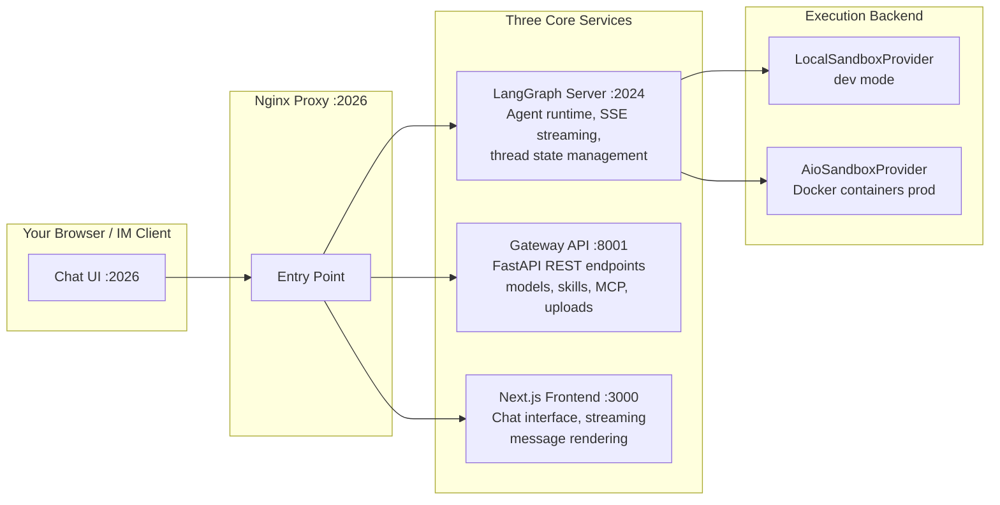
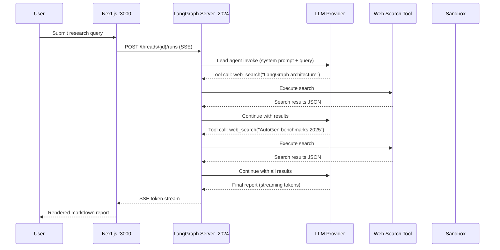

# Chapter 1: Getting Started with DeerFlow

## What Problem Does This Solve?

Most teams assume DeerFlow is something it is not. The repository name sounds like a workflow scheduler. The old documentation described it as a distributed task execution platform. Neither description is accurate.

DeerFlow is an **open-source super agent harness** — a runtime that orchestrates a lead LLM agent to conduct deep research, write and execute code, spawn parallel sub-agents, load modular skills, and deliver structured outputs (reports, podcasts, slides) via a chat interface. It was created by ByteDance and is conceptually similar to Google's Gemini Deep Research product, but open-source and extensible.

The practical problem it solves: when you need an AI assistant that can autonomously browse the web from multiple angles, write and run Python to analyze data, synthesize a structured report with citations, and optionally produce audio or slide outputs — all from a single chat message — DeerFlow provides the production-ready runtime to do it.

This chapter gets you from zero to your first research output in under 30 minutes.

## How it Works Under the Hood

Before touching any configuration, it helps to understand the three-service architecture you are about to start.



Every user message flows through Nginx to the LangGraph server. The LangGraph server runs the compiled `lead_agent` graph, which invokes the LLM, dispatches tools, streams tokens back to the frontend via SSE, and persists state via an async checkpointer.

The Gateway API handles everything that is not agent execution: listing available models, managing MCP server configuration, serving generated artifacts, handling file uploads, and managing memory records.

## Prerequisites

| Requirement | Minimum | Recommended |
|:--|:--|:--|
| CPU | 4 cores | 8 cores |
| RAM | 8 GB | 16 GB |
| Disk | 20 GB | 40 GB |
| Docker | 24+ | latest |
| Python | 3.12+ | 3.12+ |
| Node.js | 22+ | 22+ |

You also need at least one LLM provider API key. DeerFlow works with any OpenAI-compatible endpoint including:
- OpenAI (`gpt-4o`, `o1`, `o3`)
- Anthropic Claude (via OpenAI-compatible proxy or direct LangChain integration)
- DeepSeek
- Novita AI
- vLLM self-hosted endpoints
- OpenRouter (routing to Gemini, Llama, etc.)

## Installation

### Step 1: Clone the Repository

```bash
git clone https://github.com/bytedance/deer-flow.git
cd deer-flow
```

### Step 2: Run the Interactive Setup Wizard

The wizard creates `config.yaml` and `.env` from your answers:

```bash
make setup
```

The wizard prompts for:
1. LLM provider and model selection
2. API key (saved to `.env`, referenced as `$OPENAI_API_KEY` in `config.yaml`)
3. Web search provider (DuckDuckGo — free, no key; Tavily — better quality, requires key)
4. Sandbox execution mode (local for dev, Docker for production)

After `make setup`, verify the generated files:

```bash
# config.yaml should exist at the project root (NOT in backend/)
ls -la config.yaml

# .env should contain your API key
cat .env
```

### Step 3: Validate with the Doctor Script

```bash
make doctor
```

The doctor script checks:
- `config.yaml` loads without parse errors
- The selected LLM model is reachable (test API call)
- Web search tool (if configured) is responsive
- Docker is available if sandbox mode is set to Docker

### Step 4: Choose Your Startup Mode

**Docker (recommended for production and first-time setup):**

```bash
make docker-init    # Pull images, create network, initialize volumes
make docker-start   # Start all three services + Nginx
```

**Local development (faster iteration, no Docker for services):**

```bash
make install   # pip install + npm install
make dev       # Concurrently starts LangGraph server, Gateway, and Next.js
```

Both modes expose the UI at `http://localhost:2026`.

## Configuration Deep Dive

The `config.yaml` file controls every significant behavior of DeerFlow. Understanding its structure is essential for customization.

```yaml
# config.yaml — canonical location: project root (deer-flow/config.yaml)
config_version: 3

models:
  # Each entry defines an LLM available to the agent
  - name: gpt-4o
    display_name: GPT-4o
    use: langchain_openai:ChatOpenAI
    model: gpt-4o
    api_key: $OPENAI_API_KEY
    max_tokens: 16384
    supports_thinking: false
    supports_vision: true

  # Example: OpenRouter routing to Gemini
  - name: gemini-flash
    display_name: Gemini 2.5 Flash
    use: langchain_openai:ChatOpenAI
    model: google/gemini-2.5-flash-preview
    base_url: https://openrouter.ai/api/v1
    api_key: $OPENROUTER_API_KEY

tools:
  # Web search configuration
  - name: web_search
    group: web
    use: deerflow.community.ddg_search:web_search_tool
    max_results: 5

  # File operations
  - name: read_file
    group: file:read
    use: deerflow.tools.file:read_file_tool

  - name: bash
    group: bash
    use: deerflow.tools.bash:bash_tool

sandbox:
  # For development: direct host execution
  use: deerflow.sandbox.local:LocalSandboxProvider
  allow_host_bash: true

  # For production: Docker-isolated execution
  # use: deerflow.community.aio_sandbox:AioSandboxProvider
  # auto_start: true
  # port: 8080

skills:
  path: ../skills       # Host path to skills directory
  container_path: /mnt/skills
```

The configuration path is resolved in this priority order:
1. `DEER_FLOW_CONFIG_PATH` environment variable
2. `backend/config.yaml`
3. `deer-flow/config.yaml` (project root — the standard location)

### Environment Variables

```bash
# .env (git-ignored, do not commit)
OPENAI_API_KEY=sk-...
TAVILY_API_KEY=tvly-...      # optional, better search quality
ANTHROPIC_API_KEY=sk-ant-...  # if using Claude directly
LANGCHAIN_API_KEY=ls__...    # optional, for LangSmith tracing
LANGCHAIN_TRACING_V2=true    # enable LangSmith
```

## Your First Research Query

With DeerFlow running at `http://localhost:2026`, open the chat interface and type:

```
What are the key architectural differences between LangGraph and AutoGen for building multi-agent systems? Include recent benchmarks and community adoption data.
```

What you will observe:

1. **Thinking phase** — The lead agent parses the question, identifies sub-topics, and may ask a clarifying question via `ask_clarification` if the request is ambiguous
2. **Research phase** — Multiple web searches fire in sequence (or in parallel via sub-agents), each fetching and reading full page content
3. **Synthesis phase** — The agent accumulates search results in its context window
4. **Report phase** — A structured markdown report streams to the UI with inline citations in the format `[citation:Title](URL)`

The entire interaction is a single LangGraph thread, persisted in the checkpointer. You can resume it later or branch into a new query.



## Understanding Thread State

Every conversation is a **thread**. DeerFlow extends LangGraph's `AgentState` with `ThreadState`:

```python
# backend/packages/harness/deerflow/agents/thread_state.py
class ThreadState(AgentState):
    sandbox: SandboxState | None          # Docker container ID for this thread
    thread_data: ThreadDataState | None   # Workspace/uploads/outputs paths
    title: str | None                     # Auto-generated conversation title
    artifacts: list[str]                  # Paths of generated outputs (reports, MP3s, slides)
    todos: list | None                    # Task list (plan mode)
    uploaded_files: list[dict] | None     # Files attached by the user
    viewed_images: dict[str, ViewedImageData]  # Images the agent has processed
```

This state is checkpointed asynchronously after every step, meaning you can pause a long research run and resume it exactly where it left off.

## Troubleshooting Common Setup Issues

### "config.yaml not found"

The backend looks for `config.yaml` in the project root (`deer-flow/`), not in `backend/`. The most common mistake is placing it in `backend/config.yaml`. Either move it or set:

```bash
export DEER_FLOW_CONFIG_PATH=/absolute/path/to/deer-flow/config.yaml
```

### LLM Model Not Responding

Run `make doctor` — it tests the model connection. If it fails, verify:
- The API key in `.env` is correct and not expired
- The `base_url` in `config.yaml` matches the provider's endpoint
- The model name matches exactly (case-sensitive)

### Docker Sandbox Startup Timeout

The AioSandbox container image is ~500 MB. Pull it explicitly before the first run:

```bash
make setup-sandbox
```

### Port 2026 Already in Use

```bash
# Find the process using the port
lsof -i :2026
# Stop DeerFlow services
make docker-stop
# Or kill the specific process and restart
```

### Frontend Shows "Cannot connect to agent"

The frontend at `:3000` proxies agent requests through Nginx at `:2026` to the LangGraph server at `:2024`. If the LangGraph server is not running, no agent calls will succeed. Check:

```bash
make docker-logs          # Docker mode
# or
ps aux | grep langgraph   # Local mode
```

## Key Concepts Recap

| Concept | What It Actually Is |
|:--|:--|
| "Workflow" | A LangGraph thread — a sequence of LLM invocations + tool calls |
| "Task" | A sub-agent invocation spawned via `task_tool` |
| "Worker" | A Docker sandbox container executing Python/bash code |
| "State" | The LangGraph `ThreadState` persisted by the checkpointer |
| "Skill" | A Markdown file loaded into the agent's context to guide behavior |
| "Config" | `config.yaml` at project root — LLM providers, tools, sandbox mode |

## What's Next?

With DeerFlow running and your first research query completed, Chapter 2 dives into the LangGraph state machine that powers everything: how the `lead_agent` graph is compiled, how the 14-stage middleware pipeline wraps every invocation, and how async checkpointing enables long-running multi-turn research sessions.

---

## Chapter Connections

- [Tutorial Index](README.md)
- [Next Chapter: Chapter 2: LangGraph Architecture and Agent Orchestration](02-langgraph-architecture.md)
- [Main Catalog](../../README.md#-tutorial-catalog)
- [A-Z Tutorial Directory](../../discoverability/tutorial-directory.md)
