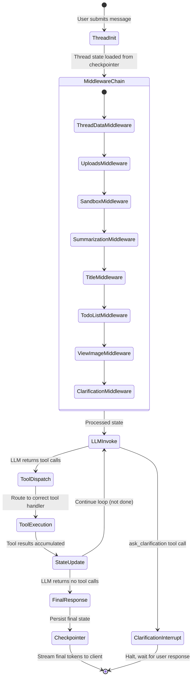
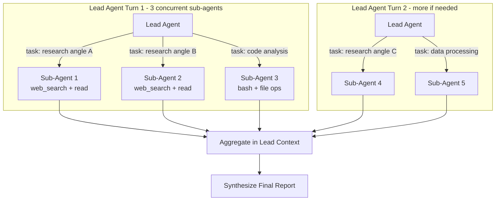

# Chapter 2: LangGraph Architecture and Agent Orchestration

## What Problem Does This Solve?

Agentic systems that use raw LLM loops fail in production. Without a proper state machine, you lose the ability to:
- Resume a long-running research session after a crash or timeout
- Inject infrastructure concerns (sandbox setup, memory loading, context summarization) without tangling them with LLM call logic
- Enforce safety constraints (loop detection, sub-agent concurrency limits) at a consistent layer
- Support human-in-the-loop interrupts (clarification requests) that pause execution and wait for user input

DeerFlow solves these problems by building on LangGraph as its state machine runtime. Every agent invocation is a step in a compiled graph with explicit state, explicit transitions, and an async checkpointer that snapshots state after every node execution. The 14-stage middleware pipeline handles infrastructure concerns in a clean, ordered chain that is composable and testable independently of the LLM.

## How it Works Under the Hood

### The LangGraph Graph Definition

DeerFlow registers a single graph called `lead_agent` in `backend/langgraph.json`:

```json
{
  "python_version": "3.12",
  "graphs": {
    "lead_agent": "deerflow.agents:make_lead_agent"
  },
  "dependencies": ["."],
  "env": ".env"
}
```

The `make_lead_agent()` factory function constructs the full agent graph:

```python
# backend/packages/harness/deerflow/agents/lead_agent/agent.py
def make_lead_agent(config: RunnableConfig | None = None):
    """
    Entry point registered in langgraph.json.
    Creates the compiled StateGraph that is the lead_agent runtime.
    """
    agent = create_deerflow_agent(
        model=resolve_model(config),    # From config.yaml models list
        tools=build_tools(config),      # web_search, bash, file ops, MCP tools
        system_prompt=load_soul_prompt(),
        features=AgentFeatures(
            subagent=True,              # Enable task_tool for sub-agents
            memory=True,               # Enable cross-session memory
            sandbox=True,              # Enable code execution sandbox
            vision=True,               # Enable image processing
            plan_mode=False,           # Todo-list mode (off by default)
        ),
        checkpointer=make_checkpointer(),  # Async SQLite or Postgres checkpointer
    )
    return agent
```

### The Agent Factory

The `create_deerflow_agent()` factory in `agents/factory.py` is the core assembly point. It accepts a model, tools, and either a `features` flags object or a custom `middleware` list:

```python
# backend/packages/harness/deerflow/agents/factory.py
def create_deerflow_agent(
    model: BaseChatModel,
    tools: list[BaseTool] | None = None,
    system_prompt: str | None = None,
    middleware: list[Middleware] | None = None,
    features: AgentFeatures | None = None,
    plan_mode: bool = False,
    state_schema: type = ThreadState,
    checkpointer: BaseCheckpointSaver | None = None,
    name: str = "lead_agent",
) -> CompiledGraph:
    """
    The factory assembly is config-free. Some injected runtime components
    (e.g., task_tool for subagent) may still read global config at invocation time.
    """
    resolved_middleware = middleware or build_middleware_chain(features, plan_mode)
    agent = create_agent(
        model=model,
        tools=tools or [],
        system_prompt=system_prompt,
        middleware=resolved_middleware,
        state_schema=state_schema,
    )
    return agent.compile(checkpointer=checkpointer, name=name)
```

Note the key design principle stated in the source: **"The factory assembly itself reads no config files."** Configuration is injected at construction time, not read at invocation time. This makes the factory fully testable in isolation.

### The Full State Machine Flow



### The 14-Stage Middleware Pipeline

Every agent invocation passes through an ordered chain of middlewares. Order matters — later middlewares can rely on earlier ones having executed:

```mermaid
graph TD
    A[Incoming State] --> B[1. ThreadDataMiddleware<br/>Initialize workspace paths for this thread]
    B --> C[2. UploadsMiddleware<br/>Process attached files, convert to Markdown]
    C --> D[3. SandboxMiddleware<br/>Acquire Docker container or local executor]
    D --> E[4. SummarizationMiddleware<br/>Compress old context when token limit approaches]
    E --> F[5. TitleMiddleware<br/>Auto-generate conversation title after first response]
    F --> G[6. TodoListMiddleware<br/>Track task checklist in plan mode]
    G --> H[7. TokenUsageMiddleware<br/>Track and expose token consumption]
    H --> I[8. MemoryMiddleware<br/>Queue facts for cross-session memory updater]
    I --> J[9. ViewImageMiddleware<br/>Enable vision: convert image paths to base64]
    J --> K[10. DeferredToolFilterMiddleware<br/>Remove tools not yet available to this model]
    K --> L[11. SubagentLimitMiddleware<br/>Throttle concurrent task_tool calls to max N]
    L --> M[12. LoopDetectionMiddleware<br/>Detect and break infinite tool-call loops]
    M --> N[13. DanglingToolCallMiddleware<br/>Handle malformed/incomplete tool call responses]
    N --> O[14. ClarificationMiddleware<br/>Intercept ask_clarification — MUST BE LAST]
    O --> P[LLM Invocation]
```



**Why ClarificationMiddleware must be last:** It intercepts `ask_clarification` tool calls and halts execution by returning a `Command(goto=END)`. Running it last ensures it captures edge cases that only appear after the full middleware chain processes the state.

### ThreadState: The State Schema

DeerFlow extends LangGraph's `AgentState` with agent-specific fields:

```python
# backend/packages/harness/deerflow/agents/thread_state.py
from langgraph.prebuilt import AgentState
from typing import Annotated

class SandboxState(TypedDict):
    sandbox_id: str | None           # Docker container ID

class ThreadDataState(TypedDict):
    workspace_path: str | None       # /mnt/user-data/workspace/{thread_id}/
    uploads_path: str | None         # /mnt/user-data/uploads/{thread_id}/
    outputs_path: str | None         # /mnt/user-data/outputs/{thread_id}/

class ViewedImageData(TypedDict):
    base64: str
    mime_type: str

class ThreadState(AgentState):
    sandbox: SandboxState | None
    thread_data: ThreadDataState | None
    title: str | None
    artifacts: Annotated[list[str], merge_artifacts]    # Custom reducer: append-only
    todos: list | None
    uploaded_files: list[dict] | None
    viewed_images: Annotated[dict[str, ViewedImageData], merge_viewed_images]
```

The `artifacts` and `viewed_images` fields use custom **reducers** — functions that merge partial state updates. When a node returns a partial state update, LangGraph uses the reducer to merge it into the full state rather than overwriting it.

### Async Checkpointing

State is persisted asynchronously after every node execution:

```python
# backend/packages/harness/deerflow/agents/checkpointer/async_provider.py
def make_checkpointer() -> BaseCheckpointSaver:
    """
    Factory function registered in langgraph.json.
    Returns an async-capable checkpointer.
    Development: SQLite-backed
    Production: Postgres-backed via LangGraph Platform
    """
    ...
```

This enables:
- **Resumability**: Stop a 30-minute research run and resume it exactly where it left off
- **Branching**: Fork a thread at any checkpoint to explore an alternative direction
- **Human-in-the-loop**: Halt at `ClarificationMiddleware`, wait for user response, resume
- **Parallelism**: Multiple concurrent threads without state interference

### Sub-Agent Orchestration via task_tool

When the `subagent` feature flag is enabled, the lead agent gains access to `task_tool`. The agent calls this tool to spawn a sub-agent with isolated context and tools:

```python
# Conceptual model of task_tool behavior
async def task_tool(
    instruction: str,       # What the sub-agent should do
    tools: list[str],       # Which tool groups to give the sub-agent
    context: str | None,   # Relevant context to inject
) -> str:
    """
    Creates a new DeerFlow agent instance with minimal context,
    executes the instruction, and returns the result as a string.

    SubagentLimitMiddleware throttles concurrent calls to max N (default: 3).
    """
    sub_agent = create_deerflow_agent(
        model=resolve_model(),
        tools=resolve_tools(tools),
        # Sub-agents do not spawn further sub-agents
        features=AgentFeatures(subagent=False),
    )
    result = await sub_agent.ainvoke({"messages": [HumanMessage(instruction)]})
    return result["messages"][-1].content
```

The lead agent's system prompt enforces a hard constraint: *"maximum [N] `task` calls per response."* If a research task requires more parallelism, the agent batches them across multiple response turns automatically.



### Model Resolution and Capability Validation

The agent resolves which model to use through a three-level fallback chain:

1. **Requested model** — specified in the API call (`X-Model` header or request body)
2. **Agent config model** — from `workspace/agents/{agent_name}/config.yaml`
3. **Global default** — first model in `config.yaml`'s `models` list

After resolution, the factory validates that the model supports any required features:

```python
# Capability flags validated before agent compilation
supports_thinking: bool    # enables extended reasoning / thinking tokens
supports_vision: bool      # enables image inputs
supports_reasoning_effort: bool  # advanced reasoning control
```

If the selected model does not support `supports_vision` but the `ViewImageMiddleware` is in the chain, the factory either raises an error or degrades gracefully depending on the `allow_degradation` configuration.

### Loop Detection

`LoopDetectionMiddleware` watches the message history for repeated tool call patterns. If the agent calls the same tool with the same arguments above a configurable threshold, the middleware injects a system message:

```python
# Conceptual behavior of LoopDetectionMiddleware
if repeated_tool_call_count > LOOP_THRESHOLD:
    state["messages"].append(SystemMessage(
        content=(
            "You appear to be repeating the same tool call. "
            "Stop and synthesize your findings with what you have so far."
        )
    ))
```

This prevents the most common failure mode in production LLM agent systems: infinite loops on ambiguous or unchanged tool results.

## Key Architecture Principles

| Principle | Implementation |
|:--|:--|
| State-machine-first | LangGraph StateGraph with explicit node/edge definitions |
| Config-free factory | `create_deerflow_agent()` accepts injected dependencies only |
| Middleware separation | Infrastructure concerns in 14-stage chain, not in LLM prompt |
| Async by default | All I/O (tools, sandbox, checkpointer) is async |
| Thread isolation | Per-thread workspace paths, sandbox containers, and state |
| Safe by default | Loop detection, sub-agent limits, clarification halting |

## Summary

DeerFlow's LangGraph architecture provides a compiled `StateGraph` with explicit `ThreadState`, an async checkpointer, and a 14-stage middleware pipeline that cleanly separates infrastructure from LLM logic. Sub-agents are spawned via `task_tool` with concurrency limits enforced at the middleware layer. The config-free factory pattern makes the system composable and testable.

In the next chapter, we trace a complete research query through the pipeline from submission to final report, including how web search results accumulate, how context is summarized to stay within token limits, and how citations are tracked.

---

## Chapter Connections

- [Tutorial Index](README.md)
- [Previous Chapter: Chapter 1: Getting Started](01-getting-started.md)
- [Next Chapter: Chapter 3: Research Agent Pipeline](03-research-agent-pipeline.md)
- [Main Catalog](../../README.md#-tutorial-catalog)
- [A-Z Tutorial Directory](../../discoverability/tutorial-directory.md)
