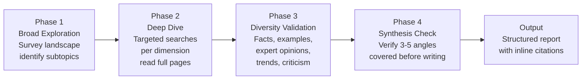
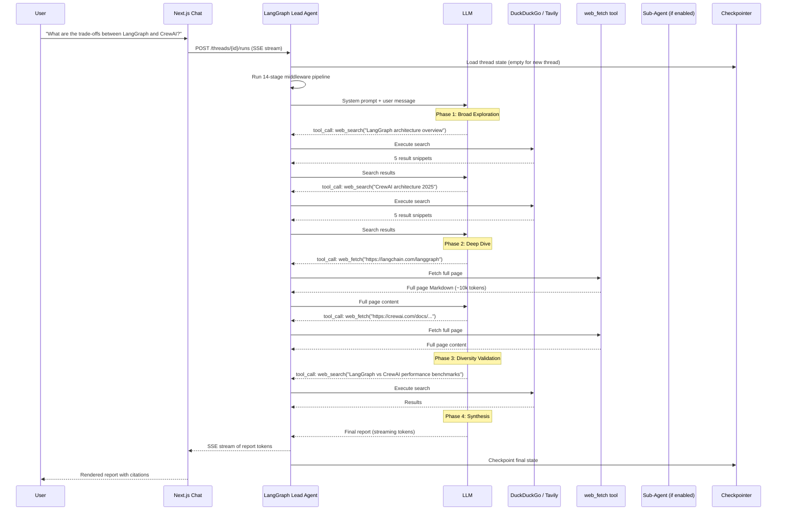
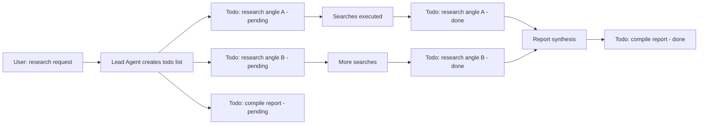

# Chapter 3: Research Agent Pipeline

## What Problem Does This Solve?

A naive research agent searches once, reads one page, and writes an answer. This produces shallow, often inaccurate outputs that miss context, conflicting evidence, and recent developments.

DeerFlow's research pipeline solves this by enforcing a structured multi-phase methodology. The Deep Research skill provides a four-phase protocol: broad exploration, deep targeted searching, diversity validation (at least 3-5 angles), and a synthesis check before writing. The system prompt enforces a mandatory `CLARIFY → PLAN → ACT` sequence so the agent never starts work on an ambiguous request. Citations are tracked inline throughout the process using a standard format.

The result is research outputs that cite real sources, cover multiple perspectives, and are reproducible by a human reviewer following the same search trail.

## How it Works Under the Hood

### The System Prompt Architecture

The lead agent's behavior is primarily controlled by its system prompt, loaded at startup from `prompt.py` and a configurable `SOUL.md` file:

```python
# backend/packages/harness/deerflow/agents/lead_agent/prompt.py
# Key excerpts from the actual system prompt structure:

SYSTEM_PROMPT = """
You are an open-source super agent configured with a specific personality.

## Core Operational Protocol

**MANDATORY PRIORITY SEQUENCE: CLARIFY → PLAN → ACT**

1. CLARIFY: When any of the following is true, call ask_clarification immediately:
   - The request contains missing information required to proceed
   - Requirements are ambiguous or could be interpreted multiple ways
   - The approach has multiple valid paths requiring user preference
   - The operation is risky or irreversible

   NEVER start work and clarify mid-execution. Clarify first, then act.

2. PLAN: Think concisely and strategically before taking action.
   Identify what is clear, what is ambiguous, and what is missing.

3. ACT: Execute with the tools available, following loaded skills.

## Citation Requirements
When using external sources, include inline citations immediately after claims:
Format: [citation:Title](URL)

Include a Sources section at the end listing all references.

## File Management
- Working directory: /mnt/user-data/workspace/
- Final deliverables: /mnt/user-data/outputs/
- Use relative paths within generated scripts

## Skill Loading
You have access to skills that provide optimized workflows for specific tasks.
Read the SKILL.md file when a query matches a skill's use case.
Load referenced skill resources progressively — only when needed.
"""
```

The SOUL.md component is loaded from `skills/public/bootstrap/templates/SOUL.template.md` and provides the agent's "personality" — communication style, values, and behavioral norms.

### The Deep Research Skill

The `deep-research` skill (`skills/public/deep-research/SKILL.md`) is the core methodology the agent loads when conducting research. It defines a four-phase protocol:



Key principles enforced by the skill:
- **Never generate content based solely on general knowledge.** Research quality directly affects output quality.
- **Search with temporal awareness.** Use the current date in queries where recency matters.
- **Fetch full sources.** Do not rely on search snippets — use `web_fetch` to read complete pages.
- **Success criteria**: Can address key facts, 2-3 concrete examples, expert perspectives, current trends, limitations, and topical relevance.

### Full Research Query Trace

Here is the complete execution path for a research query:



### Sub-Agent Parallelism in Research

When sub-agents are enabled and the query is complex, the lead agent decomposes research across concurrent sub-agents:

```python
# Lead agent's research decomposition strategy (conceptual)
# The agent generates these task_tool calls in a single response

tasks = [
    task_tool(
        instruction="Research LangGraph architecture and state management approach. "
                    "Read at least 3 full sources. Return a structured summary with citations.",
        tools=["web", "file:read"],
    ),
    task_tool(
        instruction="Research CrewAI architecture, agent roles, and orchestration model. "
                    "Read at least 3 full sources. Return a structured summary with citations.",
        tools=["web", "file:read"],
    ),
    task_tool(
        instruction="Find recent benchmarks comparing LangGraph and CrewAI: performance, "
                    "developer adoption, GitHub stars, community size. Return data with sources.",
        tools=["web", "file:read"],
    ),
]

# SubagentLimitMiddleware allows max 3 concurrent (default)
# Results arrive async and are aggregated in lead agent context
results = await asyncio.gather(*tasks)
```

### Citation Tracking

The system prompt enforces a strict citation format. Every claim derived from a web source must have an inline citation immediately following it:

```markdown
LangGraph uses a compiled StateGraph model where control flow is explicit
[citation:LangGraph Documentation](https://python.langchain.com/docs/langgraph),
while CrewAI uses a role-based crew model where agents are assigned tasks
[citation:CrewAI Docs](https://crewai.com/docs/core-concepts).

## Sources

1. [LangGraph Documentation](https://python.langchain.com/docs/langgraph)
2. [CrewAI Core Concepts](https://crewai.com/docs/core-concepts)
3. [Agent Framework Comparison 2025](https://example.com/comparison)
```

This format is enforced at the system prompt level, not by any post-processing code. If the LLM omits a citation, the format is not applied automatically — it is a soft constraint.

### Context Management and Summarization

Long research sessions accumulate large message histories. `SummarizationMiddleware` prevents context overflow:

```python
# Conceptual behavior of SummarizationMiddleware
class SummarizationMiddleware:
    """
    When token count approaches model's context limit,
    compress the older portion of the conversation:
    - Keep the system prompt
    - Keep the last N messages verbatim
    - Summarize everything in between
    - Replace the compressed portion with a summary message
    """
    TOKEN_THRESHOLD = 0.8  # Trigger at 80% of model's context window

    async def before_invoke(self, state: ThreadState) -> ThreadState:
        token_count = count_tokens(state["messages"])
        if token_count > self.TOKEN_THRESHOLD * self.model_context_limit:
            summary = await self.summarize_middle_messages(state["messages"])
            state["messages"] = compress_with_summary(state["messages"], summary)
        return state
```

The summarization model can be configured separately from the research model — a cheaper, faster model can handle compression while a more capable model handles research.

### Plan Mode for Explicit Task Tracking

When `plan_mode=True` is set (either globally or per agent), the `TodoListMiddleware` activates. The agent maintains an explicit task list in the thread state:



Todo state is stored in `ThreadState.todos` and rendered in the frontend as a visible progress tracker. This is especially useful for long-running research tasks where the user wants to see progress without reading the full agent output stream.

### Clarification Flow

Before starting any research, the agent may invoke `ask_clarification` if the query is ambiguous. This is intercepted by `ClarificationMiddleware`:

```python
# ClarificationMiddleware behavior (from source)
# 1. Detect ask_clarification tool call in LLM response
# 2. Format the question with type-specific emoji
# 3. Return Command(goto=END) to halt execution
# 4. Add a ToolMessage with the formatted question to message history
# 5. User sees the question in chat UI
# 6. User responds; new HumanMessage triggers a new run
# 7. Agent continues from halted state with user's answer

# Example of what the agent sees vs. what the user sees:

# Agent calls:
ask_clarification(
    question="What is the target audience for this comparison?",
    context="Understanding the audience helps tailor the technical depth.",
    options=["Developers evaluating frameworks", "Managers making build-vs-buy decisions", "Researchers studying multi-agent systems"],
    type="choice",
)

# User sees in chat:
"""
❓ What is the target audience for this comparison?

Context: Understanding the audience helps tailor the technical depth.

Options:
1. Developers evaluating frameworks
2. Managers making build-vs-buy decisions
3. Researchers studying multi-agent systems
"""
```

## Configuring Research Quality

### Choosing the Right Search Provider

| Provider | Quality | Speed | Cost | Config |
|:--|:--|:--|:--|:--|
| DuckDuckGo | Good | Fast | Free | `deerflow.community.ddg_search` |
| Tavily | Excellent | Moderate | Paid | `deerflow.community.tavily` |
| Exa | Excellent | Fast | Paid | `deerflow.community.exa` |
| Firecrawl | Best for full-page | Slow | Paid | `deerflow.community.firecrawl` |

```yaml
# config.yaml — selecting Tavily for higher quality research
tools:
  - name: web_search
    group: web
    use: deerflow.community.tavily:web_search_tool
    api_key: $TAVILY_API_KEY
    max_results: 10
```

### Tuning Sub-Agent Parallelism

```yaml
# workspace/agents/lead_agent/config.yaml (per-agent config)
subagent:
  enabled: true
  max_concurrent: 5    # Default: 3. More parallelism = faster research but higher cost
```

### Research-Specific Model Configuration

For deep research tasks, reasoning models produce significantly better synthesis:

```yaml
models:
  - name: o3-mini
    display_name: o3-mini (Research)
    use: langchain_openai:ChatOpenAI
    model: o3-mini
    api_key: $OPENAI_API_KEY
    supports_thinking: true
    supports_reasoning_effort: true
    when_thinking_enabled:
      extra_body:
        reasoning_effort: high
```

## Summary

The DeerFlow research pipeline is a structured, multi-phase protocol enforced at three levels:
1. **System prompt** — `CLARIFY → PLAN → ACT` sequence with citation requirements
2. **Deep Research skill** — four-phase methodology (explore, dive, diversify, synthesize)
3. **Middleware chain** — `SummarizationMiddleware` for context management, `ClarificationMiddleware` for human-in-the-loop

The pipeline produces cited, multi-angle research reports that are qualitatively different from single-shot LLM answers.

---

## Chapter Connections

- [Tutorial Index](README.md)
- [Previous Chapter: Chapter 2: LangGraph Architecture](02-langgraph-architecture.md)
- [Next Chapter: Chapter 4: RAG, Search, and Knowledge Synthesis](04-rag-search-knowledge.md)
- [Main Catalog](../../README.md#-tutorial-catalog)
- [A-Z Tutorial Directory](../../discoverability/tutorial-directory.md)
