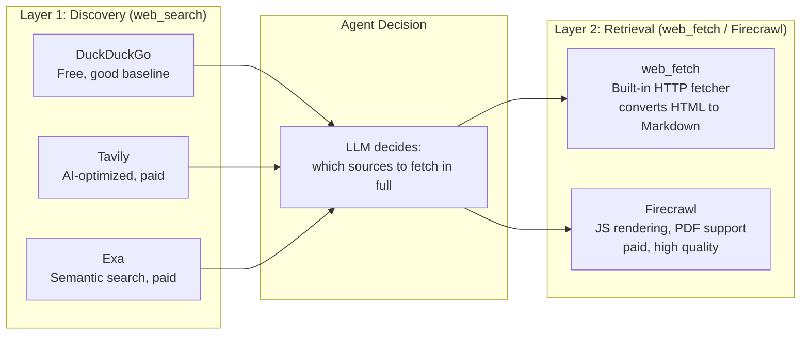
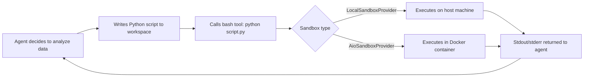
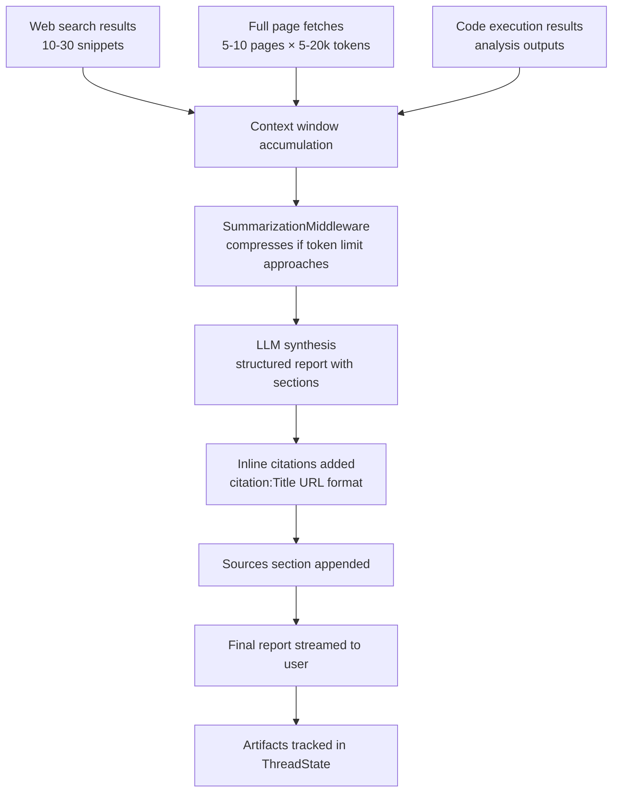

# Chapter 4: RAG, Search, and Knowledge Synthesis

## What Problem Does This Solve?

Traditional RAG systems retrieve from a pre-indexed corpus: you embed documents, store them in a vector database, and retrieve by cosine similarity. This is powerful for organization-internal knowledge, but fails for open-web research because the corpus is stale the moment it is indexed.

DeerFlow takes a different approach: **live web retrieval with LLM-driven navigation**. The agent does not query a pre-indexed corpus. It issues real-time web searches, navigates to the most relevant pages, reads full content, and synthesizes answers with inline citations — all driven by the LLM's judgment about which sources are worth reading in full.

This gives DeerFlow access to current information, niche sources, and multi-modal content (images, data files), but requires careful tool selection to balance quality, cost, and latency.

## How it Works Under the Hood

### The Two-Layer Retrieval Model



The agent always starts with a search tool to get a set of candidate URLs with snippets. It then decides which URLs are worth fetching in full based on the snippet quality, source authority, and relevance to the research question.

### DuckDuckGo Search Tool

The DuckDuckGo tool is implemented in `deerflow/community/ddg_search/tools.py` using the `duckduckgo-search` Python library:

```python
# backend/packages/harness/deerflow/community/ddg_search/tools.py
from duckduckgo_search import DDGS
from langchain_core.tools import tool

def _search_text(query: str, max_results: int = 5, region: str = "wt-wt") -> list[dict]:
    """Core search function using DDGS library."""
    with DDGS() as ddgs:
        results = list(ddgs.text(
            query,
            region=region,
            safesearch="moderate",
            max_results=max_results,
        ))
    return results

@tool
def web_search_tool(query: str, max_results: int | None = None) -> str:
    """
    Search the web using DuckDuckGo.
    Returns JSON with query, result_count, and normalized results.
    Each result: {title, url, content}
    """
    results = _search_text(query, max_results=max_results or get_config_max_results())
    # Normalize field names across DuckDuckGo response variations
    normalized = [
        {
            "title": r.get("title", ""),
            "url": r.get("href") or r.get("link", ""),
            "content": r.get("body") or r.get("snippet", ""),
        }
        for r in results
    ]
    return json.dumps({
        "query": query,
        "result_count": len(normalized),
        "results": normalized,
    })
```

Configuration in `config.yaml`:

```yaml
tools:
  - name: web_search
    group: web
    use: deerflow.community.ddg_search:web_search_tool
    max_results: 5   # Override the default result count
```

**Trade-offs:**
- Free, no API key required
- Moderate quality — good for general research
- Rate limiting can occur with rapid parallel sub-agent searches
- No semantic ranking or recency filtering

### Tavily Search Tool

Tavily is an AI-native search API optimized for LLM agents, returning cleaner, more relevant results:

```yaml
tools:
  - name: web_search
    group: web
    use: deerflow.community.tavily:web_search_tool
    api_key: $TAVILY_API_KEY
    max_results: 10
```

Tavily provides:
- AI-filtered results with relevance scoring
- Automatic content extraction (no separate `web_fetch` needed for basic use)
- Recency filtering support
- Much lower noise than DuckDuckGo for technical queries

Cost: ~$0.01–$0.05 per search depending on plan.

### Exa Search Tool

Exa uses semantic (embedding-based) search rather than keyword matching:

```yaml
tools:
  - name: web_search
    group: web
    use: deerflow.community.exa:web_search_tool
    api_key: $EXA_API_KEY
    max_results: 10
```

Exa is particularly effective for:
- Academic and research paper discovery
- Finding similar documents to a reference
- Queries where exact keywords are unknown

### Firecrawl: Full-Page Web Retrieval

For pages that require JavaScript rendering, PDF extraction, or structured data extraction, Firecrawl provides a managed scraping service:

```yaml
tools:
  - name: web_fetch
    group: web
    use: deerflow.community.firecrawl:web_fetch_tool
    api_key: $FIRECRAWL_API_KEY
```

Firecrawl converts any URL to clean Markdown, handling:
- Single-page applications (React, Vue, Angular)
- PDF documents
- Paywalled content (where legally accessible)
- JavaScript-rendered tables and charts

### Image Search Tool

DeerFlow includes an image search capability in `deerflow/community/image_search/tools.py`:

```python
# Image search returns URLs of relevant images
# When ViewImageMiddleware is active and the model supports vision,
# the agent can fetch and "view" images inline

@tool
def image_search_tool(query: str, max_results: int = 5) -> str:
    """
    Search for images relevant to the query.
    Returns JSON with image URLs, titles, and sources.
    """
    ...
```

When the agent calls `image_search_tool` and follows up with a `view_image` tool call, `ViewImageMiddleware` intercepts the `view_image` call, fetches the image, converts it to base64, and injects it into the message state as a multimodal message — provided the configured model supports vision.

### The Sandbox: Python REPL for Data Analysis

Beyond web search, DeerFlow's sandbox enables the agent to write and execute Python code for data analysis tasks. This is not a toy REPL — it is a full execution environment with file system access:



The agent's workspace is at `/mnt/user-data/workspace/{thread_id}/`, and final outputs (charts, processed data, reports) are written to `/mnt/user-data/outputs/{thread_id}/`.

Example: agent-generated data analysis code

```python
# An agent might generate and execute this script during a research task:

import json
import matplotlib.pyplot as plt

# Data from web search results
frameworks = ["LangGraph", "CrewAI", "AutoGen", "Swarm"]
github_stars = [8200, 24000, 31000, 3100]

fig, ax = plt.subplots(figsize=(10, 6))
bars = ax.bar(frameworks, github_stars, color=["#2196F3", "#4CAF50", "#FF9800", "#9C27B0"])
ax.set_xlabel("Framework")
ax.set_ylabel("GitHub Stars")
ax.set_title("Multi-Agent Framework GitHub Stars (April 2026)")

for bar, stars in zip(bars, github_stars):
    ax.text(bar.get_x() + bar.get_width()/2., bar.get_height() + 200,
            f"{stars:,}", ha="center", va="bottom")

plt.tight_layout()
plt.savefig("/mnt/user-data/outputs/framework_comparison.png", dpi=150)
print("Chart saved to outputs/framework_comparison.png")
```

The generated PNG is tracked in `ThreadState.artifacts` and served by the Gateway API for display in the frontend.

### MCP Servers: Extending the Knowledge Layer

Model Context Protocol (MCP) servers allow DeerFlow to connect to arbitrary knowledge sources — databases, private APIs, internal documentation systems:

```json
// backend/extensions_config.json
{
  "mcpServers": {
    "filesystem": {
      "command": "npx",
      "args": ["-y", "@modelcontextprotocol/server-filesystem", "/path/to/docs"],
      "enabled": true
    },
    "postgres": {
      "command": "npx",
      "args": ["-y", "@modelcontextprotocol/server-postgres", "postgresql://..."],
      "enabled": true
    },
    "github": {
      "command": "npx",
      "args": ["-y", "@modelcontextprotocol/server-github"],
      "env": {
        "GITHUB_PERSONAL_ACCESS_TOKEN": "$GITHUB_TOKEN"
      },
      "enabled": true
    }
  }
}
```

MCP tools are **automatically discovered** at startup — no code changes required. The Gateway API handles OAuth for HTTP-based MCP servers. Once enabled, these tools appear to the agent as regular tools alongside `web_search` and `bash`.

### Tool Groups and Capability Control

Tools are organized into groups that control which capabilities are available:

```python
# Tool groups defined in config.yaml
TOOL_GROUPS = {
    "web": ["web_search", "web_fetch", "image_search"],
    "file:read": ["read_file", "ls"],
    "file:write": ["write_file", "str_replace"],
    "bash": ["bash"],
}
```

Sub-agents receive a restricted tool list based on their task:
- A "web research" sub-agent gets `["web", "file:read"]`
- A "code analysis" sub-agent gets `["bash", "file:read", "file:write"]`
- A "data processing" sub-agent gets `["bash", "file:read", "file:write"]`

This prevents sub-agents from doing things outside their intended scope.

### Configuring Search for Different Research Scenarios

| Scenario | Recommended Config |
|:--|:--|
| General web research | DuckDuckGo (free) + web_fetch |
| High-quality competitive intelligence | Tavily (paid) + Firecrawl |
| Academic paper discovery | Exa (paid) + web_fetch |
| Internal documentation RAG | MCP filesystem server |
| Database querying | MCP postgres server |
| GitHub repository analysis | MCP github server + bash |
| Data analysis + visualization | bash + file ops (sandbox) |

### Knowledge Synthesis Process

After gathering evidence from multiple sources, the agent synthesizes a structured output:



## Summary

DeerFlow's knowledge acquisition system is a two-layer live retrieval architecture: a search layer (DuckDuckGo/Tavily/Exa) for source discovery and a retrieval layer (web_fetch/Firecrawl) for full-page reading. The sandbox Python REPL adds data analysis capabilities. MCP servers extend the system to private knowledge sources.

The agent orchestrates all of these tools via LLM judgment — choosing which searches to run, which pages to read in full, and which scripts to execute based on the research question and the evidence gathered so far.

---

## Chapter Connections

- [Tutorial Index](README.md)
- [Previous Chapter: Chapter 3: Research Agent Pipeline](03-research-agent-pipeline.md)
- [Next Chapter: Chapter 5: Frontend, Backend, and API Design](05-frontend-backend-api.md)
- [Main Catalog](../../README.md#-tutorial-catalog)
- [A-Z Tutorial Directory](../../discoverability/tutorial-directory.md)
