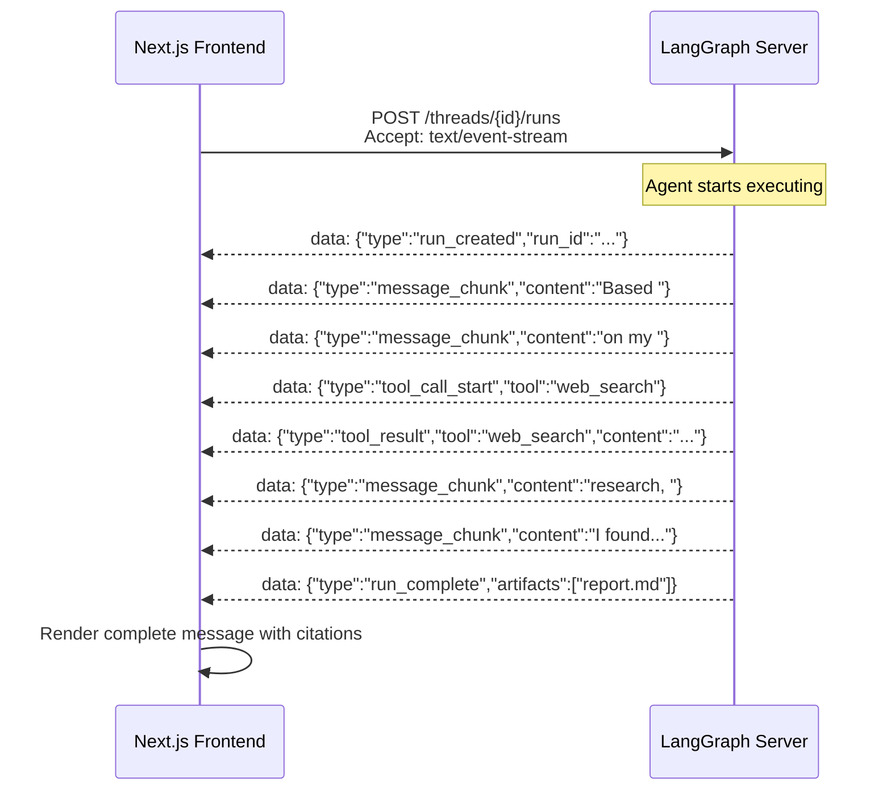
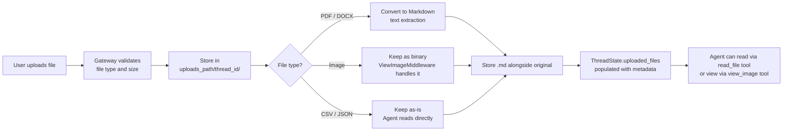

# Chapter 5: Frontend, Backend, and API Design

## What Problem Does This Solve?

A multi-agent system that only works through its own bundled UI is limited. Production deployments need programmatic access (to trigger research runs from external systems), IM integrations (to accept tasks from Slack or Telegram), and artifact serving (to download generated reports and podcasts). DeerFlow's architecture cleanly separates these concerns across three services with well-defined boundaries.

Understanding where each piece lives lets you:
- Build a custom frontend or integrate into an existing product
- Trigger research from CI/CD pipelines or scheduled jobs
- Deploy IM bots that dispatch research tasks autonomously
- Download artifacts without navigating the UI

## How it Works Under the Hood

### Three-Service Architecture

```mermaid
graph TB
    subgraph "Entry Point"
        N[Nginx :2026<br/>Unified entry point<br/>Routes by path prefix]
    end

    subgraph "Service 1: LangGraph Server :2024"
        LG1[Agent Runtime<br/>make_lead_agent graph]
        LG2[Thread State Management<br/>AsyncCheckpointer]
        LG3[SSE Streaming<br/>Token-by-token output]
        LG4[LangGraph Platform API<br/>/threads, /runs endpoints]
    end

    subgraph "Service 2: Gateway API :8001 (FastAPI)"
        GW1[Models: list available LLMs]
        GW2[MCP: configure/reload servers]
        GW3[Skills: list/install/remove]
        GW4[Uploads: file validation + storage]
        GW5[Artifacts: serve generated files]
        GW6[Memory: CRUD for cross-session memory]
        GW7[Suggestions: prompt suggestions]
        GW8[Threads: cleanup thread data]
    end

    subgraph "Service 3: Next.js Frontend :3000"
        FE1[Chat interface]
        FE2[SSE stream consumer]
        FE3[Artifact viewer]
        FE4[Thread history]
    end

    subgraph "IM Channels"
        IM1[Telegram Bot]
        IM2[Slack App]
        IM3[Feishu / Lark Bot]
        IM4[WeChat / WeCom]
    end

    N --> LG1
    N --> GW1
    N --> FE1
    IM1 --> LG1
    IM2 --> LG1
    IM3 --> LG1
    IM4 --> LG1
```



**Routing rules in Nginx:**
- `/api/...` (LangGraph paths: `/threads`, `/runs`, `/assistants`) → LangGraph server `:2024`
- `/gateway/...` → Gateway API `:8001`
- Everything else → Next.js frontend `:3000`

### LangGraph Server: The Agent Runtime

The LangGraph server is the `langgraph-cli dev` process running the compiled `lead_agent` graph. It exposes the standard LangGraph Platform API:

| Endpoint | Method | Description |
|:--|:--|:--|
| `/assistants` | GET | List registered graphs (returns `lead_agent`) |
| `/threads` | POST | Create a new conversation thread |
| `/threads/{thread_id}` | GET | Get thread metadata |
| `/threads/{thread_id}/runs` | POST | Submit a message and get SSE stream |
| `/threads/{thread_id}/runs/{run_id}` | GET | Get run status |
| `/threads/{thread_id}/state` | GET | Inspect full `ThreadState` at latest checkpoint |
| `/threads/{thread_id}/history` | GET | Get all checkpointed states |

**Starting a research run programmatically:**

```python
import httpx
import json

async def run_research(query: str, thread_id: str | None = None) -> str:
    """Submit a research query to DeerFlow and collect the full response."""
    
    base_url = "http://localhost:2026"
    
    async with httpx.AsyncClient() as client:
        # Create thread if not provided
        if thread_id is None:
            thread_resp = await client.post(f"{base_url}/threads")
            thread_id = thread_resp.json()["thread_id"]
        
        # Submit run and stream response
        full_content = ""
        
        async with client.stream(
            "POST",
            f"{base_url}/threads/{thread_id}/runs",
            json={
                "assistant_id": "lead_agent",
                "input": {
                    "messages": [{"role": "user", "content": query}]
                },
                "stream_mode": ["messages"],
            },
            headers={"Accept": "text/event-stream"},
        ) as response:
            async for line in response.aiter_lines():
                if line.startswith("data: "):
                    data = json.loads(line[6:])
                    # Extract token from SSE event
                    if data.get("type") == "message_chunk":
                        full_content += data.get("content", "")
        
        return full_content


# Usage:
import asyncio
result = asyncio.run(run_research("What are the key differences between RAG and fine-tuning?"))
print(result)
```

### SSE Streaming: How Tokens Flow to the Frontend

DeerFlow uses Server-Sent Events (SSE) for real-time streaming. The frontend establishes a long-lived HTTP connection and receives events as the agent processes:



The frontend (`frontend/src/core/api/`) handles SSE connection management, reconnection on drop, and rendering of different event types (tool calls shown as expandable cards, message chunks rendered as streaming markdown).

### Gateway API: The Support Layer

The Gateway API is a FastAPI application at `:8001` that handles everything except agent execution:

```python
# backend/app/gateway/app.py (route registration)
from app.gateway.routers import (
    agents,      # Agent config management
    models,      # List available LLM models from config.yaml
    mcp,         # MCP server config and reload
    skills,      # Skill listing, installation, removal
    uploads,     # File upload with validation
    artifacts,   # Serve generated outputs (reports, MP3s, slides)
    memory,      # Cross-session memory CRUD
    threads,     # Thread cleanup (removes filesystem artifacts)
    suggestions, # Prompt autocomplete suggestions
)

app = FastAPI(title="DeerFlow Gateway API")
app.include_router(models.router, prefix="/gateway/models")
app.include_router(mcp.router, prefix="/gateway/mcp")
app.include_router(skills.router, prefix="/gateway/skills")
app.include_router(uploads.router, prefix="/gateway/uploads")
app.include_router(artifacts.router, prefix="/gateway/artifacts")
app.include_router(memory.router, prefix="/gateway/memory")
app.include_router(threads.router, prefix="/gateway/threads")
```

**Key Gateway API endpoints:**

```bash
# List available models (from config.yaml)
GET /gateway/models
# Response: [{"name": "gpt-4o", "display_name": "GPT-4o", "supports_vision": true}, ...]

# List installed skills
GET /gateway/skills
# Response: [{"name": "deep-research", "description": "..."}, ...]

# Download a generated artifact (e.g., research report, podcast MP3)
GET /gateway/artifacts/{thread_id}/{filename}
# Response: Binary file with appropriate Content-Type header

# Upload a file for the agent to process
POST /gateway/uploads
# Multipart form: file attachment
# Response: {"file_id": "...", "filename": "...", "markdown_content": "..."}

# List MCP server configurations
GET /gateway/mcp
# Response: [{"name": "github", "enabled": true, "tools": [...]}, ...]

# Reload MCP configuration after editing extensions_config.json
POST /gateway/mcp/reload
```

### File Upload Flow

Uploaded files flow through a multi-step pipeline before reaching the agent:



### Security: Artifact Serving and XSS Prevention

Generated artifacts (HTML reports, for example) could contain attacker-controlled content if rendered inline. DeerFlow's Gateway API forces downloads rather than inline rendering:

```python
# backend/app/gateway/routers/artifacts.py
@router.get("/{thread_id}/{filename}")
async def get_artifact(thread_id: str, filename: str):
    """
    Serve generated artifacts.
    Security: always force download (Content-Disposition: attachment)
    to prevent XSS from agent-generated HTML content.
    """
    file_path = Paths.get_outputs_path(thread_id) / filename
    if not file_path.exists():
        raise HTTPException(status_code=404)
    
    return FileResponse(
        path=file_path,
        headers={"Content-Disposition": f'attachment; filename="{filename}"'},
    )
```

### IM Channel Integration

DeerFlow supports connecting to IM platforms, allowing users to interact with the agent via messaging apps:

```python
# backend/app/channels/
# Each channel implements BaseChannel with standardized message handling

class TelegramChannel(BaseChannel):
    """Polls Telegram Bot API for updates, dispatches to lead_agent."""
    
    async def handle_message(self, update: TelegramUpdate):
        # Create or retrieve thread for this Telegram user
        thread_id = self.store.get_thread_id(update.from_user.id)
        
        # Submit to LangGraph
        result = await self.agent_client.run(
            thread_id=thread_id,
            message=update.message.text,
            attachments=update.message.documents,
        )
        
        # Send response back to Telegram
        await self.bot.send_message(
            chat_id=update.chat_id,
            text=result.content,
        )
        
        # If artifacts were generated, send as files
        for artifact in result.artifacts:
            await self.bot.send_document(
                chat_id=update.chat_id,
                document=open(artifact, "rb"),
            )
```

Supported channels: Telegram, Slack, Feishu/Lark, WeChat, WeCom, Discord.

Each channel is configured in the environment:

```bash
# .env
TELEGRAM_BOT_TOKEN=...
SLACK_BOT_TOKEN=...
SLACK_SIGNING_SECRET=...
FEISHU_APP_ID=...
FEISHU_APP_SECRET=...
```

### The Embedded DeerFlowClient

For programmatic access without spinning up the full HTTP stack, DeerFlow provides an embedded client that runs the agent in-process:

```python
# backend/packages/harness/deerflow/client.py
from deerflow.client import DeerFlowClient

# Initialize client (reads config.yaml automatically)
client = DeerFlowClient()

# Run a research query in-process
result = await client.run(
    thread_id="my-thread-123",
    message="Research the current state of open-source LLM fine-tuning frameworks",
)

print(result.content)
for artifact in result.artifacts:
    print(f"Artifact: {artifact}")
```

The embedded client bypasses HTTP entirely — useful for:
- Integration tests that need to verify research output quality
- Batch research pipelines run as Python scripts
- Claude Code integration (the `claude-to-deerflow` skill uses this)

### Thread Data Management

Thread data spans both services. When a thread is deleted, both must be cleaned up:

```python
# Thread cleanup requires coordination:
# 1. LangGraph server removes thread state (messages, checkpoints)
# 2. Gateway API removes filesystem artifacts

async def delete_thread(thread_id: str):
    # Delete LangGraph state
    await langgraph_client.delete_thread(thread_id)
    
    # Delete filesystem data
    Paths.delete_thread_dir(thread_id)
    # This removes:
    # - /mnt/user-data/workspace/{thread_id}/
    # - /mnt/user-data/uploads/{thread_id}/
    # - /mnt/user-data/outputs/{thread_id}/
```

## Configuration for API Access

### Enabling Authentication

DeerFlow defaults to no authentication. For production or network-exposed deployments, add authentication at the Nginx layer:

```nginx
# nginx.conf - basic API key authentication
location /threads {
    auth_request /auth;
    proxy_pass http://langgraph:2024;
}

location /auth {
    internal;
    proxy_pass http://auth-service:8080/verify;
    proxy_pass_request_body off;
    proxy_set_header X-API-Key $http_x_api_key;
}
```

Or use the `better-auth` integration already in the frontend:

```typescript
// frontend/src/server/better-auth/config.ts
// DeerFlow ships with a better-auth server for basic user authentication
// Configure providers in this file
```

## Summary

DeerFlow's three-service architecture cleanly separates agent execution (LangGraph server), support operations (Gateway API), and user interface (Next.js). The SSE streaming model enables real-time token delivery. The Gateway API handles file uploads, artifact serving, MCP configuration, and memory management. IM channel integrations connect the agent to messaging platforms. The embedded `DeerFlowClient` enables programmatic access without HTTP overhead.

---

## Chapter Connections

- [Tutorial Index](README.md)
- [Previous Chapter: Chapter 4: RAG, Search, and Knowledge Synthesis](04-rag-search-knowledge.md)
- [Next Chapter: Chapter 6: Customization and Extension](06-customization-extension.md)
- [Main Catalog](../../README.md#-tutorial-catalog)
- [A-Z Tutorial Directory](../../discoverability/tutorial-directory.md)
