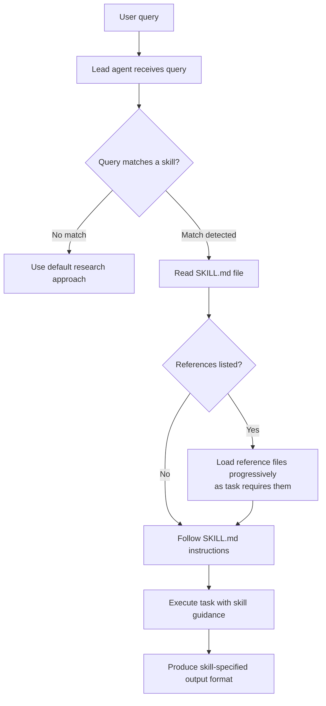
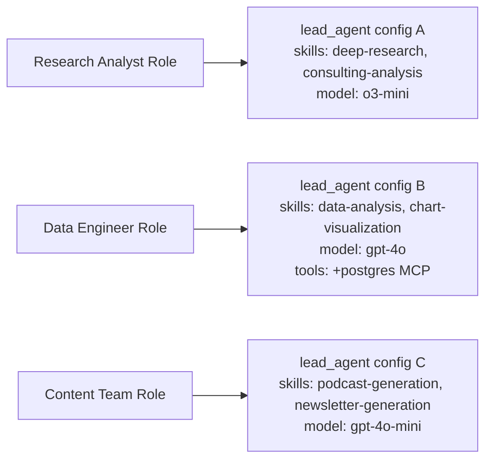

# Chapter 6: Customization and Extension

## What Problem Does This Solve?

A general-purpose research agent is useful, but a domain-specific agent is valuable. A legal research assistant needs to know how to structure case law citations. A financial analyst agent needs to know how to pull earnings data. A DevOps agent needs to know how to interact with cloud APIs. None of these behaviors can be hardcoded into a single system.

DeerFlow solves this through three composable extension mechanisms:
1. **Skills** — Markdown-based workflow guides that load into the agent's context on demand
2. **Tools** — Python functions (or MCP servers) that give the agent new capabilities
3. **Agent configs** — Per-deployment YAML files that override model, features, and skill availability

## How it Works Under the Hood

### The Skills System

Skills are Markdown files (`SKILL.md`) stored in the `skills/` directory. When the agent receives a query that matches a skill's use case, it reads the SKILL.md file and follows its methodology.



Skills are loaded **progressively** — the agent reads the top-level SKILL.md first, then loads sub-resources (templates, reference guides, scripts) only when the task requires them. This avoids bloating the context with irrelevant detail.

### Anatomy of a SKILL.md

Every skill follows a standard structure:

```markdown
# [Skill Name]

## When to Use This Skill
[Describe the trigger conditions — when should the agent load this skill?]

## What This Skill Produces
[Describe the expected output format and quality bar]

## Resources
[List reference files that may be loaded progressively]
- references/guide.md — [when to load this]
- templates/output.md — [when to load this]
- scripts/execute.py — [when to load this]

## Workflow

### Phase 1: [Phase Name]
[Step-by-step instructions]

### Phase 2: [Phase Name]
[Step-by-step instructions]

## Output Format
[Exact format specification for the final output]

## Quality Checklist
- [ ] [Quality criterion 1]
- [ ] [Quality criterion 2]
```

### Creating a Custom Skill

Let's create a skill for legal case law research:

```bash
# 1. Create the skill directory
mkdir -p skills/private/legal-research/references
mkdir -p skills/private/legal-research/templates

# 2. Create the SKILL.md
```

```markdown
# skills/private/legal-research/SKILL.md

# Legal Case Law Research

## When to Use This Skill
Load this skill when the user asks about:
- Legal cases, court decisions, or precedents
- Statutory interpretation
- Regulatory compliance questions
- Contract law or IP law research

## What This Skill Produces
A structured legal research memo with:
- Summary of relevant cases and holdings
- Key legal principles extracted
- Circuit splits or conflicting authorities noted
- Practical implications section
- Full citations in Bluebook format

## Resources
- references/citation-format.md — load when formatting citations
- templates/memo-template.md — load when writing the final memo

## Workflow

### Phase 1: Issue Identification
Identify the precise legal question. Use ask_clarification if the jurisdiction,
applicable law (state/federal), or specific legal issue is unclear.

### Phase 2: Primary Research
Search for: "[legal issue] case law [jurisdiction]"
Search for: "[statute or regulation] interpretation"
Fetch full text of key cases from Google Scholar or court websites.

### Phase 3: Secondary Sources
Search for law review articles and treatises to identify leading cases.
Use: "[legal issue] law review article [jurisdiction]"

### Phase 4: Synthesis
Apply IRAC structure: Issue, Rule, Application, Conclusion.
Cite every case with full Bluebook citation.

## Quality Checklist
- [ ] At least 3 primary cases cited
- [ ] Circuit/jurisdiction consistency verified
- [ ] Bluebook format applied
- [ ] Practical implications addressed
```

```bash
# 3. Point config.yaml to your skills directory
```

```yaml
# config.yaml
skills:
  path: ../skills     # Includes both skills/public/ and skills/private/
  container_path: /mnt/skills
```

The skill is immediately available — no restart required. The agent will discover it on the next invocation when the query matches the "When to Use" criteria.

### Using the skill-creator Skill

DeerFlow ships a meta-skill for creating new skills:

```
# In the DeerFlow chat interface:
"Use the skill-creator skill to help me create a new skill for financial earnings analysis"
```

The `skill-creator` skill (`skills/public/skill-creator/SKILL.md`) guides the agent through:
1. Analyzing the task domain and required workflow
2. Identifying what tools and references the skill needs
3. Drafting the SKILL.md structure
4. Running eval benchmarks to validate the skill quality
5. Packaging the skill for distribution

The skill-creator includes evaluation infrastructure (`scripts/run_eval.py`, `scripts/aggregate_benchmark.py`) for quantitatively measuring skill quality against test cases.

### Available Public Skills

DeerFlow ships with a rich library of production-ready skills:

| Skill | Description |
|:--|:--|
| `deep-research` | Four-phase web research methodology |
| `podcast-generation` | Convert research to MP3 dialogue |
| `ppt-generation` | Research to PowerPoint slides |
| `chart-visualization` | Generate 25+ chart types from data |
| `data-analysis` | Statistical analysis with Python |
| `academic-paper-review` | Structured paper critique |
| `systematic-literature-review` | Multi-paper synthesis with citations |
| `github-deep-research` | Deep analysis of GitHub repositories |
| `consulting-analysis` | McKinsey-style structured analysis |
| `code-documentation` | Auto-generate code documentation |
| `newsletter-generation` | Curated content newsletter production |
| `image-generation` | AI image generation integration |
| `video-generation` | Video generation integration |
| `web-design-guidelines` | UI/UX design assistance |
| `skill-creator` | Meta-skill for creating new skills |
| `find-skills` | Discover and install skills from registry |

### Adding a Custom Python Tool

For capabilities that require code execution beyond the sandbox (API integrations, specialized data processing), create a custom Python tool:

```python
# tools/my_tools/legal_database.py
from langchain_core.tools import tool
import requests

@tool
def search_legal_cases(
    query: str,
    jurisdiction: str = "federal",
    date_range: str = "2020-2026",
    max_results: int = 10,
) -> str:
    """
    Search a legal case database for relevant decisions.
    
    Args:
        query: Legal issue or case name to search for
        jurisdiction: "federal", "state:CA", "state:NY", etc.
        date_range: Date range in "YYYY-YYYY" format
        max_results: Maximum number of cases to return
    
    Returns:
        JSON string with case list, holdings, and citations
    """
    # Integration with CourtListener, Westlaw, or internal legal DB
    response = requests.get(
        "https://www.courtlistener.com/api/rest/v4/search/",
        params={
            "q": query,
            "type": "o",   # Opinions
            "order_by": "score desc",
        },
        headers={"Authorization": f"Token {get_courtlistener_token()}"},
    )
    cases = response.json()["results"]
    return format_case_results(cases[:max_results])
```

Register the tool in `config.yaml`:

```yaml
tools:
  - name: search_legal_cases
    group: web         # Add to the "web" group so legal research agents get it
    use: tools.my_tools.legal_database:search_legal_cases
    # No max_results here — the tool has its own default
```

### Custom Middleware

For advanced customization, inject custom middleware into the agent factory:

```python
# custom/audit_middleware.py
from deerflow.agents.middlewares import BaseMiddleware
from deerflow.agents.thread_state import ThreadState

class AuditLogMiddleware(BaseMiddleware):
    """Log all tool calls to an external audit system."""
    
    async def before_tool_call(
        self,
        tool_name: str,
        tool_input: dict,
        state: ThreadState,
    ) -> None:
        await audit_log.record(
            thread_id=state["thread_data"]["workspace_path"],
            tool=tool_name,
            input=tool_input,
            timestamp=datetime.utcnow(),
        )
    
    async def after_tool_call(
        self,
        tool_name: str,
        tool_output: str,
        state: ThreadState,
    ) -> None:
        await audit_log.record(
            thread_id=state["thread_data"]["workspace_path"],
            tool=tool_name,
            output_length=len(tool_output),
            timestamp=datetime.utcnow(),
        )
```

```python
# custom/agent_factory.py
from deerflow.agents.factory import create_deerflow_agent
from custom.audit_middleware import AuditLogMiddleware

def make_audited_agent(config=None):
    """Lead agent with audit logging middleware injected."""
    base_middleware = build_default_middleware_chain()
    custom_middleware = [AuditLogMiddleware()] + base_middleware
    
    return create_deerflow_agent(
        model=resolve_model(config),
        tools=build_tools(config),
        middleware=custom_middleware,  # Use custom chain instead of features flags
        checkpointer=make_checkpointer(),
    )
```

### Per-Agent Configuration Overrides

DeerFlow supports per-agent configuration files that override the global config:

```yaml
# workspace/agents/lead_agent/config.yaml
model_name: o3-mini          # Override default model for this agent
subagent:
  enabled: true
  max_concurrent: 5

# Restrict which skills this agent can load:
skills:
  - deep-research
  - chart-visualization
  - data-analysis
# null = all skills available
# [] = no skills
# ["skill-name"] = specific skills only
```

This enables multi-tenant deployments where different user groups get different agent capabilities:



### MCP Server Extensions

MCP servers are the most powerful extension point for adding private data sources:

```json
// backend/extensions_config.json
{
  "mcpServers": {
    "internal-docs": {
      "command": "npx",
      "args": ["-y", "@modelcontextprotocol/server-filesystem", "/mnt/company-docs"],
      "enabled": true
    },
    "analytics-db": {
      "command": "python",
      "args": ["-m", "my_company.mcp_server"],
      "env": {
        "DB_CONNECTION": "$ANALYTICS_DB_URL"
      },
      "enabled": true
    },
    "jira": {
      "type": "http",
      "url": "https://mcp.atlassian.com",
      "oauth": {
        "type": "client_credentials",
        "token_endpoint": "https://auth.atlassian.com/oauth/token",
        "client_id": "$JIRA_CLIENT_ID",
        "client_secret": "$JIRA_CLIENT_SECRET"
      },
      "enabled": true
    }
  }
}
```

After editing `extensions_config.json`, trigger a reload without restart:

```bash
curl -X POST http://localhost:2026/gateway/mcp/reload
```

## Summary

DeerFlow's extension model centers on three composable mechanisms:
1. **Skills** (SKILL.md files) — domain-specific workflow guides that load into agent context on demand
2. **Tools** (Python functions or MCP servers) — new capabilities injected at construction time
3. **Agent configs** — per-deployment YAML overrides for model, features, and skill availability

The skill-creator meta-skill enables teams to build, evaluate, and package new skills without modifying core code. The MCP server integration provides a standardized protocol for connecting any data source with OAuth support.

---

## Chapter Connections

- [Tutorial Index](README.md)
- [Previous Chapter: Chapter 5: Frontend, Backend, and API Design](05-frontend-backend-api.md)
- [Next Chapter: Chapter 7: Podcast and Multi-Modal Output](07-podcast-multimodal.md)
- [Main Catalog](../../README.md#-tutorial-catalog)
- [A-Z Tutorial Directory](../../discoverability/tutorial-directory.md)
