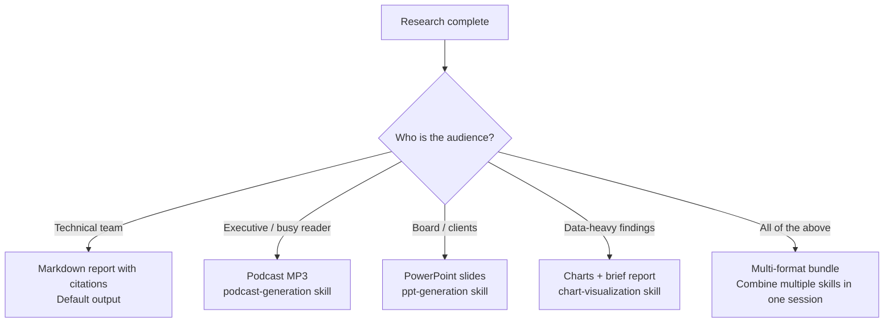

# Chapter 7: Podcast and Multi-Modal Output

## What Problem Does This Solve?

A 10-page research report is not always the right format. Executives want audio summaries they can consume during a commute. Teams want slide decks for presentations. Data analysis needs charts, not prose descriptions of numbers. DeerFlow's multi-modal output system converts research into whichever format the audience needs, using the same underlying agent and research pipeline.

The key insight: every output format is implemented as a **skill**. The agent researches the topic, then uses the appropriate skill's workflow to transform the research into the target format — running Python scripts in the sandbox to handle the actual conversion (TTS API calls, PPTX generation, chart rendering).

## How it Works Under the Hood

### The General Multi-Modal Output Architecture

```mermaid
graph TB
    A[User: generate podcast about X] --> B[Agent loads podcast-generation skill]
    B --> C[Research Phase<br/>web_search + web_fetch]
    C --> D[Script Generation<br/>Agent writes JSON dialogue script]
    D --> E[bash: python generate.py<br/>--script-file script.json<br/>--output-file podcast.mp3]
    E --> F{External API call}
    F --> G[Volcengine TTS API<br/>converts dialogue to audio]
    G --> H[MP3 saved to outputs/]
    H --> I[ThreadState.artifacts updated]
    I --> J[Frontend shows download link]
    J --> K[GET /gateway/artifacts/{thread_id}/podcast.mp3]
```

### Podcast Generation

The podcast generation skill (`skills/public/podcast-generation/SKILL.md`) converts any research content into a two-host conversational MP3:

**Step 1: Trigger the skill**

```
# In the DeerFlow chat:
"Research the current state of quantum computing and generate a podcast about it"
# or, if research was already done:
"Generate a podcast from my previous research on quantum computing"
```

**Step 2: Script creation**

The agent generates a JSON dialogue script following the skill's specification:

```json
// Example: /mnt/user-data/workspace/{thread_id}/podcast_script.json
{
  "title": "Quantum Computing: Where We Are Today",
  "locale": "en",
  "lines": [
    {
      "speaker": "female",
      "line": "Hello Deer! Today we're diving into quantum computing — and there's a lot happening right now."
    },
    {
      "speaker": "male",
      "line": "That's right. We've seen some major milestones this year. Google's Willow chip, for instance, claimed to solve a problem in 5 minutes that would take classical computers 10 septillion years."
    },
    {
      "speaker": "female",
      "line": "Septillion — that's a one followed by 24 zeros, for anyone keeping track at home. But let's back up. What does a quantum computer actually do differently?"
    },
    {
      "speaker": "male",
      "line": "Classical computers use bits — zeros and ones. Quantum computers use qubits, which can exist in a superposition of zero and one simultaneously."
    }
  ]
}
```

**Content guidelines enforced by the skill:**
- Target 40-60 lines (~10 minutes of audio)
- Natural, conversational language — "like two friends chatting"
- Greetings include "Hello Deer"
- No technical jargon, formulas, or code
- Short, speakable sentences

**Step 3: Audio generation**

The agent runs the generation script:

```bash
# Executed via bash tool in the sandbox
python /mnt/skills/podcast-generation/scripts/generate.py \
    --script-file /mnt/user-data/workspace/{thread_id}/podcast_script.json \
    --output-file /mnt/user-data/outputs/{thread_id}/quantum_computing_podcast.mp3 \
    --transcript-file /mnt/user-data/outputs/{thread_id}/podcast_transcript.md
```

```python
# skills/public/podcast-generation/scripts/generate.py
import json
import argparse
from volcengine.tts import TTS  # Volcengine Text-to-Speech SDK

def generate_podcast(script_file: str, output_file: str, transcript_file: str | None):
    with open(script_file) as f:
        script = json.load(f)
    
    tts = TTS(
        app_id=os.environ["VOLCENGINE_TTS_APP_ID"],
        access_token=os.environ["VOLCENGINE_TTS_ACCESS_TOKEN"],
        cluster=os.environ["VOLCENGINE_TTS_CLUSTER"],
    )
    
    audio_segments = []
    transcript_lines = []
    
    for line in script["lines"]:
        # Select voice based on speaker
        voice_id = "en_female_1" if line["speaker"] == "female" else "en_male_1"
        
        # Generate audio for this line
        audio = tts.synthesize(
            text=line["line"],
            voice_type=voice_id,
            encoding="mp3",
        )
        audio_segments.append(audio)
        transcript_lines.append(f"**{line['speaker'].title()}:** {line['line']}\n")
    
    # Concatenate all audio segments
    combine_audio(audio_segments, output_file)
    
    # Write transcript
    if transcript_file:
        with open(transcript_file, "w") as f:
            f.write(f"# {script['title']}\n\n")
            f.writelines(transcript_lines)
    
    print(f"Podcast saved: {output_file}")
    print(f"Duration: ~{len(script['lines']) * 15 // 60} minutes")

if __name__ == "__main__":
    parser = argparse.ArgumentParser()
    parser.add_argument("--script-file", required=True)
    parser.add_argument("--output-file", required=True)
    parser.add_argument("--transcript-file")
    args = parser.parse_args()
    generate_podcast(args.script_file, args.output_file, args.transcript_file)
```

**Required credentials:**

```bash
# .env
VOLCENGINE_TTS_APP_ID=...
VOLCENGINE_TTS_ACCESS_TOKEN=...
VOLCENGINE_TTS_CLUSTER=...
```

These are Volcengine (ByteDance's cloud platform) credentials. Without them, the generate.py script will fail at the TTS API call. For non-Volcengine deployments, modify `generate.py` to use ElevenLabs, OpenAI TTS, or any other TTS provider.

### PowerPoint Generation

The `ppt-generation` skill converts research into PPTX slides:

```
# Trigger:
"Create a PowerPoint presentation about AI agent frameworks for my team presentation"
```

The skill uses Python-PPTX or a similar library to generate slides:

```python
# skills/public/ppt-generation/scripts/generate.py (conceptual)
from pptx import Presentation
from pptx.util import Inches, Pt
import json

def generate_presentation(content_file: str, output_file: str):
    """
    Convert structured research content to PPTX.
    Content file is a JSON with slides, each having title, bullets, and notes.
    """
    with open(content_file) as f:
        content = json.load(f)
    
    prs = Presentation()
    
    for slide_data in content["slides"]:
        if slide_data["type"] == "title":
            layout = prs.slide_layouts[0]
            slide = prs.slides.add_slide(layout)
            slide.shapes.title.text = slide_data["title"]
            slide.placeholders[1].text = slide_data.get("subtitle", "")
        else:
            layout = prs.slide_layouts[1]
            slide = prs.slides.add_slide(layout)
            slide.shapes.title.text = slide_data["title"]
            body = slide.placeholders[1]
            tf = body.text_frame
            for bullet in slide_data.get("bullets", []):
                p = tf.add_paragraph()
                p.text = bullet
                p.level = 0
    
    prs.save(output_file)
    print(f"Presentation saved: {output_file}")
```

### Chart Visualization

The `chart-visualization` skill supports 25+ chart types:

```
# Trigger:
"Create a bar chart comparing GitHub stars of popular AI agent frameworks"
```

```javascript
// skills/public/chart-visualization/scripts/generate.js
// Uses AntV G2 or similar charting library for high-quality output

const { Chart } = require('@antv/g2');
const fs = require('fs');
const data = JSON.parse(fs.readFileSync(process.argv[2]));

// Chart spec from agent:
const spec = {
  type: 'interval',
  data: data,
  encode: {
    x: 'framework',
    y: 'stars',
    color: 'framework',
  },
  style: { fill: 'gradient' },
};

// Render to PNG
const chart = new Chart({ width: 800, height: 500 });
chart.options(spec);
chart.render();
chart.exportPNG(process.argv[3]);
```

Supported chart types include: bar, column, line, area, scatter, histogram, pie, donut, radar, heatmap, treemap, sankey, network graph, org chart, flow diagram, fishbone diagram, mind map, district map, and more.

### Image Generation

The `image-generation` skill integrates with external image generation APIs:

```
# Trigger:
"Generate an illustration of a neural network with multiple layers for my presentation"
```

```python
# skills/public/image-generation/scripts/generate.py
import openai
import requests

def generate_image(prompt: str, output_file: str, size: str = "1024x1024"):
    """Generate an image using OpenAI DALL-E 3 or similar."""
    client = openai.OpenAI()
    
    response = client.images.generate(
        model="dall-e-3",
        prompt=prompt,
        size=size,
        quality="standard",
        n=1,
    )
    
    image_url = response.data[0].url
    image_data = requests.get(image_url).content
    
    with open(output_file, "wb") as f:
        f.write(image_data)
    
    print(f"Image saved: {output_file}")
    print(f"Revised prompt: {response.data[0].revised_prompt}")
```

### Video Generation

The `video-generation` skill integrates with video generation APIs (Sora, Runway, or equivalent):

```python
# skills/public/video-generation/scripts/generate.py
# Calls external video generation API with a text prompt
# Polls for completion and downloads the final video file
```

### The Outputs Directory and Artifact Tracking

All generated artifacts (MP3s, PDFs, PNGs, PPTX files) are stored in:

```
/mnt/user-data/outputs/{thread_id}/
├── research_report.md
├── podcast_script.json
├── quantum_computing_podcast.mp3
├── podcast_transcript.md
├── framework_comparison.png
└── ai_frameworks_presentation.pptx
```

The agent updates `ThreadState.artifacts` with the paths of generated files using the `merge_artifacts` reducer. The frontend detects artifact entries and shows download links.

```python
# How artifacts are tracked (ThreadState reducer)
def merge_artifacts(existing: list[str], new: list[str]) -> list[str]:
    """Append-only reducer: new artifacts are added, existing are not removed."""
    return existing + [a for a in new if a not in existing]
```

### Multi-Modal Output Selection Guide



### Template-Based Output Customization

Skills include templates that control output style and structure:

```markdown
# skills/public/podcast-generation/templates/tech-explainer.md
# Tech Explainer Template

## Format
- Duration: 8-12 minutes
- Tone: Educational but accessible
- Structure:
  1. Hook: surprising fact or question (30 seconds)
  2. Background: what the technology is (2 minutes)
  3. How it works: simplified explanation (3 minutes)
  4. Why it matters: real-world impact (2 minutes)
  5. Future outlook (1 minute)
  6. Call to action: where to learn more (30 seconds)

## Language Guidelines
- Explain all technical terms when first used
- Use analogies liberally
- Avoid passive voice
```

Specify a template in your request:

```
"Generate a podcast about reinforcement learning using the tech-explainer format"
```

## Summary

DeerFlow's multi-modal output system is built on the skills framework. Each output format has a skill (podcast-generation, ppt-generation, chart-visualization, image-generation, video-generation) that guides the agent through research → script/spec generation → sandbox execution → artifact storage. The podcast skill uses Volcengine TTS for audio generation. All artifacts are tracked in `ThreadState.artifacts` and served via the Gateway API.

---

## Chapter Connections

- [Tutorial Index](README.md)
- [Previous Chapter: Chapter 6: Customization and Extension](06-customization-extension.md)
- [Next Chapter: Chapter 8: Production Deployment and Advanced Patterns](08-production-deployment.md)
- [Main Catalog](../../README.md#-tutorial-catalog)
- [A-Z Tutorial Directory](../../discoverability/tutorial-directory.md)
