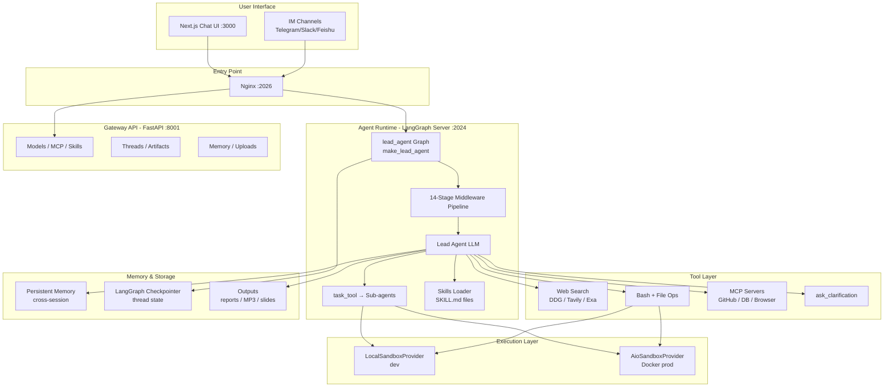

# DeerFlow Tutorial: Open-Source Super Agent Harness

> DeerFlow is a LangGraph-powered multi-agent runtime by ByteDance that orchestrates a lead agent, specialized sub-agents, persistent memory, sandboxed code execution, and a modular skills system to tackle complex, long-horizon research and automation tasks.

[](https://github.com/bytedance/deer-flow)
[](https://opensource.org/licenses/MIT)
[](https://github.com/bytedance/deer-flow)

---

## Why This Track Matters

DeerFlow represents the state of the art in open-source agentic systems. It is not an ETL scheduler, a workflow DAG engine, or a data pipeline tool. It is a **super agent harness** — a runtime that orchestrates a lead LLM agent that spawns specialized sub-agents, loads Markdown-based skills on demand, executes code inside Docker sandboxes, persists cross-session memory, and streams results back to a Next.js chat interface.

Understanding DeerFlow means understanding how production-grade, long-horizon agent systems are actually built: LangGraph state machines, middleware-chain architecture, MCP tool discovery, and skills-as-code patterns. These patterns show up across the emerging agent ecosystem.

This track focuses on:

- Understanding how LangGraph drives the agent state machine
- Understanding how the lead agent orchestrates sub-agents through the `task_tool`
- Understanding the middleware pipeline that wraps every agent invocation
- Understanding the skills system for extending agent capabilities
- Understanding RAG-style tool use (web search, code execution, file operations)
- Understanding the podcast and multi-modal output pipeline
- Understanding production deployment with Docker and LangGraph Platform

## What is DeerFlow?

**DeerFlow** is an open-source super agent harness that orchestrates sub-agents, memory, and sandboxes to accomplish almost any complex, multi-step task. It evolved from ByteDance's internal deep research tooling (inspired by Google's Gemini Deep Research product) into a general-purpose agent runtime.

The system centers on a **lead agent** that decomposes requests, loads relevant skills, spawns parallel sub-agents for long tasks, executes code in isolated Docker containers, searches the web, and synthesizes outputs into structured reports, presentations, podcasts, or other artifacts.

### Key Features

- **Multi-Agent Orchestration** — Lead agent spawns up to N concurrent sub-agents via `task_tool`, each with isolated context and tools
- **LangGraph State Machine** — Agent control flow is a compiled LangGraph graph (`lead_agent`) with async checkpointing
- **14-Stage Middleware Pipeline** — Every agent invocation passes through an ordered chain: sandbox setup, file uploads, summarization, titling, memory, vision, loop detection, clarification, and more
- **Skills Framework** — Modular Markdown-based workflows (deep-research, podcast-generation, chart-visualization, ppt-generation, etc.) load progressively on demand
- **Persistent Memory** — Cross-session memory layer learns user preferences and accumulated knowledge via a memory queue and updater
- **Sandbox Execution** — `LocalSandboxProvider` (direct) or `AioSandboxProvider` (Docker-isolated) for Python/bash execution
- **MCP Tool Discovery** — External tools (GitHub, filesystem, databases, browser) auto-discovered from `extensions_config.json`
- **Multi-Modal Outputs** — Research reports, PowerPoint slides, chart visualizations, podcasts (MP3 via Volcengine TTS), and video generation
- **IM Channel Support** — Telegram, Slack, Feishu/Lark, WeChat, WeCom integrations
- **Streaming Responses** — Server-Sent Events (SSE) from LangGraph to Next.js frontend
- **Observability** — LangSmith and Langfuse tracing for all LLM calls and agent runs

## Current Snapshot (auto-updated)

- repository: [`bytedance/deer-flow`](https://github.com/bytedance/deer-flow)
- stars: about **61k**

## Mental Model



## Tutorial Chapters

| Chapter | Topic | Time | Difficulty |
|:--------|:------|:-----|:-----------|
| **[01-getting-started](01-getting-started.md)** | Installation & First Research Query | 25 min | Beginner |
| **[02-langgraph-architecture](02-langgraph-architecture.md)** | LangGraph Architecture and Agent Orchestration | 40 min | Intermediate |
| **[03-research-agent-pipeline](03-research-agent-pipeline.md)** | Research Agent Pipeline | 35 min | Intermediate |
| **[04-rag-search-knowledge](04-rag-search-knowledge.md)** | RAG, Search, and Knowledge Synthesis | 35 min | Intermediate |
| **[05-frontend-backend-api](05-frontend-backend-api.md)** | Frontend, Backend, and API Design | 35 min | Intermediate |
| **[06-customization-extension](06-customization-extension.md)** | Customization and Extension | 40 min | Advanced |
| **[07-podcast-multimodal](07-podcast-multimodal.md)** | Podcast and Multi-Modal Output | 30 min | Advanced |
| **[08-production-deployment](08-production-deployment.md)** | Production Deployment and Advanced Patterns | 45 min | Advanced |

## What You Will Learn

By the end of this tutorial, you will be able to:

- Install and configure DeerFlow with any OpenAI-compatible LLM
- Understand how LangGraph compiles the lead agent graph with async checkpointing
- Trace a research query through the 14-stage middleware pipeline
- Extend DeerFlow with custom skills, MCP servers, and custom tools
- Understand how sub-agents are spawned via `task_tool` with concurrency limits
- Configure web search providers (DuckDuckGo, Tavily, Exa, Firecrawl)
- Use the sandbox system for safe Python and bash execution
- Generate podcasts, slides, and charts from research outputs
- Deploy DeerFlow with Docker Compose in a production-ready configuration
- Integrate IM channels (Telegram, Slack, Feishu) for autonomous agent access

## Prerequisites

### System Requirements

- **CPU**: 4+ cores recommended (8+ for sub-agent workloads)
- **RAM**: 8 GB minimum, 16 GB recommended
- **Storage**: 25 GB for Docker images and sandbox containers
- **OS**: Linux, macOS, Windows (via WSL2)

### Software Prerequisites

- Docker Desktop (for sandbox and recommended dev mode)
- Python 3.12+ (for local development)
- Node.js 22+ (for frontend)
- An API key for at least one OpenAI-compatible LLM provider
- (Optional) Tavily or DuckDuckGo API key for web search

### Knowledge Prerequisites

- Familiarity with Python async programming
- Basic understanding of LLM APIs and tool-use patterns
- Comfort with Docker and Docker Compose

## Quick Start

```bash
# Clone the repository
git clone https://github.com/bytedance/deer-flow.git
cd deer-flow

# Run the interactive setup wizard (configures config.yaml and .env)
make setup

# Start with Docker (recommended)
make docker-init
make docker-start

# Access the chat interface
open http://localhost:2026
```

For local development without Docker:

```bash
make install   # Install Python + Node dependencies
make dev       # Start all services (LangGraph server + Gateway + frontend)
```

## Use Cases

### Deep Research & Knowledge Synthesis
- Multi-source web research with automatic citation tracking
- Academic paper review and systematic literature analysis
- Competitive intelligence and market research reports

### Code & Data Analysis
- Data analysis pipelines with Python REPL execution
- GitHub repository deep dives
- Chart and visualization generation from datasets

### Content Production
- Long-form reports with structured sections
- PowerPoint presentation generation
- Podcast audio generation (MP3) with two-host dialogue
- Newsletter creation

### Automation via IM Channels
- Trigger research tasks from Slack/Telegram messages
- Deliver results back to channels automatically
- Schedule recurring research workflows

## What Makes DeerFlow Different from Airflow / Prefect / Temporal

DeerFlow is **not** a workflow DAG orchestrator. It does not define tasks as JSON configurations, does not have worker nodes, does not have a task queue, and does not use `depends_on` dependency declarations. Every comparison to Airflow or Celery in the old tutorial was wrong.

DeerFlow is a **conversational agent runtime** where:
- Control flow is determined by the LLM's tool calls, not a static DAG
- "Tasks" are sub-agent invocations generated dynamically at runtime
- State is a LangGraph `ThreadState` persisted via a checkpointer
- "Workers" are Docker sandbox containers that execute agent-generated code
- The user interacts through a chat interface, not a workflow submission API

## Contributing

Found an issue or want to improve this tutorial? Contributions are welcome!

1. Fork this repository
2. Create a feature branch
3. Make your changes
4. Submit a pull request

## Additional Resources

- [DeerFlow GitHub Repository](https://github.com/bytedance/deer-flow)
- [Backend Architecture Docs](https://github.com/bytedance/deer-flow/blob/main/backend/docs/ARCHITECTURE.md)
- [Configuration Reference](https://github.com/bytedance/deer-flow/blob/main/backend/docs/CONFIGURATION.md)
- [MCP Server Integration](https://github.com/bytedance/deer-flow/blob/main/backend/docs/MCP_SERVER.md)
- [Skills Directory](https://github.com/bytedance/deer-flow/tree/main/skills/public)

## Navigation & Backlinks

- [Start Here: Chapter 1: Getting Started](01-getting-started.md)
- [Back to Main Catalog](../../README.md#-tutorial-catalog)
- [Browse A-Z Tutorial Directory](../../discoverability/tutorial-directory.md)
- [Search by Intent](../../discoverability/query-hub.md)

*Generated by [AI Codebase Knowledge Builder](https://github.com/johnxie/awesome-code-docs)*

## Chapter Guide

1. [Chapter 1: Getting Started](01-getting-started.md)
2. [Chapter 2: LangGraph Architecture and Agent Orchestration](02-langgraph-architecture.md)
3. [Chapter 3: Research Agent Pipeline](03-research-agent-pipeline.md)
4. [Chapter 4: RAG, Search, and Knowledge Synthesis](04-rag-search-knowledge.md)
5. [Chapter 5: Frontend, Backend, and API Design](05-frontend-backend-api.md)
6. [Chapter 6: Customization and Extension](06-customization-extension.md)
7. [Chapter 7: Podcast and Multi-Modal Output](07-podcast-multimodal.md)
8. [Chapter 8: Production Deployment and Advanced Patterns](08-production-deployment.md)

## Related Tutorials

- [Botpress Tutorial](../botpress-tutorial/)
- [Claude Task Master Tutorial](../claude-task-master-tutorial/)
- [DSPy Tutorial](../dspy-tutorial/)
- [Fabric Tutorial](../fabric-tutorial/)
- [Instructor Tutorial](../instructor-tutorial/)

## Source References

- [GitHub Repository](https://github.com/bytedance/deer-flow)
- [Architecture Documentation](https://github.com/bytedance/deer-flow/blob/main/backend/docs/ARCHITECTURE.md)
- [Configuration Documentation](https://github.com/bytedance/deer-flow/blob/main/backend/docs/CONFIGURATION.md)
- [Skills Reference](https://github.com/bytedance/deer-flow/tree/main/skills/public)
- [AI Codebase Knowledge Builder](https://github.com/johnxie/awesome-code-docs)
