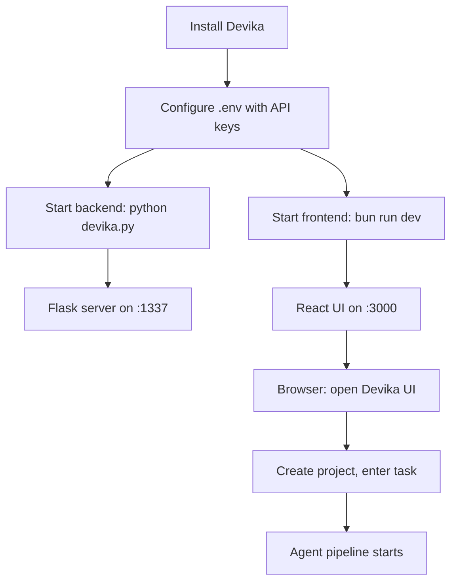

# Chapter 1: Getting Started

Welcome to **Chapter 1: Getting Started**. In this part of **Devika Tutorial: Open-Source Autonomous AI Software Engineer**, you will build an intuitive mental model first, then move into concrete implementation details and practical production tradeoffs.

This chapter walks through installing Devika, configuring API keys, and running a first autonomous coding task end-to-end.

## Learning Goals

- clone and install Devika with all required system dependencies
- configure LLM provider credentials and environment variables
- launch the Devika web UI and backend services
- submit a first task and verify agent output in the workspace

## Fast Start Checklist

1. clone the repository and install Python and Node.js dependencies
2. install Playwright browsers and Qdrant vector store
3. set API keys in `config.toml` for at least one LLM provider
4. start the backend and frontend servers, then submit a hello-world task

## Source References

- [Devika README - Getting Started](https://github.com/stitionai/devika#getting-started)
- [Devika Installation](https://github.com/stitionai/devika#installation)
- [Devika Configuration](https://github.com/stitionai/devika#configuration)
- [Devika Repository](https://github.com/stitionai/devika)

## Summary

You now have a working Devika installation and have executed your first autonomous software engineering task from prompt to generated code.

Next: [Chapter 2: Architecture and Agent Pipeline](02-architecture-and-agent-pipeline.md)

## How These Components Connect

