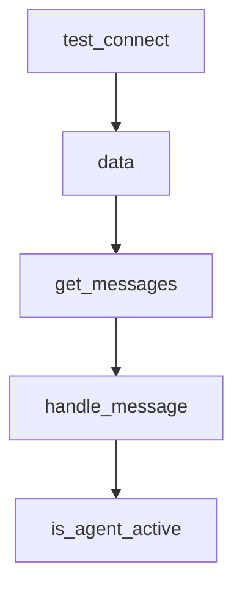

# Chapter 1: Getting Started

Welcome to **Chapter 1: Getting Started**. In this part of **Devika Tutorial: Open-Source Autonomous AI Software Engineer**, you will build an intuitive mental model first, then move into concrete implementation details and practical production tradeoffs.

This chapter walks through installing Devika, configuring API keys, and running a first autonomous coding task end-to-end.

## Learning Goals

- clone and install Devika with all required system dependencies
- configure LLM provider credentials and environment variables
- launch the Devika web UI and backend services
- submit a first task and verify agent output in the workspace

## Fast Start Checklist

1. clone the repository and install Python and Node.js dependencies
2. install Playwright browsers and Qdrant vector store
3. set API keys in `config.toml` for at least one LLM provider
4. start the backend and frontend servers, then submit a hello-world task

## Source References

- [Devika README - Getting Started](https://github.com/stitionai/devika#getting-started)
- [Devika Installation](https://github.com/stitionai/devika#installation)
- [Devika Configuration](https://github.com/stitionai/devika#configuration)
- [Devika Repository](https://github.com/stitionai/devika)

## Summary

You now have a working Devika installation and have executed your first autonomous software engineering task from prompt to generated code.

Next: [Chapter 2: Architecture and Agent Pipeline](02-architecture-and-agent-pipeline.md)

## Depth Expansion Playbook

## Source Code Walkthrough

### `devika.py`

The `test_connect` function in [`devika.py`](https://github.com/stitionai/devika/blob/HEAD/devika.py) handles a key part of this chapter's functionality:

```py
# initial socket
@socketio.on('socket_connect')
def test_connect(data):
    print("Socket connected :: ", data)
    emit_agent("socket_response", {"data": "Server Connected"})


@app.route("/api/data", methods=["GET"])
@route_logger(logger)
def data():
    project = manager.get_project_list()
    models = LLM().list_models()
    search_engines = ["Bing", "Google", "DuckDuckGo"]
    return jsonify({"projects": project, "models": models, "search_engines": search_engines})


@app.route("/api/messages", methods=["POST"])
def get_messages():
    data = request.json
    project_name = data.get("project_name")
    messages = manager.get_messages(project_name)
    return jsonify({"messages": messages})


# Main socket
@socketio.on('user-message')
def handle_message(data):
    logger.info(f"User message: {data}")
    message = data.get('message')
    base_model = data.get('base_model')
    project_name = data.get('project_name')
    search_engine = data.get('search_engine').lower()
```

This function is important because it defines how Devika Tutorial: Open-Source Autonomous AI Software Engineer implements the patterns covered in this chapter.

### `devika.py`

The `data` function in [`devika.py`](https://github.com/stitionai/devika/blob/HEAD/devika.py) handles a key part of this chapter's functionality:

```py
# initial socket
@socketio.on('socket_connect')
def test_connect(data):
    print("Socket connected :: ", data)
    emit_agent("socket_response", {"data": "Server Connected"})


@app.route("/api/data", methods=["GET"])
@route_logger(logger)
def data():
    project = manager.get_project_list()
    models = LLM().list_models()
    search_engines = ["Bing", "Google", "DuckDuckGo"]
    return jsonify({"projects": project, "models": models, "search_engines": search_engines})


@app.route("/api/messages", methods=["POST"])
def get_messages():
    data = request.json
    project_name = data.get("project_name")
    messages = manager.get_messages(project_name)
    return jsonify({"messages": messages})


# Main socket
@socketio.on('user-message')
def handle_message(data):
    logger.info(f"User message: {data}")
    message = data.get('message')
    base_model = data.get('base_model')
    project_name = data.get('project_name')
    search_engine = data.get('search_engine').lower()
```

This function is important because it defines how Devika Tutorial: Open-Source Autonomous AI Software Engineer implements the patterns covered in this chapter.

### `devika.py`

The `get_messages` function in [`devika.py`](https://github.com/stitionai/devika/blob/HEAD/devika.py) handles a key part of this chapter's functionality:

```py

@app.route("/api/messages", methods=["POST"])
def get_messages():
    data = request.json
    project_name = data.get("project_name")
    messages = manager.get_messages(project_name)
    return jsonify({"messages": messages})


# Main socket
@socketio.on('user-message')
def handle_message(data):
    logger.info(f"User message: {data}")
    message = data.get('message')
    base_model = data.get('base_model')
    project_name = data.get('project_name')
    search_engine = data.get('search_engine').lower()

    agent = Agent(base_model=base_model, search_engine=search_engine)

    state = AgentState.get_latest_state(project_name)
    if not state:
        thread = Thread(target=lambda: agent.execute(message, project_name))
        thread.start()
    else:
        if AgentState.is_agent_completed(project_name):
            thread = Thread(target=lambda: agent.subsequent_execute(message, project_name))
            thread.start()
        else:
            emit_agent("info", {"type": "warning", "message": "previous agent doesn't completed it's task."})
            last_state = AgentState.get_latest_state(project_name)
            if last_state["agent_is_active"] or not last_state["completed"]:
```

This function is important because it defines how Devika Tutorial: Open-Source Autonomous AI Software Engineer implements the patterns covered in this chapter.

### `devika.py`

The `handle_message` function in [`devika.py`](https://github.com/stitionai/devika/blob/HEAD/devika.py) handles a key part of this chapter's functionality:

```py
# Main socket
@socketio.on('user-message')
def handle_message(data):
    logger.info(f"User message: {data}")
    message = data.get('message')
    base_model = data.get('base_model')
    project_name = data.get('project_name')
    search_engine = data.get('search_engine').lower()

    agent = Agent(base_model=base_model, search_engine=search_engine)

    state = AgentState.get_latest_state(project_name)
    if not state:
        thread = Thread(target=lambda: agent.execute(message, project_name))
        thread.start()
    else:
        if AgentState.is_agent_completed(project_name):
            thread = Thread(target=lambda: agent.subsequent_execute(message, project_name))
            thread.start()
        else:
            emit_agent("info", {"type": "warning", "message": "previous agent doesn't completed it's task."})
            last_state = AgentState.get_latest_state(project_name)
            if last_state["agent_is_active"] or not last_state["completed"]:
                thread = Thread(target=lambda: agent.execute(message, project_name))
                thread.start()
            else:
                thread = Thread(target=lambda: agent.subsequent_execute(message, project_name))
                thread.start()

@app.route("/api/is-agent-active", methods=["POST"])
@route_logger(logger)
def is_agent_active():
```

This function is important because it defines how Devika Tutorial: Open-Source Autonomous AI Software Engineer implements the patterns covered in this chapter.


## How These Components Connect


