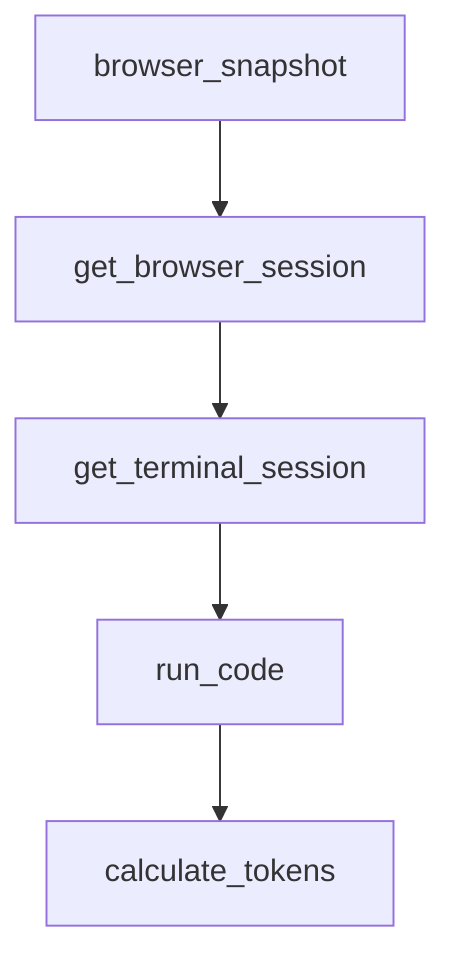

# Chapter 2: Architecture and Agent Pipeline

Welcome to **Chapter 2: Architecture and Agent Pipeline**. In this part of **Devika Tutorial: Open-Source Autonomous AI Software Engineer**, you will build an intuitive mental model first, then move into concrete implementation details and practical production tradeoffs.

This chapter explains how Devika's five specialized agents — planner, researcher, coder, action, and internal monologue — coordinate to transform a single user prompt into working code.

## Learning Goals

- understand the roles and responsibilities of each specialized agent in the Devika pipeline
- trace the data and control flow from task submission through to workspace output
- identify how the internal monologue loop drives iterative self-correction
- reason about the architectural boundaries between agents for debugging and extension

## Fast Start Checklist

1. read the architecture overview in the Devika README and docs directory
2. identify the five agent types and their input/output contracts
3. trace a single task through the pipeline by reading the orchestrator source
4. inspect agent log output for a real task to observe the coordination sequence

## Source References

- [Devika Architecture Docs](https://github.com/stitionai/devika/blob/main/docs/architecture.md)
- [Devika How It Works](https://github.com/stitionai/devika#how-it-works)
- [Devika Agent Source](https://github.com/stitionai/devika/tree/main/src/agents)
- [Devika Repository](https://github.com/stitionai/devika)

## Summary

You now understand how Devika's multi-agent architecture decomposes a high-level task into research, planning, coding, and self-reflection steps that loop until the task is complete.

Next: [Chapter 3: LLM Provider Configuration](03-llm-provider-configuration.md)

## Depth Expansion Playbook

## Source Code Walkthrough

### `devika.py`

The `browser_snapshot` function in [`devika.py`](https://github.com/stitionai/devika/blob/HEAD/devika.py) handles a key part of this chapter's functionality:

```py
@app.route("/api/get-browser-snapshot", methods=["GET"])
@route_logger(logger)
def browser_snapshot():
    snapshot_path = request.args.get("snapshot_path")
    return send_file(snapshot_path, as_attachment=True)


@app.route("/api/get-browser-session", methods=["GET"])
@route_logger(logger)
def get_browser_session():
    project_name = request.args.get("project_name")
    agent_state = AgentState.get_latest_state(project_name)
    if not agent_state:
        return jsonify({"session": None})
    else:
        browser_session = agent_state["browser_session"]
        return jsonify({"session": browser_session})


@app.route("/api/get-terminal-session", methods=["GET"])
@route_logger(logger)
def get_terminal_session():
    project_name = request.args.get("project_name")
    agent_state = AgentState.get_latest_state(project_name)
    if not agent_state:
        return jsonify({"terminal_state": None})
    else:
        terminal_state = agent_state["terminal_session"]
        return jsonify({"terminal_state": terminal_state})


@app.route("/api/run-code", methods=["POST"])
```

This function is important because it defines how Devika Tutorial: Open-Source Autonomous AI Software Engineer implements the patterns covered in this chapter.

### `devika.py`

The `get_browser_session` function in [`devika.py`](https://github.com/stitionai/devika/blob/HEAD/devika.py) handles a key part of this chapter's functionality:

```py
@app.route("/api/get-browser-session", methods=["GET"])
@route_logger(logger)
def get_browser_session():
    project_name = request.args.get("project_name")
    agent_state = AgentState.get_latest_state(project_name)
    if not agent_state:
        return jsonify({"session": None})
    else:
        browser_session = agent_state["browser_session"]
        return jsonify({"session": browser_session})


@app.route("/api/get-terminal-session", methods=["GET"])
@route_logger(logger)
def get_terminal_session():
    project_name = request.args.get("project_name")
    agent_state = AgentState.get_latest_state(project_name)
    if not agent_state:
        return jsonify({"terminal_state": None})
    else:
        terminal_state = agent_state["terminal_session"]
        return jsonify({"terminal_state": terminal_state})


@app.route("/api/run-code", methods=["POST"])
@route_logger(logger)
def run_code():
    data = request.json
    project_name = data.get("project_name")
    code = data.get("code")
    # TODO: Implement code execution logic
    return jsonify({"message": "Code execution started"})
```

This function is important because it defines how Devika Tutorial: Open-Source Autonomous AI Software Engineer implements the patterns covered in this chapter.

### `devika.py`

The `get_terminal_session` function in [`devika.py`](https://github.com/stitionai/devika/blob/HEAD/devika.py) handles a key part of this chapter's functionality:

```py
@app.route("/api/get-terminal-session", methods=["GET"])
@route_logger(logger)
def get_terminal_session():
    project_name = request.args.get("project_name")
    agent_state = AgentState.get_latest_state(project_name)
    if not agent_state:
        return jsonify({"terminal_state": None})
    else:
        terminal_state = agent_state["terminal_session"]
        return jsonify({"terminal_state": terminal_state})


@app.route("/api/run-code", methods=["POST"])
@route_logger(logger)
def run_code():
    data = request.json
    project_name = data.get("project_name")
    code = data.get("code")
    # TODO: Implement code execution logic
    return jsonify({"message": "Code execution started"})


@app.route("/api/calculate-tokens", methods=["POST"])
@route_logger(logger)
def calculate_tokens():
    data = request.json
    prompt = data.get("prompt")
    tokens = len(TIKTOKEN_ENC.encode(prompt))
    return jsonify({"token_usage": tokens})


@app.route("/api/token-usage", methods=["GET"])
```

This function is important because it defines how Devika Tutorial: Open-Source Autonomous AI Software Engineer implements the patterns covered in this chapter.

### `devika.py`

The `run_code` function in [`devika.py`](https://github.com/stitionai/devika/blob/HEAD/devika.py) handles a key part of this chapter's functionality:

```py
@app.route("/api/run-code", methods=["POST"])
@route_logger(logger)
def run_code():
    data = request.json
    project_name = data.get("project_name")
    code = data.get("code")
    # TODO: Implement code execution logic
    return jsonify({"message": "Code execution started"})


@app.route("/api/calculate-tokens", methods=["POST"])
@route_logger(logger)
def calculate_tokens():
    data = request.json
    prompt = data.get("prompt")
    tokens = len(TIKTOKEN_ENC.encode(prompt))
    return jsonify({"token_usage": tokens})


@app.route("/api/token-usage", methods=["GET"])
@route_logger(logger)
def token_usage():
    project_name = request.args.get("project_name")
    token_count = AgentState.get_latest_token_usage(project_name)
    return jsonify({"token_usage": token_count})


@app.route("/api/logs", methods=["GET"])
def real_time_logs():
    log_file = logger.read_log_file()
    return jsonify({"logs": log_file})

```

This function is important because it defines how Devika Tutorial: Open-Source Autonomous AI Software Engineer implements the patterns covered in this chapter.


## How These Components Connect


