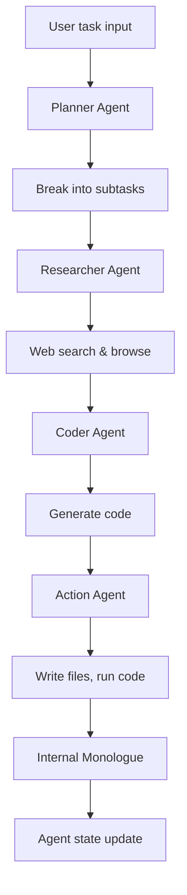

# Chapter 2: Architecture and Agent Pipeline

Welcome to **Chapter 2: Architecture and Agent Pipeline**. In this part of **Devika Tutorial: Open-Source Autonomous AI Software Engineer**, you will build an intuitive mental model first, then move into concrete implementation details and practical production tradeoffs.

This chapter explains how Devika's five specialized agents — planner, researcher, coder, action, and internal monologue — coordinate to transform a single user prompt into working code.

## Learning Goals

- understand the roles and responsibilities of each specialized agent in the Devika pipeline
- trace the data and control flow from task submission through to workspace output
- identify how the internal monologue loop drives iterative self-correction
- reason about the architectural boundaries between agents for debugging and extension

## Fast Start Checklist

1. read the architecture overview in the Devika README and docs directory
2. identify the five agent types and their input/output contracts
3. trace a single task through the pipeline by reading the orchestrator source
4. inspect agent log output for a real task to observe the coordination sequence

## Source References

- [Devika Architecture Docs](https://github.com/stitionai/devika/blob/main/docs/architecture.md)
- [Devika How It Works](https://github.com/stitionai/devika#how-it-works)
- [Devika Agent Source](https://github.com/stitionai/devika/tree/main/src/agents)
- [Devika Repository](https://github.com/stitionai/devika)

## Summary

You now understand how Devika's multi-agent architecture decomposes a high-level task into research, planning, coding, and self-reflection steps that loop until the task is complete.

Next: [Chapter 3: LLM Provider Configuration](03-llm-provider-configuration.md)

## How These Components Connect

