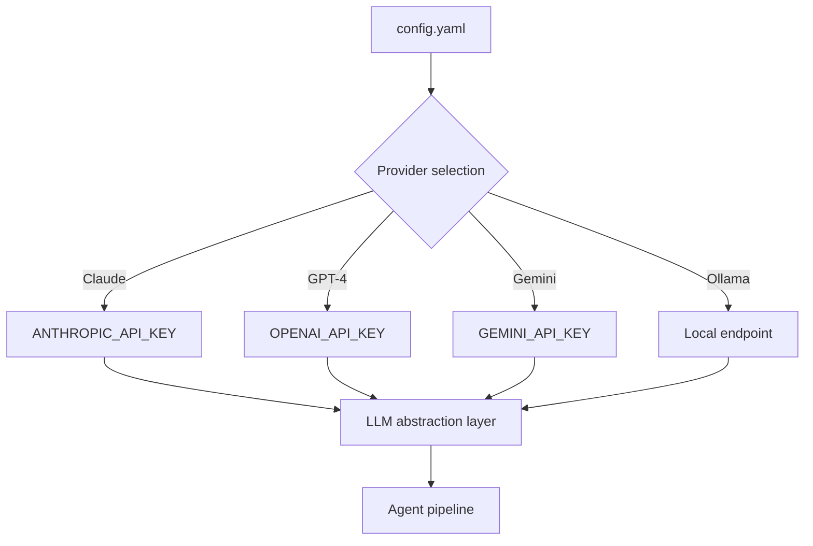

# Chapter 3: LLM Provider Configuration

Welcome to **Chapter 3: LLM Provider Configuration**. In this part of **Devika Tutorial: Open-Source Autonomous AI Software Engineer**, you will build an intuitive mental model first, then move into concrete implementation details and practical production tradeoffs.

This chapter covers how to configure Claude 3, GPT-4, Gemini, Mistral, Groq, and local Ollama models in Devika's `config.toml` and how to select the right provider for each agent role.

## Learning Goals

- configure API keys and model identifiers for every supported LLM provider
- understand Devika's model selection mechanism and how to switch providers per project
- evaluate the cost, latency, and quality tradeoffs across providers for autonomous coding tasks
- configure Ollama for fully offline, local LLM operation without external API keys

## Fast Start Checklist

1. open `config.toml` and locate the `[API_KEYS]` and `[API_MODELS]` sections
2. add your API key for at least one cloud provider (Claude, OpenAI, Google, Mistral, or Groq)
3. set the model name for each provider section to a currently available model identifier
4. optionally install and start Ollama with a code-capable model for local operation

## Source References

- [Devika Configuration Section](https://github.com/stitionai/devika#configuration)
- [Devika config.example.toml](https://github.com/stitionai/devika/blob/main/config.example.toml)
- [Devika LLM Provider Source](https://github.com/stitionai/devika/tree/main/src/llm)
- [Devika README](https://github.com/stitionai/devika/blob/main/README.md)

## Summary

You now know how to configure any of Devika's supported LLM providers, select the right model for each use case, and operate Devika in fully local mode using Ollama.

Next: [Chapter 4: Task Planning and Code Generation](04-task-planning-and-code-generation.md)

## How These Components Connect

