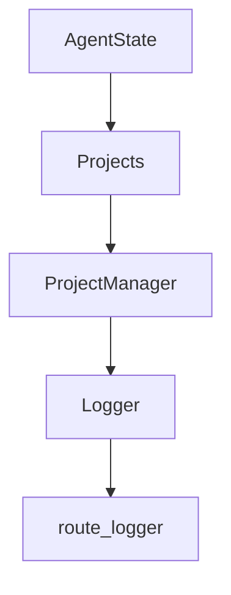

# Chapter 4: Task Planning and Code Generation

Welcome to **Chapter 4: Task Planning and Code Generation**. In this part of **Devika Tutorial: Open-Source Autonomous AI Software Engineer**, you will build an intuitive mental model first, then move into concrete implementation details and practical production tradeoffs.

This chapter explains how Devika's planner agent decomposes a user prompt into an executable step plan, and how the coder agent transforms each step plus research context into production-ready code files.

## Learning Goals

- understand how the planner agent structures a task into numbered steps with dependencies
- trace how each plan step becomes a coder agent invocation with a bounded context
- identify prompt engineering patterns that improve planning quality and code generation accuracy
- recognize failure modes in task decomposition and apply countermeasures

## Fast Start Checklist

1. submit a small, well-scoped coding task and observe the plan output in the agent log
2. examine the coder prompt template to see how plan steps and research context are assembled
3. review the generated workspace files to verify step-to-file correspondence
4. experiment with prompt phrasing to observe its effect on step count and code quality

## Source References

- [Devika Planner Agent Source](https://github.com/stitionai/devika/tree/main/src/agents/planner)
- [Devika Coder Agent Source](https://github.com/stitionai/devika/tree/main/src/agents/coder)
- [Devika How It Works](https://github.com/stitionai/devika#how-it-works)
- [Devika Architecture Docs](https://github.com/stitionai/devika/blob/main/docs/architecture.md)

## Summary

You now understand how Devika converts a natural language task into a structured execution plan and how each plan step drives a focused code generation call with research-enriched context.

Next: [Chapter 5: Web Research and Browser Integration](05-web-research-and-browser-integration.md)

## Depth Expansion Playbook

## Source Code Walkthrough

### `src/state.py`

The `AgentState` class in [`src/state.py`](https://github.com/stitionai/devika/blob/HEAD/src/state.py) handles a key part of this chapter's functionality:

```py


class AgentStateModel(SQLModel, table=True):
    __tablename__ = "agent_state"

    id: Optional[int] = Field(default=None, primary_key=True)
    project: str
    state_stack_json: str


class AgentState:
    def __init__(self):
        config = Config()
        sqlite_path = config.get_sqlite_db()
        self.engine = create_engine(f"sqlite:///{sqlite_path}")
        SQLModel.metadata.create_all(self.engine)

    def new_state(self):
        timestamp = datetime.now().strftime("%Y-%m-%d %H:%M:%S")

        return {
            "internal_monologue": '',
            "browser_session": {
                "url": None,
                "screenshot": None
            },
            "terminal_session": {
                "command": None,
                "output": None,
                "title": None
            },
            "step": int(),
```

This class is important because it defines how Devika Tutorial: Open-Source Autonomous AI Software Engineer implements the patterns covered in this chapter.

### `src/project.py`

The `Projects` class in [`src/project.py`](https://github.com/stitionai/devika/blob/HEAD/src/project.py) handles a key part of this chapter's functionality:

```py


class Projects(SQLModel, table=True):
    id: Optional[int] = Field(default=None, primary_key=True)
    project: str
    message_stack_json: str


class ProjectManager:
    def __init__(self):
        config = Config()
        sqlite_path = config.get_sqlite_db()
        self.project_path = config.get_projects_dir()
        self.engine = create_engine(f"sqlite:///{sqlite_path}")
        SQLModel.metadata.create_all(self.engine)

    def new_message(self):
        timestamp = datetime.now().strftime("%Y-%m-%d %H:%M:%S")

        return {
            "from_devika": True,
            "message": None,
            "timestamp": timestamp
        }

    def create_project(self, project: str):
        with Session(self.engine) as session:
            project_state = Projects(project=project, message_stack_json=json.dumps([]))
            session.add(project_state)
            session.commit()

    def delete_project(self, project: str):
```

This class is important because it defines how Devika Tutorial: Open-Source Autonomous AI Software Engineer implements the patterns covered in this chapter.

### `src/project.py`

The `ProjectManager` class in [`src/project.py`](https://github.com/stitionai/devika/blob/HEAD/src/project.py) handles a key part of this chapter's functionality:

```py


class ProjectManager:
    def __init__(self):
        config = Config()
        sqlite_path = config.get_sqlite_db()
        self.project_path = config.get_projects_dir()
        self.engine = create_engine(f"sqlite:///{sqlite_path}")
        SQLModel.metadata.create_all(self.engine)

    def new_message(self):
        timestamp = datetime.now().strftime("%Y-%m-%d %H:%M:%S")

        return {
            "from_devika": True,
            "message": None,
            "timestamp": timestamp
        }

    def create_project(self, project: str):
        with Session(self.engine) as session:
            project_state = Projects(project=project, message_stack_json=json.dumps([]))
            session.add(project_state)
            session.commit()

    def delete_project(self, project: str):
        with Session(self.engine) as session:
            project_state = session.query(Projects).filter(Projects.project == project).first()
            if project_state:
                session.delete(project_state)
                session.commit()

```

This class is important because it defines how Devika Tutorial: Open-Source Autonomous AI Software Engineer implements the patterns covered in this chapter.

### `src/logger.py`

The `Logger` class in [`src/logger.py`](https://github.com/stitionai/devika/blob/HEAD/src/logger.py) handles a key part of this chapter's functionality:

```py


class Logger:
    def __init__(self, filename="devika_agent.log"):
        config = Config()
        logs_dir = config.get_logs_dir()
        self.logger = LogInit(pathName=logs_dir + "/" + filename, console=True, colors=True, encoding="utf-8")

    def read_log_file(self) -> str:
        with open(self.logger.pathName, "r") as file:
            return file.read()

    def info(self, message: str):
        self.logger.info(message)
        self.logger.flush()

    def error(self, message: str):
        self.logger.error(message)
        self.logger.flush()

    def warning(self, message: str):
        self.logger.warning(message)
        self.logger.flush()

    def debug(self, message: str):
        self.logger.debug(message)
        self.logger.flush()

    def exception(self, message: str):
        self.logger.exception(message)
        self.logger.flush()

```

This class is important because it defines how Devika Tutorial: Open-Source Autonomous AI Software Engineer implements the patterns covered in this chapter.


## How These Components Connect


