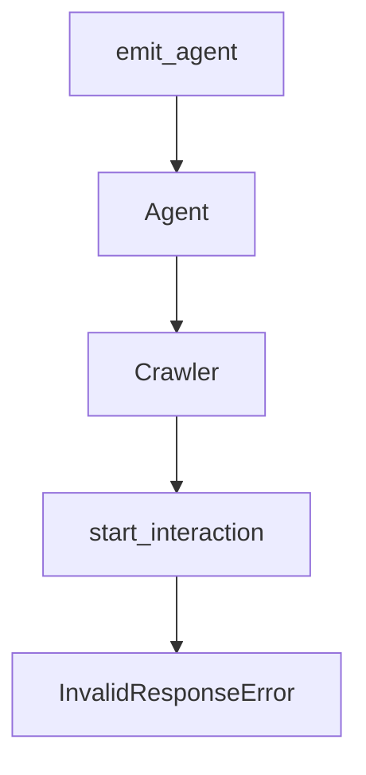

# Chapter 5: Web Research and Browser Integration

Welcome to **Chapter 5: Web Research and Browser Integration**. In this part of **Devika Tutorial: Open-Source Autonomous AI Software Engineer**, you will build an intuitive mental model first, then move into concrete implementation details and practical production tradeoffs.

This chapter covers how Devika's researcher agent uses Playwright to autonomously browse the web, extract relevant content, and store it in Qdrant for use by the coder agent.

## Learning Goals

- understand how the researcher agent generates and executes Playwright-driven web searches
- configure Playwright browser options for headless operation and rate-limiting compliance
- trace the research artifact lifecycle from web fetch to Qdrant storage to coder retrieval
- identify failure modes in browser automation and apply targeted countermeasures

## Fast Start Checklist

1. verify Playwright Chromium is installed and the researcher agent can launch a browser
2. submit a task with a clear technology context and observe the researcher's search queries in logs
3. inspect the Qdrant collection to confirm research artifacts are stored with correct metadata
4. verify the coder agent retrieves relevant chunks in subsequent steps

## Source References

- [Devika Researcher Agent Source](https://github.com/stitionai/devika/tree/main/src/agents/researcher)
- [Devika Browser Agent Source](https://github.com/stitionai/devika/tree/main/src/browser)
- [Devika Architecture Docs](https://github.com/stitionai/devika/blob/main/docs/architecture.md)
- [Playwright Python Documentation](https://playwright.dev/python/)

## Summary

You now understand how Devika's browser automation layer fetches, extracts, and stores web research that enriches code generation with up-to-date documentation and examples.

Next: [Chapter 6: Project Management and Workspaces](06-project-management-and-workspaces.md)

## Depth Expansion Playbook

## Source Code Walkthrough

### `src/socket_instance.py`

The `emit_agent` function in [`src/socket_instance.py`](https://github.com/stitionai/devika/blob/HEAD/src/socket_instance.py) handles a key part of this chapter's functionality:

```py


def emit_agent(channel, content, log=True):
    try:
        socketio.emit(channel, content)
        if log:
            logger.info(f"SOCKET {channel} MESSAGE: {content}")
        return True
    except Exception as e:
        logger.error(f"SOCKET {channel} ERROR: {str(e)}")
        return False

```

This function is important because it defines how Devika Tutorial: Open-Source Autonomous AI Software Engineer implements the patterns covered in this chapter.

### `src/agents/agent.py`

The `Agent` class in [`src/agents/agent.py`](https://github.com/stitionai/devika/blob/HEAD/src/agents/agent.py) handles a key part of this chapter's functionality:

```py

from src.project import ProjectManager
from src.state import AgentState
from src.logger import Logger

from src.bert.sentence import SentenceBert
from src.memory import KnowledgeBase
from src.browser.search import BingSearch, GoogleSearch, DuckDuckGoSearch
from src.browser import Browser
from src.browser import start_interaction
from src.filesystem import ReadCode
from src.services import Netlify
from src.documenter.pdf import PDF

import json
import time
import platform
import tiktoken
import asyncio

from src.socket_instance import emit_agent


class Agent:
    def __init__(self, base_model: str, search_engine: str, browser: Browser = None):
        if not base_model:
            raise ValueError("base_model is required")

        self.logger = Logger()

        """
        Accumulate contextual keywords from chained prompts of all preparation agents
```

This class is important because it defines how Devika Tutorial: Open-Source Autonomous AI Software Engineer implements the patterns covered in this chapter.

### `src/browser/interaction.py`

The `Crawler` class in [`src/browser/interaction.py`](https://github.com/stitionai/devika/blob/HEAD/src/browser/interaction.py) handles a key part of this chapter's functionality:

```py
black_listed_elements = set(["html", "head", "title", "meta", "iframe", "body", "script", "style", "path", "svg", "br", "::marker",])

class Crawler:
	def __init__(self):
		self.browser = (
			sync_playwright()
			.start()
			.chromium.launch(
				headless=True,
			)
		)

		self.page = self.browser.new_page()
		self.page.set_viewport_size({"width": 1280, "height": 1080})
  
	def screenshot(self, project_name):
		screenshots_save_path = Config().get_screenshots_dir()

		page_metadata = self.page.evaluate("() => { return { url: document.location.href, title: document.title } }")
		page_url = page_metadata['url']
		random_filename = os.urandom(20).hex()
		filename_to_save = f"{random_filename}.png"
		path_to_save = os.path.join(screenshots_save_path, filename_to_save)

		self.page.emulate_media(media="screen")
		self.page.screenshot(path=path_to_save)

		new_state = AgentState().new_state()
		new_state["internal_monologue"] = "Browsing the web right now..."
		new_state["browser_session"]["url"] = page_url
		new_state["browser_session"]["screenshot"] = path_to_save
		AgentState().add_to_current_state(project_name, new_state)        
```

This class is important because it defines how Devika Tutorial: Open-Source Autonomous AI Software Engineer implements the patterns covered in this chapter.

### `src/browser/interaction.py`

The `start_interaction` function in [`src/browser/interaction.py`](https://github.com/stitionai/devika/blob/HEAD/src/browser/interaction.py) handles a key part of this chapter's functionality:

```py
		return elements_of_interest

def start_interaction(model_id, objective, project_name):
	_crawler = Crawler()

	def print_help():
		print(
			"(g) to visit url\n(u) scroll up\n(d) scroll down\n(c) to click\n(t) to type\n" +
			"(h) to view commands again\n(r/enter) to run suggested command\n(o) change objective"
		)

	def get_gpt_command(objective, url, previous_command, browser_content):
		prompt = prompt_template
		prompt = prompt.replace("$objective", objective)
		prompt = prompt.replace("$url", url[:100])
		prompt = prompt.replace("$previous_command", previous_command)
		prompt = prompt.replace("$browser_content", browser_content[:4500])
		response = LLM(model_id=model_id).inference(prompt)
		return response

	def run_cmd(cmd):
		cmd = cmd.split("\n")[0]

		if cmd.startswith("SCROLL UP"):
			_crawler.scroll("up")
		elif cmd.startswith("SCROLL DOWN"):
			_crawler.scroll("down")
		elif cmd.startswith("CLICK"):
			commasplit = cmd.split(",")
			id = commasplit[0].split(" ")[1]
			_crawler.click(id)
		elif cmd.startswith("TYPE"):
```

This function is important because it defines how Devika Tutorial: Open-Source Autonomous AI Software Engineer implements the patterns covered in this chapter.


## How These Components Connect


