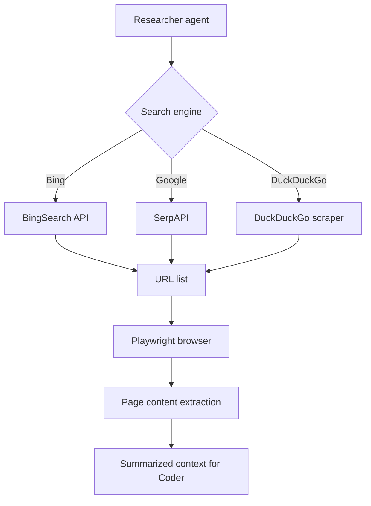

# Chapter 5: Web Research and Browser Integration

Welcome to **Chapter 5: Web Research and Browser Integration**. In this part of **Devika Tutorial: Open-Source Autonomous AI Software Engineer**, you will build an intuitive mental model first, then move into concrete implementation details and practical production tradeoffs.

This chapter covers how Devika's researcher agent uses Playwright to autonomously browse the web, extract relevant content, and store it in Qdrant for use by the coder agent.

## Learning Goals

- understand how the researcher agent generates and executes Playwright-driven web searches
- configure Playwright browser options for headless operation and rate-limiting compliance
- trace the research artifact lifecycle from web fetch to Qdrant storage to coder retrieval
- identify failure modes in browser automation and apply targeted countermeasures

## Fast Start Checklist

1. verify Playwright Chromium is installed and the researcher agent can launch a browser
2. submit a task with a clear technology context and observe the researcher's search queries in logs
3. inspect the Qdrant collection to confirm research artifacts are stored with correct metadata
4. verify the coder agent retrieves relevant chunks in subsequent steps

## Source References

- [Devika Researcher Agent Source](https://github.com/stitionai/devika/tree/main/src/agents/researcher)
- [Devika Browser Agent Source](https://github.com/stitionai/devika/tree/main/src/browser)
- [Devika Architecture Docs](https://github.com/stitionai/devika/blob/main/docs/architecture.md)
- [Playwright Python Documentation](https://playwright.dev/python/)

## Summary

You now understand how Devika's browser automation layer fetches, extracts, and stores web research that enriches code generation with up-to-date documentation and examples.

Next: [Chapter 6: Project Management and Workspaces](06-project-management-and-workspaces.md)

## How These Components Connect

