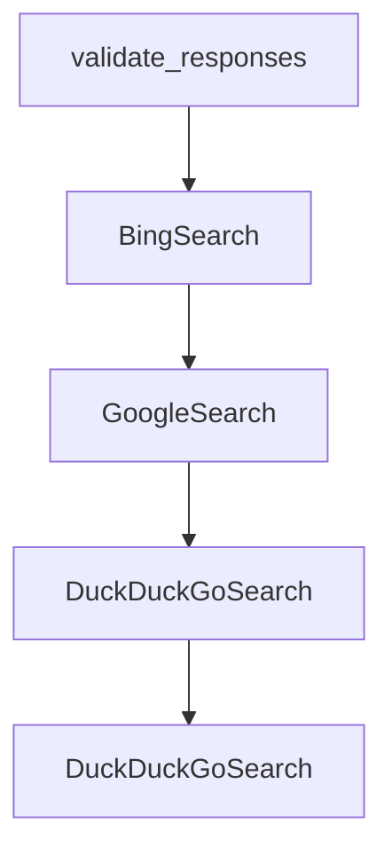

# Chapter 6: Project Management and Workspaces

Welcome to **Chapter 6: Project Management and Workspaces**. In this part of **Devika Tutorial: Open-Source Autonomous AI Software Engineer**, you will build an intuitive mental model first, then move into concrete implementation details and practical production tradeoffs.

This chapter explains how Devika organizes projects, manages the workspace file system, integrates with git, and enables teams to structure and review autonomous coding sessions.

## Learning Goals

- understand the Devika project model: how projects are created, named, and isolated in the workspace
- trace how generated files are written, updated, and organized within a project workspace
- configure and use Devika's git integration for committing and reviewing agent-generated code
- manage multiple concurrent projects and maintain workspace hygiene over time

## Fast Start Checklist

1. create a new project in the Devika UI and observe the workspace directory created on disk
2. submit a task and verify generated files appear under the correct project subdirectory
3. initialize git in the project workspace and review the first commit of agent-generated code
4. explore the project list API and SQLite database to understand project metadata storage

## Source References

- [Devika Project Management Source](https://github.com/stitionai/devika/tree/main/src/project)
- [Devika README](https://github.com/stitionai/devika/blob/main/README.md)
- [Devika Architecture Docs](https://github.com/stitionai/devika/blob/main/docs/architecture.md)
- [Devika Repository](https://github.com/stitionai/devika)

## Summary

You now know how to create and manage Devika projects, navigate the workspace file structure, and use git to review, version, and share agent-generated code safely.

Next: [Chapter 7: Debugging and Troubleshooting](07-debugging-and-troubleshooting.md)

## Depth Expansion Playbook

## Source Code Walkthrough

### `src/services/utils.py`

The `validate_responses` function in [`src/services/utils.py`](https://github.com/stitionai/devika/blob/HEAD/src/services/utils.py) handles a key part of this chapter's functionality:

```py
    pass

def validate_responses(func):
    @wraps(func)
    def wrapper(*args, **kwargs):
        args = list(args)
        response = args[1]
        response = response.strip()

        try:
            response = json.loads(response)
            print("first", type(response))
            args[1] = response
            return func(*args, **kwargs)

        except json.JSONDecodeError:
            pass

        try:
            response = response.split("```")[1]
            if response:
                response = json.loads(response.strip())
                print("second", type(response))
                args[1] = response
                return func(*args, **kwargs)

        except (IndexError, json.JSONDecodeError):
            pass

        try:
            start_index = response.find('{')
            end_index = response.rfind('}')
```

This function is important because it defines how Devika Tutorial: Open-Source Autonomous AI Software Engineer implements the patterns covered in this chapter.

### `src/browser/search.py`

The `BingSearch` class in [`src/browser/search.py`](https://github.com/stitionai/devika/blob/HEAD/src/browser/search.py) handles a key part of this chapter's functionality:

```py


class BingSearch:
    def __init__(self):
        self.config = Config()
        self.bing_api_key = self.config.get_bing_api_key()
        self.bing_api_endpoint = self.config.get_bing_api_endpoint()
        self.query_result = None

    def search(self, query):
        headers = {"Ocp-Apim-Subscription-Key": self.bing_api_key}
        params = {"q": query, "mkt": "en-US"}

        try:
            response = requests.get(self.bing_api_endpoint, headers=headers, params=params)
            response.raise_for_status()
            self.query_result = response.json()
            return self.query_result
        except Exception as error:
            return error

    def get_first_link(self):
        return self.query_result["webPages"]["value"][0]["url"]


class GoogleSearch:
    def __init__(self):
        self.config = Config()
        self.google_search_api_key = self.config.get_google_search_api_key()
        self.google_search_engine_ID = self.config.get_google_search_engine_id()
        self.google_search_api_endpoint = self.config.get_google_search_api_endpoint()
        self.query_result = None
```

This class is important because it defines how Devika Tutorial: Open-Source Autonomous AI Software Engineer implements the patterns covered in this chapter.

### `src/browser/search.py`

The `GoogleSearch` class in [`src/browser/search.py`](https://github.com/stitionai/devika/blob/HEAD/src/browser/search.py) handles a key part of this chapter's functionality:

```py


class GoogleSearch:
    def __init__(self):
        self.config = Config()
        self.google_search_api_key = self.config.get_google_search_api_key()
        self.google_search_engine_ID = self.config.get_google_search_engine_id()
        self.google_search_api_endpoint = self.config.get_google_search_api_endpoint()
        self.query_result = None

    def search(self, query):
        params = {
            "key": self.google_search_api_key,
            "cx": self.google_search_engine_ID,
            "q": query
        }
        try:
            print("Searching in Google...")
            response = requests.get(self.google_search_api_endpoint, params=params)
            # response.raise_for_status()
            self.query_result = response.json()
        except Exception as error:
            return error

    def get_first_link(self):
        item = ""
        try:
            if 'items' in self.query_result:
                item = self.query_result['items'][0]['link']
            return item
        except Exception as error:
            print(error)
```

This class is important because it defines how Devika Tutorial: Open-Source Autonomous AI Software Engineer implements the patterns covered in this chapter.

### `src/browser/search.py`

The `DuckDuckGoSearch` class in [`src/browser/search.py`](https://github.com/stitionai/devika/blob/HEAD/src/browser/search.py) handles a key part of this chapter's functionality:

```py
            return ""

# class DuckDuckGoSearch:
#     def __init__(self):
#         self.query_result = None
#
#     def search(self, query):
#         from duckduckgo_search import DDGS
#         try:
#             self.query_result = DDGS().text(query, max_results=5, region="us")
#             print(self.query_result)
#
#         except Exception as err:
#             print(err)
#
#     def get_first_link(self):
#         if self.query_result:
#             return self.query_result[0]["href"]
#         else:
#             return None
#


class DuckDuckGoSearch:
    """DuckDuckGo search engine class.
    methods are inherited from the duckduckgo_search package.
    do not change the methods.

    currently, the package is not working with our current setup.
    """
    def __init__(self):
        from curl_cffi import requests as curl_requests
```

This class is important because it defines how Devika Tutorial: Open-Source Autonomous AI Software Engineer implements the patterns covered in this chapter.


## How These Components Connect


