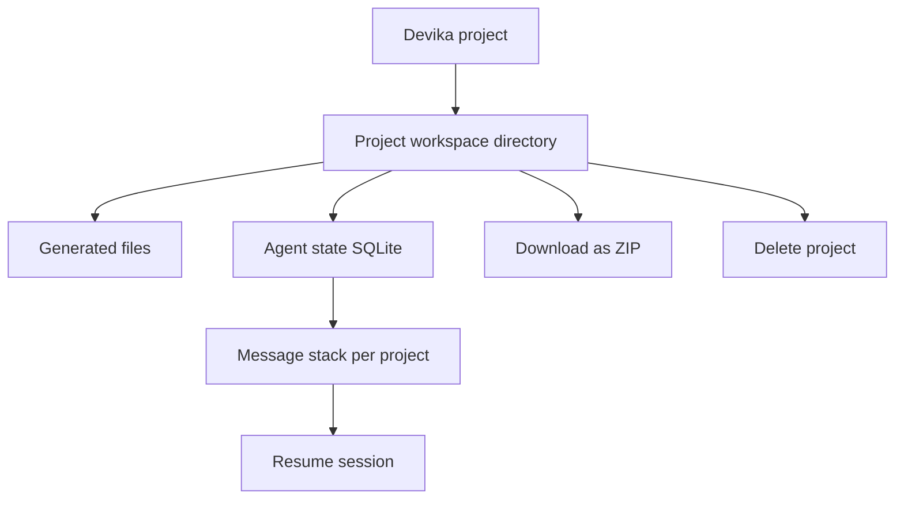

# Chapter 6: Project Management and Workspaces

Welcome to **Chapter 6: Project Management and Workspaces**. In this part of **Devika Tutorial: Open-Source Autonomous AI Software Engineer**, you will build an intuitive mental model first, then move into concrete implementation details and practical production tradeoffs.

This chapter explains how Devika organizes projects, manages the workspace file system, integrates with git, and enables teams to structure and review autonomous coding sessions.

## Learning Goals

- understand the Devika project model: how projects are created, named, and isolated in the workspace
- trace how generated files are written, updated, and organized within a project workspace
- configure and use Devika's git integration for committing and reviewing agent-generated code
- manage multiple concurrent projects and maintain workspace hygiene over time

## Fast Start Checklist

1. create a new project in the Devika UI and observe the workspace directory created on disk
2. submit a task and verify generated files appear under the correct project subdirectory
3. initialize git in the project workspace and review the first commit of agent-generated code
4. explore the project list API and SQLite database to understand project metadata storage

## Source References

- [Devika Project Management Source](https://github.com/stitionai/devika/tree/main/src/project)
- [Devika README](https://github.com/stitionai/devika/blob/main/README.md)
- [Devika Architecture Docs](https://github.com/stitionai/devika/blob/main/docs/architecture.md)
- [Devika Repository](https://github.com/stitionai/devika)

## Summary

You now know how to create and manage Devika projects, navigate the workspace file structure, and use git to review, version, and share agent-generated code safely.

Next: [Chapter 7: Debugging and Troubleshooting](07-debugging-and-troubleshooting.md)

## How These Components Connect

