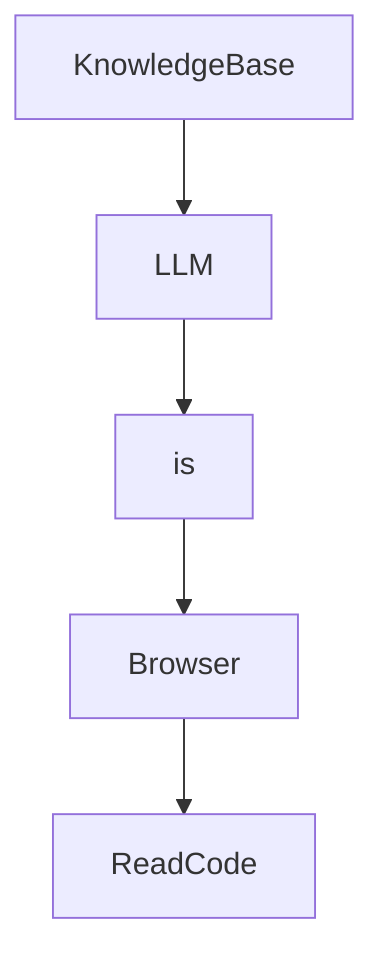

# Chapter 7: Debugging and Troubleshooting

Welcome to **Chapter 7: Debugging and Troubleshooting**. In this part of **Devika Tutorial: Open-Source Autonomous AI Software Engineer**, you will build an intuitive mental model first, then move into concrete implementation details and practical production tradeoffs.

This chapter covers how to diagnose and resolve failures in Devika's agent pipeline, from startup errors to mid-task agent loops, using logs, the self-reflection mechanism, and targeted countermeasures.

## Learning Goals

- identify the log sources and log levels that expose agent pipeline state during task execution
- diagnose the most common failure patterns across planner, researcher, coder, and action agents
- understand how the internal monologue self-reflection loop can be leveraged as a debugging signal
- apply systematic countermeasures for each failure category without restarting the entire pipeline

## Fast Start Checklist

1. enable DEBUG log level in config.toml and observe the agent interaction log during a task run
2. submit a task that deliberately requires web research and trace the full researcher log output
3. identify the log line that indicates a coder agent invocation and the line that confirms file write
4. simulate a deliberate error (bad API key) and trace it from the request to the error log entry

## Source References

- [Devika Logs and Debugging](https://github.com/stitionai/devika#debugging)
- [Devika Agent Source](https://github.com/stitionai/devika/tree/main/src/agents)
- [Devika README](https://github.com/stitionai/devika/blob/main/README.md)
- [Devika Repository](https://github.com/stitionai/devika)

## Summary

You now have a systematic debugging playbook for Devika that covers log interpretation, agent failure diagnosis, and targeted countermeasures for every major failure category in the pipeline.

Next: [Chapter 8: Production Operations and Governance](08-production-operations-and-governance.md)

## Depth Expansion Playbook

## Source Code Walkthrough

### `src/memory/knowledge_base.py`

The `KnowledgeBase` class in [`src/memory/knowledge_base.py`](https://github.com/stitionai/devika/blob/HEAD/src/memory/knowledge_base.py) handles a key part of this chapter's functionality:

```py
    contents: str

class KnowledgeBase:
    def __init__(self):
        config = Config()
        sqlite_path = config.get_sqlite_db()
        self.engine = create_engine(f"sqlite:///{sqlite_path}")
        SQLModel.metadata.create_all(self.engine)

    def add_knowledge(self, tag: str, contents: str):
        knowledge = Knowledge(tag=tag, contents=contents)
        with Session(self.engine) as session:
            session.add(knowledge)
            session.commit()

    def get_knowledge(self, tag: str) -> str:
        with Session(self.engine) as session:
            knowledge = session.query(Knowledge).filter(Knowledge.tag == tag).first()
            if knowledge:
                return knowledge.contents
            return None
```

This class is important because it defines how Devika Tutorial: Open-Source Autonomous AI Software Engineer implements the patterns covered in this chapter.

### `src/llm/llm.py`

The `LLM` class in [`src/llm/llm.py`](https://github.com/stitionai/devika/blob/HEAD/src/llm/llm.py) handles a key part of this chapter's functionality:

```py


class LLM:
    def __init__(self, model_id: str = None):
        self.model_id = model_id
        self.log_prompts = config.get_logging_prompts()
        self.timeout_inference = config.get_timeout_inference()
        self.models = {
            "CLAUDE": [
                ("Claude 3 Opus", "claude-3-opus-20240229"),
                ("Claude 3 Sonnet", "claude-3-sonnet-20240229"),
                ("Claude 3 Haiku", "claude-3-haiku-20240307"),
            ],
            "OPENAI": [
                ("GPT-4o-mini", "gpt-4o-mini"),
                ("GPT-4o", "gpt-4o"),
                ("GPT-4 Turbo", "gpt-4-turbo"),
                ("GPT-3.5 Turbo", "gpt-3.5-turbo-0125"),
            ],
            "GOOGLE": [
                ("Gemini 1.0 Pro", "gemini-pro"),
                ("Gemini 1.5 Flash", "gemini-1.5-flash"),
                ("Gemini 1.5 Pro", "gemini-1.5-pro"),
            ],
            "MISTRAL": [
                ("Mistral 7b", "open-mistral-7b"),
                ("Mistral 8x7b", "open-mixtral-8x7b"),
                ("Mistral Medium", "mistral-medium-latest"),
                ("Mistral Small", "mistral-small-latest"),
                ("Mistral Large", "mistral-large-latest"),
            ],
            "GROQ": [
```

This class is important because it defines how Devika Tutorial: Open-Source Autonomous AI Software Engineer implements the patterns covered in this chapter.

### `src/llm/llm.py`

The `is` interface in [`src/llm/llm.py`](https://github.com/stitionai/devika/blob/HEAD/src/llm/llm.py) handles a key part of this chapter's functionality:

```py

import tiktoken
from typing import List, Tuple

from src.socket_instance import emit_agent
from .ollama_client import Ollama
from .claude_client import Claude
from .openai_client import OpenAi
from .gemini_client import Gemini
from .mistral_client import MistralAi
from .groq_client import Groq
from .lm_studio_client import LMStudio

from src.state import AgentState

from src.config import Config
from src.logger import Logger

TIKTOKEN_ENC = tiktoken.get_encoding("cl100k_base")

ollama = Ollama()
logger = Logger()
agentState = AgentState()
config = Config()


class LLM:
    def __init__(self, model_id: str = None):
        self.model_id = model_id
        self.log_prompts = config.get_logging_prompts()
        self.timeout_inference = config.get_timeout_inference()
        self.models = {
```

This interface is important because it defines how Devika Tutorial: Open-Source Autonomous AI Software Engineer implements the patterns covered in this chapter.

### `src/browser/browser.py`

The `Browser` class in [`src/browser/browser.py`](https://github.com/stitionai/devika/blob/HEAD/src/browser/browser.py) handles a key part of this chapter's functionality:

```py


class Browser:
    def __init__(self):
        self.playwright = None
        self.browser = None
        self.page = None
        self.agent = AgentState()

    async def start(self):
        self.playwright = await async_playwright().start()
        self.browser = await self.playwright.chromium.launch(headless=True)
        self.page = await self.browser.new_page()
        return self

    # def new_page(self):
    #     return self.browser.new_page()

    async def go_to(self, url):
        try:
            await self.page.goto(url, timeout=20000)

        except TimeoutError as e:
            print(f"TimeoutError: {e} when trying to navigate to {url}")
            return False
        return True

    async def screenshot(self, project_name):
        screenshots_save_path = Config().get_screenshots_dir()

        page_metadata = await self.page.evaluate("() => { return { url: document.location.href, title: document.title } }")
        page_url = page_metadata['url']
```

This class is important because it defines how Devika Tutorial: Open-Source Autonomous AI Software Engineer implements the patterns covered in this chapter.


## How These Components Connect


