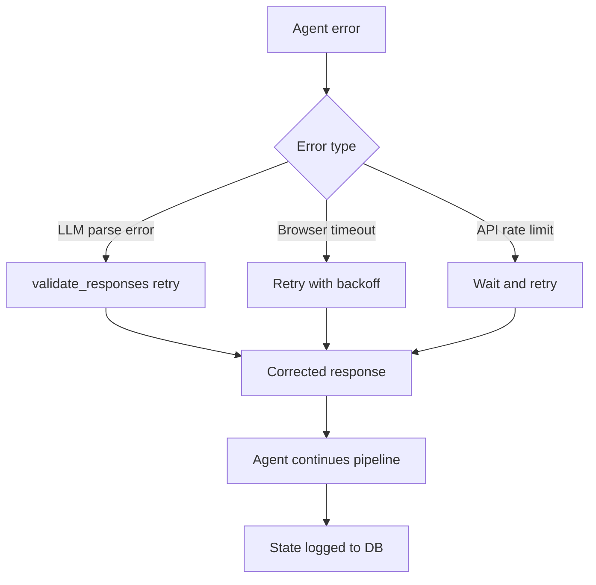

# Chapter 7: Debugging and Troubleshooting

Welcome to **Chapter 7: Debugging and Troubleshooting**. In this part of **Devika Tutorial: Open-Source Autonomous AI Software Engineer**, you will build an intuitive mental model first, then move into concrete implementation details and practical production tradeoffs.

This chapter covers how to diagnose and resolve failures in Devika's agent pipeline, from startup errors to mid-task agent loops, using logs, the self-reflection mechanism, and targeted countermeasures.

## Learning Goals

- identify the log sources and log levels that expose agent pipeline state during task execution
- diagnose the most common failure patterns across planner, researcher, coder, and action agents
- understand how the internal monologue self-reflection loop can be leveraged as a debugging signal
- apply systematic countermeasures for each failure category without restarting the entire pipeline

## Fast Start Checklist

1. enable DEBUG log level in config.toml and observe the agent interaction log during a task run
2. submit a task that deliberately requires web research and trace the full researcher log output
3. identify the log line that indicates a coder agent invocation and the line that confirms file write
4. simulate a deliberate error (bad API key) and trace it from the request to the error log entry

## Source References

- [Devika Logs and Debugging](https://github.com/stitionai/devika#debugging)
- [Devika Agent Source](https://github.com/stitionai/devika/tree/main/src/agents)
- [Devika README](https://github.com/stitionai/devika/blob/main/README.md)
- [Devika Repository](https://github.com/stitionai/devika)

## Summary

You now have a systematic debugging playbook for Devika that covers log interpretation, agent failure diagnosis, and targeted countermeasures for every major failure category in the pipeline.

Next: [Chapter 8: Production Operations and Governance](08-production-operations-and-governance.md)

## How These Components Connect

