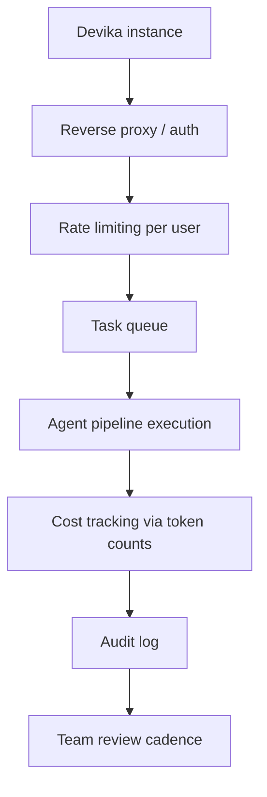

# Chapter 8: Production Operations and Governance

Welcome to **Chapter 8: Production Operations and Governance**. In this part of **Devika Tutorial: Open-Source Autonomous AI Software Engineer**, you will build an intuitive mental model first, then move into concrete implementation details and practical production tradeoffs.

This chapter covers team deployment strategies, security hardening, API cost governance, code review requirements for agent-generated code, and the operational runbooks needed to run Devika safely at scale.

## Learning Goals

- design a team deployment architecture for Devika that enforces access control and audit logging
- implement API cost governance controls that prevent runaway spend from autonomous agent tasks
- define code review and merge policies that are appropriate for agent-generated code
- build operational runbooks for incident response, key rotation, and capacity management

## Governance Checklist

- all LLM API keys are stored in a secrets manager, not in config.toml on disk
- agent-generated code requires human review before merging to protected branches
- API spend is tracked per project with per-day and per-task budget caps
- audit logs capture every task submission, agent invocation, and workspace file write

## Source References

- [Devika README](https://github.com/stitionai/devika/blob/main/README.md)
- [Devika Security Policy](https://github.com/stitionai/devika/blob/main/SECURITY.md)
- [Devika Architecture Docs](https://github.com/stitionai/devika/blob/main/docs/architecture.md)
- [Devika Repository](https://github.com/stitionai/devika)

## Summary

You now have a complete production governance framework for Devika covering security, cost controls, code review policies, and operational runbooks for safe team-scale autonomous coding.

Return to: [Tutorial Index](README.md)

## How These Components Connect

