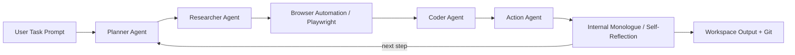

# Devika Tutorial: Open-Source Autonomous AI Software Engineer

> Learn how to deploy and operate `stitionai/devika` — a multi-agent autonomous coding system that plans, researches, writes, and debugs code end-to-end.

## Why This Track Matters

Devika represents one of the most complete open-source implementations of an autonomous software engineering agent, combining multi-agent coordination, live web research, browser automation, and polyglot code generation in a single self-hosted stack. As teams evaluate autonomous coding systems for internal use, understanding how Devika's agent pipeline is structured, how it coordinates specialized roles, and how to govern it safely becomes a critical engineering competency. This track takes you from first install to production-grade team deployment, covering every architectural layer in depth.

This track focuses on:

- deploying and configuring Devika with any major LLM provider including Claude 3, GPT-4, Gemini, Mistral, Groq, and Ollama
- understanding the multi-agent pipeline: planner, researcher, coder, action, and internal monologue agents
- operating browser automation and web research capabilities safely and effectively
- governing autonomous code generation at team scale with cost controls and audit discipline

## Current Snapshot (auto-updated)

- repository: [`stitionai/devika`](https://github.com/stitionai/devika)
- stars: about **19.5k**
- latest release: latest main branch
- recent activity: updates on **2025**
- project positioning: open-source autonomous AI software engineer, alternative to Devin by Cognition AI

## Mental Model

## Chapter Guide

| Chapter | Key Question | Outcome |
|:--------|:-------------|:--------|
| [01 - Getting Started](01-getting-started.md) | How do I install Devika and run a first task? | Working baseline |
| [02 - Architecture and Agent Pipeline](02-architecture-and-agent-pipeline.md) | How do Devika's specialized agents coordinate? | Architecture clarity |
| [03 - LLM Provider Configuration](03-llm-provider-configuration.md) | How do I connect Claude, GPT-4, Gemini, Ollama, and others? | Provider flexibility |
| [04 - Task Planning and Code Generation](04-task-planning-and-code-generation.md) | How does Devika decompose tasks and generate code? | Reliable code output |
| [05 - Web Research and Browser Integration](05-web-research-and-browser-integration.md) | How does Devika research the web with Playwright? | Research agent control |
| [06 - Project Management and Workspaces](06-project-management-and-workspaces.md) | How do I manage projects, files, and git integration? | Workspace discipline |
| [07 - Debugging and Troubleshooting](07-debugging-and-troubleshooting.md) | How do I diagnose failures in the agent pipeline? | Operational resilience |
| [08 - Production Operations and Governance](08-production-operations-and-governance.md) | How do teams deploy Devika safely at scale? | Governance runbook |

## What You Will Learn

- how to configure and run Devika across multiple LLM providers for different cost and capability tradeoffs
- how to reason about multi-agent coordination, context flow, and internal monologue loops
- how to operate browser automation and research pipelines responsibly
- how to govern autonomous code generation workflows in team environments with audit and rollback controls

## Source References

- [Devika Repository](https://github.com/stitionai/devika)
- [Devika README](https://github.com/stitionai/devika/blob/main/README.md)
- [Devika Architecture Docs](https://github.com/stitionai/devika/blob/main/docs/architecture.md)
- [Devika How It Works](https://github.com/stitionai/devika#how-it-works)
- [Devika Setup Guide](https://github.com/stitionai/devika#getting-started)

## Related Tutorials

- [OpenHands Tutorial](../openhands-tutorial/)
- [SWE-agent Tutorial](../swe-agent-tutorial/)
- [Cline Tutorial](../cline-tutorial/)
- [Aider Tutorial](../aider-tutorial/)
- [Open SWE Tutorial](../open-swe-tutorial/)

---

Start with [Chapter 1: Getting Started](01-getting-started.md).

## Navigation & Backlinks

- [Start Here: Chapter 1: Getting Started](01-getting-started.md)
- [Back to Main Catalog](../../README.md#-tutorial-catalog)
- [Browse A-Z Tutorial Directory](../../discoverability/tutorial-directory.md)
- [Search by Intent](../../discoverability/query-hub.md)
- [Explore Category Hubs](../../README.md#category-hubs)

## Full Chapter Map

1. [Chapter 1: Getting Started](01-getting-started.md)
2. [Chapter 2: Architecture and Agent Pipeline](02-architecture-and-agent-pipeline.md)
3. [Chapter 3: LLM Provider Configuration](03-llm-provider-configuration.md)
4. [Chapter 4: Task Planning and Code Generation](04-task-planning-and-code-generation.md)
5. [Chapter 5: Web Research and Browser Integration](05-web-research-and-browser-integration.md)
6. [Chapter 6: Project Management and Workspaces](06-project-management-and-workspaces.md)
7. [Chapter 7: Debugging and Troubleshooting](07-debugging-and-troubleshooting.md)
8. [Chapter 8: Production Operations and Governance](08-production-operations-and-governance.md)

*Generated by [AI Codebase Knowledge Builder](https://github.com/The-Pocket/Tutorial-Codebase-Knowledge)*
