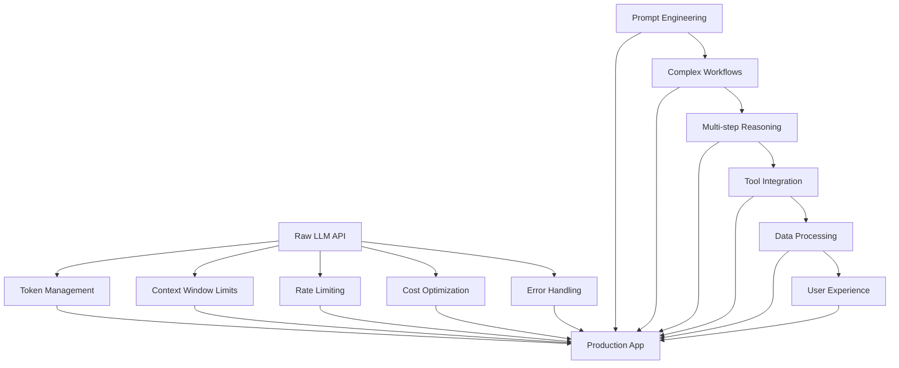
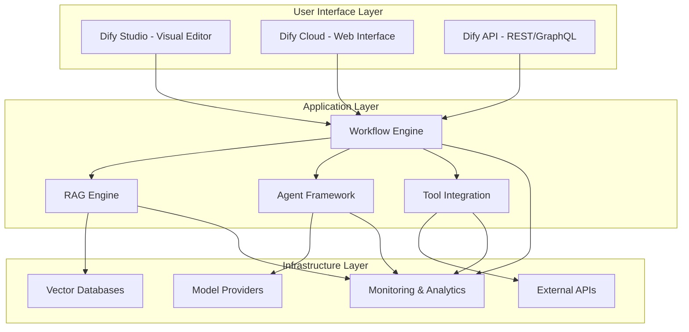

# Chapter 1: Dify System Overview

Welcome to **Chapter 1: Dify System Overview**. In this part of **Dify Platform: Deep Dive Tutorial**, you will build an intuitive mental model first, then move into concrete implementation details and practical production tradeoffs.


> Understanding Dify's place in the modern LLM application ecosystem

## 🎯 Learning Objectives

By the end of this chapter, you'll understand:
- Dify's role in the LLM application development landscape
- The key problems Dify solves for developers and organizations
- Core architectural principles and design philosophy
- How Dify compares to other LLM development platforms

## 📊 The LLM Application Challenge

Large Language Models (LLMs) have revolutionized AI development, but building production-ready applications presents significant challenges:

### **The Gap Between Raw LLMs and Production Apps**



### **Common Pain Points for LLM App Development**

1. **Context Management**: Fitting complex tasks into limited token windows
2. **Workflow Orchestration**: Coordinating multiple LLM calls and tools
3. **Data Integration**: Connecting LLMs to external data sources and APIs
4. **User Experience**: Building intuitive interfaces for AI-powered features
5. **Scalability**: Handling increased usage and optimizing costs
6. **Reliability**: Managing API failures, rate limits, and error conditions

## 🏗️ What is Dify?

Dify (pronounced "dee-fy") is an open-source development platform designed to bridge the gap between raw LLM capabilities and production-ready applications.

### **Core Mission**
> **Democratize LLM application development** by providing visual tools and abstractions that make complex AI workflows accessible to developers of all skill levels.

### **Key Design Principles**

| Principle | Description | Impact |
|:----------|:------------|:-------|
| **Visual Development** | Drag-and-drop interface for building LLM workflows | Reduces development time and learning curve |
| **Modular Architecture** | Reusable components and templates | Promotes code reuse and consistency |
| **Production Ready** | Built-in monitoring, scaling, and error handling | Reduces time to production deployment |
| **Open Source** | Transparent codebase and community-driven development | Ensures long-term viability and extensibility |
| **Multi-Provider Support** | Works with OpenAI, Anthropic, local models, etc. | Avoids vendor lock-in |

## 🏛️ Dify's Architecture Overview

Dify follows a layered architecture that separates concerns and enables both visual and programmatic development:



### **Core Components**

1. **Dify Studio**: Visual development environment for building LLM applications
2. **Workflow Engine**: Orchestrates complex multi-step LLM interactions
3. **RAG Engine**: Handles document processing and retrieval-augmented generation
4. **Agent Framework**: Enables autonomous agents with tool integration
5. **API Layer**: REST and GraphQL interfaces for programmatic access

## 🔍 Dify vs. Other LLM Platforms

### **Comparison Matrix**

| Platform | Visual Dev | Code Export | Multi-Provider | Enterprise Features | Open Source |
|:---------|:----------:|:-----------:|:--------------:|:-------------------:|:-----------:|
| **Dify** | ✅ | ✅ | ✅ | ✅ | ✅ |
| LangChain | ❌ | ✅ | ✅ | ❌ | ✅ |
| LangSmith | ❌ | ✅ | ✅ | ✅ | ❌ |
| Flowise | ✅ | ❌ | ✅ | ❌ | ✅ |
| CrewAI | ❌ | ✅ | ❌ | ❌ | ✅ |
| AutoGen | ❌ | ✅ | ✅ | ❌ | ✅ |

### **Dify's Unique Value Proposition**

#### **🎨 Visual + Code Development**
Unlike platforms that force you to choose between visual tools or code, Dify supports both:
- **Visual Mode**: Drag-and-drop workflow building for rapid prototyping
- **Code Mode**: Export workflows as Python code for customization and version control

#### **🏢 Enterprise-Ready from Day One**
Most LLM platforms are research-oriented. Dify includes production features out of the box:
- User management and authentication
- Usage analytics and cost tracking
- A/B testing and model comparison
- Production deployment and scaling

#### **🔧 Extensible Architecture**
Dify's modular design makes it easy to extend:
- Custom node types for specialized tasks
- Integration with proprietary tools and APIs
- Custom model providers and fine-tuned models
- Plugin system for community extensions

## 🚀 Getting Started with Dify

### **Quick Start Options**

#### **Option 1: Dify Cloud (Recommended for Beginners)**
```bash
# No installation required
# Visit https://dify.ai and create a free account
# Start building immediately in the web interface
```

#### **Option 2: Local Development**
```bash
# Clone the repository
git clone https://github.com/langgenius/dify.git
cd dify

# Start with Docker (easiest)
docker-compose up -d

# Or install dependencies manually
pip install -r requirements.txt
python -m dify
```

#### **Option 3: Development Environment**
```bash
# For contributors and advanced users
git clone https://github.com/langgenius/dify.git
cd dify

# Set up development environment
npm install
npm run dev
```

## 📈 Use Cases and Applications

### **Content Creation & Processing**
- **Blog Writing Assistant**: Generate and edit blog posts with style consistency
- **Document Summarization**: Automatically summarize long documents and reports
- **Content Translation**: Multi-language content creation and translation workflows

### **Business Intelligence & Analytics**
- **Data Analysis Agent**: Query databases and generate insights from data
- **Report Generation**: Create automated reports from multiple data sources
- **Market Research**: Gather and synthesize information from web sources

### **Customer Service & Support**
- **Intelligent Chatbots**: Handle customer inquiries with context awareness
- **Knowledge Base Q&A**: Answer questions from company documentation
- **Ticket Classification**: Automatically categorize and route support tickets

### **Development & Coding**
- **Code Review Assistant**: Analyze code changes and suggest improvements
- **Documentation Generator**: Create API docs and technical documentation
- **Bug Analysis**: Investigate and explain software bugs and issues

## 🎯 Learning Path Forward

This chapter provided the foundation for understanding Dify's role and capabilities. In the following chapters, we'll dive deeper into:

- **[Chapter 2: Core Architecture](02-core-architecture.md)** - How Dify's components work together
- **[Chapter 3: Workflow Engine](03-workflow-engine.md)** - Building complex LLM workflows visually
- **[Chapter 4: RAG Implementation](04-rag-implementation.md)** - Document processing and retrieval-augmented generation

## 💡 Key Takeaways

1. **Dify bridges the gap** between raw LLM APIs and production applications
2. **Visual development** makes complex workflows accessible to all developers
3. **Modular architecture** enables extensibility and customization
4. **Enterprise features** ensure production readiness from day one
5. **Open source foundation** guarantees long-term viability and community support

## 🧪 Hands-On Exercise

**Estimated Time: 15 minutes**

1. Visit [dify.ai](https://dify.ai) and create a free account
2. Explore the web interface and familiarization yourself with the visual editor
3. Try creating a simple workflow that generates text based on user input
4. Observe how the visual interface translates to actual LLM interactions

---

**Ready to dive deeper?** Continue to [Chapter 2: Core Architecture](02-core-architecture.md) to understand how Dify's components work together.

## What Problem Does This Solve?

Most teams struggle here because the hard part is not writing more code, but deciding clear boundaries for `dify`, `subgraph`, `Layer` so behavior stays predictable as complexity grows.

In practical terms, this chapter helps you avoid three common failures:

- coupling core logic too tightly to one implementation path
- missing the handoff boundaries between setup, execution, and validation
- shipping changes without clear rollback or observability strategy

After working through this chapter, you should be able to reason about `Chapter 1: Dify System Overview` as an operating subsystem inside **Dify Platform: Deep Dive Tutorial**, with explicit contracts for inputs, state transitions, and outputs.

Use the implementation notes around `Dify`, `https`, `install` as your checklist when adapting these patterns to your own repository.

## How it Works Under the Hood

Under the hood, `Chapter 1: Dify System Overview` usually follows a repeatable control path:

1. **Context bootstrap**: initialize runtime config and prerequisites for `dify`.
2. **Input normalization**: shape incoming data so `subgraph` receives stable contracts.
3. **Core execution**: run the main logic branch and propagate intermediate state through `Layer`.
4. **Policy and safety checks**: enforce limits, auth scopes, and failure boundaries.
5. **Output composition**: return canonical result payloads for downstream consumers.
6. **Operational telemetry**: emit logs/metrics needed for debugging and performance tuning.

When debugging, walk this sequence in order and confirm each stage has explicit success/failure conditions.

## Source Walkthrough

Use the following upstream sources to verify implementation details while reading this chapter:

- [Dify](https://github.com/langgenius/dify)
  Why it matters: authoritative reference on `Dify` (github.com).

Suggested trace strategy:
- search upstream code for `dify` and `subgraph` to map concrete implementation paths
- compare docs claims against actual runtime/config code before reusing patterns in production

## Chapter Connections

- [Tutorial Index](index.md)
- [Next Chapter: Chapter 2: Core Architecture](02-core-architecture.md)
- [Main Catalog](../../README.md#-tutorial-catalog)
- [A-Z Tutorial Directory](../../discoverability/tutorial-directory.md)
