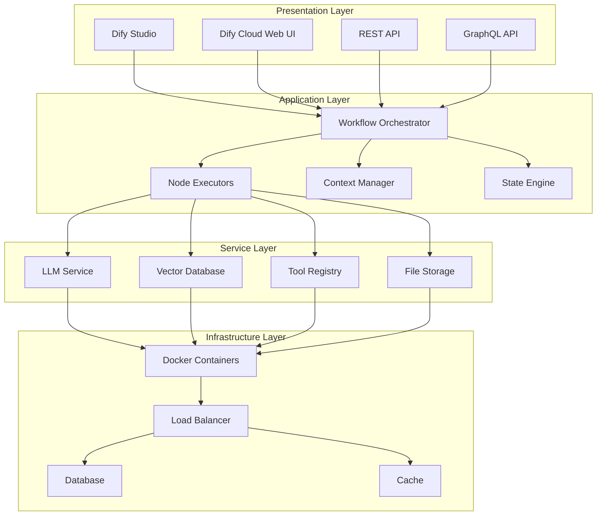
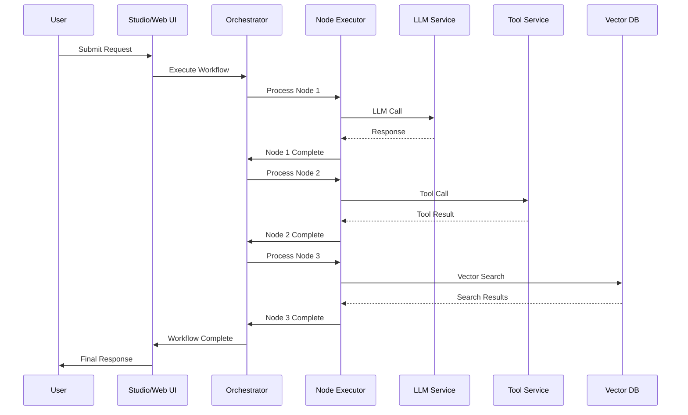
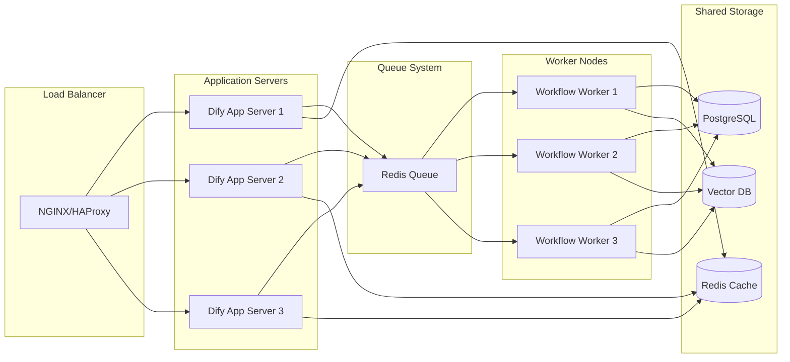

# Chapter 2: Core Architecture

Welcome to **Chapter 2: Core Architecture**. In this part of **Dify Platform: Deep Dive Tutorial**, you will build an intuitive mental model first, then move into concrete implementation details and practical production tradeoffs.


> Understanding how Dify's components work together to power LLM applications

## 🎯 Learning Objectives

By the end of this chapter, you'll understand:
- Dify's layered architecture and component relationships
- Data flow patterns for LLM applications
- How visual workflows translate to executable code
- Scalability and performance considerations

## 🏗️ Architectural Layers

Dify's architecture is organized into distinct layers, each handling specific responsibilities:



### **Layer Responsibilities**

| Layer | Purpose | Key Components |
|:------|:--------|:---------------|
| **Presentation** | User interfaces and API access | Studio, Web UI, REST/GraphQL APIs |
| **Application** | Business logic and workflow execution | Orchestrator, Executors, Context Manager |
| **Service** | External integrations and data access | LLM APIs, Vector DB, Tool Registry |
| **Infrastructure** | Hosting, scaling, and persistence | Docker, Load Balancing, Database |

## 🔄 Data Flow Architecture

Understanding how data moves through Dify is crucial for building effective workflows:

### **Workflow Execution Flow**



### **Context Management**

Dify's context system enables complex multi-turn conversations and stateful workflows:

```python
# Example: Context Flow in Dify
class ContextManager:
    def __init__(self):
        self.global_context = {}
        self.node_contexts = {}
        self.conversation_history = []

    def update_context(self, node_id, key, value):
        """Update context for a specific node"""
        if node_id not in self.node_contexts:
            self.node_contexts[node_id] = {}
        self.node_contexts[node_id][key] = value

    def get_context(self, node_id=None):
        """Retrieve context, optionally filtered by node"""
        if node_id:
            return self.node_contexts.get(node_id, {})
        return self.global_context

    def propagate_context(self, from_node, to_node):
        """Pass context between workflow nodes"""
        context = self.get_context(from_node)
        self.node_contexts[to_node] = context.copy()
```

## 🧩 Core Components Deep Dive

### **Workflow Orchestrator**

The heart of Dify's execution engine:

```python
# Simplified Workflow Orchestrator
class WorkflowOrchestrator:
    def __init__(self):
        self.nodes = []
        self.edges = []
        self.context_manager = ContextManager()

    def execute_workflow(self, workflow_id, input_data):
        """Execute a complete workflow"""
        workflow = self.load_workflow(workflow_id)

        for node in self.topological_sort(workflow.nodes):
            result = self.execute_node(node, input_data)
            self.context_manager.update_context(
                node.id, 'output', result
            )

        return self.context_manager.get_context()

    def execute_node(self, node, input_data):
        """Execute a single workflow node"""
        executor = NodeExecutorFactory.create(node.type)
        return executor.execute(node.config, input_data)
```

### **Node Executor System**

Dify supports various node types, each with specialized execution logic:

| Node Type | Purpose | Example Use Case |
|:----------|:--------|:-----------------|
| **LLM** | Direct LLM interactions | Text generation, analysis |
| **Tool** | External API/tool calls | Weather lookup, calculator |
| **Data** | Data processing operations | Text splitting, filtering |
| **Logic** | Control flow decisions | Conditional branching, loops |
| **Output** | Response formatting | JSON formatting, templating |

### **State Management**

Dify's state engine ensures reliable workflow execution:

```python
class StateEngine:
    def __init__(self):
        self.states = {
            'pending': 'Workflow queued for execution',
            'running': 'Workflow currently executing',
            'completed': 'Workflow finished successfully',
            'failed': 'Workflow execution failed',
            'paused': 'Workflow paused for manual intervention'
        }

    def transition_state(self, workflow_id, new_state, metadata=None):
        """Transition workflow to new state with metadata"""
        self.update_workflow_status(workflow_id, new_state)

        if metadata:
            self.log_state_change(workflow_id, new_state, metadata)

        if new_state == 'failed':
            self.trigger_error_handling(workflow_id)

    def handle_retry(self, workflow_id, retry_config):
        """Implement retry logic for failed nodes"""
        max_retries = retry_config.get('max_attempts', 3)
        backoff = retry_config.get('backoff_seconds', 1)

        for attempt in range(max_retries):
            try:
                return self.retry_node(workflow_id)
            except Exception as e:
                if attempt == max_retries - 1:
                    raise e
                time.sleep(backoff * (2 ** attempt))  # Exponential backoff
```

## 🔧 Visual to Code Translation

One of Dify's most powerful features is translating visual workflows to executable code:

### **Visual Workflow Example**

```
Input Node → LLM Node → Tool Node → Output Node
     ↓         ↓         ↓         ↓
   "Hello"   Generate   Search    Format
             Response   Weather  Response
```

### **Generated Python Code**

```python
# Generated from visual workflow
import dify
from dify.nodes import LLMNode, ToolNode, OutputNode

def weather_assistant_workflow(user_input):
    """Generated workflow function"""

    # Initialize workflow
    workflow = dify.Workflow()

    # Configure LLM node
    llm_node = LLMNode(
        model="gpt-4",
        prompt=f"Extract location from: {user_input}",
        temperature=0.7
    )

    # Configure tool node
    weather_tool = ToolNode(
        tool="weather_api",
        parameters={"location": llm_node.output}
    )

    # Configure output node
    output_node = OutputNode(
        template="The weather in {{location}} is {{temperature}}°C"
    )

    # Connect nodes
    workflow.connect(llm_node, weather_tool)
    workflow.connect(weather_tool, output_node)

    # Execute workflow
    result = workflow.execute(input_data={"user_input": user_input})
    return result
```

## 📊 Scalability Considerations

### **Horizontal Scaling Architecture**



### **Performance Optimization Strategies**

1. **Caching Layer**: Redis for frequently accessed data and LLM responses
2. **Async Processing**: Queue-based workflow execution for long-running tasks
3. **Connection Pooling**: Efficient management of LLM API connections
4. **Load Balancing**: Distribute requests across multiple application servers
5. **Database Optimization**: Indexing, query optimization, and read replicas

## 🔒 Security Architecture

Dify implements multiple security layers:

### **Authentication & Authorization**
- JWT-based authentication for API access
- Role-based access control (RBAC) for different user types
- API key management for external integrations

### **Data Protection**
- Encryption at rest for sensitive data
- TLS encryption for data in transit
- Secure credential storage and rotation

### **Runtime Security**
- Sandboxed code execution for custom nodes
- Rate limiting to prevent abuse
- Input validation and sanitization

## 📈 Monitoring & Observability

Dify provides comprehensive monitoring capabilities:

```python
# Example monitoring integration
class MonitoringService:
    def __init__(self):
        self.metrics = {}

    def record_workflow_execution(self, workflow_id, duration, success):
        """Record workflow execution metrics"""
        self.metrics[f'workflow_{workflow_id}_duration'] = duration
        self.metrics[f'workflow_{workflow_id}_success'] = 1 if success else 0

    def record_llm_usage(self, model, tokens_used, cost):
        """Track LLM API usage and costs"""
        self.metrics[f'llm_{model}_tokens'] += tokens_used
        self.metrics[f'llm_{model}_cost'] += cost

    def get_dashboard_data(self):
        """Generate monitoring dashboard data"""
        return {
            'total_workflows': len([k for k in self.metrics.keys() if k.startswith('workflow_')]),
            'success_rate': self.calculate_success_rate(),
            'cost_breakdown': self.get_cost_breakdown(),
            'performance_metrics': self.get_performance_metrics()
        }
```

## 🎯 Key Takeaways

1. **Layered Architecture**: Clear separation of concerns enables scalability and maintainability
2. **Workflow Orchestration**: Visual workflows translate to executable code automatically
3. **Context Management**: Sophisticated state management enables complex multi-turn interactions
4. **Scalability Design**: Built for horizontal scaling and high-throughput workloads
5. **Security First**: Multiple layers of security protect user data and prevent abuse

## 🧪 Hands-On Exercise

**Estimated Time: 30 minutes**

1. **Explore Dify's Architecture**: Use the web interface to examine how workflows are structured
2. **Create a Multi-Step Workflow**: Build a workflow that involves LLM generation, tool calling, and data processing
3. **Observe Execution Flow**: Use browser developer tools to observe API calls and data flow
4. **Export as Code**: Export your visual workflow as Python code and analyze the generated structure

## 🔗 Connection to Next Chapter

Understanding Dify's architecture prepares you for diving into the **Workflow Engine** in the next chapter, where we'll explore how to build complex multi-step LLM interactions visually.

---

**Ready to build workflows?** Continue to [Chapter 3: Workflow Engine](03-workflow-engine.md)

## What Problem Does This Solve?

Most teams struggle here because the hard part is not writing more code, but deciding clear boundaries for `self`, `workflow`, `Workflow` so behavior stays predictable as complexity grows.

In practical terms, this chapter helps you avoid three common failures:

- coupling core logic too tightly to one implementation path
- missing the handoff boundaries between setup, execution, and validation
- shipping changes without clear rollback or observability strategy

After working through this chapter, you should be able to reason about `Chapter 2: Core Architecture` as an operating subsystem inside **Dify Platform: Deep Dive Tutorial**, with explicit contracts for inputs, state transitions, and outputs.

Use the implementation notes around `Node`, `node`, `workflow_id` as your checklist when adapting these patterns to your own repository.

## How it Works Under the Hood

Under the hood, `Chapter 2: Core Architecture` usually follows a repeatable control path:

1. **Context bootstrap**: initialize runtime config and prerequisites for `self`.
2. **Input normalization**: shape incoming data so `workflow` receives stable contracts.
3. **Core execution**: run the main logic branch and propagate intermediate state through `Workflow`.
4. **Policy and safety checks**: enforce limits, auth scopes, and failure boundaries.
5. **Output composition**: return canonical result payloads for downstream consumers.
6. **Operational telemetry**: emit logs/metrics needed for debugging and performance tuning.

When debugging, walk this sequence in order and confirm each stage has explicit success/failure conditions.

## Source Walkthrough

Use the following upstream sources to verify implementation details while reading this chapter:

- [Dify](https://github.com/langgenius/dify)
  Why it matters: authoritative reference on `Dify` (github.com).

Suggested trace strategy:
- search upstream code for `self` and `workflow` to map concrete implementation paths
- compare docs claims against actual runtime/config code before reusing patterns in production

## Chapter Connections

- [Tutorial Index](index.md)
- [Previous Chapter: Chapter 1: Dify System Overview](01-system-overview.md)
- [Next Chapter: Chapter 3: Workflow Engine](03-workflow-engine.md)
- [Main Catalog](../../README.md#-tutorial-catalog)
- [A-Z Tutorial Directory](../../discoverability/tutorial-directory.md)
