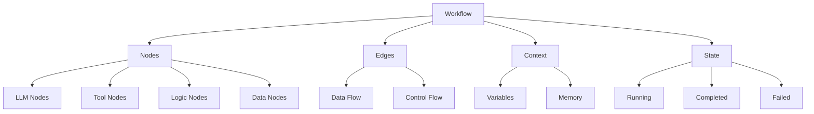
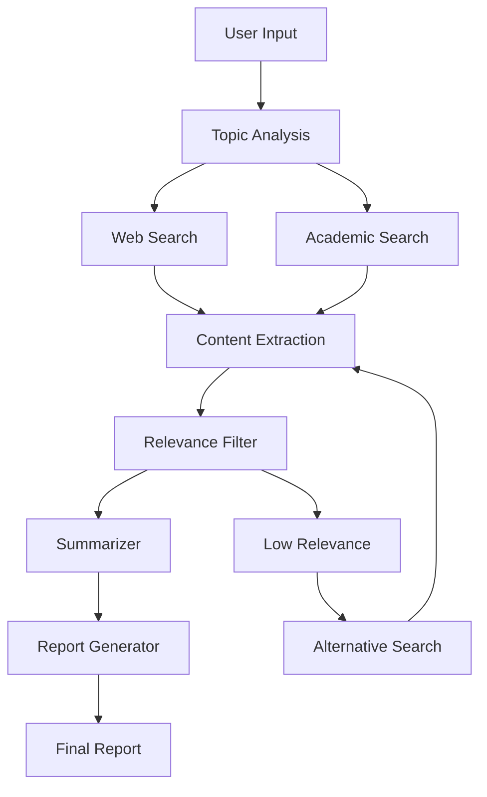
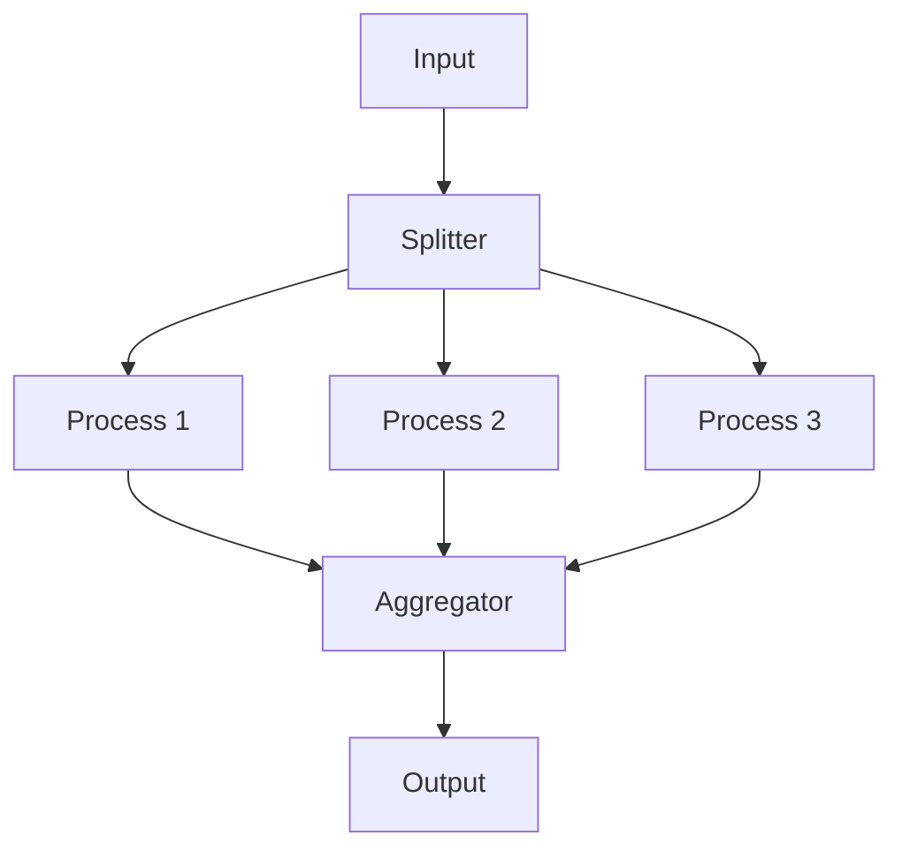

# Chapter 3: Workflow Engine

Welcome to **Chapter 3: Workflow Engine**. In this part of **Dify Platform: Deep Dive Tutorial**, you will build an intuitive mental model first, then move into concrete implementation details and practical production tradeoffs.


> Building complex LLM workflows with Dify's visual node system

## 🎯 Learning Objectives

By the end of this chapter, you'll be able to:
- Design and build complex multi-step LLM workflows
- Use different node types effectively in workflows
- Implement conditional logic and loops in workflows
- Optimize workflow performance and error handling
- Debug and monitor workflow execution

## 🏗️ Understanding the Workflow Engine

Dify's workflow engine is the core component that orchestrates LLM interactions, tool integrations, and data processing into coherent applications.

### **Workflow vs. Traditional Code**

| Aspect | Traditional Code | Dify Workflow |
|:-------|:-----------------|:--------------|
| **Structure** | Sequential functions | Visual node graph |
| **Execution** | Linear code flow | Parallel/async execution |
| **Debugging** | Print statements, breakpoints | Visual flow inspection |
| **Modification** | Code changes, redeploy | Drag-and-drop editing |
| **Collaboration** | Code reviews, merge conflicts | Real-time collaborative editing |

### **Core Workflow Concepts**



## 🧩 Node Types Deep Dive

### **LLM Nodes**

LLM nodes handle direct interactions with language models:

```python
# Example LLM Node Configuration
llm_node_config = {
    "model": "gpt-4",
    "prompt_template": """
    You are a helpful assistant. Answer the following question:
    Context: {context}
    Question: {question}
    Answer:
    """,
    "parameters": {
        "temperature": 0.7,
        "max_tokens": 1000,
        "top_p": 0.9
    },
    "inputs": ["context", "question"],
    "outputs": ["response", "usage_stats"]
}
```

**Best Practices for LLM Nodes:**
- Use clear, specific prompt templates
- Include relevant context and examples
- Set appropriate temperature for your use case
- Monitor token usage and costs

### **Tool Nodes**

Tool nodes enable external API calls and integrations:

```python
# Example Tool Node for Weather API
weather_tool_config = {
    "tool_name": "weather_api",
    "description": "Get current weather for a location",
    "parameters": {
        "location": {
            "type": "string",
            "description": "City name or coordinates"
        },
        "units": {
            "type": "enum",
            "values": ["metric", "imperial"],
            "default": "metric"
        }
    },
    "authentication": {
        "api_key": "{{WEATHER_API_KEY}}"
    },
    "error_handling": {
        "retry_count": 3,
        "timeout_seconds": 30
    }
}
```

### **Logic Nodes**

Logic nodes provide control flow and decision making:

#### **Conditional Branching**

```python
# If/Else Logic Node
conditional_config = {
    "condition": "{{user_input_length}} > 100",
    "true_branch": "summarize_text",
    "false_branch": "process_short_input",
    "evaluation_mode": "python_expression"
}
```

#### **Loop Processing**

```python
# Loop Logic Node
loop_config = {
    "iterator": "{{document_chunks}}",
    "loop_variable": "chunk",
    "max_iterations": 10,
    "exit_condition": "{{no_more_chunks}}",
    "aggregation_mode": "concatenate"
}
```

### **Data Processing Nodes**

Data nodes handle text processing, formatting, and transformation:

```python
# Text Splitter Node
text_splitter_config = {
    "input_text": "{{document_content}}",
    "split_method": "sentence",
    "chunk_size": 512,
    "overlap": 50,
    "output_format": "array"
}

# Template Formatter Node
template_config = {
    "template": """
    # Analysis Report

    **Input:** {{original_text}}
    **Summary:** {{summary}}
    **Key Points:** {{key_points}}
    **Recommendations:** {{recommendations}}

    Generated on: {{timestamp}}
    """,
    "output_format": "markdown"
}
```

## 🔄 Building Complex Workflows

### **Example: Research Assistant Workflow**

Let's build a comprehensive research assistant that can:
1. Take a research topic from the user
2. Search for relevant information
3. Summarize findings
4. Generate a structured report



#### **Implementation Steps**

1. **Input Processing Node**
   - Extract topic and research scope
   - Validate input format

2. **Parallel Search Nodes**
   - Web search for recent information
   - Academic database search for scholarly articles

3. **Content Processing Pipeline**
   - Extract relevant text from search results
   - Filter by relevance and quality
   - Remove duplicates and redundant information

4. **Summarization Node**
   - Generate concise summaries
   - Extract key findings and insights

5. **Report Generation**
   - Structure information into readable format
   - Add citations and references
   - Include executive summary

### **Workflow Configuration**

```python
research_assistant_workflow = {
    "name": "Research Assistant",
    "description": "Comprehensive research and report generation",
    "nodes": [
        {
            "id": "input_processor",
            "type": "llm",
            "config": {
                "model": "gpt-4",
                "prompt": "Extract research topic and scope from: {{user_input}}",
                "outputs": ["topic", "scope", "keywords"]
            }
        },
        {
            "id": "web_search",
            "type": "tool",
            "config": {
                "tool": "google_search",
                "query": "{{keywords}}",
                "max_results": 10
            }
        },
        {
            "id": "academic_search",
            "type": "tool",
            "config": {
                "tool": "semantic_scholar",
                "query": "{{topic}}",
                "year_range": "2020-2024"
            }
        },
        {
            "id": "content_filter",
            "type": "logic",
            "config": {
                "condition": "len({{search_results}}) > 3",
                "true_action": "proceed",
                "false_action": "expand_search"
            }
        },
        {
            "id": "summarizer",
            "type": "llm",
            "config": {
                "model": "gpt-4",
                "prompt": "Summarize key findings from: {{filtered_content}}",
                "max_tokens": 800
            }
        },
        {
            "id": "report_generator",
            "type": "template",
            "config": {
                "template_file": "research_report.md",
                "variables": {
                    "topic": "{{topic}}",
                    "summary": "{{summary}}",
                    "findings": "{{findings}}",
                    "sources": "{{sources}}"
                }
            }
        }
    ],
    "edges": [
        {"from": "input_processor", "to": "web_search", "data": ["topic", "keywords"]},
        {"from": "input_processor", "to": "academic_search", "data": ["topic"]},
        {"from": "web_search", "to": "content_filter"},
        {"from": "academic_search", "to": "content_filter"},
        {"from": "content_filter", "to": "summarizer", "condition": "proceed"},
        {"from": "summarizer", "to": "report_generator"},
        {"from": "content_filter", "to": "web_search", "condition": "expand_search"}
    ],
    "error_handling": {
        "max_retries": 3,
        "fallback_actions": {
            "search_failure": "use_cached_data",
            "llm_failure": "use_simpler_model"
        }
    }
}
```

## 🔧 Advanced Workflow Patterns

### **Error Handling and Recovery**

```python
# Advanced Error Handling Configuration
error_handling_config = {
    "node_errors": {
        "llm_timeout": {
            "retry_strategy": "exponential_backoff",
            "max_retries": 3,
            "fallback_model": "gpt-3.5-turbo"
        },
        "tool_failure": {
            "retry_strategy": "fixed_interval",
            "interval_seconds": 5,
            "max_retries": 2,
            "fallback_action": "skip_node"
        }
    },
    "workflow_errors": {
        "partial_failure": "continue_with_available_data",
        "total_failure": "generate_error_report"
    },
    "monitoring": {
        "error_threshold": 0.1,  # Alert if >10% nodes fail
        "auto_recovery": True
    }
}
```

### **Performance Optimization**

1. **Parallel Execution**
   - Run independent nodes simultaneously
   - Use async/await for I/O operations

2. **Caching Strategy**
   - Cache LLM responses for similar inputs
   - Store intermediate results

3. **Resource Management**
   - Limit concurrent executions
   - Implement rate limiting for external APIs

### **Dynamic Workflows**

```python
# Dynamic Node Creation Based on Input
def create_dynamic_workflow(user_requirements):
    """Create workflow nodes based on user requirements"""

    nodes = []
    edges = []

    # Always start with input processing
    nodes.append({
        "id": "input_processor",
        "type": "llm",
        "config": {"model": "gpt-4", "task": "analyze_requirements"}
    })

    # Add nodes based on requirements
    if "research" in user_requirements:
        nodes.append({
            "id": "web_search",
            "type": "tool",
            "config": {"tool": "search_api"}
        })
        edges.append({"from": "input_processor", "to": "web_search"})

    if "analysis" in user_requirements:
        nodes.append({
            "id": "data_analyzer",
            "type": "llm",
            "config": {"model": "gpt-4", "task": "analyze_data"}
        })

    if "reporting" in user_requirements:
        nodes.append({
            "id": "report_generator",
            "type": "template",
            "config": {"template": "analysis_report.md"}
        })

    return {"nodes": nodes, "edges": edges}
```

## 📊 Workflow Monitoring and Debugging

### **Built-in Monitoring Features**

Dify provides comprehensive workflow observability:

```python
# Workflow Monitoring API
class WorkflowMonitor:
    def __init__(self):
        self.metrics = {}

    def track_execution(self, workflow_id, node_id, start_time, end_time, status):
        """Track individual node execution"""
        duration = end_time - start_time

        self.metrics[f'{workflow_id}_{node_id}'] = {
            'duration': duration,
            'status': status,
            'timestamp': end_time
        }

        if status == 'failed':
            self.alert_failure(workflow_id, node_id)

    def get_workflow_stats(self, workflow_id):
        """Generate workflow performance statistics"""
        return {
            'total_executions': self.count_executions(workflow_id),
            'success_rate': self.calculate_success_rate(workflow_id),
            'average_duration': self.calculate_avg_duration(workflow_id),
            'bottleneck_nodes': self.identify_bottlenecks(workflow_id)
        }

    def visualize_workflow(self, workflow_id):
        """Generate visual representation of workflow execution"""
        # Create execution graph with timing data
        pass
```

### **Debugging Strategies**

1. **Step-by-Step Execution**
   - Run workflow one node at a time
   - Inspect intermediate results
   - Identify where failures occur

2. **Logging and Tracing**
   - Enable detailed logging for all nodes
   - Track data flow between nodes
   - Monitor external API calls

3. **Performance Profiling**
   - Identify slow nodes
   - Monitor resource usage
   - Optimize bottleneck operations

## 🎯 Best Practices for Workflow Design

### **Design Principles**

1. **Modularity**: Break complex workflows into smaller, reusable components
2. **Error Resilience**: Implement proper error handling and fallback strategies
3. **Scalability**: Design workflows that can handle increased load
4. **Maintainability**: Use clear naming and documentation
5. **Testability**: Design workflows that can be easily tested

### **Common Patterns**

#### **Fan-Out/Fan-In Pattern**


#### **Circuit Breaker Pattern**
```python
class CircuitBreakerNode:
    def __init__(self, failure_threshold=5, recovery_timeout=60):
        self.failure_count = 0
        self.last_failure_time = None
        self.state = 'closed'  # closed, open, half-open

    def execute(self, node_func):
        if self.state == 'open':
            if self.should_attempt_reset():
                self.state = 'half-open'
            else:
                raise CircuitBreakerError("Circuit is open")

        try:
            result = node_func()
            self.on_success()
            return result
        except Exception as e:
            self.on_failure()
            raise e

    def on_failure(self):
        self.failure_count += 1
        self.last_failure_time = time.time()

        if self.failure_count >= self.failure_threshold:
            self.state = 'open'

    def on_success(self):
        if self.state == 'half-open':
            self.state = 'closed'
            self.failure_count = 0
```

## 🧪 Hands-On Exercise

**Estimated Time: 45 minutes**

1. **Build a Customer Support Workflow**:
   - Input: Customer inquiry text
   - Process: Classify inquiry type, search knowledge base, generate response
   - Output: Categorized response with relevant information

2. **Implement Error Handling**:
   - Add retry logic for failed API calls
   - Implement fallback responses for system failures
   - Add monitoring and alerting

3. **Optimize Performance**:
   - Identify and resolve bottlenecks
   - Implement caching for repeated queries
   - Add parallel processing where appropriate

## 🎯 Key Takeaways

1. **Visual Workflow Design**: Drag-and-drop interface makes complex LLM applications accessible
2. **Node-Based Architecture**: Modular components enable flexible workflow construction
3. **Advanced Control Flow**: Conditional logic, loops, and error handling for robust applications
4. **Performance Optimization**: Caching, parallel execution, and monitoring for production readiness
5. **Debugging Tools**: Built-in monitoring and tracing for workflow troubleshooting

## 🔗 Connection to Next Chapter

With a solid understanding of the workflow engine, we're ready to explore **RAG Implementation** in the next chapter, where we'll learn how to integrate document processing and retrieval-augmented generation into our workflows.

---

**Ready to add intelligence?** Continue to [Chapter 4: RAG Implementation](04-rag-implementation.md)

## What Problem Does This Solve?

Most teams struggle here because the hard part is not writing more code, but deciding clear boundaries for `self`, `nodes`, `config` so behavior stays predictable as complexity grows.

In practical terms, this chapter helps you avoid three common failures:

- coupling core logic too tightly to one implementation path
- missing the handoff boundaries between setup, execution, and validation
- shipping changes without clear rollback or observability strategy

After working through this chapter, you should be able to reason about `Chapter 3: Workflow Engine` as an operating subsystem inside **Dify Platform: Deep Dive Tutorial**, with explicit contracts for inputs, state transitions, and outputs.

Use the implementation notes around `workflow_id`, `Node`, `topic` as your checklist when adapting these patterns to your own repository.

## How it Works Under the Hood

Under the hood, `Chapter 3: Workflow Engine` usually follows a repeatable control path:

1. **Context bootstrap**: initialize runtime config and prerequisites for `self`.
2. **Input normalization**: shape incoming data so `nodes` receives stable contracts.
3. **Core execution**: run the main logic branch and propagate intermediate state through `config`.
4. **Policy and safety checks**: enforce limits, auth scopes, and failure boundaries.
5. **Output composition**: return canonical result payloads for downstream consumers.
6. **Operational telemetry**: emit logs/metrics needed for debugging and performance tuning.

When debugging, walk this sequence in order and confirm each stage has explicit success/failure conditions.

## Source Walkthrough

Use the following upstream sources to verify implementation details while reading this chapter:

- [Dify](https://github.com/langgenius/dify)
  Why it matters: authoritative reference on `Dify` (github.com).

Suggested trace strategy:
- search upstream code for `self` and `nodes` to map concrete implementation paths
- compare docs claims against actual runtime/config code before reusing patterns in production

## Chapter Connections

- [Tutorial Index](index.md)
- [Previous Chapter: Chapter 2: Core Architecture](02-core-architecture.md)
- [Next Chapter: Chapter 4: RAG Implementation](04-rag-implementation.md)
- [Main Catalog](../../README.md#-tutorial-catalog)
- [A-Z Tutorial Directory](../../discoverability/tutorial-directory.md)
