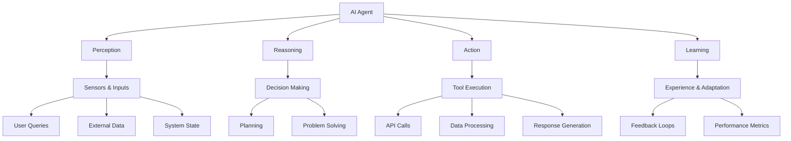
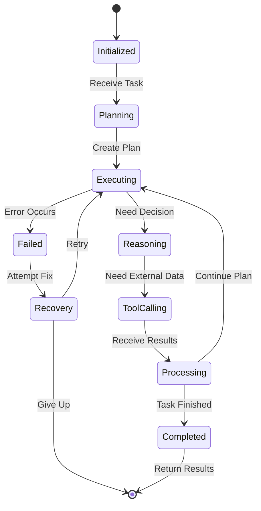

# Chapter 5: Agent Framework

> Building autonomous AI agents with tool integration and reasoning capabilities in Dify

## 🎯 Learning Objectives

By the end of this chapter, you'll be able to:
- Understand the principles of autonomous AI agents
- Design agent architectures with specialized roles and capabilities
- Implement tool integration for external API access
- Build reasoning loops and decision-making systems
- Create multi-agent systems that collaborate on complex tasks

## 🤖 What is an AI Agent?

AI agents are autonomous systems that can perceive their environment, make decisions, and take actions to achieve goals.

### **Agent Characteristics**



### **Agent vs. Chatbot**

| Aspect | Chatbot | AI Agent |
|:-------|:--------|:---------|
| **Interaction** | Conversational responses | Goal-directed actions |
| **Autonomy** | Reactive to user input | Proactive task execution |
| **Tools** | Limited to conversation | External API integration |
| **Memory** | Session-based | Persistent state and learning |
| **Decision Making** | Rule-based responses | Complex reasoning and planning |

## 🏗️ Agent Architecture in Dify

### **Core Agent Components**

Dify's agent framework consists of several key components:

```python
# Agent Architecture Configuration
agent_architecture = {
    "core_components": {
        "reasoning_engine": {
            "type": "llm",
            "model": "gpt-4",
            "role": "decision_making"
        },
        "tool_registry": {
            "max_tools": 20,
            "categories": ["search", "calculation", "api", "data"]
        },
        "memory_system": {
            "type": "vector_db",
            "capacity": "unlimited",
            "retention_policy": "time_based"
        },
        "execution_engine": {
            "parallel_execution": True,
            "error_handling": "retry_with_backoff"
        }
    },
    "communication": {
        "protocol": "structured_json",
        "response_format": "action_result"
    }
}
```

### **Agent Lifecycle**



## 🛠️ Tool Integration

### **Tool Definition and Registration**

```python
# Tool Definition Schema
tool_schema = {
    "name": "weather_api",
    "description": "Get current weather information for a location",
    "category": "api",
    "parameters": {
        "type": "object",
        "properties": {
            "location": {
                "type": "string",
                "description": "City name or coordinates (lat,lng)"
            },
            "units": {
                "type": "string",
                "enum": ["metric", "imperial"],
                "default": "metric",
                "description": "Temperature units"
            }
        },
        "required": ["location"]
    },
    "authentication": {
        "type": "api_key",
        "header_name": "X-API-Key",
        "key_source": "environment_variable"
    },
    "rate_limiting": {
        "requests_per_minute": 60,
        "burst_limit": 10
    },
    "error_handling": {
        "retry_count": 3,
        "retry_delay_seconds": 1,
        "exponential_backoff": True
    }
}
```

### **Tool Execution Engine**

```python
class ToolExecutor:
    def __init__(self, tool_registry):
        self.registry = tool_registry
        self.execution_stats = {}

    async def execute_tool(self, tool_name, parameters):
        """Execute a tool with given parameters"""

        # Validate tool exists
        if tool_name not in self.registry:
            raise ToolNotFoundError(f"Tool {tool_name} not registered")

        tool_config = self.registry[tool_name]

        # Validate parameters
        self.validate_parameters(parameters, tool_config['parameters'])

        # Check rate limits
        await self.check_rate_limits(tool_name)

        # Execute tool
        start_time = time.time()
        try:
            result = await self.call_tool_api(tool_config, parameters)
            execution_time = time.time() - start_time

            # Record success
            self.record_execution(tool_name, True, execution_time)

            return result

        except Exception as e:
            execution_time = time.time() - start_time
            self.record_execution(tool_name, False, execution_time)
            raise ToolExecutionError(f"Tool execution failed: {str(e)}")

    def validate_parameters(self, params, schema):
        """Validate tool parameters against schema"""
        # JSON Schema validation logic
        pass

    async def check_rate_limits(self, tool_name):
        """Implement rate limiting logic"""
        pass

    async def call_tool_api(self, tool_config, params):
        """Make actual API call to tool"""
        # Tool-specific API calling logic
        pass
```

## 🧠 Reasoning and Decision Making

### **Reasoning Loop Architecture**

```python
class ReasoningEngine:
    def __init__(self, llm_client, tool_executor):
        self.llm = llm_client
        self.tools = tool_executor
        self.max_steps = 10
        self.reasoning_history = []

    async def reason_and_act(self, task, context):
        """Main reasoning loop"""

        current_state = {
            'task': task,
            'context': context,
            'steps_taken': 0,
            'tools_used': [],
            'results': []
        }

        while current_state['steps_taken'] < self.max_steps:
            # Generate next action
            action = await self.generate_next_action(current_state)

            if action['type'] == 'final_answer':
                return action['answer']

            elif action['type'] == 'tool_call':
                # Execute tool
                result = await self.tools.execute_tool(
                    action['tool_name'],
                    action['parameters']
                )

                # Update state with result
                current_state['results'].append(result)
                current_state['tools_used'].append(action['tool_name'])
                current_state['steps_taken'] += 1

                # Add to reasoning history
                self.reasoning_history.append({
                    'step': current_state['steps_taken'],
                    'action': action,
                    'result': result
                })

            else:
                raise ReasoningError(f"Unknown action type: {action['type']}")

        # Max steps reached
        return self.generate_fallback_answer(current_state)

    async def generate_next_action(self, state):
        """Use LLM to decide next action"""

        prompt = self.build_reasoning_prompt(state)

        response = await self.llm.generate(
            prompt,
            temperature=0.1,  # Low temperature for consistent reasoning
            max_tokens=500
        )

        return self.parse_action_response(response)
```

### **Prompt Engineering for Reasoning**

```python
def build_reasoning_prompt(self, state):
    """Build comprehensive reasoning prompt"""

    tool_descriptions = self.get_tool_descriptions()

    prompt = f"""
You are an AI assistant that can use tools to help solve tasks.

Available tools:
{tool_descriptions}

Task: {state['task']}

Current context:
{state['context']}

Previous results:
{json.dumps(state['results'], indent=2)}

Steps taken so far: {state['steps_taken']}

Instructions:
1. Analyze the current situation
2. Determine what information you need
3. Choose the appropriate tool to gather that information
4. If you have enough information to answer, provide the final answer

Respond with a JSON object containing:
- "thought": Your reasoning process
- "action": Either "tool_call" or "final_answer"
- "tool_name": Name of tool to call (if action is "tool_call")
- "parameters": Tool parameters (if action is "tool_call")
- "answer": Final answer (if action is "final_answer")

Example response:
{{
    "thought": "I need to check the weather first",
    "action": "tool_call",
    "tool_name": "weather_api",
    "parameters": {{"location": "New York"}}
}}
"""

    return prompt
```

## 👥 Multi-Agent Systems

### **Agent Roles and Specialization**

```python
# Multi-Agent System Configuration
multi_agent_config = {
    "agents": {
        "researcher": {
            "role": "information_gathering",
            "specialties": ["web_search", "data_analysis"],
            "tools": ["search_api", "database_query"],
            "model": "gpt-4",
            "temperature": 0.3
        },
        "analyst": {
            "role": "data_analysis",
            "specialties": ["statistics", "visualization"],
            "tools": ["calculator", "chart_generator"],
            "model": "gpt-4",
            "temperature": 0.1
        },
        "writer": {
            "role": "content_creation",
            "specialties": ["writing", "editing"],
            "tools": ["text_processor", "grammar_checker"],
            "model": "gpt-3.5-turbo",
            "temperature": 0.7
        },
        "coordinator": {
            "role": "task_coordination",
            "specialties": ["planning", "delegation"],
            "tools": ["task_manager", "communication"],
            "model": "gpt-4",
            "temperature": 0.2
        }
    },
    "communication_protocol": {
        "message_format": "structured_json",
        "channels": ["direct", "broadcast", "task_queue"],
        "conflict_resolution": "voting_system"
    }
}
```

### **Agent Communication and Collaboration**

```python
class AgentCommunicationSystem:
    def __init__(self, agents):
        self.agents = agents
        self.message_queue = asyncio.Queue()
        self.task_assignments = {}

    async def coordinate_task(self, task_description):
        """Coordinate multi-agent task execution"""

        # Parse task and break into subtasks
        subtasks = await self.analyze_and_decompose_task(task_description)

        # Assign subtasks to appropriate agents
        assignments = self.assign_subtasks_to_agents(subtasks)

        # Execute subtasks in parallel
        results = await self.execute_parallel_subtasks(assignments)

        # Synthesize final result
        final_result = await self.synthesize_results(results)

        return final_result

    async def execute_parallel_subtasks(self, assignments):
        """Execute subtasks across multiple agents"""

        # Create tasks for each agent
        agent_tasks = []
        for agent_id, subtasks in assignments.items():
            agent = self.agents[agent_id]
            task = asyncio.create_task(
                agent.execute_subtasks(subtasks)
            )
            agent_tasks.append(task)

        # Wait for all agents to complete
        results = await asyncio.gather(*agent_tasks)

        return results

    async def communicate_between_agents(self, from_agent, to_agent, message):
        """Handle inter-agent communication"""

        # Route message to appropriate agent
        target_agent = self.agents[to_agent]

        # Add context and routing information
        enriched_message = {
            'from': from_agent,
            'to': to_agent,
            'content': message,
            'timestamp': datetime.now().isoformat(),
            'message_id': str(uuid.uuid4())
        }

        # Send message
        await target_agent.receive_message(enriched_message)
```

## 🏆 Advanced Agent Patterns

### **ReAct Pattern Implementation**

```python
class ReActAgent:
    """Reasoning + Acting agent pattern"""

    def __init__(self, llm_client, tools):
        self.llm = llm_client
        self.tools = tools
        self.reasoning_trace = []

    async def solve_task(self, task):
        """Solve task using ReAct pattern"""

        current_thought = f"I need to {task}"
        available_actions = []

        while True:
            # Think step
            thought_process = await self.generate_thought(
                current_thought, available_actions
            )

            # Act step
            action = await self.decide_action(thought_process)

            if action['type'] == 'final_answer':
                return action['answer']

            # Execute action
            result = await self.execute_action(action)

            # Update reasoning trace
            self.reasoning_trace.append({
                'thought': thought_process,
                'action': action,
                'result': result
            })

            # Update current thought
            current_thought = f"Based on {result}, I should..."

            available_actions.append(action)

    async def generate_thought(self, current_thought, previous_actions):
        """Generate next thought in reasoning chain"""

        prompt = f"""
Current situation: {current_thought}

Previous actions taken:
{json.dumps(previous_actions, indent=2)}

What should I think about next to make progress?
Be specific about what information I need or what I should try.
"""

        return await self.llm.generate(prompt, temperature=0.5)
```

### **Chain-of-Thought Prompting**

```python
def build_cot_prompt(self, task, examples=None):
    """Build chain-of-thought prompting"""

    base_prompt = f"""
Solve this task step by step, showing your reasoning:

Task: {task}

Let's work through this systematically:

1. Understand the problem
2. Identify what information is needed
3. Plan how to gather that information
4. Execute the plan
5. Synthesize the answer

Step-by-step reasoning:
"""

    if examples:
        example_section = "\n\nExamples:\n"
        for example in examples:
            example_section += f"Task: {example['task']}\n"
            example_section += f"Reasoning: {example['reasoning']}\n"
            example_section += f"Answer: {example['answer']}\n\n"

        base_prompt = example_section + base_prompt

    return base_prompt
```

## 📊 Agent Evaluation and Monitoring

### **Performance Metrics**

```python
class AgentEvaluator:
    def __init__(self):
        self.metrics = {
            'task_completion_rate': [],
            'average_steps_per_task': [],
            'tool_usage_efficiency': [],
            'reasoning_quality_score': []
        }

    def evaluate_agent_performance(self, task_results):
        """Evaluate agent performance across multiple tasks"""

        for result in task_results:
            # Task completion
            completion_rate = 1.0 if result['completed'] else 0.0
            self.metrics['task_completion_rate'].append(completion_rate)

            # Steps efficiency
            if result['completed']:
                steps = result['steps_taken']
                self.metrics['average_steps_per_task'].append(steps)

                # Tool usage efficiency
                useful_tools = result.get('useful_tools_used', 0)
                total_tools = result.get('total_tools_used', 1)
                efficiency = useful_tools / total_tools
                self.metrics['tool_usage_efficiency'].append(efficiency)

        return self.calculate_aggregate_metrics()

    def calculate_aggregate_metrics(self):
        """Calculate aggregate performance metrics"""

        return {
            'completion_rate': sum(self.metrics['task_completion_rate']) / len(self.metrics['task_completion_rate']),
            'avg_steps': sum(self.metrics['average_steps_per_task']) / len(self.metrics['average_steps_per_task']),
            'tool_efficiency': sum(self.metrics['tool_usage_efficiency']) / len(self.metrics['tool_usage_efficiency'])
        }
```

## 🧪 Hands-On Exercise

**Estimated Time: 75 minutes**

1. **Build a Research Assistant Agent**:
   - Create an agent that can research topics using web search and data analysis
   - Implement tool integration for information gathering
   - Add reasoning capabilities for multi-step research tasks

2. **Implement Multi-Agent Collaboration**:
   - Create specialized agents (researcher, analyst, writer)
   - Implement communication protocols between agents
   - Build a coordinator agent that delegates tasks

3. **Add Advanced Reasoning Patterns**:
   - Implement ReAct pattern for complex decision making
   - Add chain-of-thought prompting for better reasoning
   - Create evaluation metrics for agent performance

## 🎯 Key Takeaways

1. **Agent Architecture**: Modular design with reasoning, tools, and memory systems
2. **Tool Integration**: Secure and reliable external API access with error handling
3. **Reasoning Loops**: Systematic decision-making and problem-solving capabilities
4. **Multi-Agent Systems**: Collaboration patterns for complex task decomposition
5. **Evaluation**: Metrics and monitoring for continuous improvement

## 🔗 Connection to Next Chapter

With agent fundamentals established, we're ready to explore **Custom Nodes** in the next chapter, where we'll learn how to extend Dify's capabilities with custom workflow components.

---

**Ready to extend Dify?** Continue to [Chapter 6: Custom Nodes](06-custom-nodes.md)