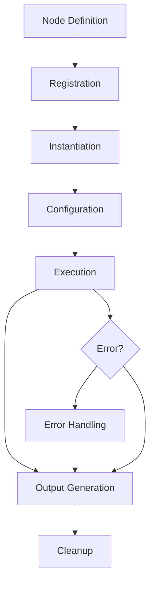

# Chapter 6: Custom Nodes

Welcome to **Chapter 6: Custom Nodes**. In this part of **Dify Platform: Deep Dive Tutorial**, you will build an intuitive mental model first, then move into concrete implementation details and practical production tradeoffs.


> Extending Dify's workflow capabilities with custom node development

## 🎯 Learning Objectives

By the end of this chapter, you'll be able to:
- Understand the custom node architecture in Dify
- Develop and register custom node types
- Implement complex business logic in workflow nodes
- Handle authentication and error management in custom nodes
- Package and deploy custom nodes for reuse

## 🏗️ Custom Node Architecture

### **Node Lifecycle**



### **Node Definition Schema**

```python
# Custom Node Definition
node_definition = {
    "metadata": {
        "name": "custom_data_processor",
        "display_name": "Custom Data Processor",
        "description": "Process and transform data using custom logic",
        "icon": "🔧",
        "category": "data_processing",
        "version": "1.0.0",
        "author": "Your Name"
    },
    "inputs": [
        {
            "name": "input_data",
            "type": "object",
            "description": "Data to process",
            "required": True
        },
        {
            "name": "processing_config",
            "type": "object",
            "description": "Configuration parameters",
            "required": False,
            "default": {}
        }
    ],
    "outputs": [
        {
            "name": "processed_data",
            "type": "object",
            "description": "Transformed data"
        },
        {
            "name": "processing_stats",
            "type": "object",
            "description": "Processing statistics"
        }
    ],
    "parameters": [
        {
            "name": "batch_size",
            "type": "integer",
            "description": "Number of items to process at once",
            "default": 100,
            "min": 1,
            "max": 1000
        },
        {
            "name": "timeout_seconds",
            "type": "integer",
            "description": "Maximum processing time",
            "default": 30,
            "min": 1,
            "max": 300
        }
    ],
    "execution": {
        "runtime": "python",
        "handler": "process_data",
        "timeout": 300,
        "retry_policy": {
            "max_attempts": 3,
            "backoff_multiplier": 2.0
        }
    }
}
```

## 💻 Developing Custom Nodes

### **Node Implementation Class**

```python
from dify.nodes.base import BaseNode
from dify.utils import validate_input, sanitize_output
import asyncio
import time

class CustomDataProcessorNode(BaseNode):
    """Custom node for data processing operations"""

    def __init__(self, config):
        super().__init__(config)
        self.batch_size = config.get('batch_size', 100)
        self.timeout_seconds = config.get('timeout_seconds', 30)
        self.processing_stats = {
            'items_processed': 0,
            'processing_time': 0,
            'errors': 0
        }

    @validate_input
    async def execute(self, inputs, context):
        """Main execution method"""

        start_time = time.time()

        try:
            # Extract inputs
            input_data = inputs.get('input_data', [])
            processing_config = inputs.get('processing_config', {})

            # Validate input data
            if not isinstance(input_data, list):
                raise ValueError("input_data must be a list")

            # Process data in batches
            processed_data = []
            for i in range(0, len(input_data), self.batch_size):
                batch = input_data[i:i + self.batch_size]

                # Process batch with timeout
                batch_result = await asyncio.wait_for(
                    self.process_batch(batch, processing_config),
                    timeout=self.timeout_seconds
                )

                processed_data.extend(batch_result)

                # Update progress
                await self.update_progress(
                    (i + len(batch)) / len(input_data) * 100
                )

            # Calculate processing statistics
            processing_time = time.time() - start_time
            self.processing_stats.update({
                'items_processed': len(processed_data),
                'processing_time': processing_time,
                'success_rate': (len(processed_data) / len(input_data)) * 100
            })

            # Prepare outputs
            outputs = {
                'processed_data': processed_data,
                'processing_stats': self.processing_stats
            }

            return sanitize_output(outputs)

        except Exception as e:
            self.processing_stats['errors'] += 1
            await self.log_error(f"Processing failed: {str(e)}")
            raise

    async def process_batch(self, batch, config):
        """Process a single batch of data"""

        processed_batch = []

        for item in batch:
            try:
                # Apply custom processing logic
                processed_item = await self.process_item(item, config)
                processed_batch.append(processed_item)

            except Exception as e:
                await self.log_warning(f"Failed to process item: {str(e)}")
                # Continue processing other items
                continue

        return processed_batch

    async def process_item(self, item, config):
        """Process a single data item"""

        # Example processing logic - customize as needed
        if config.get('operation') == 'uppercase':
            if isinstance(item, str):
                return item.upper()
            return item

        elif config.get('operation') == 'filter':
            filter_criteria = config.get('filter_criteria', {})
            if self.matches_criteria(item, filter_criteria):
                return item
            return None

        elif config.get('operation') == 'transform':
            return self.apply_transformation(item, config)

        # Default: return item unchanged
        return item

    def matches_criteria(self, item, criteria):
        """Check if item matches filter criteria"""
        if not isinstance(item, dict):
            return True

        for key, value in criteria.items():
            if key not in item or item[key] != value:
                return False

        return True

    def apply_transformation(self, item, config):
        """Apply custom transformation"""
        transform_type = config.get('transform_type', 'identity')

        if transform_type == 'add_field':
            field_name = config.get('field_name', 'new_field')
            field_value = config.get('field_value', 'default')
            if isinstance(item, dict):
                item[field_name] = field_value

        elif transform_type == 'rename_field':
            old_name = config.get('old_field_name')
            new_name = config.get('new_field_name')
            if isinstance(item, dict) and old_name in item:
                item[new_name] = item.pop(old_name)

        return item

    async def update_progress(self, percentage):
        """Update execution progress"""
        await self.context.update_progress(percentage)

    async def log_error(self, message):
        """Log error message"""
        await self.context.log('ERROR', message)

    async def log_warning(self, message):
        """Log warning message"""
        await self.context.log('WARNING', message)
```

### **Node Registration and Packaging**

```python
# Node Registration
node_registration = {
    "nodes": [
        {
            "definition": "path/to/custom_data_processor.json",
            "implementation": "path/to/CustomDataProcessorNode.py",
            "dependencies": [
                "pandas>=1.5.0",
                "numpy>=1.21.0"
            ]
        }
    ],
    "hooks": {
        "on_install": "setup_database_connection",
        "on_uninstall": "cleanup_resources"
    }
}

# Package Structure
custom_node_package = {
    "name": "custom-nodes-collection",
    "version": "1.0.0",
    "description": "Collection of custom Dify nodes",
    "author": "Your Organization",
    "nodes": [
        "custom_data_processor",
        "api_integrator",
        "data_validator"
    ],
    "dependencies": {
        "python": ">=3.8",
        "dify": ">=0.4.0"
    },
    "files": [
        "nodes/",
        "utils/",
        "tests/"
    ]
}
```

## 🔧 Advanced Node Features

### **Authentication and Security**

```python
class SecureApiNode(BaseNode):
    """Node with authentication and security features"""

    def __init__(self, config):
        super().__init__(config)
        self.auth_config = config.get('authentication', {})
        self.encryption_enabled = config.get('encryption', False)

    async def authenticate(self):
        """Handle authentication for external services"""

        auth_type = self.auth_config.get('type')

        if auth_type == 'oauth2':
            return await self.oauth2_authentication()
        elif auth_type == 'api_key':
            return await self.api_key_authentication()
        elif auth_type == 'basic':
            return await self.basic_authentication()
        else:
            raise ValueError(f"Unsupported auth type: {auth_type}")

    async def oauth2_authentication(self):
        """OAuth2 authentication flow"""

        client_id = self.auth_config['client_id']
        client_secret = self.auth_config['client_secret']
        token_url = self.auth_config['token_url']

        # OAuth2 client credentials flow
        auth = aiohttp.BasicAuth(client_id, client_secret)
        data = {'grant_type': 'client_credentials'}

        async with aiohttp.ClientSession() as session:
            async with session.post(token_url, auth=auth, data=data) as response:
                if response.status == 200:
                    token_data = await response.json()
                    return {'Authorization': f"Bearer {token_data['access_token']}"}
                else:
                    raise AuthenticationError("OAuth2 authentication failed")

    async def encrypt_sensitive_data(self, data):
        """Encrypt sensitive data if enabled"""

        if not self.encryption_enabled:
            return data

        # Implement encryption logic
        key = self.get_encryption_key()
        encrypted_data = self.encrypt(data, key)

        return encrypted_data

    def get_encryption_key(self):
        """Get encryption key from secure storage"""
        # Implementation depends on your key management system
        pass
```

### **Error Handling and Resilience**

```python
class ResilientNode(BaseNode):
    """Node with advanced error handling and resilience"""

    def __init__(self, config):
        super().__init__(config)
        self.retry_config = config.get('retry_policy', {})
        self.circuit_breaker = CircuitBreaker(
            failure_threshold=5,
            recovery_timeout=60
        )

    async def execute_with_resilience(self, operation, *args, **kwargs):
        """Execute operation with resilience patterns"""

        # Circuit breaker check
        if not self.circuit_breaker.can_execute():
            raise CircuitBreakerError("Circuit breaker is open")

        # Retry logic
        max_attempts = self.retry_config.get('max_attempts', 3)
        backoff_multiplier = self.retry_config.get('backoff_multiplier', 2.0)

        for attempt in range(max_attempts):
            try:
                result = await operation(*args, **kwargs)

                # Record success
                self.circuit_breaker.record_success()
                return result

            except TemporaryError as e:
                if attempt == max_attempts - 1:
                    # Last attempt failed
                    self.circuit_breaker.record_failure()
                    raise

                # Calculate backoff delay
                delay = (backoff_multiplier ** attempt) * self.retry_config.get('base_delay', 1.0)

                await self.log_warning(f"Attempt {attempt + 1} failed, retrying in {delay}s: {str(e)}")
                await asyncio.sleep(delay)

            except PermanentError as e:
                # Don't retry permanent errors
                self.circuit_breaker.record_failure()
                raise

    async def handle_partial_failure(self, results, errors):
        """Handle scenarios where some operations succeed and others fail"""

        success_count = len(results)
        error_count = len(errors)

        # Log partial failure
        await self.log_warning(f"Partial failure: {success_count} succeeded, {error_count} failed")

        # Decide on continuation strategy
        failure_threshold = self.config.get('failure_threshold', 0.5)

        if error_count / (success_count + error_count) > failure_threshold:
            # Too many failures, abort
            raise PartialFailureError(f"Failure rate exceeds threshold: {failure_threshold}")

        # Continue with successful results
        return results

    async def implement_fallback(self, primary_result, fallback_operation):
        """Implement fallback logic when primary operation fails"""

        try:
            return await primary_result
        except Exception as e:
            await self.log_warning(f"Primary operation failed, using fallback: {str(e)}")

            try:
                return await fallback_operation()
            except Exception as fallback_error:
                await self.log_error(f"Fallback also failed: {str(fallback_error)}")
                raise
```

### **State Management and Persistence**

```python
class StatefulNode(BaseNode):
    """Node that maintains state across executions"""

    def __init__(self, config):
        super().__init__(config)
        self.state_store = self.initialize_state_store()
        self.checkpoint_interval = config.get('checkpoint_interval', 100)

    async def load_state(self, execution_id):
        """Load previous state for this execution"""

        state_key = f"execution_{execution_id}"
        state = await self.state_store.get(state_key)

        if state:
            self.current_state = state
            await self.log_info("Loaded previous state")
        else:
            self.current_state = self.get_initial_state()
            await self.log_info("Initialized new state")

    async def save_state(self, execution_id):
        """Save current state"""

        state_key = f"execution_{execution_id}"
        await self.state_store.set(state_key, self.current_state)

        # Clean up old states periodically
        await self.cleanup_old_states()

    async def execute_with_state(self, inputs):
        """Execute with state management"""

        execution_id = inputs.get('execution_id', str(uuid.uuid4()))

        # Load or initialize state
        await self.load_state(execution_id)

        try:
            # Perform stateful operations
            result = await self.process_with_state(inputs)

            # Save updated state
            await self.save_state(execution_id)

            return result

        except Exception as e:
            # Save state even on failure for debugging
            await self.save_state(execution_id)
            raise

    async def process_with_state(self, inputs):
        """Main processing logic with state"""

        operation = inputs.get('operation')

        if operation == 'increment':
            self.current_state['counter'] += 1
        elif operation == 'append':
            data = inputs.get('data')
            self.current_state['data_list'].append(data)
        elif operation == 'query':
            return self.current_state.copy()

        # Checkpoint state periodically
        if self.current_state.get('operations_count', 0) % self.checkpoint_interval == 0:
            await self.create_checkpoint()

        return {'status': 'success', 'state': self.current_state}

    def get_initial_state(self):
        """Get initial state structure"""
        return {
            'counter': 0,
            'data_list': [],
            'operations_count': 0,
            'created_at': datetime.now().isoformat()
        }

    async def create_checkpoint(self):
        """Create a checkpoint of current state"""
        checkpoint_id = str(uuid.uuid4())
        checkpoint_data = {
            'state': self.current_state.copy(),
            'timestamp': datetime.now().isoformat(),
            'checkpoint_id': checkpoint_id
        }

        await self.state_store.set(f"checkpoint_{checkpoint_id}", checkpoint_data)
```

## 📦 Packaging and Deployment

### **Node Package Structure**

```
custom-node-package/
├── manifest.json          # Package metadata
├── nodes/                 # Node implementations
│   ├── data_processor.py
│   ├── api_integrator.py
│   └── validator.py
├── schemas/              # Node definition schemas
│   ├── data_processor.json
│   ├── api_integrator.json
│   └── validator.json
├── tests/               # Unit and integration tests
│   ├── test_data_processor.py
│   └── test_api_integrator.py
├── docs/                # Documentation
│   ├── README.md
│   └── examples/
├── requirements.txt     # Python dependencies
└── setup.py            # Installation script
```

### **Package Manifest**

```json
{
    "name": "advanced-data-processing-nodes",
    "version": "1.0.0",
    "description": "Collection of advanced data processing nodes for Dify",
    "author": "Data Processing Team",
    "license": "MIT",
    "homepage": "https://github.com/your-org/dify-nodes",
    "keywords": ["dify", "nodes", "data-processing", "api-integration"],
    "engines": {
        "node": ">=16.0.0",
        "python": ">=3.8.0"
    },
    "dify": {
        "minVersion": "0.4.0",
        "maxVersion": "0.5.0"
    },
    "nodes": [
        {
            "name": "advanced_data_processor",
            "file": "nodes/data_processor.py",
            "schema": "schemas/data_processor.json",
            "category": "data_processing"
        },
        {
            "name": "api_integrator",
            "file": "nodes/api_integrator.py",
            "schema": "schemas/api_integrator.json",
            "category": "integrations"
        }
    ],
    "dependencies": {
        "requests": "^2.28.0",
        "pandas": "^1.5.0",
        "numpy": "^1.21.0"
    },
    "scripts": {
        "install": "pip install -r requirements.txt",
        "test": "python -m pytest tests/",
        "build": "python setup.py sdist bdist_wheel"
    }
}
```

## 🧪 Testing Custom Nodes

### **Unit Testing Framework**

```python
import pytest
import asyncio
from unittest.mock import Mock, AsyncMock
from custom_nodes.data_processor import CustomDataProcessorNode

class TestCustomDataProcessorNode:
    """Test suite for CustomDataProcessorNode"""

    @pytest.fixture
    def node_config(self):
        return {
            'batch_size': 50,
            'timeout_seconds': 10
        }

    @pytest.fixture
    def mock_context(self):
        context = Mock()
        context.update_progress = AsyncMock()
        context.log = AsyncMock()
        return context

    @pytest.fixture
    def node(self, node_config, mock_context):
        node = CustomDataProcessorNode(node_config)
        node.context = mock_context
        return node

    @pytest.mark.asyncio
    async def test_process_uppercase_operation(self, node):
        """Test uppercase operation"""

        inputs = {
            'input_data': ['hello', 'world'],
            'processing_config': {'operation': 'uppercase'}
        }

        result = await node.execute(inputs, node.context)

        assert result['processed_data'] == ['HELLO', 'WORLD']
        assert result['processing_stats']['items_processed'] == 2

    @pytest.mark.asyncio
    async def test_process_filter_operation(self, node):
        """Test filter operation"""

        input_data = [
            {'name': 'Alice', 'age': 25},
            {'name': 'Bob', 'age': 30},
            {'name': 'Charlie', 'age': 25}
        ]

        inputs = {
            'input_data': input_data,
            'processing_config': {
                'operation': 'filter',
                'filter_criteria': {'age': 25}
            }
        }

        result = await node.execute(inputs, node.context)

        # Should only return items where age == 25
        assert len(result['processed_data']) == 2
        assert all(item['age'] == 25 for item in result['processed_data'] if item is not None)

    @pytest.mark.asyncio
    async def test_error_handling(self, node):
        """Test error handling"""

        # Invalid input type
        inputs = {
            'input_data': "not a list",
            'processing_config': {}
        }

        with pytest.raises(ValueError, match="input_data must be a list"):
            await node.execute(inputs, node.context)

    @pytest.mark.asyncio
    async def test_batch_processing(self, node):
        """Test batch processing"""

        # Create large dataset
        input_data = [{'id': i, 'value': f'item_{i}'} for i in range(150)]

        inputs = {
            'input_data': input_data,
            'processing_config': {'operation': 'transform', 'transform_type': 'add_field',
                                'field_name': 'processed', 'field_value': True}
        }

        result = await node.execute(inputs, node.context)

        # Should process all items
        assert len(result['processed_data']) == 150
        assert all(item.get('processed') == True for item in result['processed_data'])

        # Should have processed in batches of 50
        assert result['processing_stats']['items_processed'] == 150

    @pytest.mark.asyncio
    async def test_timeout_handling(self, node):
        """Test timeout handling"""

        # Configure short timeout
        node.timeout_seconds = 0.1

        # Simulate slow processing
        async def slow_process_batch(batch, config):
            await asyncio.sleep(0.2)  # Sleep longer than timeout
            return batch

        node.process_batch = slow_process_batch

        inputs = {
            'input_data': [{'id': 1}],
            'processing_config': {}
        }

        with pytest.raises(asyncio.TimeoutError):
            await node.execute(inputs, node.context)
```

## 🧪 Hands-On Exercise

**Estimated Time: 90 minutes**

1. **Create a Custom API Integration Node**:
   - Build a node that integrates with a REST API
   - Implement authentication and error handling
   - Add configuration options for different endpoints

2. **Develop a Data Transformation Node**:
   - Create a node that transforms data using custom logic
   - Support multiple transformation types
   - Add validation and error handling

3. **Implement Stateful Processing**:
   - Build a node that maintains state across executions
   - Add checkpointing and recovery mechanisms
   - Test state persistence and recovery

## 🎯 Key Takeaways

1. **Node Architecture**: Modular design with clear input/output schemas
2. **Implementation Patterns**: Async execution, error handling, and logging
3. **Security**: Authentication, encryption, and secure data handling
4. **Resilience**: Retry logic, circuit breakers, and fallback mechanisms
5. **State Management**: Persistence and recovery for long-running processes
6. **Testing**: Comprehensive unit and integration testing
7. **Packaging**: Proper packaging and deployment for reuse

## 🔗 Connection to Next Chapter

With custom node development complete, we're ready to explore **Production Deployment** in the final chapter, where we'll learn how to deploy, scale, and monitor Dify applications in production environments.

---

**Ready for production?** Continue to [Chapter 7: Production Deployment](07-production-deployment.md)

## What Problem Does This Solve?

Most teams struggle here because the hard part is not writing more code, but deciding clear boundaries for `self`, `item`, `config` so behavior stays predictable as complexity grows.

In practical terms, this chapter helps you avoid three common failures:

- coupling core logic too tightly to one implementation path
- missing the handoff boundaries between setup, execution, and validation
- shipping changes without clear rollback or observability strategy

After working through this chapter, you should be able to reason about `Chapter 6: Custom Nodes` as an operating subsystem inside **Dify Platform: Deep Dive Tutorial**, with explicit contracts for inputs, state transitions, and outputs.

Use the implementation notes around `node`, `inputs`, `input_data` as your checklist when adapting these patterns to your own repository.

## How it Works Under the Hood

Under the hood, `Chapter 6: Custom Nodes` usually follows a repeatable control path:

1. **Context bootstrap**: initialize runtime config and prerequisites for `self`.
2. **Input normalization**: shape incoming data so `item` receives stable contracts.
3. **Core execution**: run the main logic branch and propagate intermediate state through `config`.
4. **Policy and safety checks**: enforce limits, auth scopes, and failure boundaries.
5. **Output composition**: return canonical result payloads for downstream consumers.
6. **Operational telemetry**: emit logs/metrics needed for debugging and performance tuning.

When debugging, walk this sequence in order and confirm each stage has explicit success/failure conditions.

## Source Walkthrough

Use the following upstream sources to verify implementation details while reading this chapter:

- [Dify](https://github.com/langgenius/dify)
  Why it matters: authoritative reference on `Dify` (github.com).

Suggested trace strategy:
- search upstream code for `self` and `item` to map concrete implementation paths
- compare docs claims against actual runtime/config code before reusing patterns in production

## Chapter Connections

- [Tutorial Index](index.md)
- [Previous Chapter: Chapter 5: Agent Framework](05-agent-framework.md)
- [Next Chapter: Chapter 7: Production Deployment](07-production-deployment.md)
- [Main Catalog](../../README.md#-tutorial-catalog)
- [A-Z Tutorial Directory](../../discoverability/tutorial-directory.md)
