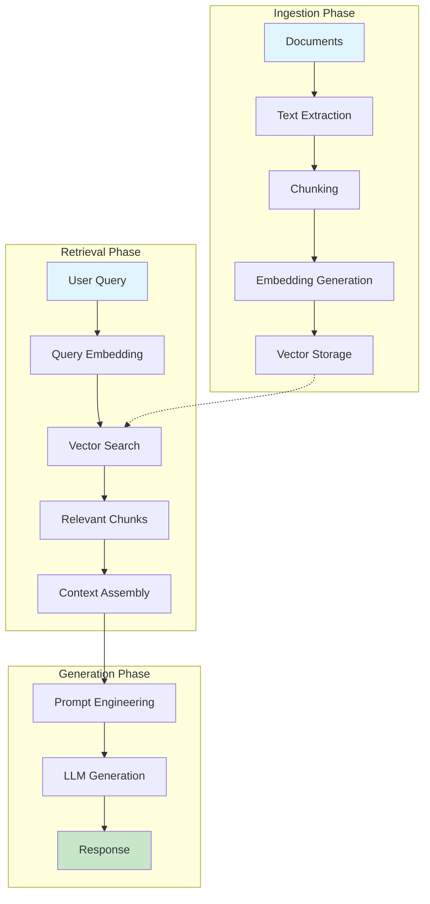
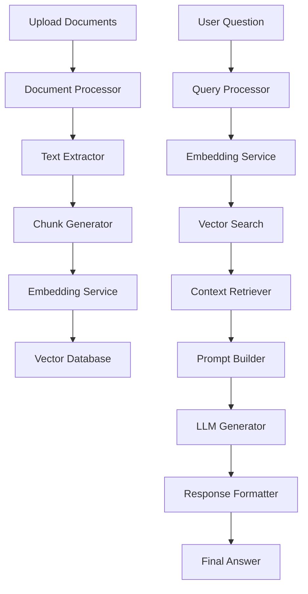

# Chapter 4: RAG Implementation

> Building retrieval-augmented generation systems with Dify's document processing and vector search capabilities

## 🎯 Learning Objectives

By the end of this chapter, you'll be able to:
- Understand the principles of retrieval-augmented generation (RAG)
- Implement document ingestion and processing pipelines
- Configure vector databases for semantic search
- Build RAG-enabled chatbots and Q&A systems
- Optimize retrieval quality and generation accuracy

## 🤔 What is Retrieval-Augmented Generation?

RAG combines the strengths of retrieval-based and generation-based AI approaches:

### **The RAG Advantage**

Traditional LLMs are limited by their training data cutoff and lack of specific domain knowledge. RAG addresses this by:

1. **Dynamic Knowledge Access**: Retrieve relevant information from external sources
2. **Reduced Hallucinations**: Ground responses in factual, up-to-date information
3. **Domain Adaptation**: Easily customize for specific industries or knowledge domains
4. **Cost Efficiency**: Avoid expensive model retraining for new information

### **RAG Architecture Overview**



## 📄 Document Processing Pipeline

### **Document Ingestion Strategies**

Dify supports multiple document formats and ingestion methods:

```python
# Document Ingestion Configuration
document_ingestion_config = {
    "supported_formats": [
        "pdf", "docx", "txt", "md", "html",
        "csv", "json", "xml", "rtf"
    ],
    "processing_options": {
        "extract_metadata": True,
        "preserve_formatting": False,
        "handle_tables": True,
        "process_images": False  # Text-only extraction
    },
    "chunking_strategy": {
        "method": "semantic",  # semantic, fixed, sentence
        "chunk_size": 512,
        "overlap": 50,
        "separator": "\n\n"
    }
}
```

### **Text Chunking Strategies**

Effective chunking is crucial for retrieval quality:

#### **Fixed-Size Chunking**
```python
def fixed_size_chunking(text, chunk_size=512, overlap=50):
    """Split text into fixed-size chunks with overlap"""
    chunks = []
    start = 0

    while start < len(text):
        end = start + chunk_size

        # Add overlap from previous chunk
        if start > 0:
            start = max(0, start - overlap)

        chunk = text[start:end]
        chunks.append(chunk)

        start = end

    return chunks
```

#### **Semantic Chunking**
```python
def semantic_chunking(text, max_chunk_size=512):
    """Split text at semantic boundaries"""
    import re

    # Split on paragraph boundaries first
    paragraphs = re.split(r'\n\s*\n', text)

    chunks = []
    current_chunk = ""

    for paragraph in paragraphs:
        # Check if adding this paragraph exceeds max size
        if len(current_chunk + paragraph) > max_chunk_size:
            if current_chunk:
                chunks.append(current_chunk.strip())
                current_chunk = paragraph
            else:
                # Paragraph itself is too long, split by sentences
                sentences = re.split(r'(?<=[.!?])\s+', paragraph)
                temp_chunk = ""

                for sentence in sentences:
                    if len(temp_chunk + sentence) > max_chunk_size:
                        if temp_chunk:
                            chunks.append(temp_chunk.strip())
                        temp_chunk = sentence
                    else:
                        temp_chunk += sentence + " "

                if temp_chunk:
                    current_chunk = temp_chunk
        else:
            current_chunk += paragraph + "\n\n"

    if current_chunk:
        chunks.append(current_chunk.strip())

    return chunks
```

## 🔍 Vector Search and Retrieval

### **Embedding Models**

Dify supports multiple embedding providers:

```python
# Embedding Configuration
embedding_config = {
    "providers": {
        "openai": {
            "model": "text-embedding-ada-002",
            "dimensions": 1536,
            "max_tokens": 8191
        },
        "huggingface": {
            "model": "sentence-transformers/all-MiniLM-L6-v2",
            "dimensions": 384,
            "max_tokens": 512
        },
        "cohere": {
            "model": "embed-multilingual-v2.0",
            "dimensions": 768,
            "max_tokens": 2048
        }
    },
    "default_provider": "openai",
    "caching": {
        "enabled": True,
        "ttl_hours": 24
    }
}
```

### **Vector Database Integration**

Dify integrates with popular vector databases:

```python
# Vector Database Configuration
vector_db_config = {
    "engine": "weaviate",  # weaviate, pinecone, qdrant, chroma
    "connection": {
        "host": "localhost",
        "port": 8080,
        "api_key": "{{VECTOR_DB_API_KEY}}"
    },
    "index_settings": {
        "metric": "cosine",  # cosine, euclidean, dot_product
        "ef_construction": 200,
        "max_connections": 16
    },
    "collection_schema": {
        "name": "documents",
        "properties": [
            {"name": "content", "type": "text"},
            {"name": "metadata", "type": "object"},
            {"name": "source", "type": "text"},
            {"name": "chunk_id", "type": "int"}
        ]
    }
}
```

### **Advanced Retrieval Techniques**

#### **Hybrid Search**
```python
class HybridRetriever:
    def __init__(self, vector_db, bm25_index):
        self.vector_db = vector_db
        self.bm25_index = bm25_index
        self.weights = {"semantic": 0.7, "keyword": 0.3}

    def retrieve(self, query, top_k=5):
        """Combine semantic and keyword search"""

        # Semantic search
        semantic_results = self.vector_db.search(
            query_embedding=self.embed_query(query),
            limit=top_k * 2  # Get more candidates
        )

        # Keyword search
        keyword_results = self.bm25_index.search(query, limit=top_k * 2)

        # Combine and rerank
        combined_scores = {}
        for doc_id, score in semantic_results:
            combined_scores[doc_id] = score * self.weights["semantic"]

        for doc_id, score in keyword_results:
            if doc_id in combined_scores:
                combined_scores[doc_id] += score * self.weights["keyword"]
            else:
                combined_scores[doc_id] = score * self.weights["keyword"]

        # Return top-k results
        sorted_results = sorted(
            combined_scores.items(),
            key=lambda x: x[1],
            reverse=True
        )

        return sorted_results[:top_k]
```

#### **Re-ranking**
```python
class ReRanker:
    def __init__(self, cross_encoder_model):
        self.model = cross_encoder_model

    def rerank(self, query, documents, top_k=3):
        """Re-rank documents using cross-encoder"""

        pairs = [[query, doc['content']] for doc in documents]

        # Get relevance scores
        scores = self.model.predict(pairs)

        # Sort by scores
        ranked_docs = [
            doc for _, doc in sorted(
                zip(scores, documents),
                key=lambda x: x[0],
                reverse=True
            )
        ]

        return ranked_docs[:top_k]
```

## 🏗️ Building RAG Workflows in Dify

### **Document Q&A System**

Let's build a complete document Q&A system:



#### **Workflow Configuration**

```python
document_qa_workflow = {
    "name": "Document Q&A Assistant",
    "nodes": [
        {
            "id": "document_processor",
            "type": "document_processor",
            "config": {
                "input_type": "file_upload",
                "supported_formats": ["pdf", "docx", "txt"],
                "chunking_strategy": {
                    "method": "semantic",
                    "chunk_size": 512,
                    "overlap": 50
                }
            }
        },
        {
            "id": "embedding_generator",
            "type": "embedding",
            "config": {
                "provider": "openai",
                "model": "text-embedding-ada-002"
            }
        },
        {
            "id": "vector_store",
            "type": "vector_db",
            "config": {
                "engine": "weaviate",
                "collection": "documents"
            }
        },
        {
            "id": "query_processor",
            "type": "llm",
            "config": {
                "model": "gpt-3.5-turbo",
                "prompt": "Rephrase this question for better retrieval: {user_question}",
                "temperature": 0.1
            }
        },
        {
            "id": "retriever",
            "type": "vector_search",
            "config": {
                "top_k": 3,
                "score_threshold": 0.7,
                "rerank": True
            }
        },
        {
            "id": "answer_generator",
            "type": "llm",
            "config": {
                "model": "gpt-4",
                "prompt_template": """
                Answer the question based on the provided context.

                Context:
                {retrieved_documents}

                Question: {original_question}

                Instructions:
                - Use only information from the provided context
                - If the context doesn't contain enough information, say so
                - Be concise but comprehensive
                - Include relevant quotes from the context

                Answer:
                """,
                "temperature": 0.3,
                "max_tokens": 800
            }
        }
    ],
    "edges": [
        {"from": "document_processor", "to": "embedding_generator"},
        {"from": "embedding_generator", "to": "vector_store"},
        {"from": "query_processor", "to": "retriever", "data": ["rephrased_question"]},
        {"from": "retriever", "to": "answer_generator", "data": ["context"]},
        {"from": "answer_generator", "to": "output"}
    ]
}
```

## 🔧 RAG Optimization Techniques

### **Query Expansion**

```python
class QueryExpander:
    def __init__(self, llm_client):
        self.llm = llm_client

    def expand_query(self, original_query):
        """Generate multiple query variations"""

        prompt = f"""
        Generate 3 different phrasings of this question that would help
        find relevant information in a document collection:

        Original: {original_query}

        Variations:
        1.
        2.
        3.
        """

        response = self.llm.generate(prompt, temperature=0.7)
        variations = self.parse_variations(response)

        return [original_query] + variations

    def parse_variations(self, response):
        """Extract query variations from LLM response"""
        lines = response.strip().split('\n')
        variations = []

        for line in lines:
            if line.startswith(('1.', '2.', '3.')):
                variation = line[3:].strip()
                if variation:
                    variations.append(variation)

        return variations
```

### **Context Compression**

```python
class ContextCompressor:
    def __init__(self, llm_client):
        self.llm = llm_client

    def compress_context(self, query, documents, max_length=2000):
        """Compress retrieved documents to fit context window"""

        # Combine all documents
        full_context = "\n\n".join([doc['content'] for doc in documents])

        if len(full_context) <= max_length:
            return full_context

        # Use LLM to summarize and compress
        prompt = f"""
        Summarize the following documents to answer this question: {query}

        Documents:
        {full_context}

        Provide a concise summary that captures all relevant information,
        limited to {max_length} characters.
        """

        compressed = self.llm.generate(prompt, max_tokens=max_length//4)
        return compressed.strip()
```

### **Multi-Hop Retrieval**

```python
class MultiHopRetriever:
    def __init__(self, retriever, generator):
        self.retriever = retriever
        self.generator = generator

    def retrieve_multi_hop(self, query, max_hops=2):
        """Perform multi-hop retrieval and reasoning"""

        context = []
        current_query = query

        for hop in range(max_hops):
            # Retrieve documents for current query
            docs = self.retriever.retrieve(current_query, top_k=3)

            # Add to context
            context.extend(docs)

            # Generate follow-up question if not last hop
            if hop < max_hops - 1:
                follow_up_prompt = f"""
                Based on the retrieved information, what additional
                information do we need to fully answer: {query}

                Retrieved so far: {summarize_docs(docs)}

                Follow-up question:
                """

                current_query = self.generator.generate(follow_up_prompt).strip()

        return context
```

## 📊 Evaluating RAG Performance

### **Retrieval Metrics**

```python
class RAGEvaluator:
    def __init__(self):
        self.metrics = {}

    def evaluate_retrieval(self, queries, ground_truth, retrieved_docs):
        """Evaluate retrieval quality"""

        precision_scores = []
        recall_scores = []
        ndcg_scores = []

        for query, truth, retrieved in zip(queries, ground_truth, retrieved_docs):
            # Precision@K
            precision = self.precision_at_k(retrieved, truth, k=5)

            # Recall@K
            recall = self.recall_at_k(retrieved, truth, k=5)

            # NDCG@K
            ndcg = self.ndcg_at_k(retrieved, truth, k=5)

            precision_scores.append(precision)
            recall_scores.append(recall)
            ndcg_scores.append(ndcg)

        return {
            'precision@5': sum(precision_scores) / len(precision_scores),
            'recall@5': sum(recall_scores) / len(recall_scores),
            'ndcg@5': sum(ndcg_scores) / len(ndcg_scores)
        }

    def precision_at_k(self, retrieved, relevant, k):
        """Calculate precision at k"""
        retrieved_at_k = retrieved[:k]
        relevant_retrieved = len(set(retrieved_at_k) & set(relevant))
        return relevant_retrieved / k if k > 0 else 0

    def recall_at_k(self, retrieved, relevant, k):
        """Calculate recall at k"""
        retrieved_at_k = retrieved[:k]
        relevant_retrieved = len(set(retrieved_at_k) & set(relevant))
        return relevant_retrieved / len(relevant) if relevant else 0

    def ndcg_at_k(self, retrieved, relevant, k):
        """Calculate NDCG at k"""
        retrieved_at_k = retrieved[:k]

        dcg = 0
        for i, doc in enumerate(retrieved_at_k):
            if doc in relevant:
                dcg += 1 / math.log2(i + 2)

        # Calculate IDCG
        idcg = sum(1 / math.log2(i + 2) for i in range(min(k, len(relevant))))

        return dcg / idcg if idcg > 0 else 0
```

### **Generation Quality Metrics**

```python
class GenerationEvaluator:
    def __init__(self, llm_judge):
        self.llm_judge = llm_judge

    def evaluate_answer_quality(self, question, answer, context):
        """Evaluate answer quality using LLM-as-judge"""

        prompt = f"""
        Evaluate the quality of this answer to the question.

        Question: {question}
        Answer: {answer}
        Context: {context[:500]}...

        Rate on a scale of 1-5 for:
        1. Factual accuracy (correct information)
        2. Completeness (answers the question fully)
        3. Relevance (stays on topic)
        4. Groundedness (based on provided context)

        Provide scores and brief explanation.
        """

        evaluation = self.llm_judge.generate(prompt)

        # Parse scores from response
        return self.parse_evaluation(evaluation)
```

## 🧪 Hands-On Exercise

**Estimated Time: 60 minutes**

1. **Build a Document Q&A System**:
   - Upload a collection of documents (PDFs, docs, or text files)
   - Configure document processing and chunking
   - Set up vector embeddings and storage
   - Create a retrieval-augmented Q&A interface

2. **Optimize Retrieval Quality**:
   - Experiment with different chunking strategies
   - Try various embedding models
   - Implement re-ranking and query expansion
   - Compare retrieval metrics before and after optimization

3. **Add Advanced Features**:
   - Implement multi-hop retrieval for complex questions
   - Add context compression for long documents
   - Create a feedback loop for continuous improvement

## 🎯 Key Takeaways

1. **RAG Architecture**: Combines retrieval and generation for more accurate, up-to-date responses
2. **Document Processing**: Effective chunking and preprocessing are crucial for retrieval quality
3. **Vector Search**: Semantic similarity enables finding relevant information beyond keyword matching
4. **Optimization Techniques**: Query expansion, re-ranking, and context compression improve performance
5. **Evaluation**: Systematic metrics help measure and improve RAG system quality

## 🔗 Connection to Next Chapter

With RAG fundamentals mastered, we're ready to explore **Agent Framework** in the next chapter, where we'll learn how to build autonomous agents that can use tools and make decisions.

---

**Ready for autonomous agents?** Continue to [Chapter 5: Agent Framework](05-agent-framework.md)