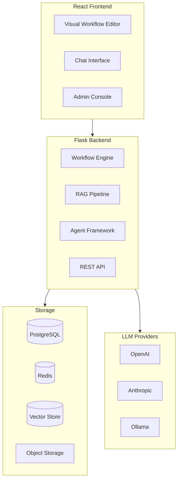

# Dify Platform: Deep Dive Tutorial

> **Project**: [Dify](https://github.com/langgenius/dify) — An open-source LLM application development platform for building workflows, RAG pipelines, and AI agents with a visual interface.

## What Is Dify?

Dify is an open-source LLM application platform that provides a visual interface for building AI workflows, RAG systems, and agent frameworks. It supports orchestrating complex LLM pipelines with a drag-and-drop node system and offers one-click deployment via Docker.

| Feature | Description |
|---------|-------------|
| **Visual Workflows** | Drag-and-drop node system for chaining LLM operations |
| **RAG Pipeline** | Multi-stage document processing with vector storage and retrieval |
| **Agent Framework** | Tool-calling loops and reasoning chain management |
| **Multi-Model** | OpenAI, Anthropic, Google, local models via Ollama |
| **Plugin System** | Extensible architecture for custom nodes and integrations |
| **Deployment** | One-click Docker Compose deployment |

## Architecture Overview

## Tutorial Structure

| Chapter | Topic | What You'll Learn |
|---------|-------|-------------------|
| [1. System Overview](01-system-overview.md) | Architecture | Dify's place in the LLM ecosystem, core components |
| [2. Core Architecture](02-core-architecture.md) | Design | Components, data flow, service boundaries |
| [3. Workflow Engine](03-workflow-engine.md) | Orchestration | Node system, visual workflows, execution pipeline |
| [4. RAG Implementation](04-rag-implementation.md) | Retrieval | Document processing, embeddings, vector search |
| [5. Agent Framework](05-agent-framework.md) | Agents | Tool calling, reasoning loops, agent types |
| [6. Custom Nodes](06-custom-nodes.md) | Extensibility | Building custom workflow nodes and plugins |
| [7. Production Deployment](07-production-deployment.md) | Operations | Docker, scaling, monitoring, security |
| [8. Operations Playbook](08-operations-playbook.md) | Reliability | Incident response, SLOs, and cost controls |

## Tech Stack

| Component | Technology |
|-----------|-----------|
| **Backend** | Python, Flask |
| **Frontend** | React, TypeScript |
| **Database** | PostgreSQL |
| **Cache** | Redis |
| **Vector Store** | Weaviate, Qdrant, pgvector |
| **Deployment** | Docker Compose |

---

Ready to begin? Start with [Chapter 1: System Overview](01-system-overview.md).

---

*Built with insights from the [Dify repository](https://github.com/langgenius/dify) and community documentation.*

## Navigation & Backlinks

- [Start Here: Chapter 1: Dify System Overview](01-system-overview.md)
- [Back to Main Catalog](../../README.md#-tutorial-catalog)
- [Browse A-Z Tutorial Directory](../../discoverability/tutorial-directory.md)
- [Search by Intent](../../discoverability/query-hub.md)
- [Explore Category Hubs](../../README.md#category-hubs)

## Full Chapter Map

1. [Chapter 1: Dify System Overview](01-system-overview.md)
2. [Chapter 2: Core Architecture](02-core-architecture.md)
3. [Chapter 3: Workflow Engine](03-workflow-engine.md)
4. [Chapter 4: RAG Implementation](04-rag-implementation.md)
5. [Chapter 5: Agent Framework](05-agent-framework.md)
6. [Chapter 6: Custom Nodes](06-custom-nodes.md)
7. [Chapter 7: Production Deployment](07-production-deployment.md)
8. [Chapter 8: Operations Playbook](08-operations-playbook.md)

## Source References

- [Dify](https://github.com/langgenius/dify)

*Generated by [AI Codebase Knowledge Builder](https://github.com/The-Pocket/Tutorial-Codebase-Knowledge)*
