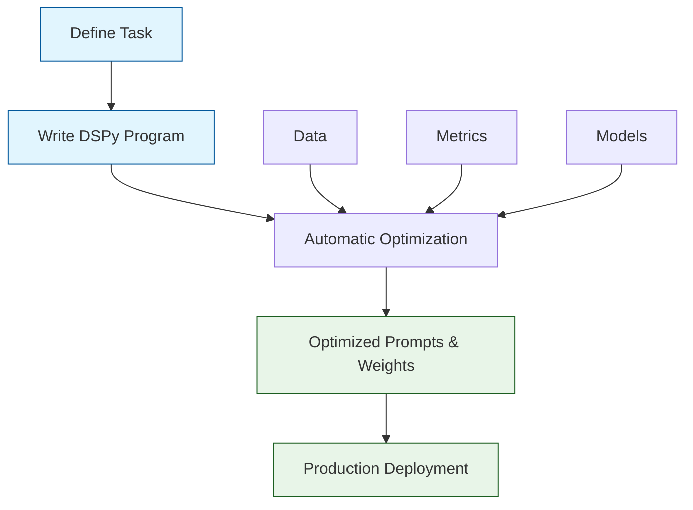

# DSPy Tutorial: Programming Language Models

> Learn to program language models declaratively with DSPy, the Stanford NLP framework for systematic prompt optimization and modular LLM pipelines.

<div align="center">

**🧠 Declarative LLM Programming Framework**

[](https://github.com/stanfordnlp/dspy)

</div>

---

## 🎯 What is DSPy?

**DSPy**<sup>[View Repo](https://github.com/stanfordnlp/dspy)</sup> is a framework for algorithmically optimizing LM prompts and weights, developed by researchers at Stanford NLP. Unlike traditional prompt engineering, DSPy allows you to program LMs declaratively - you specify what you want to accomplish, and DSPy figures out how to optimize the prompts and model configurations.

### DSPy vs Traditional Approaches

| Aspect | Traditional Prompting | DSPy |
|:-------|:----------------------|:-----|
| **Approach** | Manual prompt crafting | Algorithmic optimization |
| **Optimization** | Trial and error | Automatic prompt tuning |
| **Composition** | Hard-coded pipelines | Modular, reusable components |
| **Evaluation** | Manual testing | Systematic validation |
| **Maintenance** | Brittle, manual updates | Self-improving systems |



## Core Concepts

### Signatures
Signatures define the input/output behavior of your LM calls. They specify what information goes in and what comes out.

```python
# Basic signature
class BasicQA(dspy.Signature):
    """Answer questions with short factoid answers."""

    question = dspy.InputField()
    answer = dspy.OutputField(desc="often between 1 and 5 words")

# Advanced signature with instructions
class GenerateAnswer(dspy.Signature):
    """Answer questions with evidence. Use the provided context to justify your answer."""

    context = dspy.InputField(desc="facts here are assumed to be true")
    question = dspy.InputField()
    answer = dspy.OutputField(desc="natural language answer, with evidence")
    evidence = dspy.OutputField(desc="supporting facts from context")
```

### Modules
Modules are reusable components that implement specific behaviors using LMs.

```python
# Built-in modules
retriever = dspy.Retrieve(k=3)  # Retrieve top-3 passages
generator = dspy.ChainOfThought()  # Generate with reasoning
classifier = dspy.MultiChainComparison()  # Compare multiple options

# Custom modules
class CustomQA(dspy.Module):
    def __init__(self):
        super().__init__()
        self.retrieve = dspy.Retrieve(k=3)
        self.generate = dspy.ChainOfThought(signature=GenerateAnswer)

    def forward(self, question):
        context = self.retrieve(question).passages
        answer = self.generate(context=context, question=question)
        return answer
```

### Optimizers
Optimizers automatically improve your DSPy programs by tuning prompts and selecting better model configurations.

```python
# Teleprompters optimize prompts
teleprompter = dspy.BootstrapFewShot(metric=my_metric, max_bootstraps=3)
optimized_program = teleprompter.compile(program, trainset=trainset)

# MIPRO optimizes instructions
mipro_optimizer = dspy.MIPROv2(metric=my_metric, num_candidates=10)
optimized_program = mipro_optimizer.compile(program, trainset=trainset)
```

## Tutorial Chapters

1. **[Chapter 1: Getting Started](01-getting-started.md)** - Installation, basic concepts, and your first DSPy program
2. **[Chapter 2: Signatures](02-signatures.md)** - Defining input/output specifications for LM calls
3. **[Chapter 3: Modules](03-modules.md)** - Using built-in and creating custom DSPy modules
4. **[Chapter 4: Retrieval-Augmented Generation](04-rag.md)** - Building RAG systems with DSPy
5. **[Chapter 5: Optimization](05-optimization.md)** - Automatic prompt and model optimization
6. **[Chapter 6: Advanced Patterns](06-advanced-patterns.md)** - Multi-hop reasoning, tool use, and complex workflows
7. **[Chapter 7: Evaluation & Metrics](07-evaluation.md)** - Systematic evaluation and custom metrics
8. **[Chapter 8: Production Deployment](08-production.md)** - Scaling, monitoring, and production best practices

## What You'll Learn

- **Declarative Programming** - Specify what you want, let DSPy optimize how
- **Automatic Optimization** - Self-improving prompts and model configurations
- **Modular Design** - Build complex systems from reusable components
- **Systematic Evaluation** - Rigorous testing and validation frameworks
- **Production Deployment** - Scale DSPy systems for real-world applications

## Prerequisites

- Python 3.9+
- Basic understanding of LLMs and prompting
- Familiarity with machine learning concepts (helpful but not required)
- OpenAI API key or access to other LLM providers

## Quick Start

```bash
# Install DSPy
pip install dspy-ai

# Set up OpenAI API key
export OPENAI_API_KEY="your-api-key"
```

```python
import dspy

# Configure LM
lm = dspy.OpenAI(model='gpt-3.5-turbo', api_key='your-key')
dspy.settings.configure(lm=lm)

# Define signature
class BasicQA(dspy.Signature):
    question = dspy.InputField()
    answer = dspy.OutputField()

# Create program
qa_program = dspy.Predict(BasicQA)

# Use program
result = qa_program(question="What is the capital of France?")
print(result.answer)  # "Paris"
```

## Example: RAG System

```python
import dspy

# Configure DSPy
lm = dspy.OpenAI(model='gpt-4')
rm = dspy.ColBERTv2(url='http://20.102.90.50:2017/wiki17_abstracts')
dspy.settings.configure(lm=lm, rm=rm)

# Define RAG signature
class GenerateAnswer(dspy.Signature):
    context = dspy.InputField(desc="may contain relevant facts")
    question = dspy.InputField()
    answer = dspy.OutputField(desc="answer with evidence")

# Create RAG program
class RAG(dspy.Module):
    def __init__(self, num_passages=3):
        super().__init__()
        self.retrieve = dspy.Retrieve(k=num_passages)
        self.generate_answer = dspy.ChainOfThought(GenerateAnswer)

    def forward(self, question):
        context = self.retrieve(question).passages
        prediction = self.generate_answer(context=context, question=question)
        return dspy.Prediction(context=context, answer=prediction.answer)

# Use RAG system
rag = RAG()
result = rag("What are the main components of a computer?")
print(result.answer)
```

## Learning Path

### 🟢 Beginner Track
1. Chapters 1-2: Setup and basic signatures
2. Build simple QA systems

### 🟡 Intermediate Track
1. Chapters 3-4: Modules and RAG systems
2. Create retrieval-augmented applications

### 🔴 Advanced Track
1. Chapters 5-8: Optimization, evaluation, and production
2. Master DSPy for complex real-world applications

---

**Ready to program language models systematically? Let's begin with [Chapter 1: Getting Started](01-getting-started.md)!**

*Generated for [Awesome Code Docs](https://github.com/johnxie/awesome-code-docs)*