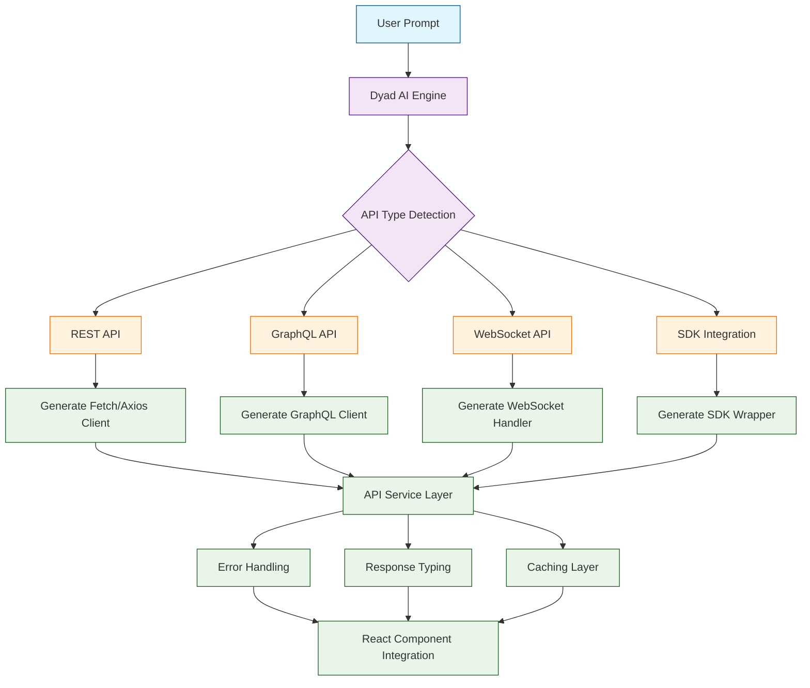
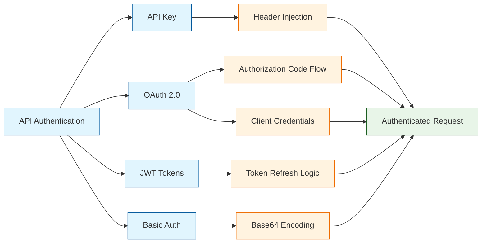
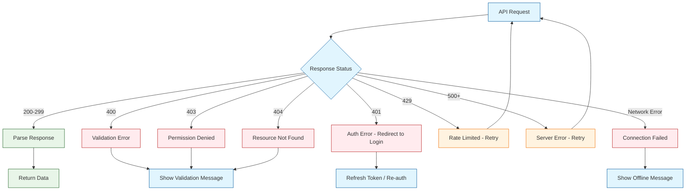

# Chapter 5: API Integration

APIs are the bridges that connect your Dyad applications to the broader ecosystem of services, data sources, and platforms. Whether you need to fetch weather data, process payments, send notifications, or integrate with AI services, mastering API integration is essential for building production-ready applications. In this chapter, we'll explore how Dyad simplifies connecting to external services while giving you full control over request handling, authentication, and error management.

## How API Integration Works in Dyad

Dyad generates the boilerplate code for API calls, handles environment variable management, and scaffolds error-handling patterns -- all from natural language prompts. The generated code follows modern best practices using `fetch`, Axios, or dedicated SDK clients depending on the service.



## REST API Integration

REST APIs form the backbone of most web service integrations. Dyad generates strongly-typed API clients that handle serialization, headers, and response parsing automatically.

### Making HTTP Requests

Use natural language prompts to describe the API interaction you need:

```
Integrate with a weather API to fetch current conditions and a 5-day forecast for any city
```

Dyad generates a service layer like this:

```typescript
// services/weatherApi.ts
interface WeatherData {
  city: string;
  temperature: number;
  humidity: number;
  description: string;
  icon: string;
}

interface ForecastDay {
  date: string;
  high: number;
  low: number;
  description: string;
  icon: string;
  precipitation: number;
}

interface WeatherResponse {
  current: WeatherData;
  forecast: ForecastDay[];
}

const API_BASE = "https://api.openweathermap.org/data/2.5";

export async function fetchWeather(city: string): Promise<WeatherResponse> {
  const apiKey = import.meta.env.VITE_WEATHER_API_KEY;

  const [currentRes, forecastRes] = await Promise.all([
    fetch(`${API_BASE}/weather?q=${encodeURIComponent(city)}&appid=${apiKey}&units=metric`),
    fetch(`${API_BASE}/forecast?q=${encodeURIComponent(city)}&appid=${apiKey}&units=metric`),
  ]);

  if (!currentRes.ok || !forecastRes.ok) {
    throw new Error(`Weather API error: ${currentRes.statusText}`);
  }

  const currentData = await currentRes.json();
  const forecastData = await forecastRes.json();

  return {
    current: {
      city: currentData.name,
      temperature: currentData.main.temp,
      humidity: currentData.main.humidity,
      description: currentData.weather[0].description,
      icon: currentData.weather[0].icon,
    },
    forecast: forecastData.list
      .filter((_: any, i: number) => i % 8 === 0)
      .map((day: any) => ({
        date: day.dt_txt,
        high: day.main.temp_max,
        low: day.main.temp_min,
        description: day.weather[0].description,
        icon: day.weather[0].icon,
        precipitation: day.pop * 100,
      })),
  };
}
```

### Using the API in a React Component

```tsx
// components/WeatherWidget.tsx
import React, { useState, useEffect } from "react";
import { fetchWeather, WeatherResponse } from "../services/weatherApi";

export function WeatherWidget() {
  const [city, setCity] = useState("San Francisco");
  const [weather, setWeather] = useState<WeatherResponse | null>(null);
  const [loading, setLoading] = useState(false);
  const [error, setError] = useState<string | null>(null);

  const loadWeather = async () => {
    setLoading(true);
    setError(null);
    try {
      const data = await fetchWeather(city);
      setWeather(data);
    } catch (err) {
      setError(err instanceof Error ? err.message : "Failed to fetch weather");
    } finally {
      setLoading(false);
    }
  };

  useEffect(() => {
    loadWeather();
  }, []);

  return (
    <div className="weather-widget">
      <div className="search-bar">
        <input
          value={city}
          onChange={(e) => setCity(e.target.value)}
          placeholder="Enter city name"
          onKeyDown={(e) => e.key === "Enter" && loadWeather()}
        />
        <button onClick={loadWeather} disabled={loading}>
          {loading ? "Loading..." : "Search"}
        </button>
      </div>

      {error && <div className="error-message">{error}</div>}

      {weather && (
        <>
          <div className="current-weather">
            <h2>{weather.current.city}</h2>
            <p className="temperature">{weather.current.temperature}C</p>
            <p>{weather.current.description}</p>
          </div>
          <div className="forecast">
            {weather.forecast.map((day) => (
              <div key={day.date} className="forecast-day">
                <span>{day.date}</span>
                <span>{day.high} / {day.low}</span>
              </div>
            ))}
          </div>
        </>
      )}
    </div>
  );
}
```

## Authentication Strategies

Different APIs require different authentication approaches. Dyad can generate the appropriate authentication flow based on your prompt.



### Authentication Methods Comparison

| Method | Use Case | Security Level | Complexity | Token Refresh |
|--------|----------|---------------|------------|---------------|
| API Key | Public APIs, server-to-server | Medium | Low | Not needed |
| OAuth 2.0 | User-authorized access | High | High | Automatic |
| JWT | Session management | High | Medium | Required |
| Basic Auth | Internal/simple APIs | Low | Low | Not needed |
| Bearer Token | REST APIs with auth servers | High | Medium | Varies |

### API Key Authentication

```typescript
// services/apiClient.ts
class ApiClient {
  private baseUrl: string;
  private apiKey: string;

  constructor(baseUrl: string) {
    this.baseUrl = baseUrl;
    this.apiKey = import.meta.env.VITE_API_KEY;
  }

  private getHeaders(): HeadersInit {
    return {
      "Content-Type": "application/json",
      "X-API-Key": this.apiKey,
    };
  }

  async get<T>(endpoint: string): Promise<T> {
    const response = await fetch(`${this.baseUrl}${endpoint}`, {
      headers: this.getHeaders(),
    });
    if (!response.ok) throw new Error(`GET ${endpoint} failed: ${response.statusText}`);
    return response.json();
  }

  async post<T>(endpoint: string, body: unknown): Promise<T> {
    const response = await fetch(`${this.baseUrl}${endpoint}`, {
      method: "POST",
      headers: this.getHeaders(),
      body: JSON.stringify(body),
    });
    if (!response.ok) throw new Error(`POST ${endpoint} failed: ${response.statusText}`);
    return response.json();
  }
}

export const apiClient = new ApiClient("https://api.example.com/v1");
```

### OAuth 2.0 Integration

```typescript
// services/oauthClient.ts
interface OAuthTokens {
  accessToken: string;
  refreshToken: string;
  expiresAt: number;
}

class OAuthClient {
  private tokens: OAuthTokens | null = null;
  private clientId: string;
  private clientSecret: string;
  private tokenUrl: string;

  constructor() {
    this.clientId = import.meta.env.VITE_OAUTH_CLIENT_ID;
    this.clientSecret = import.meta.env.VITE_OAUTH_CLIENT_SECRET;
    this.tokenUrl = import.meta.env.VITE_OAUTH_TOKEN_URL;
  }

  async authenticate(code: string): Promise<void> {
    const response = await fetch(this.tokenUrl, {
      method: "POST",
      headers: { "Content-Type": "application/x-www-form-urlencoded" },
      body: new URLSearchParams({
        grant_type: "authorization_code",
        code,
        client_id: this.clientId,
        client_secret: this.clientSecret,
      }),
    });

    const data = await response.json();
    this.tokens = {
      accessToken: data.access_token,
      refreshToken: data.refresh_token,
      expiresAt: Date.now() + data.expires_in * 1000,
    };
  }

  private async refreshIfNeeded(): Promise<string> {
    if (!this.tokens) throw new Error("Not authenticated");
    if (Date.now() < this.tokens.expiresAt - 60000) {
      return this.tokens.accessToken;
    }

    const response = await fetch(this.tokenUrl, {
      method: "POST",
      headers: { "Content-Type": "application/x-www-form-urlencoded" },
      body: new URLSearchParams({
        grant_type: "refresh_token",
        refresh_token: this.tokens.refreshToken,
        client_id: this.clientId,
      }),
    });

    const data = await response.json();
    this.tokens = {
      accessToken: data.access_token,
      refreshToken: data.refresh_token ?? this.tokens.refreshToken,
      expiresAt: Date.now() + data.expires_in * 1000,
    };
    return this.tokens.accessToken;
  }

  async authorizedFetch(url: string, options: RequestInit = {}): Promise<Response> {
    const token = await this.refreshIfNeeded();
    return fetch(url, {
      ...options,
      headers: {
        ...options.headers,
        Authorization: `Bearer ${token}`,
      },
    });
  }
}

export const oauthClient = new OAuthClient();
```

## Popular API Integrations

Dyad provides excellent support for commonly used third-party services. Here are prompt examples and the generated integration patterns.

### Payment Processing with Stripe

```
Integrate Stripe for payment processing with checkout sessions and subscription management
```

```typescript
// services/stripeService.ts
interface CreateCheckoutParams {
  priceId: string;
  successUrl: string;
  cancelUrl: string;
  customerEmail?: string;
}

interface SubscriptionStatus {
  id: string;
  status: "active" | "canceled" | "past_due" | "trialing";
  currentPeriodEnd: string;
  plan: string;
}

export async function createCheckoutSession(params: CreateCheckoutParams): Promise<string> {
  const response = await fetch("/api/stripe/create-checkout", {
    method: "POST",
    headers: { "Content-Type": "application/json" },
    body: JSON.stringify(params),
  });

  const { sessionUrl } = await response.json();
  return sessionUrl;
}

export async function getSubscriptionStatus(customerId: string): Promise<SubscriptionStatus> {
  const response = await fetch(`/api/stripe/subscription/${customerId}`);
  if (!response.ok) throw new Error("Failed to fetch subscription status");
  return response.json();
}

export async function cancelSubscription(subscriptionId: string): Promise<void> {
  await fetch(`/api/stripe/subscription/${subscriptionId}`, {
    method: "DELETE",
  });
}
```

### Email with SendGrid

```
Add email sending capability with templates and tracking using SendGrid
```

```typescript
// services/emailService.ts
interface EmailParams {
  to: string;
  subject: string;
  templateId?: string;
  dynamicData?: Record<string, string>;
  htmlContent?: string;
}

export async function sendEmail(params: EmailParams): Promise<{ messageId: string }> {
  const response = await fetch("/api/email/send", {
    method: "POST",
    headers: { "Content-Type": "application/json" },
    body: JSON.stringify({
      to: params.to,
      subject: params.subject,
      template_id: params.templateId,
      dynamic_template_data: params.dynamicData,
      html_content: params.htmlContent,
    }),
  });

  if (!response.ok) throw new Error("Failed to send email");
  return response.json();
}
```

### Analytics with Google Analytics

```
Connect Google Analytics for page view tracking and custom event monitoring
```

```typescript
// services/analytics.ts
declare global {
  interface Window {
    gtag: (...args: any[]) => void;
  }
}

export function trackPageView(path: string, title: string): void {
  window.gtag("config", import.meta.env.VITE_GA_MEASUREMENT_ID, {
    page_path: path,
    page_title: title,
  });
}

export function trackEvent(
  action: string,
  category: string,
  label?: string,
  value?: number
): void {
  window.gtag("event", action, {
    event_category: category,
    event_label: label,
    value: value,
  });
}

export function trackConversion(transactionId: string, amount: number): void {
  window.gtag("event", "purchase", {
    transaction_id: transactionId,
    value: amount,
    currency: "USD",
  });
}
```

## API Management Best Practices

### Building a Reusable API Hook

Dyad can generate custom React hooks that encapsulate API call patterns with loading states, error handling, and caching.

```tsx
// hooks/useApi.ts
import { useState, useEffect, useCallback } from "react";

interface UseApiResult<T> {
  data: T | null;
  loading: boolean;
  error: string | null;
  refetch: () => Promise<void>;
}

export function useApi<T>(
  fetchFn: () => Promise<T>,
  dependencies: any[] = []
): UseApiResult<T> {
  const [data, setData] = useState<T | null>(null);
  const [loading, setLoading] = useState(true);
  const [error, setError] = useState<string | null>(null);

  const execute = useCallback(async () => {
    setLoading(true);
    setError(null);
    try {
      const result = await fetchFn();
      setData(result);
    } catch (err) {
      setError(err instanceof Error ? err.message : "An error occurred");
    } finally {
      setLoading(false);
    }
  }, dependencies);

  useEffect(() => {
    execute();
  }, [execute]);

  return { data, loading, error, refetch: execute };
}
```

### Rate Limiting and Retry Logic

```typescript
// services/rateLimiter.ts
interface RetryConfig {
  maxRetries: number;
  baseDelay: number;
  maxDelay: number;
}

const defaultConfig: RetryConfig = {
  maxRetries: 3,
  baseDelay: 1000,
  maxDelay: 10000,
};

export async function fetchWithRetry(
  url: string,
  options: RequestInit = {},
  config: RetryConfig = defaultConfig
): Promise<Response> {
  let lastError: Error | null = null;

  for (let attempt = 0; attempt <= config.maxRetries; attempt++) {
    try {
      const response = await fetch(url, options);

      if (response.status === 429) {
        const retryAfter = response.headers.get("Retry-After");
        const delay = retryAfter
          ? parseInt(retryAfter) * 1000
          : Math.min(config.baseDelay * Math.pow(2, attempt), config.maxDelay);

        console.warn(`Rate limited. Retrying in ${delay}ms (attempt ${attempt + 1})`);
        await new Promise((resolve) => setTimeout(resolve, delay));
        continue;
      }

      if (!response.ok && response.status >= 500) {
        throw new Error(`Server error: ${response.status}`);
      }

      return response;
    } catch (err) {
      lastError = err instanceof Error ? err : new Error(String(err));
      if (attempt < config.maxRetries) {
        const delay = Math.min(
          config.baseDelay * Math.pow(2, attempt),
          config.maxDelay
        );
        await new Promise((resolve) => setTimeout(resolve, delay));
      }
    }
  }

  throw lastError ?? new Error("Request failed after retries");
}
```

### Comprehensive Error Handling



```typescript
// services/errorHandler.ts
export class ApiError extends Error {
  constructor(
    message: string,
    public status: number,
    public code?: string,
    public details?: Record<string, string[]>
  ) {
    super(message);
    this.name = "ApiError";
  }
}

export async function handleApiResponse<T>(response: Response): Promise<T> {
  if (response.ok) {
    return response.json();
  }

  const errorBody = await response.json().catch(() => ({}));

  switch (response.status) {
    case 400:
      throw new ApiError(
        errorBody.message || "Invalid request",
        400,
        "VALIDATION_ERROR",
        errorBody.errors
      );
    case 401:
      throw new ApiError("Authentication required", 401, "UNAUTHORIZED");
    case 403:
      throw new ApiError("Permission denied", 403, "FORBIDDEN");
    case 404:
      throw new ApiError("Resource not found", 404, "NOT_FOUND");
    case 429:
      throw new ApiError("Rate limit exceeded", 429, "RATE_LIMITED");
    default:
      throw new ApiError(
        errorBody.message || "An unexpected error occurred",
        response.status,
        "SERVER_ERROR"
      );
  }
}
```

## Environment Variable Management

Dyad helps you manage API keys and secrets securely using environment variables.

| Variable Pattern | Purpose | Example |
|-----------------|---------|---------|
| `VITE_*` | Client-side variables (public) | `VITE_GA_MEASUREMENT_ID` |
| `API_*` | Server-side API keys (private) | `API_STRIPE_SECRET_KEY` |
| `DATABASE_*` | Database connection strings | `DATABASE_URL` |
| `OAUTH_*` | OAuth credentials | `OAUTH_CLIENT_SECRET` |

```bash
# .env.local (never commit this file)
VITE_API_BASE_URL=https://api.example.com/v1
VITE_WEATHER_API_KEY=your_weather_api_key
VITE_GA_MEASUREMENT_ID=G-XXXXXXXXXX

# Server-side only
API_STRIPE_SECRET_KEY=sk_live_xxxxx
API_SENDGRID_KEY=SG.xxxxx
```

## GraphQL API Integration

For services that offer GraphQL endpoints, Dyad generates typed queries and mutations.

```typescript
// services/graphqlClient.ts
interface GraphQLResponse<T> {
  data: T;
  errors?: Array<{ message: string; path: string[] }>;
}

export async function graphqlRequest<T>(
  query: string,
  variables?: Record<string, unknown>
): Promise<T> {
  const response = await fetch(import.meta.env.VITE_GRAPHQL_ENDPOINT, {
    method: "POST",
    headers: {
      "Content-Type": "application/json",
      Authorization: `Bearer ${localStorage.getItem("auth_token")}`,
    },
    body: JSON.stringify({ query, variables }),
  });

  const result: GraphQLResponse<T> = await response.json();

  if (result.errors?.length) {
    throw new Error(result.errors.map((e) => e.message).join(", "));
  }

  return result.data;
}

// Usage example: fetching user profile
const GET_USER_PROFILE = `
  query GetUserProfile($userId: ID!) {
    user(id: $userId) {
      id
      name
      email
      avatar
      posts {
        id
        title
        createdAt
      }
    }
  }
`;

interface UserProfile {
  user: {
    id: string;
    name: string;
    email: string;
    avatar: string;
    posts: Array<{ id: string; title: string; createdAt: string }>;
  };
}

export async function getUserProfile(userId: string): Promise<UserProfile> {
  return graphqlRequest<UserProfile>(GET_USER_PROFILE, { userId });
}
```

---

## Summary

API integration is the key to connecting your Dyad applications to the wider world of services and data. In this chapter, you learned how to generate REST and GraphQL clients from natural language prompts, implement multiple authentication strategies, integrate popular third-party services like Stripe, SendGrid, and Google Analytics, and build robust error handling with retry logic. Dyad's AI engine handles the boilerplate while you focus on describing the interactions your application needs.

## Key Takeaways

- **Prompt-driven API integration** -- Describe the service you want to connect and Dyad generates typed API clients automatically.
- **Authentication flexibility** -- Support for API keys, OAuth 2.0, JWT, and bearer tokens with automatic token refresh.
- **Error resilience** -- Implement rate limiting, exponential backoff, and comprehensive error classification to build production-grade integrations.
- **Environment security** -- Use `VITE_*` prefixed variables for client-side keys and keep server secrets out of the browser bundle.
- **Reusable patterns** -- Custom hooks like `useApi` and utility functions like `fetchWithRetry` keep your codebase clean and consistent.

## Next Steps

With your APIs connected, your applications can now communicate with external services. In the next chapter, we will explore how to customize the appearance and behavior of your Dyad applications with advanced styling techniques, theming systems, and responsive design patterns.

**Ready to customize? Continue to [Chapter 6: Customization and Styling](06-customization-styling.md)**

---

*Built with insights from the [Dyad](https://github.com/dyad-sh/dyad) project.*
