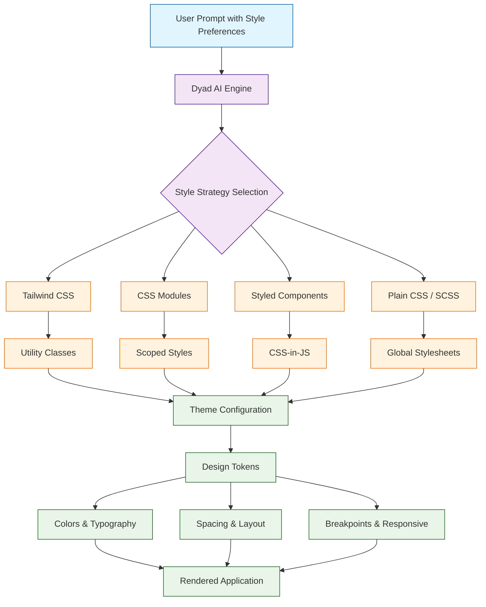
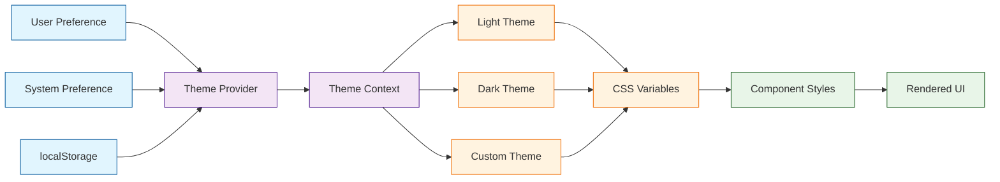
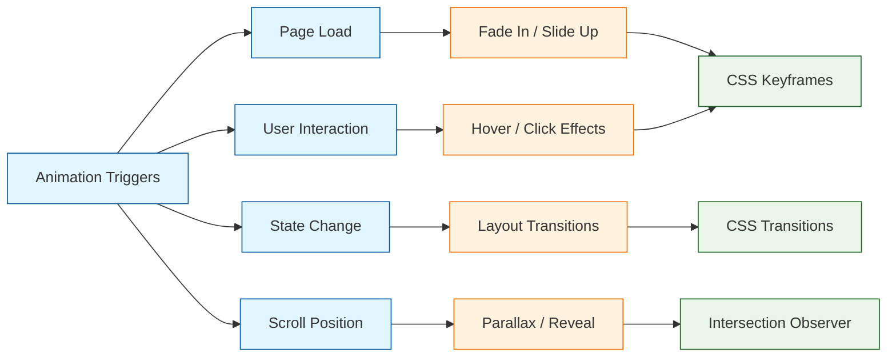

# Chapter 6: Customization and Styling

A great application is not just functional -- it needs to look and feel polished. Dyad generates visually appealing applications out of the box, but the real power comes from customizing themes, layouts, animations, and responsive behavior to match your brand and user expectations. In this chapter, we will explore the full spectrum of styling capabilities available in Dyad, from CSS framework integration to building complete design systems.

## Styling Architecture in Dyad

Dyad generates styles using the approach best suited to your prompt and chosen tech stack. Understanding the styling pipeline helps you make informed decisions about customization.



## CSS Framework Comparison

Dyad supports multiple CSS frameworks. Choosing the right one depends on your project requirements and personal preference.

| Framework | Approach | Bundle Size | Learning Curve | Best For |
|-----------|----------|------------|----------------|----------|
| Tailwind CSS | Utility-first | Small (purged) | Medium | Rapid prototyping, custom designs |
| CSS Modules | Scoped classes | Minimal | Low | Component isolation, large projects |
| Styled Components | CSS-in-JS | Medium | Medium | Dynamic theming, React-native compat |
| Material UI | Component library | Large | Medium | Enterprise apps, Material Design |
| Ant Design | Component library | Large | Medium | Admin dashboards, data-heavy apps |
| Plain CSS / SCSS | Traditional | Minimal | Low | Full control, legacy projects |

## Tailwind CSS Integration

Tailwind CSS is Dyad's default styling framework. It provides utility classes that map directly to CSS properties, enabling rapid UI development without leaving your markup.

### Configuring Tailwind in Dyad

```
Create a dashboard app styled with Tailwind CSS using a custom color palette and dark mode
```

Dyad generates a tailored Tailwind configuration:

```typescript
// tailwind.config.ts
import type { Config } from "tailwindcss";

const config: Config = {
  content: ["./index.html", "./src/**/*.{js,ts,jsx,tsx}"],
  darkMode: "class",
  theme: {
    extend: {
      colors: {
        primary: {
          50: "#eff6ff",
          100: "#dbeafe",
          200: "#bfdbfe",
          300: "#93c5fd",
          400: "#60a5fa",
          500: "#3b82f6",
          600: "#2563eb",
          700: "#1d4ed8",
          800: "#1e40af",
          900: "#1e3a8a",
          950: "#172554",
        },
        surface: {
          light: "#ffffff",
          dark: "#1e1e2e",
        },
        accent: {
          DEFAULT: "#8b5cf6",
          hover: "#7c3aed",
        },
      },
      fontFamily: {
        sans: ["Inter", "system-ui", "sans-serif"],
        mono: ["JetBrains Mono", "monospace"],
      },
      spacing: {
        18: "4.5rem",
        88: "22rem",
        112: "28rem",
      },
      borderRadius: {
        "4xl": "2rem",
      },
      animation: {
        "fade-in": "fadeIn 0.3s ease-in-out",
        "slide-up": "slideUp 0.4s ease-out",
        "pulse-soft": "pulseSoft 2s infinite",
      },
      keyframes: {
        fadeIn: {
          "0%": { opacity: "0" },
          "100%": { opacity: "1" },
        },
        slideUp: {
          "0%": { transform: "translateY(20px)", opacity: "0" },
          "100%": { transform: "translateY(0)", opacity: "1" },
        },
        pulseSoft: {
          "0%, 100%": { opacity: "1" },
          "50%": { opacity: "0.7" },
        },
      },
    },
  },
  plugins: [],
};

export default config;
```

### Building a Styled Card Component

```tsx
// components/DashboardCard.tsx
import React from "react";

interface DashboardCardProps {
  title: string;
  value: string | number;
  change?: number;
  icon: React.ReactNode;
  trend?: "up" | "down" | "neutral";
}

export function DashboardCard({ title, value, change, icon, trend }: DashboardCardProps) {
  const trendColors = {
    up: "text-green-500 bg-green-50 dark:bg-green-900/20",
    down: "text-red-500 bg-red-50 dark:bg-red-900/20",
    neutral: "text-gray-500 bg-gray-50 dark:bg-gray-900/20",
  };

  return (
    <div className="bg-white dark:bg-surface-dark rounded-2xl shadow-sm border
                    border-gray-100 dark:border-gray-800 p-6
                    hover:shadow-md transition-shadow duration-200
                    animate-fade-in">
      <div className="flex items-center justify-between mb-4">
        <div className="p-2 bg-primary-50 dark:bg-primary-900/30 rounded-xl">
          {icon}
        </div>
        {change !== undefined && trend && (
          <span className={`text-sm font-medium px-2.5 py-1 rounded-full
                           ${trendColors[trend]}`}>
            {trend === "up" ? "+" : ""}{change}%
          </span>
        )}
      </div>
      <h3 className="text-sm font-medium text-gray-500 dark:text-gray-400 mb-1">
        {title}
      </h3>
      <p className="text-2xl font-bold text-gray-900 dark:text-white">
        {value}
      </p>
    </div>
  );
}
```

## Theme System and Dark Mode

Dyad can generate complete theme systems that support light mode, dark mode, and custom brand themes with seamless switching.



### Building a Theme Provider

```tsx
// context/ThemeContext.tsx
import React, { createContext, useContext, useState, useEffect } from "react";

type ThemeMode = "light" | "dark" | "system";

interface ThemeColors {
  background: string;
  surface: string;
  text: string;
  textSecondary: string;
  primary: string;
  primaryHover: string;
  border: string;
  shadow: string;
}

interface ThemeContextType {
  mode: ThemeMode;
  setMode: (mode: ThemeMode) => void;
  colors: ThemeColors;
  isDark: boolean;
}

const lightColors: ThemeColors = {
  background: "#f8fafc",
  surface: "#ffffff",
  text: "#0f172a",
  textSecondary: "#64748b",
  primary: "#3b82f6",
  primaryHover: "#2563eb",
  border: "#e2e8f0",
  shadow: "rgba(0, 0, 0, 0.05)",
};

const darkColors: ThemeColors = {
  background: "#0f172a",
  surface: "#1e293b",
  text: "#f1f5f9",
  textSecondary: "#94a3b8",
  primary: "#60a5fa",
  primaryHover: "#93c5fd",
  border: "#334155",
  shadow: "rgba(0, 0, 0, 0.3)",
};

const ThemeContext = createContext<ThemeContextType | null>(null);

export function ThemeProvider({ children }: { children: React.ReactNode }) {
  const [mode, setMode] = useState<ThemeMode>(() => {
    return (localStorage.getItem("theme") as ThemeMode) || "system";
  });

  const systemDark = window.matchMedia("(prefers-color-scheme: dark)").matches;
  const isDark = mode === "dark" || (mode === "system" && systemDark);
  const colors = isDark ? darkColors : lightColors;

  useEffect(() => {
    localStorage.setItem("theme", mode);
    document.documentElement.classList.toggle("dark", isDark);
  }, [mode, isDark]);

  useEffect(() => {
    const mediaQuery = window.matchMedia("(prefers-color-scheme: dark)");
    const handler = () => {
      if (mode === "system") {
        document.documentElement.classList.toggle("dark", mediaQuery.matches);
      }
    };
    mediaQuery.addEventListener("change", handler);
    return () => mediaQuery.removeEventListener("change", handler);
  }, [mode]);

  return (
    <ThemeContext.Provider value={{ mode, setMode, colors, isDark }}>
      {children}
    </ThemeContext.Provider>
  );
}

export function useTheme(): ThemeContextType {
  const context = useContext(ThemeContext);
  if (!context) throw new Error("useTheme must be used within ThemeProvider");
  return context;
}
```

### Theme Toggle Component

```tsx
// components/ThemeToggle.tsx
import React from "react";
import { useTheme } from "../context/ThemeContext";

export function ThemeToggle() {
  const { mode, setMode } = useTheme();

  const modes: Array<{ value: "light" | "dark" | "system"; label: string }> = [
    { value: "light", label: "Light" },
    { value: "dark", label: "Dark" },
    { value: "system", label: "System" },
  ];

  return (
    <div className="flex items-center bg-gray-100 dark:bg-gray-800 rounded-lg p-1">
      {modes.map(({ value, label }) => (
        <button
          key={value}
          onClick={() => setMode(value)}
          className={`px-3 py-1.5 text-sm font-medium rounded-md transition-all
            ${mode === value
              ? "bg-white dark:bg-gray-700 text-gray-900 dark:text-white shadow-sm"
              : "text-gray-500 dark:text-gray-400 hover:text-gray-700 dark:hover:text-gray-300"
            }`}
        >
          {label}
        </button>
      ))}
    </div>
  );
}
```

## Responsive Design Patterns

Dyad generates responsive layouts that adapt to any screen size. Understanding the breakpoint system helps you fine-tune the mobile experience.

### Breakpoint Reference

| Breakpoint | Min Width | Target Devices | Tailwind Prefix |
|-----------|-----------|----------------|-----------------|
| Default | 0px | Mobile phones | (none) |
| `sm` | 640px | Large phones, small tablets | `sm:` |
| `md` | 768px | Tablets | `md:` |
| `lg` | 1024px | Small laptops | `lg:` |
| `xl` | 1280px | Desktops | `xl:` |
| `2xl` | 1536px | Large monitors | `2xl:` |

### Responsive Layout Component

```tsx
// components/ResponsiveLayout.tsx
import React from "react";

interface ResponsiveLayoutProps {
  sidebar: React.ReactNode;
  content: React.ReactNode;
  header: React.ReactNode;
}

export function ResponsiveLayout({ sidebar, content, header }: ResponsiveLayoutProps) {
  const [sidebarOpen, setSidebarOpen] = React.useState(false);

  return (
    <div className="min-h-screen bg-gray-50 dark:bg-gray-900">
      {/* Mobile header */}
      <div className="lg:hidden fixed top-0 left-0 right-0 z-30
                      bg-white dark:bg-gray-800 border-b border-gray-200
                      dark:border-gray-700 px-4 py-3 flex items-center justify-between">
        <button
          onClick={() => setSidebarOpen(!sidebarOpen)}
          className="p-2 rounded-lg hover:bg-gray-100 dark:hover:bg-gray-700"
        >
          <span className="sr-only">Toggle sidebar</span>
          <svg className="w-6 h-6" fill="none" viewBox="0 0 24 24" stroke="currentColor">
            <path strokeLinecap="round" strokeLinejoin="round" strokeWidth={2}
                  d="M4 6h16M4 12h16M4 18h16" />
          </svg>
        </button>
        {header}
      </div>

      {/* Sidebar overlay for mobile */}
      {sidebarOpen && (
        <div
          className="lg:hidden fixed inset-0 z-40 bg-black/50"
          onClick={() => setSidebarOpen(false)}
        />
      )}

      {/* Sidebar */}
      <aside className={`fixed top-0 left-0 z-50 h-full w-72
                         bg-white dark:bg-gray-800 border-r border-gray-200
                         dark:border-gray-700 transform transition-transform
                         duration-300 ease-in-out
                         lg:translate-x-0 lg:static lg:z-auto
                         ${sidebarOpen ? "translate-x-0" : "-translate-x-full"}`}>
        {sidebar}
      </aside>

      {/* Main content */}
      <main className="lg:ml-72 pt-16 lg:pt-0">
        <div className="hidden lg:block">{header}</div>
        <div className="p-4 md:p-6 lg:p-8 max-w-7xl mx-auto">
          {content}
        </div>
      </main>
    </div>
  );
}
```

## CSS-in-JS with Styled Components

For projects that prefer CSS-in-JS, Dyad can generate styled-components with full TypeScript support and dynamic theming.

```
Build a profile card component using styled-components with hover effects and theme support
```

```tsx
// components/ProfileCard.styled.tsx
import styled, { css, keyframes } from "styled-components";

const shimmer = keyframes`
  0% { background-position: -200% 0; }
  100% { background-position: 200% 0; }
`;

interface CardProps {
  elevated?: boolean;
}

export const Card = styled.div<CardProps>`
  background: ${({ theme }) => theme.colors.surface};
  border-radius: 16px;
  padding: 24px;
  border: 1px solid ${({ theme }) => theme.colors.border};
  transition: all 0.3s ease;
  position: relative;
  overflow: hidden;

  ${({ elevated }) =>
    elevated &&
    css`
      box-shadow: 0 4px 6px -1px rgba(0, 0, 0, 0.1),
                  0 2px 4px -2px rgba(0, 0, 0, 0.1);
    `}

  &:hover {
    transform: translateY(-2px);
    box-shadow: 0 10px 25px -5px rgba(0, 0, 0, 0.15),
                0 8px 10px -6px rgba(0, 0, 0, 0.1);
  }

  &::before {
    content: "";
    position: absolute;
    top: 0;
    left: 0;
    right: 0;
    height: 4px;
    background: linear-gradient(
      90deg,
      ${({ theme }) => theme.colors.primary},
      ${({ theme }) => theme.colors.accent}
    );
  }
`;

export const Avatar = styled.img`
  width: 80px;
  height: 80px;
  border-radius: 50%;
  object-fit: cover;
  border: 3px solid ${({ theme }) => theme.colors.primary};
  margin-bottom: 16px;
`;

export const Name = styled.h3`
  font-size: 1.25rem;
  font-weight: 700;
  color: ${({ theme }) => theme.colors.text};
  margin-bottom: 4px;
`;

export const Role = styled.p`
  font-size: 0.875rem;
  color: ${({ theme }) => theme.colors.textSecondary};
  margin-bottom: 16px;
`;

export const SkeletonLoader = styled.div`
  background: linear-gradient(
    90deg,
    ${({ theme }) => theme.colors.border} 25%,
    ${({ theme }) => theme.colors.surface} 50%,
    ${({ theme }) => theme.colors.border} 75%
  );
  background-size: 200% 100%;
  animation: ${shimmer} 1.5s infinite;
  border-radius: 8px;
  height: 20px;
`;
```

## Animation and Transitions

Smooth animations elevate the user experience. Dyad generates CSS transitions, keyframe animations, and integrates with animation libraries.

### Animation Patterns



### Scroll-Triggered Animations

```tsx
// hooks/useScrollAnimation.ts
import { useEffect, useRef, useState } from "react";

interface ScrollAnimationOptions {
  threshold?: number;
  rootMargin?: string;
  triggerOnce?: boolean;
}

export function useScrollAnimation(options: ScrollAnimationOptions = {}) {
  const { threshold = 0.1, rootMargin = "0px", triggerOnce = true } = options;
  const ref = useRef<HTMLDivElement>(null);
  const [isVisible, setIsVisible] = useState(false);

  useEffect(() => {
    const element = ref.current;
    if (!element) return;

    const observer = new IntersectionObserver(
      ([entry]) => {
        if (entry.isIntersecting) {
          setIsVisible(true);
          if (triggerOnce) observer.unobserve(element);
        } else if (!triggerOnce) {
          setIsVisible(false);
        }
      },
      { threshold, rootMargin }
    );

    observer.observe(element);
    return () => observer.disconnect();
  }, [threshold, rootMargin, triggerOnce]);

  return { ref, isVisible };
}

// Usage in a component
export function AnimatedSection({ children }: { children: React.ReactNode }) {
  const { ref, isVisible } = useScrollAnimation({ threshold: 0.2 });

  return (
    <div
      ref={ref}
      className={`transition-all duration-700 ease-out
        ${isVisible
          ? "opacity-100 translate-y-0"
          : "opacity-0 translate-y-8"
        }`}
    >
      {children}
    </div>
  );
}
```

### Micro-Interactions

```tsx
// components/AnimatedButton.tsx
import React, { useState } from "react";

interface AnimatedButtonProps {
  children: React.ReactNode;
  onClick?: () => void;
  variant?: "primary" | "secondary" | "ghost";
  loading?: boolean;
}

export function AnimatedButton({
  children,
  onClick,
  variant = "primary",
  loading = false,
}: AnimatedButtonProps) {
  const [ripple, setRipple] = useState<{ x: number; y: number } | null>(null);

  const baseStyles = "relative overflow-hidden px-6 py-3 rounded-xl font-medium \
                       transition-all duration-200 focus:outline-none focus:ring-2 \
                       focus:ring-offset-2 disabled:opacity-50 disabled:cursor-not-allowed";

  const variantStyles = {
    primary: "bg-primary-600 text-white hover:bg-primary-700 \
              focus:ring-primary-500 active:scale-[0.98]",
    secondary: "bg-gray-100 dark:bg-gray-800 text-gray-900 dark:text-white \
                hover:bg-gray-200 dark:hover:bg-gray-700 focus:ring-gray-500",
    ghost: "bg-transparent text-primary-600 dark:text-primary-400 \
            hover:bg-primary-50 dark:hover:bg-primary-900/20 focus:ring-primary-500",
  };

  const handleClick = (e: React.MouseEvent<HTMLButtonElement>) => {
    const rect = e.currentTarget.getBoundingClientRect();
    setRipple({ x: e.clientX - rect.left, y: e.clientY - rect.top });
    setTimeout(() => setRipple(null), 600);
    onClick?.();
  };

  return (
    <button
      className={`${baseStyles} ${variantStyles[variant]}`}
      onClick={handleClick}
      disabled={loading}
    >
      {ripple && (
        <span
          className="absolute rounded-full bg-white/30 animate-ping"
          style={{
            left: ripple.x - 10,
            top: ripple.y - 10,
            width: 20,
            height: 20,
          }}
        />
      )}
      {loading ? (
        <span className="flex items-center gap-2">
          <svg className="animate-spin h-4 w-4" viewBox="0 0 24 24">
            <circle className="opacity-25" cx="12" cy="12" r="10"
                    stroke="currentColor" strokeWidth="4" fill="none" />
            <path className="opacity-75" fill="currentColor"
                  d="M4 12a8 8 0 018-8V0C5.373 0 0 5.373 0 12h4z" />
          </svg>
          Loading...
        </span>
      ) : (
        children
      )}
    </button>
  );
}
```

## Design Tokens and Style Constants

Design tokens centralize your visual language into reusable values. Dyad generates token files that keep styling consistent across your entire application.

```typescript
// styles/tokens.ts
export const tokens = {
  colors: {
    brand: {
      primary: "#3b82f6",
      secondary: "#8b5cf6",
      accent: "#f59e0b",
    },
    semantic: {
      success: "#22c55e",
      warning: "#f59e0b",
      error: "#ef4444",
      info: "#3b82f6",
    },
    neutral: {
      50: "#f8fafc",
      100: "#f1f5f9",
      200: "#e2e8f0",
      300: "#cbd5e1",
      400: "#94a3b8",
      500: "#64748b",
      600: "#475569",
      700: "#334155",
      800: "#1e293b",
      900: "#0f172a",
    },
  },
  typography: {
    fontFamily: {
      sans: "'Inter', system-ui, sans-serif",
      mono: "'JetBrains Mono', monospace",
    },
    fontSize: {
      xs: "0.75rem",
      sm: "0.875rem",
      base: "1rem",
      lg: "1.125rem",
      xl: "1.25rem",
      "2xl": "1.5rem",
      "3xl": "1.875rem",
      "4xl": "2.25rem",
    },
    fontWeight: {
      normal: 400,
      medium: 500,
      semibold: 600,
      bold: 700,
    },
  },
  spacing: {
    px: "1px",
    0.5: "0.125rem",
    1: "0.25rem",
    2: "0.5rem",
    3: "0.75rem",
    4: "1rem",
    6: "1.5rem",
    8: "2rem",
    12: "3rem",
    16: "4rem",
  },
  radii: {
    sm: "0.25rem",
    md: "0.375rem",
    lg: "0.5rem",
    xl: "0.75rem",
    "2xl": "1rem",
    full: "9999px",
  },
  shadows: {
    sm: "0 1px 2px rgba(0, 0, 0, 0.05)",
    md: "0 4px 6px -1px rgba(0, 0, 0, 0.1)",
    lg: "0 10px 15px -3px rgba(0, 0, 0, 0.1)",
    xl: "0 20px 25px -5px rgba(0, 0, 0, 0.1)",
  },
} as const;
```

## Accessibility and Inclusive Styling

Proper styling goes beyond appearance -- it ensures your application is usable by everyone.

| Concern | Guideline | Implementation |
|---------|-----------|----------------|
| Color contrast | WCAG AA: 4.5:1 for text | Use contrast-checking tools, avoid light-on-light |
| Focus indicators | Visible focus rings on all interactive elements | `focus:ring-2 focus:ring-primary-500` |
| Font sizing | Minimum 16px for body text | Use `rem` units, respect user preferences |
| Motion sensitivity | Respect `prefers-reduced-motion` | Disable animations when preference is set |
| Screen readers | Meaningful alt text and ARIA labels | `aria-label`, `sr-only` classes |

```tsx
// styles/accessibility.css (generated by Dyad)
@media (prefers-reduced-motion: reduce) {
  *,
  *::before,
  *::after {
    animation-duration: 0.01ms !important;
    animation-iteration-count: 1 !important;
    transition-duration: 0.01ms !important;
    scroll-behavior: auto !important;
  }
}

:focus-visible {
  outline: 2px solid #3b82f6;
  outline-offset: 2px;
}

.sr-only {
  position: absolute;
  width: 1px;
  height: 1px;
  padding: 0;
  margin: -1px;
  overflow: hidden;
  clip: rect(0, 0, 0, 0);
  white-space: nowrap;
  border-width: 0;
}
```

---

## Summary

Customization and styling transform functional applications into polished, brand-aligned products. In this chapter, you learned how to configure Tailwind CSS with custom themes and design tokens, build a complete dark mode system with the ThemeProvider pattern, create responsive layouts that adapt from mobile to desktop, implement CSS-in-JS with styled-components for dynamic theming, add scroll-triggered animations and micro-interactions, and ensure accessibility compliance in your styling approach. Dyad generates production-quality styles from natural language, giving you a strong foundation that you can refine to match any design vision.

## Key Takeaways

- **Framework flexibility** -- Dyad supports Tailwind CSS, CSS Modules, styled-components, and traditional CSS/SCSS depending on your preference.
- **Theme systems** -- Build complete light/dark/custom theme support with React Context and CSS variables for seamless switching.
- **Responsive by default** -- Use Tailwind's breakpoint system or custom media queries to create layouts that work on every device.
- **Animation with purpose** -- Add transitions and animations that enhance usability rather than distract, always respecting `prefers-reduced-motion`.
- **Design tokens** -- Centralize colors, typography, spacing, and shadows into a single source of truth for consistent styling.
- **Accessibility first** -- Ensure color contrast, focus indicators, and motion sensitivity are addressed in every component.

## Next Steps

Your applications now look and feel professional. In the next chapter, we will explore testing and validation strategies to ensure your Dyad-generated code is reliable, performant, and bug-free before it reaches users.

**Ready to test? Continue to [Chapter 7: Testing and Validation](07-testing-validation.md)**

---

*Built with insights from the [Dyad](https://github.com/dyad-sh/dyad) project.*
