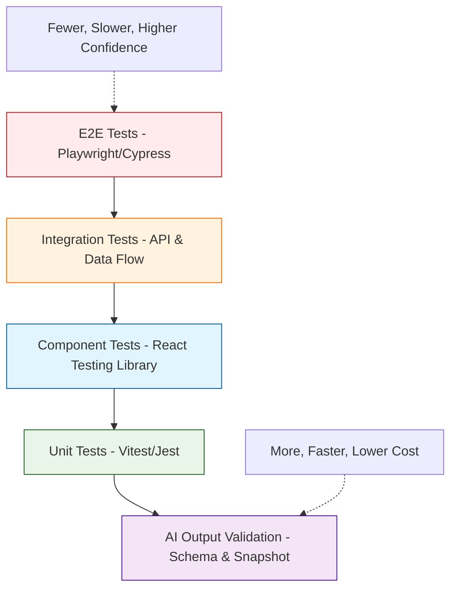
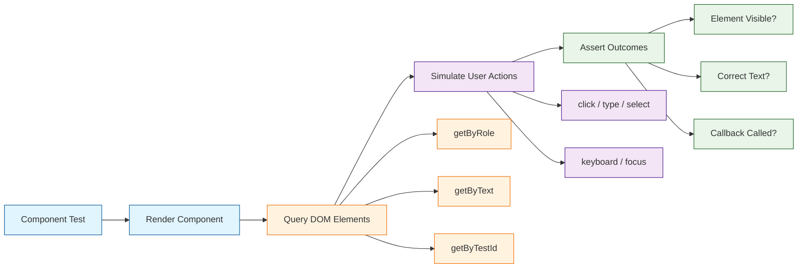
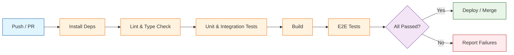

# Chapter 7: Testing and Validation

Welcome to **Chapter 7: Testing and Validation**. In this part of **Dyad Tutorial: Local-First AI App Building**, you will build an intuitive mental model first, then move into concrete implementation details and practical production tradeoffs.


AI-generated code needs the same rigorous testing as hand-written code -- sometimes more. Because Dyad produces entire components and service layers from natural language prompts, having a comprehensive testing strategy ensures that the generated output behaves correctly, handles edge cases, and remains maintainable as your application evolves. In this chapter, we will cover unit testing, integration testing, end-to-end testing, and validation techniques specifically tailored for Dyad applications.

## The Testing Pyramid for Dyad Apps

Testing Dyad applications follows the same pyramid principle used in traditional development, but with an additional layer of AI output validation to catch prompt-related regressions.



## Testing Strategy Comparison

| Test Type | Scope | Speed | Tools | When to Use |
|-----------|-------|-------|-------|------------|
| Unit | Single function/hook | Very fast | Vitest, Jest | Business logic, utilities, hooks |
| Component | Single React component | Fast | React Testing Library | UI behavior, rendering, events |
| Integration | Multiple modules together | Medium | Vitest, MSW | API calls, data flows, state |
| E2E | Full user workflows | Slow | Playwright, Cypress | Critical user paths, regression |
| Snapshot | Rendered output comparison | Fast | Vitest | UI regression, generated markup |
| Schema | Data structure validation | Very fast | Zod, Yup | API responses, form data |

## Setting Up the Test Environment

Dyad generates projects with Vite, so Vitest is the natural testing framework. Here is a typical test configuration that Dyad scaffolds.

```typescript
// vitest.config.ts
import { defineConfig } from "vitest/config";
import react from "@vitejs/plugin-react";
import path from "path";

export default defineConfig({
  plugins: [react()],
  test: {
    globals: true,
    environment: "jsdom",
    setupFiles: ["./src/test/setup.ts"],
    css: true,
    coverage: {
      provider: "v8",
      reporter: ["text", "json", "html"],
      exclude: [
        "node_modules/",
        "src/test/",
        "**/*.d.ts",
        "**/*.config.*",
      ],
      thresholds: {
        branches: 80,
        functions: 80,
        lines: 80,
        statements: 80,
      },
    },
  },
  resolve: {
    alias: {
      "@": path.resolve(__dirname, "./src"),
    },
  },
});
```

### Test Setup File

```typescript
// src/test/setup.ts
import "@testing-library/jest-dom";
import { cleanup } from "@testing-library/react";
import { afterEach, vi } from "vitest";

// Automatically clean up after each test
afterEach(() => {
  cleanup();
});

// Mock IntersectionObserver for components using scroll animations
class MockIntersectionObserver implements IntersectionObserver {
  readonly root: Element | null = null;
  readonly rootMargin: string = "";
  readonly thresholds: ReadonlyArray<number> = [];

  constructor(private callback: IntersectionObserverCallback) {}
  observe() {}
  unobserve() {}
  disconnect() {}
  takeRecords(): IntersectionObserverEntry[] { return []; }
}

vi.stubGlobal("IntersectionObserver", MockIntersectionObserver);

// Mock matchMedia for theme tests
Object.defineProperty(window, "matchMedia", {
  writable: true,
  value: vi.fn().mockImplementation((query: string) => ({
    matches: false,
    media: query,
    onchange: null,
    addListener: vi.fn(),
    removeListener: vi.fn(),
    addEventListener: vi.fn(),
    removeEventListener: vi.fn(),
    dispatchEvent: vi.fn(),
  })),
});
```

## Unit Testing

Unit tests verify individual functions, utilities, and custom hooks in isolation. Dyad-generated utility functions should be tested for correctness and edge cases.

### Testing Utility Functions

```typescript
// utils/formatters.ts
export function formatCurrency(amount: number, currency: string = "USD"): string {
  return new Intl.NumberFormat("en-US", {
    style: "currency",
    currency,
  }).format(amount);
}

export function formatRelativeTime(date: Date): string {
  const now = new Date();
  const diffMs = now.getTime() - date.getTime();
  const diffMinutes = Math.floor(diffMs / 60000);
  const diffHours = Math.floor(diffMs / 3600000);
  const diffDays = Math.floor(diffMs / 86400000);

  if (diffMinutes < 1) return "just now";
  if (diffMinutes < 60) return `${diffMinutes}m ago`;
  if (diffHours < 24) return `${diffHours}h ago`;
  if (diffDays < 7) return `${diffDays}d ago`;
  return date.toLocaleDateString();
}

export function truncateText(text: string, maxLength: number): string {
  if (text.length <= maxLength) return text;
  return text.slice(0, maxLength).trimEnd() + "...";
}
```

```typescript
// utils/formatters.test.ts
import { describe, it, expect, vi, beforeEach, afterEach } from "vitest";
import { formatCurrency, formatRelativeTime, truncateText } from "./formatters";

describe("formatCurrency", () => {
  it("formats USD amounts correctly", () => {
    expect(formatCurrency(1234.56)).toBe("$1,234.56");
  });

  it("formats zero correctly", () => {
    expect(formatCurrency(0)).toBe("$0.00");
  });

  it("formats negative amounts", () => {
    expect(formatCurrency(-42.5)).toBe("-$42.50");
  });

  it("supports other currencies", () => {
    expect(formatCurrency(1000, "EUR")).toBe("€1,000.00");
  });
});

describe("formatRelativeTime", () => {
  beforeEach(() => {
    vi.useFakeTimers();
    vi.setSystemTime(new Date("2025-06-15T12:00:00Z"));
  });

  afterEach(() => {
    vi.useRealTimers();
  });

  it("returns 'just now' for recent dates", () => {
    const date = new Date("2025-06-15T11:59:45Z");
    expect(formatRelativeTime(date)).toBe("just now");
  });

  it("returns minutes ago for dates within the hour", () => {
    const date = new Date("2025-06-15T11:30:00Z");
    expect(formatRelativeTime(date)).toBe("30m ago");
  });

  it("returns hours ago for dates within the day", () => {
    const date = new Date("2025-06-15T06:00:00Z");
    expect(formatRelativeTime(date)).toBe("6h ago");
  });

  it("returns days ago for dates within the week", () => {
    const date = new Date("2025-06-12T12:00:00Z");
    expect(formatRelativeTime(date)).toBe("3d ago");
  });
});

describe("truncateText", () => {
  it("returns original text if shorter than max length", () => {
    expect(truncateText("Hello", 10)).toBe("Hello");
  });

  it("truncates long text with ellipsis", () => {
    expect(truncateText("Hello World Example", 10)).toBe("Hello...");
  });

  it("handles exact length", () => {
    expect(truncateText("Hello", 5)).toBe("Hello");
  });

  it("handles empty string", () => {
    expect(truncateText("", 10)).toBe("");
  });
});
```

### Testing Custom Hooks

```typescript
// hooks/useApi.test.ts
import { renderHook, waitFor } from "@testing-library/react";
import { describe, it, expect, vi } from "vitest";
import { useApi } from "./useApi";

describe("useApi", () => {
  it("starts in loading state", () => {
    const fetchFn = vi.fn(() => new Promise(() => {}));
    const { result } = renderHook(() => useApi(fetchFn));

    expect(result.current.loading).toBe(true);
    expect(result.current.data).toBeNull();
    expect(result.current.error).toBeNull();
  });

  it("returns data on successful fetch", async () => {
    const mockData = { users: [{ id: 1, name: "Alice" }] };
    const fetchFn = vi.fn().mockResolvedValue(mockData);

    const { result } = renderHook(() => useApi(fetchFn));

    await waitFor(() => {
      expect(result.current.loading).toBe(false);
    });

    expect(result.current.data).toEqual(mockData);
    expect(result.current.error).toBeNull();
  });

  it("returns error on failed fetch", async () => {
    const fetchFn = vi.fn().mockRejectedValue(new Error("Network error"));

    const { result } = renderHook(() => useApi(fetchFn));

    await waitFor(() => {
      expect(result.current.loading).toBe(false);
    });

    expect(result.current.data).toBeNull();
    expect(result.current.error).toBe("Network error");
  });

  it("refetch triggers a new request", async () => {
    let callCount = 0;
    const fetchFn = vi.fn().mockImplementation(() => {
      callCount++;
      return Promise.resolve({ count: callCount });
    });

    const { result } = renderHook(() => useApi(fetchFn));

    await waitFor(() => {
      expect(result.current.loading).toBe(false);
    });

    expect(result.current.data).toEqual({ count: 1 });

    await result.current.refetch();

    await waitFor(() => {
      expect(result.current.data).toEqual({ count: 2 });
    });
  });
});
```

## Component Testing

React Testing Library is the standard for testing Dyad-generated components. The focus is on testing behavior from the user's perspective rather than implementation details.



### Testing a Form Component

```tsx
// components/ContactForm.tsx
import React, { useState } from "react";

interface ContactFormProps {
  onSubmit: (data: { name: string; email: string; message: string }) => void;
}

export function ContactForm({ onSubmit }: ContactFormProps) {
  const [name, setName] = useState("");
  const [email, setEmail] = useState("");
  const [message, setMessage] = useState("");
  const [errors, setErrors] = useState<Record<string, string>>({});

  const validate = (): boolean => {
    const newErrors: Record<string, string> = {};
    if (!name.trim()) newErrors.name = "Name is required";
    if (!email.trim()) newErrors.email = "Email is required";
    else if (!/^[^\s@]+@[^\s@]+\.[^\s@]+$/.test(email)) {
      newErrors.email = "Invalid email format";
    }
    if (!message.trim()) newErrors.message = "Message is required";
    setErrors(newErrors);
    return Object.keys(newErrors).length === 0;
  };

  const handleSubmit = (e: React.FormEvent) => {
    e.preventDefault();
    if (validate()) {
      onSubmit({ name, email, message });
    }
  };

  return (
    <form onSubmit={handleSubmit} aria-label="Contact form">
      <div>
        <label htmlFor="name">Name</label>
        <input id="name" value={name} onChange={(e) => setName(e.target.value)} />
        {errors.name && <span role="alert">{errors.name}</span>}
      </div>
      <div>
        <label htmlFor="email">Email</label>
        <input id="email" type="email" value={email}
               onChange={(e) => setEmail(e.target.value)} />
        {errors.email && <span role="alert">{errors.email}</span>}
      </div>
      <div>
        <label htmlFor="message">Message</label>
        <textarea id="message" value={message}
                  onChange={(e) => setMessage(e.target.value)} />
        {errors.message && <span role="alert">{errors.message}</span>}
      </div>
      <button type="submit">Send</button>
    </form>
  );
}
```

```typescript
// components/ContactForm.test.tsx
import { render, screen } from "@testing-library/react";
import userEvent from "@testing-library/user-event";
import { describe, it, expect, vi } from "vitest";
import { ContactForm } from "./ContactForm";

describe("ContactForm", () => {
  it("renders all form fields", () => {
    render(<ContactForm onSubmit={vi.fn()} />);

    expect(screen.getByLabelText("Name")).toBeInTheDocument();
    expect(screen.getByLabelText("Email")).toBeInTheDocument();
    expect(screen.getByLabelText("Message")).toBeInTheDocument();
    expect(screen.getByRole("button", { name: "Send" })).toBeInTheDocument();
  });

  it("shows validation errors for empty fields", async () => {
    const user = userEvent.setup();
    render(<ContactForm onSubmit={vi.fn()} />);

    await user.click(screen.getByRole("button", { name: "Send" }));

    expect(screen.getByText("Name is required")).toBeInTheDocument();
    expect(screen.getByText("Email is required")).toBeInTheDocument();
    expect(screen.getByText("Message is required")).toBeInTheDocument();
  });

  it("shows error for invalid email format", async () => {
    const user = userEvent.setup();
    render(<ContactForm onSubmit={vi.fn()} />);

    await user.type(screen.getByLabelText("Name"), "John");
    await user.type(screen.getByLabelText("Email"), "not-an-email");
    await user.type(screen.getByLabelText("Message"), "Hello");
    await user.click(screen.getByRole("button", { name: "Send" }));

    expect(screen.getByText("Invalid email format")).toBeInTheDocument();
  });

  it("calls onSubmit with form data when valid", async () => {
    const user = userEvent.setup();
    const onSubmit = vi.fn();
    render(<ContactForm onSubmit={onSubmit} />);

    await user.type(screen.getByLabelText("Name"), "John Doe");
    await user.type(screen.getByLabelText("Email"), "john@example.com");
    await user.type(screen.getByLabelText("Message"), "Hello there");
    await user.click(screen.getByRole("button", { name: "Send" }));

    expect(onSubmit).toHaveBeenCalledWith({
      name: "John Doe",
      email: "john@example.com",
      message: "Hello there",
    });
  });

  it("does not call onSubmit when validation fails", async () => {
    const user = userEvent.setup();
    const onSubmit = vi.fn();
    render(<ContactForm onSubmit={onSubmit} />);

    await user.click(screen.getByRole("button", { name: "Send" }));

    expect(onSubmit).not.toHaveBeenCalled();
  });
});
```

## Integration Testing with Mock Service Worker

Mock Service Worker (MSW) intercepts network requests at the service worker level, allowing you to test API integrations without hitting real endpoints.

### Setting Up MSW Handlers

```typescript
// src/test/mocks/handlers.ts
import { http, HttpResponse } from "msw";

export const handlers = [
  http.get("/api/users", () => {
    return HttpResponse.json([
      { id: 1, name: "Alice", email: "alice@example.com" },
      { id: 2, name: "Bob", email: "bob@example.com" },
    ]);
  }),

  http.post("/api/users", async ({ request }) => {
    const body = await request.json() as Record<string, unknown>;
    return HttpResponse.json(
      { id: 3, ...body },
      { status: 201 }
    );
  }),

  http.get("/api/users/:id", ({ params }) => {
    const { id } = params;
    if (id === "999") {
      return HttpResponse.json(
        { message: "User not found" },
        { status: 404 }
      );
    }
    return HttpResponse.json({
      id: Number(id),
      name: "Alice",
      email: "alice@example.com",
    });
  }),

  http.delete("/api/users/:id", () => {
    return new HttpResponse(null, { status: 204 });
  }),
];
```

```typescript
// src/test/mocks/server.ts
import { setupServer } from "msw/node";
import { handlers } from "./handlers";

export const server = setupServer(...handlers);
```

### Integration Test Example

```typescript
// services/userService.test.ts
import { describe, it, expect, beforeAll, afterAll, afterEach } from "vitest";
import { server } from "../test/mocks/server";
import { http, HttpResponse } from "msw";

const API_BASE = "/api";

async function fetchUsers() {
  const res = await fetch(`${API_BASE}/users`);
  if (!res.ok) throw new Error("Failed to fetch users");
  return res.json();
}

async function createUser(data: { name: string; email: string }) {
  const res = await fetch(`${API_BASE}/users`, {
    method: "POST",
    headers: { "Content-Type": "application/json" },
    body: JSON.stringify(data),
  });
  if (!res.ok) throw new Error("Failed to create user");
  return res.json();
}

describe("User Service Integration", () => {
  beforeAll(() => server.listen());
  afterEach(() => server.resetHandlers());
  afterAll(() => server.close());

  it("fetches the list of users", async () => {
    const users = await fetchUsers();

    expect(users).toHaveLength(2);
    expect(users[0]).toEqual({
      id: 1,
      name: "Alice",
      email: "alice@example.com",
    });
  });

  it("creates a new user", async () => {
    const newUser = await createUser({
      name: "Charlie",
      email: "charlie@example.com",
    });

    expect(newUser).toEqual({
      id: 3,
      name: "Charlie",
      email: "charlie@example.com",
    });
  });

  it("handles server errors gracefully", async () => {
    server.use(
      http.get("/api/users", () => {
        return HttpResponse.json(
          { message: "Internal server error" },
          { status: 500 }
        );
      })
    );

    await expect(fetchUsers()).rejects.toThrow("Failed to fetch users");
  });
});
```

## End-to-End Testing with Playwright

E2E tests validate complete user workflows in a real browser. Dyad applications benefit from E2E tests that verify the full flow from UI interaction through API calls to rendered output.

### Playwright Configuration

```typescript
// playwright.config.ts
import { defineConfig, devices } from "@playwright/test";

export default defineConfig({
  testDir: "./e2e",
  fullyParallel: true,
  forbidOnly: !!process.env.CI,
  retries: process.env.CI ? 2 : 0,
  workers: process.env.CI ? 1 : undefined,
  reporter: process.env.CI ? "github" : "html",
  use: {
    baseURL: "http://localhost:5173",
    trace: "on-first-retry",
    screenshot: "only-on-failure",
  },
  projects: [
    { name: "chromium", use: { ...devices["Desktop Chrome"] } },
    { name: "firefox", use: { ...devices["Desktop Firefox"] } },
    { name: "webkit", use: { ...devices["Desktop Safari"] } },
    { name: "mobile-chrome", use: { ...devices["Pixel 5"] } },
    { name: "mobile-safari", use: { ...devices["iPhone 13"] } },
  ],
  webServer: {
    command: "npm run dev",
    url: "http://localhost:5173",
    reuseExistingServer: !process.env.CI,
  },
});
```

### E2E Test Examples

```typescript
// e2e/user-management.spec.ts
import { test, expect } from "@playwright/test";

test.describe("User Management", () => {
  test.beforeEach(async ({ page }) => {
    await page.goto("/users");
  });

  test("displays the user list", async ({ page }) => {
    await expect(page.getByRole("heading", { name: "Users" })).toBeVisible();
    await expect(page.getByRole("table")).toBeVisible();
    const rows = page.getByRole("row");
    await expect(rows).toHaveCount(3); // header + 2 users
  });

  test("creates a new user through the form", async ({ page }) => {
    await page.getByRole("button", { name: "Add User" }).click();

    await expect(page.getByRole("dialog")).toBeVisible();

    await page.getByLabel("Name").fill("Charlie Brown");
    await page.getByLabel("Email").fill("charlie@example.com");
    await page.getByRole("button", { name: "Save" }).click();

    await expect(page.getByRole("dialog")).not.toBeVisible();
    await expect(page.getByText("Charlie Brown")).toBeVisible();
  });

  test("validates required fields", async ({ page }) => {
    await page.getByRole("button", { name: "Add User" }).click();
    await page.getByRole("button", { name: "Save" }).click();

    await expect(page.getByText("Name is required")).toBeVisible();
    await expect(page.getByText("Email is required")).toBeVisible();
  });

  test("deletes a user with confirmation", async ({ page }) => {
    const firstRow = page.getByRole("row").nth(1);
    await firstRow.getByRole("button", { name: "Delete" }).click();

    await expect(page.getByText("Are you sure?")).toBeVisible();
    await page.getByRole("button", { name: "Confirm" }).click();

    await expect(page.getByText("User deleted successfully")).toBeVisible();
  });
});

test.describe("Theme Switching", () => {
  test("toggles between light and dark mode", async ({ page }) => {
    await page.goto("/");

    const html = page.locator("html");
    await expect(html).not.toHaveClass(/dark/);

    await page.getByRole("button", { name: "Dark" }).click();
    await expect(html).toHaveClass(/dark/);

    await page.getByRole("button", { name: "Light" }).click();
    await expect(html).not.toHaveClass(/dark/);
  });
});
```

## Data Validation with Zod

Runtime data validation ensures that API responses and user inputs match expected shapes. Dyad can generate Zod schemas that serve as both validation and TypeScript type source.

```typescript
// schemas/userSchema.ts
import { z } from "zod";

export const userSchema = z.object({
  id: z.number().positive(),
  name: z.string().min(1, "Name is required").max(100),
  email: z.string().email("Invalid email format"),
  role: z.enum(["admin", "editor", "viewer"]),
  createdAt: z.string().datetime(),
  preferences: z.object({
    theme: z.enum(["light", "dark", "system"]).default("system"),
    language: z.string().default("en"),
    notifications: z.boolean().default(true),
  }).optional(),
});

export type User = z.infer<typeof userSchema>;

export const createUserSchema = userSchema.omit({ id: true, createdAt: true });
export type CreateUserInput = z.infer<typeof createUserSchema>;

// Validation function
export function validateUser(data: unknown): User {
  return userSchema.parse(data);
}

export function safeValidateUser(data: unknown) {
  return userSchema.safeParse(data);
}
```

```typescript
// schemas/userSchema.test.ts
import { describe, it, expect } from "vitest";
import { userSchema, createUserSchema, safeValidateUser } from "./userSchema";

describe("userSchema", () => {
  const validUser = {
    id: 1,
    name: "Alice",
    email: "alice@example.com",
    role: "admin" as const,
    createdAt: "2025-01-15T10:30:00Z",
  };

  it("validates a correct user object", () => {
    const result = userSchema.safeParse(validUser);
    expect(result.success).toBe(true);
  });

  it("rejects invalid email", () => {
    const result = safeValidateUser({ ...validUser, email: "not-email" });
    expect(result.success).toBe(false);
    if (!result.success) {
      expect(result.error.issues[0].message).toBe("Invalid email format");
    }
  });

  it("rejects invalid role", () => {
    const result = safeValidateUser({ ...validUser, role: "superadmin" });
    expect(result.success).toBe(false);
  });

  it("rejects negative id", () => {
    const result = safeValidateUser({ ...validUser, id: -1 });
    expect(result.success).toBe(false);
  });

  it("accepts optional preferences", () => {
    const withPrefs = {
      ...validUser,
      preferences: { theme: "dark" as const, language: "en", notifications: false },
    };
    const result = userSchema.safeParse(withPrefs);
    expect(result.success).toBe(true);
  });
});

describe("createUserSchema", () => {
  it("does not require id or createdAt", () => {
    const result = createUserSchema.safeParse({
      name: "Bob",
      email: "bob@example.com",
      role: "viewer",
    });
    expect(result.success).toBe(true);
  });
});
```

## Running Tests and Coverage

### NPM Scripts

```json
{
  "scripts": {
    "test": "vitest run",
    "test:watch": "vitest",
    "test:coverage": "vitest run --coverage",
    "test:ui": "vitest --ui",
    "test:e2e": "playwright test",
    "test:e2e:ui": "playwright test --ui",
    "test:all": "vitest run --coverage && playwright test"
  }
}
```

### Coverage Thresholds

| Metric | Minimum | Target | Critical Paths |
|--------|---------|--------|---------------|
| Statements | 80% | 90%+ | 100% for auth |
| Branches | 80% | 85%+ | 100% for validation |
| Functions | 80% | 90%+ | 100% for API clients |
| Lines | 80% | 90%+ | 100% for utilities |

### CI Pipeline Integration



## Accessibility Testing

Automated accessibility checks catch common issues early. Dyad-generated components should pass axe-core audits.

```typescript
// components/Navigation.a11y.test.tsx
import { render } from "@testing-library/react";
import { axe, toHaveNoViolations } from "jest-axe";
import { describe, it, expect } from "vitest";
import { Navigation } from "./Navigation";

expect.extend(toHaveNoViolations);

describe("Navigation Accessibility", () => {
  it("has no accessibility violations", async () => {
    const { container } = render(
      <Navigation
        items={[
          { label: "Home", href: "/" },
          { label: "About", href: "/about" },
          { label: "Contact", href: "/contact" },
        ]}
      />
    );

    const results = await axe(container);
    expect(results).toHaveNoViolations();
  });
});
```

---

## Summary

Testing AI-generated code is essential to ensuring reliability and catching regressions as you iterate on prompts. In this chapter, you learned how to configure Vitest as the primary test runner, write unit tests for utilities and custom hooks, test React components with React Testing Library, set up integration tests with Mock Service Worker, implement end-to-end tests with Playwright across multiple browsers and devices, validate data structures with Zod schemas, and integrate accessibility audits into your test suite. A comprehensive testing strategy builds confidence that your Dyad applications will behave correctly in production.

## Key Takeaways

- **Test pyramid** -- Start with many fast unit tests, add component and integration tests, and cap with fewer E2E tests for critical user flows.
- **Behavior over implementation** -- Use React Testing Library to test what users see and do, not internal component state.
- **Mock at the network level** -- MSW intercepts HTTP requests without modifying application code, keeping tests realistic.
- **Validate at runtime** -- Zod schemas provide both TypeScript types and runtime validation for API responses and form inputs.
- **Automate in CI** -- Run lint, type-check, unit tests, build, and E2E tests in sequence to catch issues before they reach production.
- **Accessibility matters** -- Automated axe-core audits catch WCAG violations early, complementing manual testing.

## Next Steps

With a solid testing foundation, your applications are ready for the real world. In the final chapter, we will cover deployment strategies, hosting options, and how to share your Dyad-built applications with users and collaborators.

**Ready to deploy? Continue to [Chapter 8: Deployment and Sharing](08-deployment-sharing.md)**

---

*Built with insights from the [Dyad](https://github.com/dyad-sh/dyad) project.*

## What Problem Does This Solve?

Most teams struggle here because the hard part is not writing more code, but deciding clear boundaries for `expect`, `name`, `test` so behavior stays predictable as complexity grows.

In practical terms, this chapter helps you avoid three common failures:

- coupling core logic too tightly to one implementation path
- missing the handoff boundaries between setup, execution, and validation
- shipping changes without clear rollback or observability strategy

After working through this chapter, you should be able to reason about `Chapter 7: Testing and Validation` as an operating subsystem inside **Dyad Tutorial: Local-First AI App Building**, with explicit contracts for inputs, state transitions, and outputs.

Use the implementation notes around `email`, `result`, `page` as your checklist when adapting these patterns to your own repository.

## How it Works Under the Hood

Under the hood, `Chapter 7: Testing and Validation` usually follows a repeatable control path:

1. **Context bootstrap**: initialize runtime config and prerequisites for `expect`.
2. **Input normalization**: shape incoming data so `name` receives stable contracts.
3. **Core execution**: run the main logic branch and propagate intermediate state through `test`.
4. **Policy and safety checks**: enforce limits, auth scopes, and failure boundaries.
5. **Output composition**: return canonical result payloads for downstream consumers.
6. **Operational telemetry**: emit logs/metrics needed for debugging and performance tuning.

When debugging, walk this sequence in order and confirm each stage has explicit success/failure conditions.

## Source Walkthrough

Use the following upstream sources to verify implementation details while reading this chapter:

- [Dyad README](https://github.com/dyad-sh/dyad/blob/main/README.md)
  Why it matters: authoritative reference on `Dyad README` (github.com).
- [Dyad Releases](https://github.com/dyad-sh/dyad/releases)
  Why it matters: authoritative reference on `Dyad Releases` (github.com).
- [Dyad Repository](https://github.com/dyad-sh/dyad)
  Why it matters: authoritative reference on `Dyad Repository` (github.com).

Suggested trace strategy:
- search upstream code for `expect` and `name` to map concrete implementation paths
- compare docs claims against actual runtime/config code before reusing patterns in production

## Chapter Connections

- [Tutorial Index](index.md)
- [Previous Chapter: Chapter 6: Customization and Styling](06-customization-styling.md)
- [Next Chapter: Chapter 8: Deployment and Sharing](08-deployment-sharing.md)
- [Main Catalog](../../README.md#-tutorial-catalog)
- [A-Z Tutorial Directory](../../discoverability/tutorial-directory.md)
