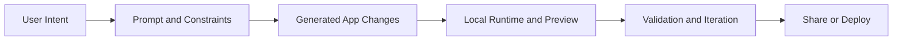

# Dyad Tutorial: Local-First AI App Building

> A practical guide to `dyad-sh/dyad`, focused on local-first app generation, integration patterns, validation loops, and deployment readiness.

## Why This Track Matters

Dyad is one of the fastest-moving local-first vibe-coding tools. To use it effectively, teams need more than setup steps:

- clear prompt-to-change workflows
- safe handling of generated edits
- repeatable validation patterns
- practical deployment and sharing guidance

## Current Snapshot (auto-updated)

- repository: [`dyad-sh/dyad`](https://github.com/dyad-sh/dyad)
- stars: about **19.6k**
- latest release: [`v0.36.0`](https://github.com/dyad-sh/dyad/releases/tag/v0.36.0) (published February 9, 2026)
- development activity: frequent updates on `main`
- licensing model in repo: Apache 2.0 for most code and fair-source licensing in `src/pro`

## Mental Model

## Chapter Guide

| Chapter | Key Question | Outcome |
|:--------|:-------------|:--------|
| [01 - Getting Started](01-getting-started.md) | How do I install and run Dyad safely? | Stable local baseline |
| [02 - Natural Language App Building](02-natural-language-building.md) | How do prompts map to predictable app changes? | Better prompt contracts |
| [03 - Component Integration](03-component-integration.md) | How do I add reusable UI systems? | Structured component extension |
| [04 - Data Management](04-data-management.md) | How should persistence and state be modeled? | Cleaner data architecture |
| [05 - API Integration](05-api-integration.md) | How do I connect external services safely? | API integration playbook |
| [06 - Customization and Styling](06-customization-styling.md) | How do I control UX quality and branding? | Design-system alignment |
| [07 - Testing and Validation](07-testing-validation.md) | How do I verify generated output quality? | Automated and manual QA loops |
| [08 - Deployment and Sharing](08-deployment-sharing.md) | How do I deliver apps to users reliably? | Practical release workflow |

## What You Will Learn

- how to run Dyad as a reliable local-first app builder
- how to reduce rework with better scope and prompt constraints
- how to validate generated changes before sharing/deploying
- how to integrate APIs and data layers with lower risk

## Source References

- [Dyad README](https://github.com/dyad-sh/dyad/blob/main/README.md)
- [Dyad Releases](https://github.com/dyad-sh/dyad/releases)
- [Dyad Repository](https://github.com/dyad-sh/dyad)

## Related Tutorials

- [bolt.diy Tutorial](../bolt-diy-tutorial/)
- [Vercel AI SDK Tutorial](../vercel-ai-tutorial/)
- [Cline Tutorial](../cline-tutorial/)
- [Roo Code Tutorial](../roo-code-tutorial/)

---

Start with [Chapter 1: Getting Started](01-getting-started.md).

## Navigation & Backlinks

- [Start Here: Chapter 1: Getting Started with Dyad](01-getting-started.md)
- [Back to Main Catalog](../../README.md#-tutorial-catalog)
- [Browse A-Z Tutorial Directory](../../discoverability/tutorial-directory.md)
- [Search by Intent](../../discoverability/query-hub.md)
- [Explore Category Hubs](../../README.md#category-hubs)

## Full Chapter Map

1. [Chapter 1: Getting Started with Dyad](01-getting-started.md)
2. [Chapter 2: Natural Language App Building](02-natural-language-building.md)
3. [Chapter 3: Component Integration](03-component-integration.md)
4. [Chapter 4: Data Management](04-data-management.md)
5. [Chapter 5: API Integration](05-api-integration.md)
6. [Chapter 6: Customization and Styling](06-customization-styling.md)
7. [Chapter 7: Testing and Validation](07-testing-validation.md)
8. [Chapter 8: Deployment and Sharing](08-deployment-sharing.md)

*Generated by [AI Codebase Knowledge Builder](https://github.com/The-Pocket/Tutorial-Codebase-Knowledge)*
