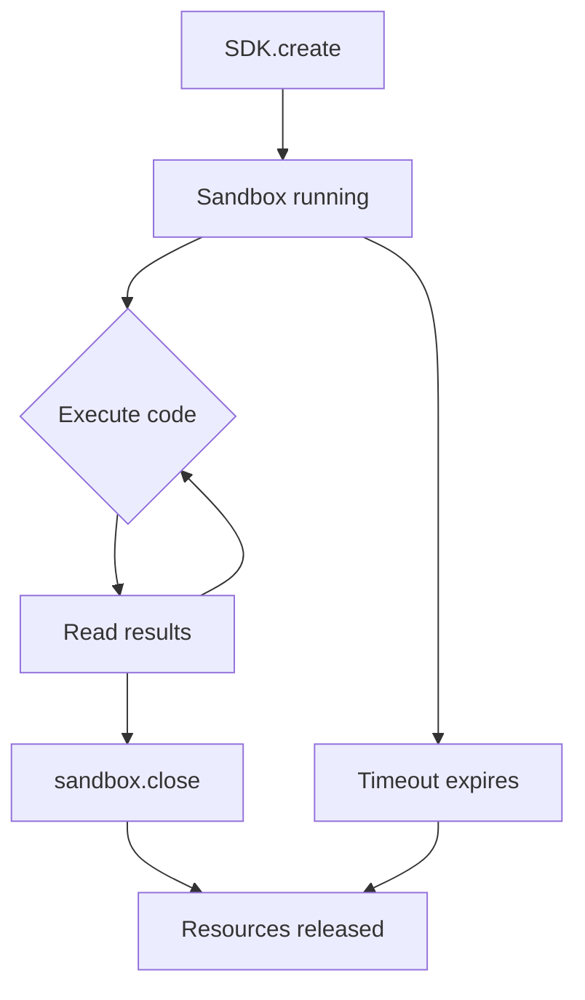

# Chapter 1: Getting Started

Welcome to **Chapter 1: Getting Started**. In this part of **E2B Tutorial: Secure Cloud Sandboxes for AI Agent Code Execution**, you will install the SDK, get your API key, and run code in your first cloud sandbox.

## Learning Goals

- sign up for E2B and get an API key
- install the Python or TypeScript SDK
- spin up your first sandbox and execute code
- understand the basic sandbox lifecycle

## Prerequisites

You need:
- Python 3.8+ or Node.js 18+
- An E2B account (free tier available at [e2b.dev](https://e2b.dev))

## Get Your API Key

1. Sign up at [e2b.dev](https://e2b.dev)
2. Navigate to your dashboard
3. Copy your API key from the settings page

Set it as an environment variable:

```bash
export E2B_API_KEY="e2b_your_api_key_here"
```

## Install the SDK

### Python

```bash
pip install e2b-code-interpreter
```

### TypeScript

```bash
npm install @e2b/code-interpreter
```

## Your First Sandbox

### Python --- Hello Sandbox

```python
from e2b_code_interpreter import Sandbox

# Create a sandbox --- spins up in <200ms
sandbox = Sandbox()

# Execute Python code inside the sandbox
execution = sandbox.run_code("print('Hello from E2B sandbox!')")

# Read the output
print(execution.text)  # "Hello from E2B sandbox!"

# Clean up
sandbox.close()
```

### TypeScript --- Hello Sandbox

```typescript
import { Sandbox } from '@e2b/code-interpreter';

async function main() {
  // Create a sandbox
  const sandbox = await Sandbox.create();

  // Execute Python code inside the sandbox
  const execution = await sandbox.runCode("print('Hello from E2B sandbox!')");

  // Read the output
  console.log(execution.text); // "Hello from E2B sandbox!"

  // Clean up
  await sandbox.close();
}

main();
```

## Understanding the Sandbox Lifecycle



Every sandbox follows this lifecycle:

1. **Create** --- the SDK requests a new sandbox from E2B's cloud. A Firecracker microVM boots in under 200ms.
2. **Execute** --- you run code, manage files, and interact with the sandbox as many times as needed.
3. **Close** --- you explicitly close the sandbox, or it auto-terminates after a timeout (default 5 minutes).

## Using the Context Manager (Python)

The recommended pattern in Python uses a context manager to ensure cleanup:

```python
from e2b_code_interpreter import Sandbox

with Sandbox() as sandbox:
    execution = sandbox.run_code("""
import sys
print(f"Python version: {sys.version}")
print(f"Platform: {sys.platform}")
    """)
    print(execution.text)
# Sandbox is automatically closed here
```

## Running Multiple Code Cells

Sandboxes maintain state between executions, just like Jupyter notebook cells:

```python
from e2b_code_interpreter import Sandbox

with Sandbox() as sandbox:
    # Cell 1: define a variable
    sandbox.run_code("x = 42")

    # Cell 2: use the variable
    execution = sandbox.run_code("print(f'The answer is {x}')")
    print(execution.text)  # "The answer is 42"

    # Cell 3: import and use a library
    execution = sandbox.run_code("""
import math
print(f"Square root of x: {math.sqrt(x)}")
    """)
    print(execution.text)  # "Square root of x: 6.48..."
```

## Setting a Custom Timeout

```python
from e2b_code_interpreter import Sandbox

# Sandbox will stay alive for 10 minutes
sandbox = Sandbox(timeout=600)

execution = sandbox.run_code("print('I have 10 minutes to live')")
print(execution.text)

sandbox.close()
```

## Handling Execution Errors

When code fails, E2B captures the error cleanly:

```python
from e2b_code_interpreter import Sandbox

with Sandbox() as sandbox:
    execution = sandbox.run_code("1 / 0")

    if execution.error:
        print(f"Error type: {execution.error.name}")
        print(f"Error message: {execution.error.value}")
        print(f"Traceback: {execution.error.traceback}")
    else:
        print(execution.text)
```

## Installing the CLI

E2B also provides a CLI for managing sandbox templates:

```bash
npm install -g @e2b/cli

# Authenticate
e2b auth login

# Verify
e2b auth whoami
```

## Source References

- [E2B Quickstart](https://e2b.dev/docs/quickstart)
- [E2B Python SDK](https://github.com/e2b-dev/E2B/tree/main/packages/python-sdk)
- [E2B TypeScript SDK](https://github.com/e2b-dev/E2B/tree/main/packages/js-sdk)
- [E2B API Key Setup](https://e2b.dev/docs/getting-started/api-key)

## Summary

You now have a working E2B setup and have executed code in a cloud sandbox. Key takeaways:

- Sandboxes spin up in under 200ms
- State persists between code cells within a sandbox
- Sandboxes auto-terminate after a configurable timeout
- Error handling is clean and structured

Next: [Chapter 2: Sandbox Architecture](02-sandbox-architecture.md)

---

[Back to E2B Tutorial](README.md) | [Next: Chapter 2: Sandbox Architecture](02-sandbox-architecture.md)
