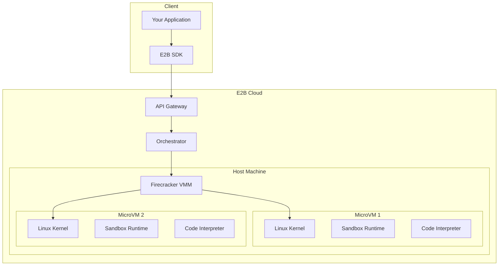
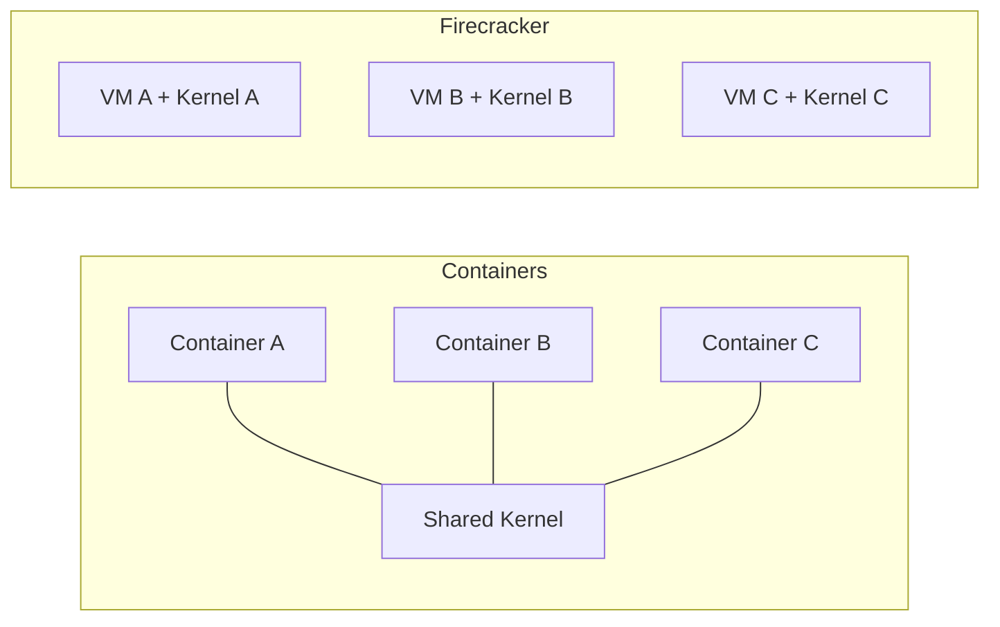
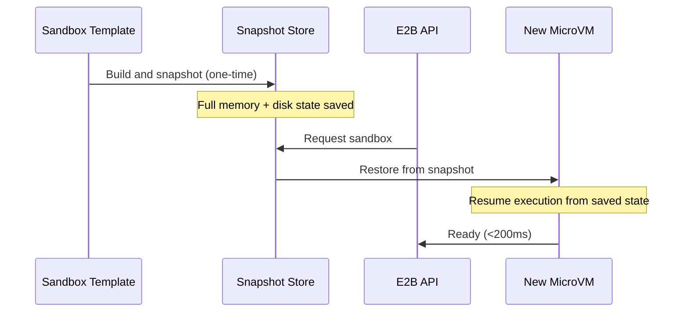
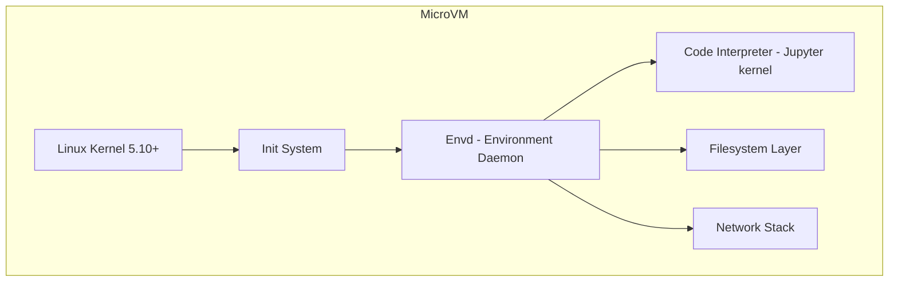
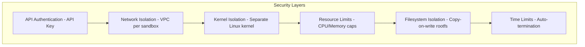
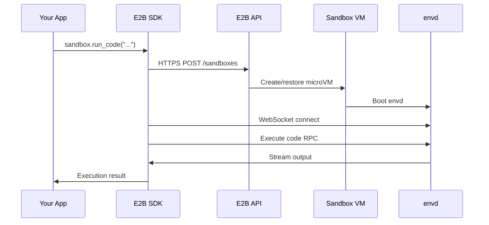

# Chapter 2: Sandbox Architecture

Welcome to **Chapter 2: Sandbox Architecture**. In this chapter you will understand how E2B achieves sub-200ms cold starts while maintaining strong security isolation using Firecracker microVMs.

## Learning Goals

- understand the Firecracker microVM model and why it matters for AI agents
- trace the full lifecycle of a sandbox from request to teardown
- reason about isolation guarantees and security boundaries
- understand how snapshotting enables fast cold starts

## Why Sandboxes Need Real Isolation

AI agents generate arbitrary code. Unlike traditional web applications with predictable behavior, an agent might:

- run `rm -rf /` if it hallucinates
- attempt network exfiltration of sensitive data
- consume unbounded CPU/memory
- install and run any software

Containers are not enough --- they share the host kernel. E2B uses Firecracker microVMs, the same technology that powers AWS Lambda, to provide hardware-level isolation.

## Architecture Overview



## Firecracker microVMs

Firecracker is an open-source virtual machine monitor (VMM) built by AWS. Each E2B sandbox is a full microVM with:

| Property | Detail |
|:---------|:-------|
| Kernel | Dedicated Linux kernel per sandbox |
| Memory | Isolated memory space, not shared with host |
| Filesystem | Copy-on-write rootfs from a base snapshot |
| Network | Dedicated virtual network interface |
| Startup | <200ms from API call to ready |

### Why Not Containers?



Containers share the host kernel. A kernel exploit in one container compromises all containers on the host. Firecracker microVMs each have their own kernel, providing the isolation level of traditional VMs with the startup speed of containers.

## The Snapshot Model

The key to sub-200ms cold starts is **memory snapshotting**:



1. **Template build** --- E2B boots a microVM, installs your dependencies, and takes a full memory snapshot (like hibernating a laptop).
2. **Sandbox creation** --- instead of booting from scratch, E2B restores from the snapshot. The VM resumes exactly where it left off.
3. **Copy-on-write** --- the base snapshot is shared read-only. Each sandbox only stores its own changes.

## Sandbox Components

Each sandbox runs these components:



### Envd (Environment Daemon)

The `envd` process is the primary control plane inside each sandbox. It:

- receives RPC commands from the SDK via WebSocket
- manages the code interpreter (Jupyter kernel)
- handles filesystem operations (read, write, list, watch)
- manages process lifecycle (start, signal, wait)
- controls network configuration

### Code Interpreter

The default code interpreter is a Jupyter kernel that:

- maintains execution state between cells
- captures stdout, stderr, and rich output (charts, images, HTML)
- supports multiple languages via Jupyter kernels
- handles interruption and timeout

## Security Boundaries



| Layer | What It Prevents |
|:------|:-----------------|
| API auth | Unauthorized sandbox creation |
| Network isolation | Cross-sandbox communication, unless explicitly allowed |
| Kernel isolation | Kernel exploits affecting other sandboxes |
| Resource limits | Resource exhaustion attacks |
| Filesystem isolation | Data leakage between sandboxes |
| Time limits | Runaway processes, cost overruns |

## Resource Allocation

Sandboxes can be configured with different resource profiles:

```python
from e2b_code_interpreter import Sandbox

# Default sandbox
sandbox = Sandbox()

# Sandbox with more resources
sandbox = Sandbox(
    metadata={"purpose": "data-processing"},
    timeout=300,
)
```

Default resource allocation per sandbox:

| Resource | Default | Notes |
|:---------|:--------|:------|
| vCPUs | 2 | Dedicated, not shared |
| Memory | 512 MB | Isolated per VM |
| Disk | 1 GB | Copy-on-write, expandable |
| Timeout | 300s | Configurable up to plan limit |
| Network | Full outbound | Inbound via explicit mapping |

## How the SDK Communicates



The SDK communicates with sandboxes over WebSocket for real-time bidirectional communication. This enables streaming output, file watching, and interactive process management.

## Practical Implications

Understanding the architecture helps you make better decisions:

1. **First execution is slowest** --- even at <200ms, factor this into latency budgets
2. **State is ephemeral** --- when the sandbox closes, everything is gone. Save important files explicitly.
3. **Each sandbox is truly isolated** --- no shared state between sandboxes, by design
4. **Custom templates amortize setup** --- install heavy dependencies once in a template, not per sandbox
5. **Network calls work** --- sandboxes have full outbound internet access by default

## Source References

- [E2B Architecture Overview](https://e2b.dev/docs/sandbox)
- [Firecracker microVM](https://firecracker-microvm.github.io/)
- [E2B Security Model](https://e2b.dev/docs/security)
- [AWS Firecracker Paper](https://www.usenix.org/conference/nsdi20/presentation/agache)

## Summary

E2B sandboxes are Firecracker microVMs that provide hardware-level isolation with container-like startup times. Memory snapshotting enables sub-200ms cold starts. Each sandbox has its own kernel, memory, filesystem, and network stack --- true isolation for untrusted AI-generated code.

Next: [Chapter 3: Code Execution](03-code-execution.md)

---

[Previous: Chapter 1: Getting Started](01-getting-started.md) | [Back to E2B Tutorial](README.md) | [Next: Chapter 3: Code Execution](03-code-execution.md)
