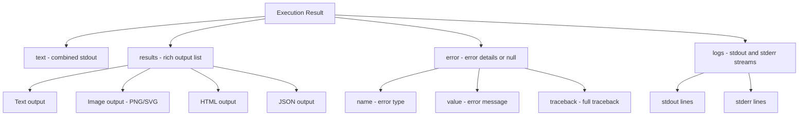
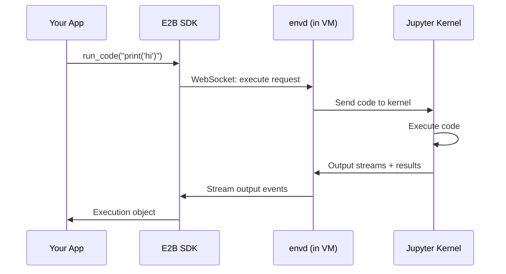

# Chapter 3: Code Execution

Welcome to **Chapter 3: Code Execution**. This chapter covers the core of what E2B does --- running code inside sandboxes. You will learn execution patterns, output handling, error management, and multi-language support.

## Learning Goals

- execute Python, JavaScript, and shell commands in sandboxes
- capture stdout, stderr, and rich output (charts, images)
- handle errors and timeouts gracefully
- work with execution artifacts like generated files and plots

## Basic Code Execution

### Python SDK

```python
from e2b_code_interpreter import Sandbox

with Sandbox() as sandbox:
    # Simple execution
    execution = sandbox.run_code("print('hello world')")
    print(execution.text)  # "hello world"

    # Multi-line code
    execution = sandbox.run_code("""
import json

data = {"name": "E2B", "type": "sandbox"}
print(json.dumps(data, indent=2))
    """)
    print(execution.text)
```

### TypeScript SDK

```typescript
import { Sandbox } from '@e2b/code-interpreter';

const sandbox = await Sandbox.create();

const execution = await sandbox.runCode(`
import json
data = {"name": "E2B", "type": "sandbox"}
print(json.dumps(data, indent=2))
`);

console.log(execution.text);
await sandbox.close();
```

## Execution Result Structure



### Inspecting Results

```python
from e2b_code_interpreter import Sandbox

with Sandbox() as sandbox:
    execution = sandbox.run_code("""
print("stdout line 1")
print("stdout line 2")
import sys
print("stderr line", file=sys.stderr)
result = 42
result
    """)

    # Combined text output
    print(f"Text: {execution.text}")

    # Separate log streams
    print(f"Stdout: {execution.logs.stdout}")
    print(f"Stderr: {execution.logs.stderr}")

    # Rich results (the last expression value)
    for result in execution.results:
        print(f"Result type: {type(result)}")
        if result.text:
            print(f"Text result: {result.text}")
```

## Generating Charts and Images

E2B captures matplotlib plots and other rich output:

```python
from e2b_code_interpreter import Sandbox

with Sandbox() as sandbox:
    execution = sandbox.run_code("""
import matplotlib.pyplot as plt
import numpy as np

x = np.linspace(0, 2 * np.pi, 100)
y = np.sin(x)

plt.figure(figsize=(10, 6))
plt.plot(x, y, 'b-', linewidth=2)
plt.title('Sine Wave')
plt.xlabel('x')
plt.ylabel('sin(x)')
plt.grid(True)
plt.show()
    """)

    # Access the generated image
    for result in execution.results:
        if result.png:
            # result.png is a base64-encoded PNG string
            print(f"Got PNG image: {len(result.png)} chars")

            # Save to local file
            import base64
            with open("sine_wave.png", "wb") as f:
                f.write(base64.b64decode(result.png))
```

## Error Handling Patterns

### Basic Error Handling

```python
from e2b_code_interpreter import Sandbox

with Sandbox() as sandbox:
    execution = sandbox.run_code("""
def divide(a, b):
    return a / b

result = divide(10, 0)
    """)

    if execution.error:
        print(f"Error: {execution.error.name}: {execution.error.value}")
        # Error: ZeroDivisionError: division by zero
        print(f"Traceback:\n{execution.error.traceback}")
    else:
        print(f"Result: {execution.text}")
```

### Timeout Handling

```python
from e2b_code_interpreter import Sandbox

with Sandbox() as sandbox:
    # Set a per-execution timeout
    try:
        execution = sandbox.run_code(
            """
import time
time.sleep(60)  # This will timeout
print("done")
            """,
            timeout=5,  # 5 second timeout
        )
    except TimeoutError:
        print("Execution timed out after 5 seconds")
```

### Robust Execution Wrapper

```python
from e2b_code_interpreter import Sandbox
from dataclasses import dataclass
from typing import Optional


@dataclass
class CodeResult:
    success: bool
    output: str
    error: Optional[str] = None
    images: list = None

    def __post_init__(self):
        if self.images is None:
            self.images = []


def safe_execute(sandbox: Sandbox, code: str, timeout: int = 30) -> CodeResult:
    """Execute code with comprehensive error handling."""
    try:
        execution = sandbox.run_code(code, timeout=timeout)

        if execution.error:
            return CodeResult(
                success=False,
                output=execution.text or "",
                error=f"{execution.error.name}: {execution.error.value}",
            )

        images = [r.png for r in execution.results if r.png]

        return CodeResult(
            success=True,
            output=execution.text or "",
            images=images,
        )
    except TimeoutError:
        return CodeResult(
            success=False,
            output="",
            error=f"Execution timed out after {timeout}s",
        )
    except Exception as e:
        return CodeResult(
            success=False,
            output="",
            error=f"SDK error: {str(e)}",
        )


# Usage
with Sandbox() as sandbox:
    result = safe_execute(sandbox, "print(2 + 2)")
    print(result)  # CodeResult(success=True, output='4', ...)
```

## Running Shell Commands

Beyond the code interpreter, you can run shell commands directly:

```python
from e2b_code_interpreter import Sandbox

with Sandbox() as sandbox:
    # Run a shell command
    result = sandbox.commands.run("echo 'Hello from bash'")
    print(result.stdout)  # "Hello from bash\n"

    # Install a package and use it
    sandbox.commands.run("pip install requests")

    execution = sandbox.run_code("""
import requests
resp = requests.get("https://httpbin.org/json")
print(resp.json()["slideshow"]["title"])
    """)
    print(execution.text)
```

## Multi-step Execution Patterns

### Data Pipeline

```python
from e2b_code_interpreter import Sandbox

with Sandbox() as sandbox:
    # Step 1: Generate data
    sandbox.run_code("""
import pandas as pd
import numpy as np

np.random.seed(42)
df = pd.DataFrame({
    'date': pd.date_range('2024-01-01', periods=100),
    'value': np.random.randn(100).cumsum() + 100,
    'category': np.random.choice(['A', 'B', 'C'], 100),
})
df.to_csv('/tmp/data.csv', index=False)
print(f"Generated {len(df)} rows")
    """)

    # Step 2: Analyze
    execution = sandbox.run_code("""
import pandas as pd

df = pd.read_csv('/tmp/data.csv')
summary = df.groupby('category')['value'].agg(['mean', 'std', 'count'])
print(summary.to_string())
    """)
    print(execution.text)

    # Step 3: Visualize
    execution = sandbox.run_code("""
import pandas as pd
import matplotlib.pyplot as plt

df = pd.read_csv('/tmp/data.csv')
df['date'] = pd.to_datetime(df['date'])

fig, ax = plt.subplots(figsize=(12, 6))
for cat in df['category'].unique():
    mask = df['category'] == cat
    ax.plot(df.loc[mask, 'date'], df.loc[mask, 'value'], label=cat, alpha=0.7)

ax.legend()
ax.set_title('Value Over Time by Category')
plt.tight_layout()
plt.show()
    """)

    if execution.results and execution.results[0].png:
        print("Chart generated successfully")
```

## Execution Flow



## Cross-references

- For streaming output in real-time, see [Chapter 7: Streaming and Real-time Output](07-streaming-and-realtime-output.md)
- For installing dependencies via custom templates, see [Chapter 5: Custom Sandbox Templates](05-custom-sandbox-templates.md)
- For filesystem operations used in data pipelines, see [Chapter 4: Filesystem and Process Management](04-filesystem-and-process-management.md)

## Source References

- [E2B Code Execution Docs](https://e2b.dev/docs/code-interpreting)
- [E2B Execution API Reference](https://e2b.dev/docs/sdk-reference/python/execution)
- [E2B Cookbook: Data Analysis](https://github.com/e2b-dev/e2b-cookbook)

## Summary

Code execution in E2B sandboxes gives you structured results with stdout, stderr, rich output, and error information. The Jupyter kernel maintains state across cells. Shell commands let you install packages and run system tools. Always wrap execution in error handling for production use.

Next: [Chapter 4: Filesystem and Process Management](04-filesystem-and-process-management.md)

---

[Previous: Chapter 2: Sandbox Architecture](02-sandbox-architecture.md) | [Back to E2B Tutorial](README.md) | [Next: Chapter 4: Filesystem and Process Management](04-filesystem-and-process-management.md)
