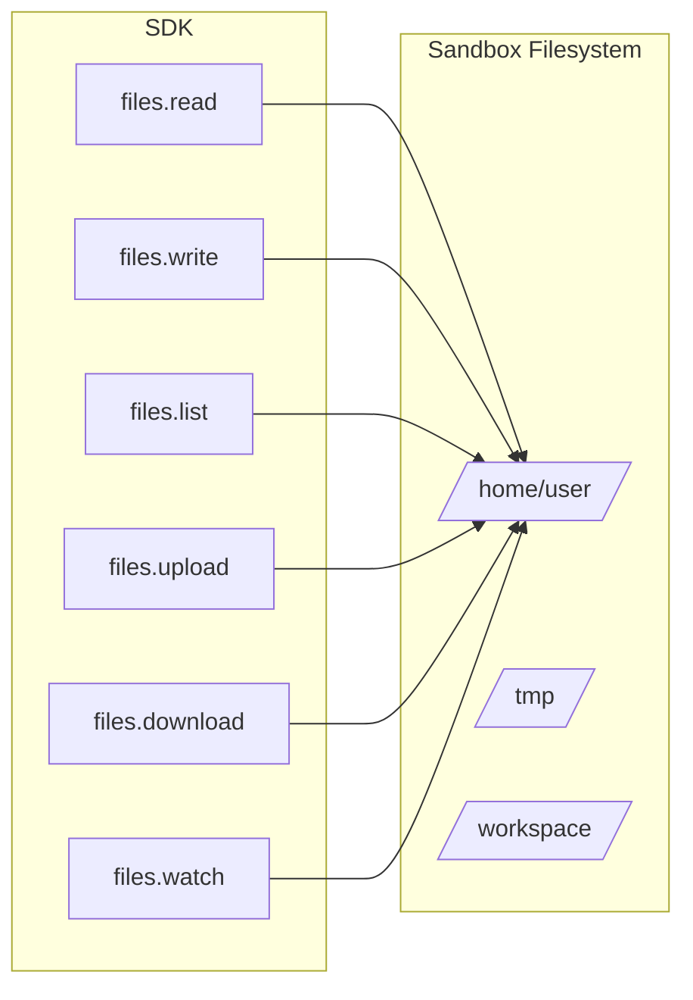
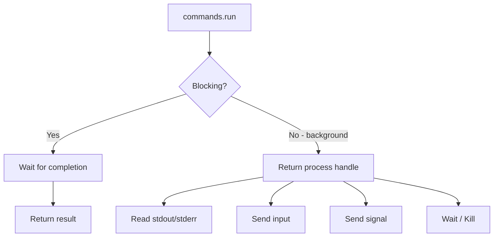

# Chapter 4: Filesystem and Process Management

Welcome to **Chapter 4: Filesystem and Process Management**. This chapter covers how to read, write, and manage files inside sandboxes, and how to start, monitor, and control long-running processes.

## Learning Goals

- read, write, upload, and download files in sandboxes
- list directories and watch for filesystem changes
- start and manage background processes
- combine file and process operations for real workflows

## Filesystem Operations Overview



## Writing Files

### Write Text Files

```python
from e2b_code_interpreter import Sandbox

with Sandbox() as sandbox:
    # Write a text file
    sandbox.files.write("/home/user/hello.txt", "Hello from E2B!")

    # Write a Python script
    sandbox.files.write("/home/user/script.py", """
import sys
print(f"Arguments: {sys.argv[1:]}")
print("Script executed successfully")
    """)

    # Write a JSON config
    import json
    config = {"model": "gpt-4", "temperature": 0.7}
    sandbox.files.write(
        "/home/user/config.json",
        json.dumps(config, indent=2),
    )
```

### Write Binary Files

```python
from e2b_code_interpreter import Sandbox

with Sandbox() as sandbox:
    # Upload a local file to the sandbox
    with open("local_data.csv", "rb") as f:
        sandbox.files.write("/home/user/data.csv", f)

    # Verify it arrived
    result = sandbox.commands.run("wc -l /home/user/data.csv")
    print(f"Lines: {result.stdout.strip()}")
```

## Reading Files

```python
from e2b_code_interpreter import Sandbox

with Sandbox() as sandbox:
    # Write then read
    sandbox.files.write("/home/user/test.txt", "line 1\nline 2\nline 3")

    # Read text content
    content = sandbox.files.read("/home/user/test.txt")
    print(content)  # "line 1\nline 2\nline 3"

    # Read a file generated by code execution
    sandbox.run_code("""
import json
data = {"results": [1, 2, 3, 4, 5]}
with open("/home/user/output.json", "w") as f:
    json.dump(data, f, indent=2)
    """)

    output = sandbox.files.read("/home/user/output.json")
    print(output)
```

## Listing Directories

```python
from e2b_code_interpreter import Sandbox

with Sandbox() as sandbox:
    # Create some files
    sandbox.files.write("/home/user/project/src/main.py", "print('main')")
    sandbox.files.write("/home/user/project/src/utils.py", "# utils")
    sandbox.files.write("/home/user/project/README.md", "# Project")

    # List directory contents
    entries = sandbox.files.list("/home/user/project")
    for entry in entries:
        print(f"{'DIR ' if entry.is_dir else 'FILE'} {entry.name}")

    # List with subdirectories
    entries = sandbox.files.list("/home/user/project/src")
    for entry in entries:
        print(f"  {entry.name} ({entry.size} bytes)")
```

## Downloading Files from Sandbox

```python
from e2b_code_interpreter import Sandbox

with Sandbox() as sandbox:
    # Generate a file inside the sandbox
    sandbox.run_code("""
import pandas as pd
import numpy as np

df = pd.DataFrame({
    'x': np.random.randn(1000),
    'y': np.random.randn(1000),
})
df.to_csv('/home/user/results.csv', index=False)
    """)

    # Download file content
    content = sandbox.files.read("/home/user/results.csv")

    # Save locally
    with open("downloaded_results.csv", "w") as f:
        f.write(content)
    print("File downloaded successfully")
```

## Watching Filesystem Changes

```python
from e2b_code_interpreter import Sandbox

with Sandbox() as sandbox:
    # Set up a file watcher
    watcher = sandbox.files.watch("/home/user/output", on_event=lambda event:
        print(f"File event: {event.type} - {event.name}")
    )

    # Code that creates files will trigger events
    sandbox.run_code("""
import os
os.makedirs("/home/user/output", exist_ok=True)
for i in range(3):
    with open(f"/home/user/output/file_{i}.txt", "w") as f:
        f.write(f"Content {i}")
    """)

    # Stop watching
    watcher.stop()
```

## Process Management



### Running Commands

```python
from e2b_code_interpreter import Sandbox

with Sandbox() as sandbox:
    # Blocking command
    result = sandbox.commands.run("ls -la /home/user")
    print(result.stdout)
    print(f"Exit code: {result.exit_code}")

    # Command with environment variables
    result = sandbox.commands.run(
        "echo $MY_VAR",
        envs={"MY_VAR": "hello"},
    )
    print(result.stdout)  # "hello\n"

    # Command in a specific directory
    sandbox.files.write("/home/user/project/test.py", "print('test')")
    result = sandbox.commands.run(
        "python test.py",
        cwd="/home/user/project",
    )
    print(result.stdout)  # "test\n"
```

### Background Processes

```python
from e2b_code_interpreter import Sandbox
import time

with Sandbox() as sandbox:
    # Start a web server in the background
    sandbox.files.write("/home/user/server.py", """
from http.server import HTTPServer, SimpleHTTPRequestHandler
import os

os.chdir("/home/user")
server = HTTPServer(("0.0.0.0", 8080), SimpleHTTPRequestHandler)
print("Server running on port 8080")
server.serve_forever()
    """)

    proc = sandbox.commands.run(
        "python /home/user/server.py",
        background=True,
    )

    # Give server a moment to start
    time.sleep(1)

    # Test the server
    result = sandbox.commands.run("curl -s http://localhost:8080")
    print(f"Server response length: {len(result.stdout)}")

    # Kill the background process
    proc.kill()
```

### Process with Streaming Output

```python
from e2b_code_interpreter import Sandbox

with Sandbox() as sandbox:
    sandbox.files.write("/home/user/worker.py", """
import time
import sys

for i in range(5):
    print(f"Processing step {i+1}/5")
    sys.stdout.flush()
    time.sleep(1)

print("Done!")
    """)

    # Run with output callback
    result = sandbox.commands.run(
        "python /home/user/worker.py",
        on_stdout=lambda data: print(f"[STDOUT] {data}"),
        on_stderr=lambda data: print(f"[STDERR] {data}"),
    )
    print(f"Exit code: {result.exit_code}")
```

## Complete Workflow: Build and Test a Project

```python
from e2b_code_interpreter import Sandbox

with Sandbox() as sandbox:
    # 1. Create project structure
    sandbox.files.write("/home/user/project/calculator.py", """
def add(a, b):
    return a + b

def multiply(a, b):
    return a * b

def divide(a, b):
    if b == 0:
        raise ValueError("Cannot divide by zero")
    return a / b
    """)

    sandbox.files.write("/home/user/project/test_calculator.py", """
import pytest
from calculator import add, multiply, divide

def test_add():
    assert add(2, 3) == 5
    assert add(-1, 1) == 0

def test_multiply():
    assert multiply(3, 4) == 12
    assert multiply(0, 5) == 0

def test_divide():
    assert divide(10, 2) == 5.0
    with pytest.raises(ValueError):
        divide(1, 0)
    """)

    # 2. Install dependencies
    sandbox.commands.run("pip install pytest")

    # 3. Run tests
    result = sandbox.commands.run(
        "python -m pytest test_calculator.py -v",
        cwd="/home/user/project",
    )
    print(result.stdout)
    print(f"Tests passed: {result.exit_code == 0}")
```

## Cross-references

- For executing code via the interpreter (not shell), see [Chapter 3: Code Execution](03-code-execution.md)
- For pre-installing dependencies in templates, see [Chapter 5: Custom Sandbox Templates](05-custom-sandbox-templates.md)
- For streaming process output to clients, see [Chapter 7: Streaming and Real-time Output](07-streaming-and-realtime-output.md)

## Source References

- [E2B Filesystem Docs](https://e2b.dev/docs/sandbox/filesystem)
- [E2B Process Docs](https://e2b.dev/docs/sandbox/process)
- [E2B SDK Reference: Files](https://e2b.dev/docs/sdk-reference/python/filesystem)

## Summary

The sandbox filesystem and process management APIs give you full control over the sandbox environment. You can upload files, generate outputs, run background services, and orchestrate multi-step workflows. All operations happen inside the isolated microVM, so nothing leaks to your host.

Next: [Chapter 5: Custom Sandbox Templates](05-custom-sandbox-templates.md)

---

[Previous: Chapter 3: Code Execution](03-code-execution.md) | [Back to E2B Tutorial](README.md) | [Next: Chapter 5: Custom Sandbox Templates](05-custom-sandbox-templates.md)
