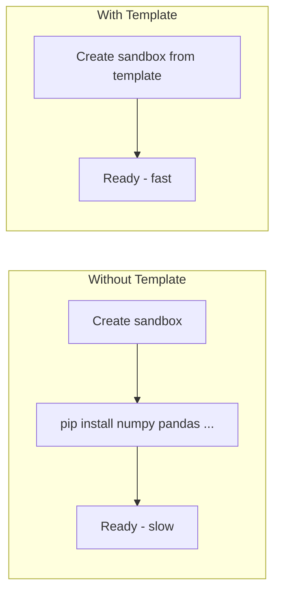
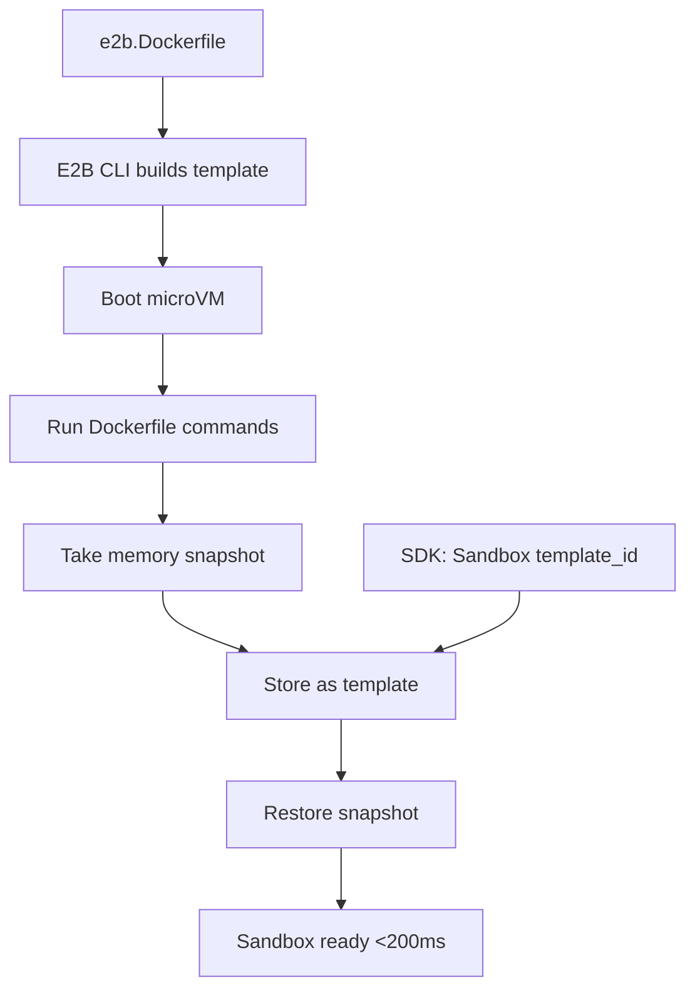
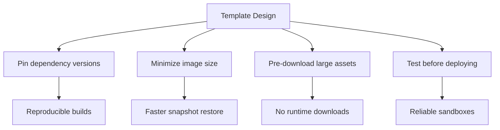
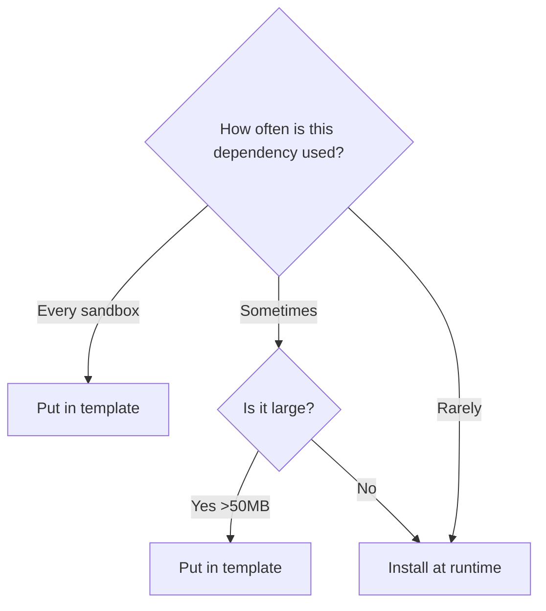

# Chapter 5: Custom Sandbox Templates

Welcome to **Chapter 5: Custom Sandbox Templates**. This chapter covers how to create custom sandbox environments with pre-installed dependencies, tools, and configurations --- eliminating per-sandbox setup time and ensuring consistent environments.

## Learning Goals

- understand why custom templates matter for production use
- create and build custom sandbox templates
- configure templates with system packages, Python libraries, and custom tools
- use custom templates from the SDK
- manage template versions and updates

## Why Custom Templates?

Without templates, every sandbox starts from a base image and you install dependencies at runtime:



| Approach | Startup Time | Consistency | Cost |
|:---------|:-------------|:------------|:-----|
| Install at runtime | 10-60s per sandbox | Varies (version drift) | Higher (repeated installs) |
| Custom template | <200ms | Identical every time | Lower (install once) |

## Template Architecture



A template is a Dockerfile-like specification that E2B builds into a memory snapshot. When you create a sandbox from a template, E2B restores that snapshot --- skipping all build steps.

## Creating Your First Template

### Step 1: Initialize Template

```bash
# Create a directory for your template
mkdir my-data-sandbox && cd my-data-sandbox

# Initialize with E2B CLI
e2b template init
```

This creates an `e2b.Dockerfile`:

```dockerfile
# This is a custom E2B sandbox template

FROM e2b/base

# Install system packages
RUN apt-get update && apt-get install -y \
    build-essential \
    && rm -rf /var/lib/apt/lists/*

# Install Python packages
RUN pip install \
    numpy \
    pandas \
    matplotlib \
    scikit-learn \
    requests
```

### Step 2: Customize the Dockerfile

```dockerfile
FROM e2b/base

# System dependencies
RUN apt-get update && apt-get install -y \
    build-essential \
    libpq-dev \
    ffmpeg \
    && rm -rf /var/lib/apt/lists/*

# Python data science stack
RUN pip install \
    numpy==1.26.4 \
    pandas==2.2.1 \
    matplotlib==3.8.3 \
    seaborn==0.13.2 \
    scikit-learn==1.4.1 \
    scipy==1.12.0 \
    requests==2.31.0 \
    beautifulsoup4==4.12.3

# Create workspace directory
RUN mkdir -p /home/user/workspace

# Copy any files you want pre-loaded
COPY utils.py /home/user/utils.py
```

### Step 3: Build the Template

```bash
e2b template build --name "data-science-sandbox"
```

The CLI will output a template ID:

```
Building template...
Template ID: ds4n8kx2v7
Build completed successfully.
```

### Step 4: Use the Template

```python
from e2b_code_interpreter import Sandbox

# Use your custom template
with Sandbox(template="ds4n8kx2v7") as sandbox:
    # numpy is already installed --- no pip install needed
    execution = sandbox.run_code("""
import numpy as np
import pandas as pd
import sklearn

print(f"NumPy: {np.__version__}")
print(f"Pandas: {pd.__version__}")
print(f"Scikit-learn: {sklearn.__version__}")
    """)
    print(execution.text)
```

```typescript
import { Sandbox } from '@e2b/code-interpreter';

const sandbox = await Sandbox.create({ template: 'ds4n8kx2v7' });

const execution = await sandbox.runCode(`
import numpy as np
print(f"NumPy ready: {np.__version__}")
`);

console.log(execution.text);
await sandbox.close();
```

## Template Configuration File

The `e2b.toml` file stores template metadata:

```toml
# e2b.toml
template_id = "ds4n8kx2v7"
template_name = "data-science-sandbox"
dockerfile = "e2b.Dockerfile"

[scripts]
# Run after the Dockerfile build
post_build = "python -c 'import numpy; print(numpy.__version__)'"
```

## Advanced Template Patterns

### Web Scraping Template

```dockerfile
FROM e2b/base

RUN apt-get update && apt-get install -y \
    chromium-browser \
    chromium-chromedriver \
    && rm -rf /var/lib/apt/lists/*

RUN pip install \
    selenium==4.18.1 \
    playwright==1.42.0 \
    beautifulsoup4==4.12.3 \
    requests==2.31.0 \
    lxml==5.1.0

RUN playwright install chromium
```

### Node.js Template

```dockerfile
FROM e2b/base

# Install Node.js 20
RUN curl -fsSL https://deb.nodesource.com/setup_20.x | bash - \
    && apt-get install -y nodejs \
    && rm -rf /var/lib/apt/lists/*

# Install global packages
RUN npm install -g typescript tsx esbuild

# Pre-install common packages in a workspace
RUN mkdir -p /home/user/workspace && \
    cd /home/user/workspace && \
    npm init -y && \
    npm install express axios zod
```

### ML/AI Template

```dockerfile
FROM e2b/base

RUN pip install \
    torch==2.2.1 --index-url https://download.pytorch.org/whl/cpu \
    transformers==4.38.2 \
    tokenizers==0.15.2 \
    sentence-transformers==2.5.1 \
    openai==1.13.3 \
    langchain==0.1.11

# Pre-download a small model
RUN python -c "from sentence_transformers import SentenceTransformer; SentenceTransformer('all-MiniLM-L6-v2')"
```

## Managing Templates

### List Templates

```bash
e2b template list
```

### Update a Template

```bash
# Edit the Dockerfile, then rebuild
e2b template build --name "data-science-sandbox"
```

### Delete a Template

```bash
e2b template delete ds4n8kx2v7
```

## Template Best Practices



1. **Pin all dependency versions** --- avoid `pip install pandas` without a version, or builds will drift over time
2. **Clean up apt caches** --- always add `&& rm -rf /var/lib/apt/lists/*` after apt-get install
3. **Pre-download models and data** --- anything downloaded at runtime adds latency
4. **Layer efficiently** --- combine related RUN commands to reduce snapshot size
5. **Test locally first** --- run `e2b template build` and verify the template works before using in production

## Template vs Runtime Installation Decision Tree



## Cross-references

- For understanding how templates become snapshots, see [Chapter 2: Sandbox Architecture](02-sandbox-architecture.md)
- For installing packages at runtime as an alternative, see [Chapter 3: Code Execution](03-code-execution.md)
- For using templates with agent frameworks, see [Chapter 6: Framework Integrations](06-framework-integrations.md)

## Source References

- [E2B Custom Sandbox Templates](https://e2b.dev/docs/sandbox-template)
- [E2B CLI Reference](https://e2b.dev/docs/cli)
- [E2B Dockerfile Reference](https://e2b.dev/docs/sandbox-template/dockerfile)
- [E2B Template Examples](https://github.com/e2b-dev/e2b-cookbook/tree/main/templates)

## Summary

Custom templates let you pre-install dependencies, tools, and data so sandboxes start instantly with everything ready. Pin your versions, minimize image size, and pre-download large assets. Use the CLI to build, list, and manage templates. The decision between template and runtime installation comes down to frequency of use and dependency size.

Next: [Chapter 6: Framework Integrations](06-framework-integrations.md)

---

[Previous: Chapter 4: Filesystem and Process Management](04-filesystem-and-process-management.md) | [Back to E2B Tutorial](README.md) | [Next: Chapter 6: Framework Integrations](06-framework-integrations.md)
