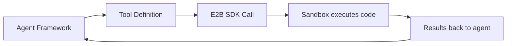
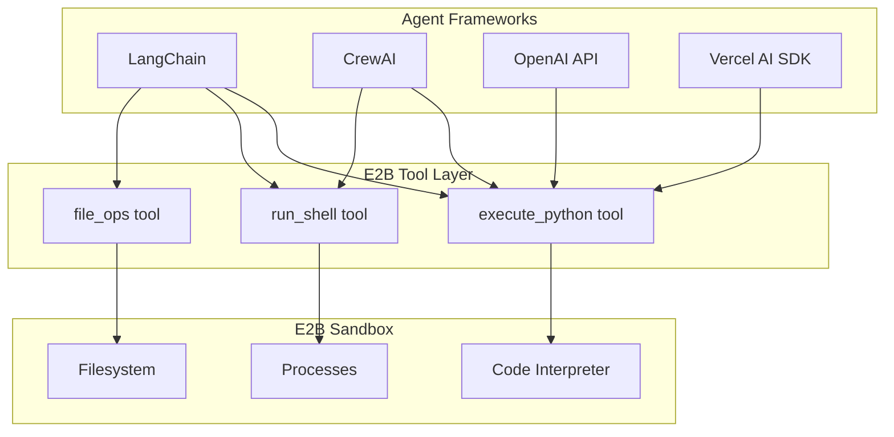

# Chapter 6: Framework Integrations

Welcome to **Chapter 6: Framework Integrations**. This chapter shows how to connect E2B sandboxes to popular AI agent frameworks --- LangChain, CrewAI, OpenAI Assistants, and Vercel AI SDK --- so agents can execute code safely as part of their reasoning loop.

## Learning Goals

- integrate E2B as a code execution tool in LangChain agents
- use E2B sandboxes with CrewAI for multi-agent code tasks
- connect E2B to OpenAI Assistants API code interpreter
- understand the integration pattern that applies to any framework

## The Integration Pattern

Every framework integration follows the same pattern:



The agent framework decides *what* code to run. E2B decides *where and how* to run it safely.

## LangChain Integration

### Installation

```bash
pip install langchain langchain-openai e2b-code-interpreter
```

### E2B as a LangChain Tool

```python
from langchain_core.tools import tool
from langchain_openai import ChatOpenAI
from langchain.agents import AgentExecutor, create_tool_calling_agent
from langchain_core.prompts import ChatPromptTemplate
from e2b_code_interpreter import Sandbox

# Create a persistent sandbox for the agent session
sandbox = Sandbox()


@tool
def execute_python(code: str) -> str:
    """Execute Python code in a secure sandbox. Use this to run
    calculations, data analysis, or any Python code."""
    execution = sandbox.run_code(code)

    if execution.error:
        return f"Error: {execution.error.name}: {execution.error.value}"

    result_parts = []
    if execution.text:
        result_parts.append(execution.text)

    for result in execution.results:
        if result.png:
            result_parts.append("[Image generated]")
        if result.text:
            result_parts.append(result.text)

    return "\n".join(result_parts) or "Code executed successfully (no output)"


@tool
def install_package(package_name: str) -> str:
    """Install a Python package in the sandbox."""
    result = sandbox.commands.run(f"pip install {package_name}")
    if result.exit_code == 0:
        return f"Successfully installed {package_name}"
    return f"Failed to install {package_name}: {result.stderr}"


# Build the agent
llm = ChatOpenAI(model="gpt-4o")
tools = [execute_python, install_package]

prompt = ChatPromptTemplate.from_messages([
    ("system", "You are a data analyst. Use the execute_python tool to "
               "run code and answer questions. Always show your work."),
    ("human", "{input}"),
    ("placeholder", "{agent_scratchpad}"),
])

agent = create_tool_calling_agent(llm, tools, prompt)
executor = AgentExecutor(agent=agent, tools=tools, verbose=True)

# Run the agent
result = executor.invoke({
    "input": "Generate 1000 random numbers, calculate their mean "
             "and standard deviation, and create a histogram."
})
print(result["output"])

# Clean up
sandbox.close()
```

### LangChain with Sandbox Lifecycle Management

```python
from contextlib import contextmanager
from langchain_core.tools import tool
from e2b_code_interpreter import Sandbox


class E2BSandboxManager:
    """Manages sandbox lifecycle for LangChain agents."""

    def __init__(self, template: str = None, timeout: int = 300):
        self.template = template
        self.timeout = timeout
        self.sandbox = None

    def get_sandbox(self) -> Sandbox:
        if self.sandbox is None:
            kwargs = {"timeout": self.timeout}
            if self.template:
                kwargs["template"] = self.template
            self.sandbox = Sandbox(**kwargs)
        return self.sandbox

    def close(self):
        if self.sandbox:
            self.sandbox.close()
            self.sandbox = None

    def create_tools(self):
        manager = self

        @tool
        def execute_python(code: str) -> str:
            """Execute Python code in a secure cloud sandbox."""
            sandbox = manager.get_sandbox()
            execution = sandbox.run_code(code)
            if execution.error:
                return f"Error: {execution.error.name}: {execution.error.value}"
            return execution.text or "Executed successfully"

        @tool
        def write_file(path: str, content: str) -> str:
            """Write a file in the sandbox."""
            sandbox = manager.get_sandbox()
            sandbox.files.write(path, content)
            return f"File written to {path}"

        @tool
        def read_file(path: str) -> str:
            """Read a file from the sandbox."""
            sandbox = manager.get_sandbox()
            return sandbox.files.read(path)

        return [execute_python, write_file, read_file]
```

## CrewAI Integration

### Installation

```bash
pip install crewai e2b-code-interpreter
```

### E2B Tools for CrewAI

```python
from crewai import Agent, Task, Crew
from crewai.tools import tool
from e2b_code_interpreter import Sandbox

sandbox = Sandbox()


@tool("Execute Python Code")
def execute_python(code: str) -> str:
    """Execute Python code in a secure E2B sandbox.
    The sandbox has numpy, pandas, and matplotlib pre-installed."""
    execution = sandbox.run_code(code)

    if execution.error:
        return f"Error: {execution.error.name}: {execution.error.value}\n{execution.error.traceback}"

    output = []
    if execution.text:
        output.append(execution.text)
    for r in execution.results:
        if r.png:
            output.append("[Chart/image generated]")
    return "\n".join(output) or "Code ran successfully"


@tool("Run Shell Command")
def run_shell(command: str) -> str:
    """Run a shell command in the E2B sandbox."""
    result = sandbox.commands.run(command)
    return result.stdout + result.stderr


# Define agents
data_analyst = Agent(
    role="Data Analyst",
    goal="Analyze datasets and produce insights with visualizations",
    backstory="You are an expert data analyst who writes clean Python code.",
    tools=[execute_python, run_shell],
    verbose=True,
)

report_writer = Agent(
    role="Report Writer",
    goal="Create clear, actionable reports from analysis results",
    backstory="You summarize data findings into executive-ready reports.",
    verbose=True,
)

# Define tasks
analysis_task = Task(
    description="""
    Generate a synthetic sales dataset with 500 rows containing:
    - date (2024 Q1-Q4)
    - product (A, B, C)
    - region (North, South, East, West)
    - revenue (random realistic values)

    Then analyze trends by product and region.
    Create at least one visualization.
    """,
    expected_output="Analysis results with key findings and a chart",
    agent=data_analyst,
)

report_task = Task(
    description="Write a summary report based on the analysis results.",
    expected_output="A 3-paragraph executive summary with recommendations",
    agent=report_writer,
)

# Run the crew
crew = Crew(
    agents=[data_analyst, report_writer],
    tasks=[analysis_task, report_task],
    verbose=True,
)

result = crew.kickoff()
print(result)

sandbox.close()
```

## OpenAI Assistants API Integration

```python
import openai
from e2b_code_interpreter import Sandbox


def handle_code_execution(code: str, sandbox: Sandbox) -> dict:
    """Execute code from OpenAI function call in E2B sandbox."""
    execution = sandbox.run_code(code)

    if execution.error:
        return {
            "success": False,
            "error": f"{execution.error.name}: {execution.error.value}",
        }

    return {
        "success": True,
        "output": execution.text or "",
        "has_images": any(r.png for r in execution.results),
    }


# Define the function for OpenAI
tools = [{
    "type": "function",
    "function": {
        "name": "execute_python",
        "description": "Execute Python code in a secure sandbox",
        "parameters": {
            "type": "object",
            "properties": {
                "code": {
                    "type": "string",
                    "description": "Python code to execute",
                }
            },
            "required": ["code"],
        },
    },
}]

client = openai.OpenAI()
sandbox = Sandbox()

messages = [
    {"role": "system", "content": "You are a helpful assistant. Use the "
     "execute_python tool to run code when needed."},
    {"role": "user", "content": "What are the first 20 Fibonacci numbers?"},
]

# Agent loop
response = client.chat.completions.create(
    model="gpt-4o",
    messages=messages,
    tools=tools,
)

while response.choices[0].message.tool_calls:
    message = response.choices[0].message
    messages.append(message)

    for tool_call in message.tool_calls:
        if tool_call.function.name == "execute_python":
            import json
            args = json.loads(tool_call.function.arguments)
            result = handle_code_execution(args["code"], sandbox)

            messages.append({
                "role": "tool",
                "tool_call_id": tool_call.id,
                "content": json.dumps(result),
            })

    response = client.chat.completions.create(
        model="gpt-4o",
        messages=messages,
        tools=tools,
    )

print(response.choices[0].message.content)
sandbox.close()
```

## Vercel AI SDK Integration (TypeScript)

```typescript
import { Sandbox } from '@e2b/code-interpreter';
import { openai } from '@ai-sdk/openai';
import { generateText, tool } from 'ai';
import { z } from 'zod';

async function main() {
  const sandbox = await Sandbox.create();

  const result = await generateText({
    model: openai('gpt-4o'),
    tools: {
      executePython: tool({
        description: 'Execute Python code in a secure sandbox',
        parameters: z.object({
          code: z.string().describe('Python code to execute'),
        }),
        execute: async ({ code }) => {
          const execution = await sandbox.runCode(code);
          if (execution.error) {
            return `Error: ${execution.error.name}: ${execution.error.value}`;
          }
          return execution.text || 'Code executed successfully';
        },
      }),
    },
    maxSteps: 5,
    prompt: 'Calculate the first 10 prime numbers and their sum.',
  });

  console.log(result.text);
  await sandbox.close();
}

main();
```

## Integration Architecture



## Cross-references

- For the sandbox lifecycle used in integrations, see [Chapter 1: Getting Started](01-getting-started.md)
- For streaming output back to agent UIs, see [Chapter 7: Streaming and Real-time Output](07-streaming-and-realtime-output.md)
- For custom templates used with frameworks, see [Chapter 5: Custom Sandbox Templates](05-custom-sandbox-templates.md)

## Source References

- [E2B LangChain Integration](https://e2b.dev/docs/integrations/langchain)
- [E2B CrewAI Integration](https://e2b.dev/docs/integrations/crewai)
- [E2B OpenAI Integration](https://e2b.dev/docs/integrations/openai)
- [E2B Vercel AI SDK Integration](https://e2b.dev/docs/integrations/vercel-ai-sdk)
- [E2B Cookbook: Integrations](https://github.com/e2b-dev/e2b-cookbook)

## Summary

E2B integrates with any agent framework through a simple pattern: define a tool that wraps `sandbox.run_code()`, register it with the framework, and let the agent call it. The sandbox provides safe execution regardless of what the agent generates. Manage sandbox lifecycle carefully --- create one sandbox per agent session, and clean up when done.

Next: [Chapter 7: Streaming and Real-time Output](07-streaming-and-realtime-output.md)

---

[Previous: Chapter 5: Custom Sandbox Templates](05-custom-sandbox-templates.md) | [Back to E2B Tutorial](README.md) | [Next: Chapter 7: Streaming and Real-time Output](07-streaming-and-realtime-output.md)
